# SaaS Security, Boundary & Flow Diagrams

Security-, boundary-, and flow-focused diagrams complementing [[SaaSSystemDiagrams]]. Aligned with Architecture Decisions **AD-1..AD-16** in `specs/016-saas-architecture/spec.md`.

> [!NOTE]
> **Updated 2026-06-19**: Part H adds the cluster-admin read-wide/write-narrow diagram and local-mode contrast (AD-14). Observability data-flow and secret-rotation diagrams are covered in [[SaaSSystemDiagrams]] Part G and [[Decisions/ADR-030-saas-architecture|ADR-030]]; remaining Part A–G flow diagrams reflect AD-1..AD-11 and are supplemented by the new entries. See [[2026-06-19-saas-spec-hardening|the hardening session log]].

## Index

- **Part A — User Story Flows** (US1–US9)
- **Part B — Data Flow Diagrams** (DFD L0/L1 + per-classification)
- **Part C — Schema & ERD Detail** (tables, indexes, constraints, migration lineage)
- **Part D — Network Diagrams** (traffic, port matrix, AZ resilience)
- **Part E — Security Perimeter & Trust Boundaries**
- **Part F — Egress Boundaries & Data Exfiltration Controls**
- **Part G — Tenant Data Boundaries** (org isolation at every layer)
- **Part H — Access Boundaries** (IAM + RBAC enforcement points)

---

# Part A — User Story Flows

## US1 — Sign Up / Log In via Cognito

```mermaid
flowchart TB
    U[User] --> V{visit app}
    V -->|no session| RED[302 → Cognito Hosted UI]
    RED --> CH{auth method}
    CH -->|email/password| NATIVE[Cognito native auth]
    CH -->|social BYO| SOCIAL[Google/GitHub federation]
    NATIVE --> CODE[authorization code]
    SOCIAL --> CODE
    CODE --> CB[/callback]
    CB --> TOK[exchange code → tokens PKCE]
    TOK --> VER[verify JWT via JWKS]
    VER --> UP[upsert User by cognito_sub]
    UP --> FIRST{first login?}
    FIRST -->|yes| MAP[create users row + org membership]
    FIRST -->|no| SESS
    MAP --> SESS[set httpOnly session]
    SESS --> DASH[dashboard]
```

## US2 — Train a Model with Live Metrics

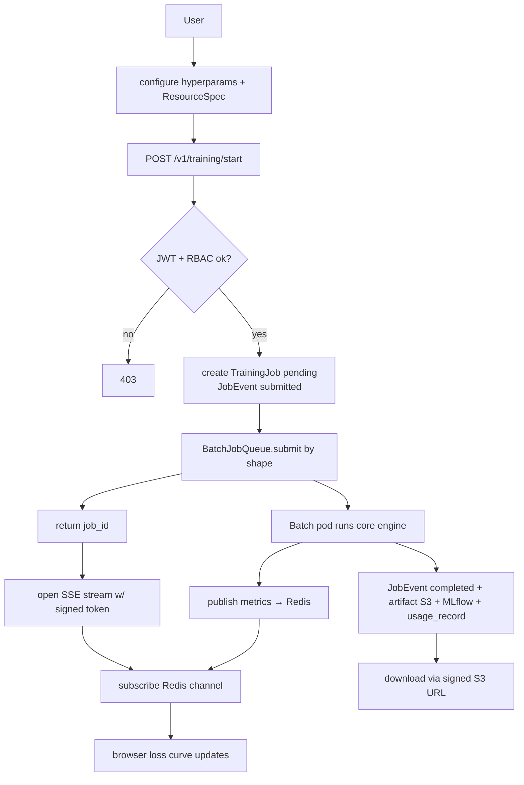

## US2a — Training Resilience (pod down / SSE drop / polling fallback)

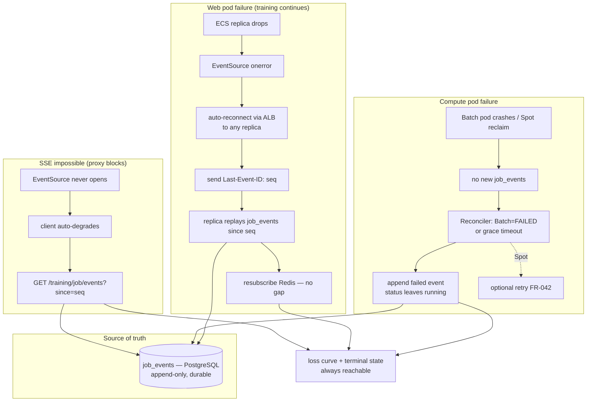

## US3 — RBAC Multi-Tenancy & Data Isolation

```mermaid
flowchart TB
    A[User Org A] --> CA[create corpus]
    CA --> OWN[owned by org_id=A, created_by=A]
    B[User Org B] --> LIST[GET /v1/corpora]
    LIST --> MW[RBAC middleware resolves org_id=B]
    MW --> Q[repository WHERE org_id=B]
    Q --> EMPTY[empty — A's corpus invisible]
    B --> DIRECT[GET /v1/corpora/{A_corpus_id}]
    DIRECT --> GUARD{guard: resource.org_id == B?}
    GUARD -->|no| F403[403 Forbidden]
    B --> VIEW[viewer role tries DELETE]
    VIEW --> RBAC{role permits delete?}
    RBAC -->|viewer: no| F403b[403]
```

## US4 — Local Mode Unchanged

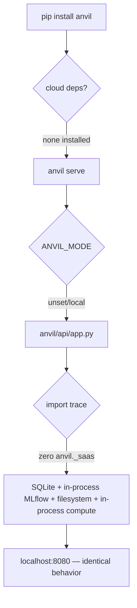

## US5 — SaaS Developer Local Stack

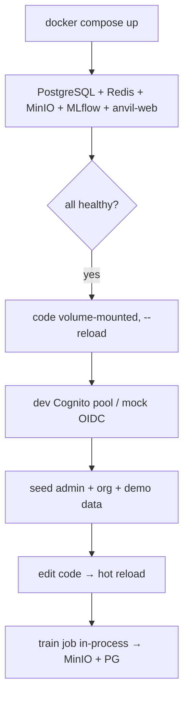

## US6 — CDK Infrastructure (Developer)

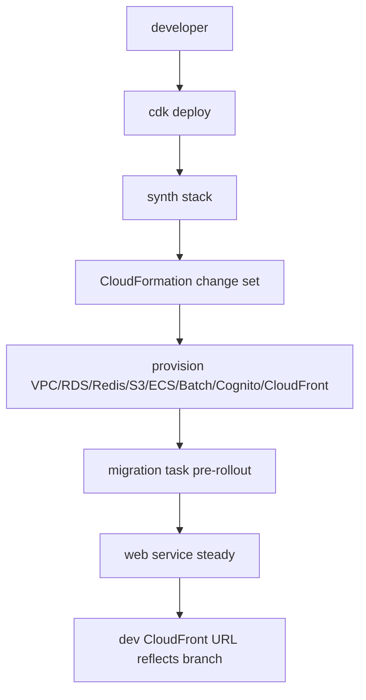

## US7 — One-Command Deploy

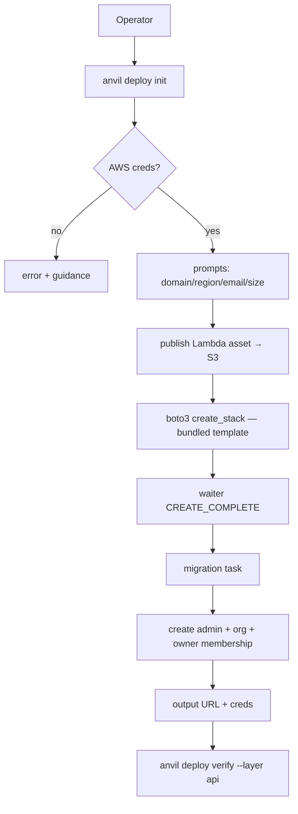

## US8 — Destroy / Upgrade / Reconfigure

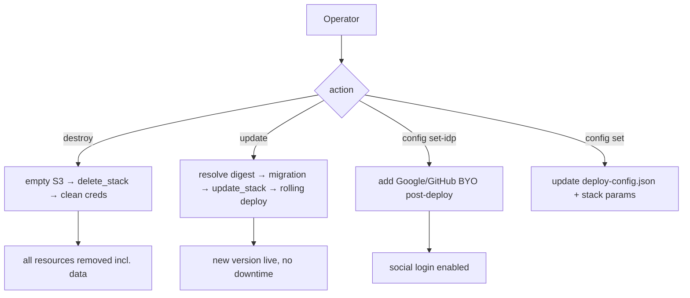

## US9 — CLI Remote Push/Pull

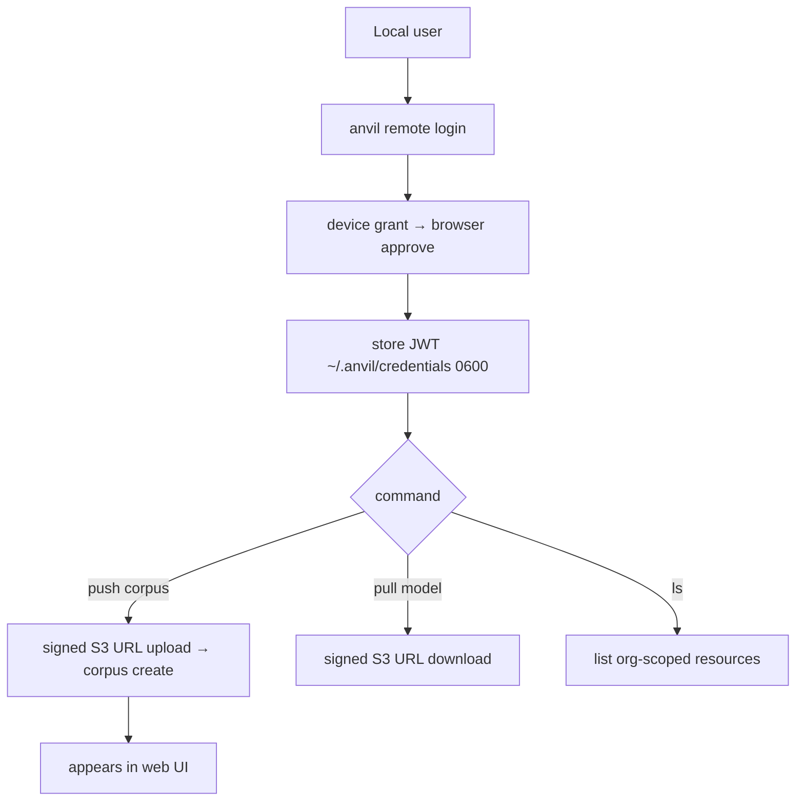

---

# Part B — Data Flow Diagrams

## B1. DFD Level 0 — Context

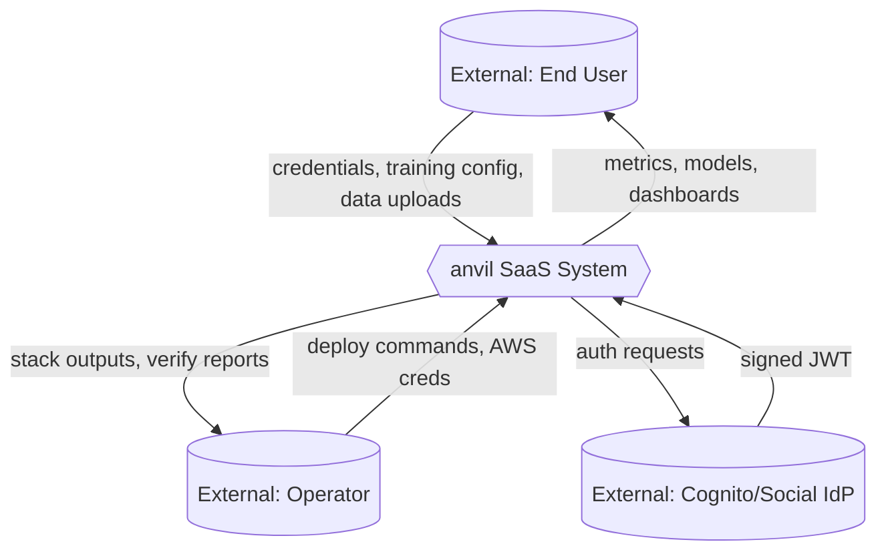

## B2. DFD Level 1 — Internal Processes & Stores

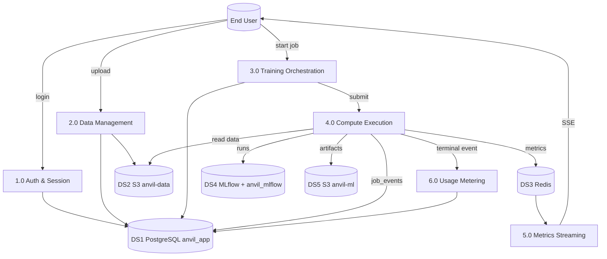

## B3. Data Classification Flows

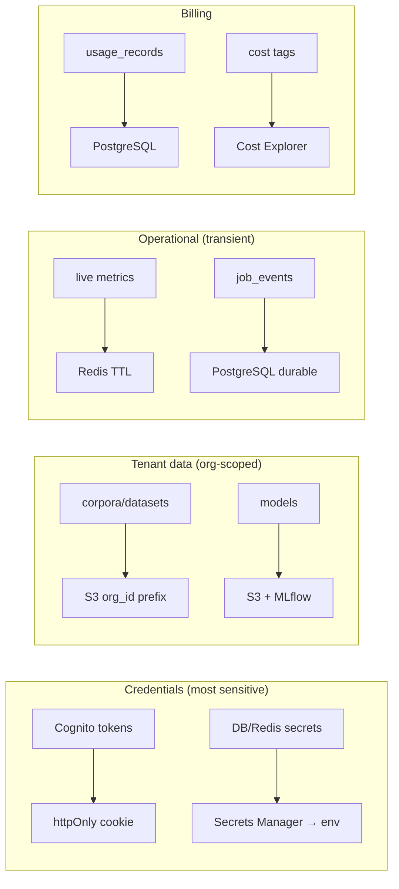

## B4. Upload Data Flow (signed URL, no data through app)

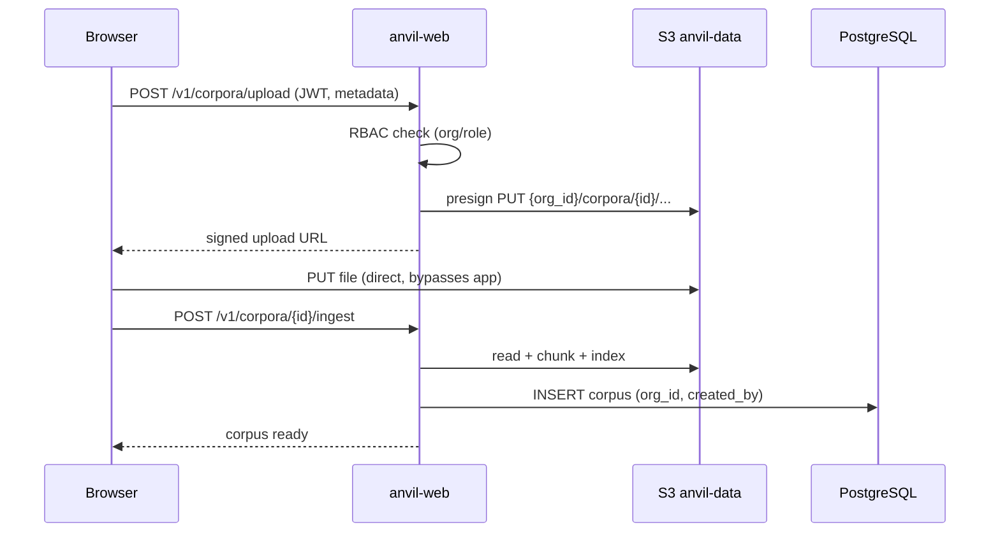

---

# Part C — Schema & ERD Detail

## C1. Table-Level Schema with Keys & Indexes

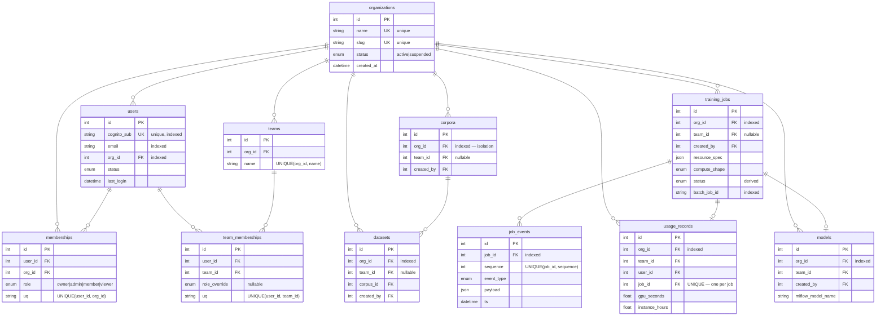

## C2. Index Strategy (isolation + performance)

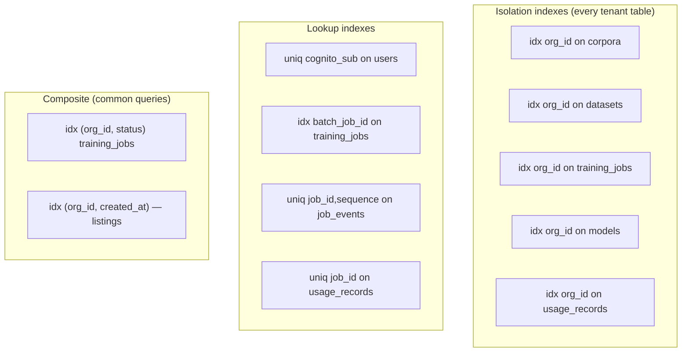

## C3. Two-Database Separation

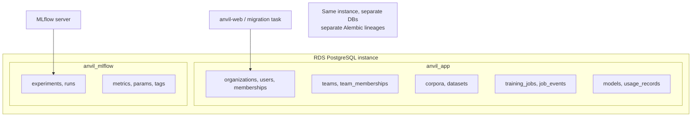

## C4. Migration Lineage

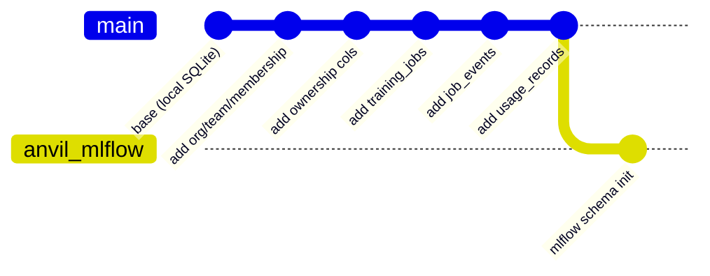

---

# Part D — Network Diagrams

## D1. Traffic Flow (north-south + east-west)

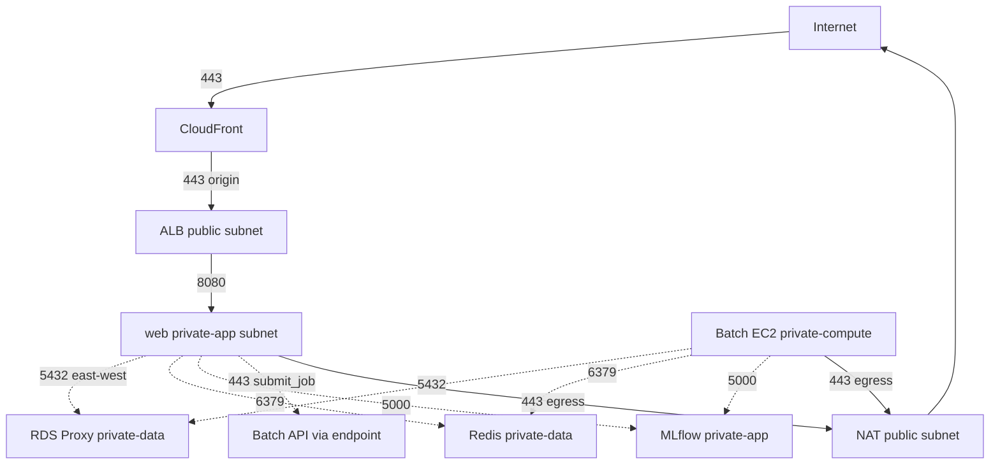

## D2. Port / Protocol Matrix

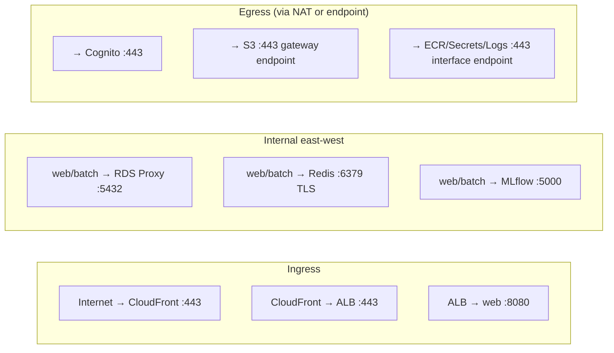

## D3. Multi-AZ Resilience

```mermaid
graph TB
    subgraph "AZ-a"
        WEBA[web task]
        RDSA[RDS primary]
        NATA[NAT-a]
    end
    subgraph "AZ-b"
        WEBB[web task]
        RDSB[RDS standby]
        NATB[NAT-b]
    end
    ALB[ALB spans both AZ] --> WEBA & WEBB
    RDSA -.->|sync replication| RDSB
    WEBA --> NATA
    WEBB --> NATB
```

---

# Part E — Security Perimeter & Trust Boundaries

## E1. Trust Zones

```mermaid
flowchart TB
    subgraph Z0["Zone 0 — Untrusted Internet"]
        ATT[Anyone / attacker]
    end
    subgraph Z1["Zone 1 — Edge (AWS-managed)"]
        CF[CloudFront + WAF]
        COG[Cognito]
    end
    subgraph Z2["Zone 2 — DMZ (public subnets)"]
        ALB[ALB]
        NAT[NAT GW]
    end
    subgraph Z3["Zone 3 — Application (private)"]
        WEB[anvil-web]
        MLF[MLflow]
    end
    subgraph Z4["Zone 4 — Compute (private)"]
        BATCH[Batch EC2]
    end
    subgraph Z5["Zone 5 — Data (private, most trusted)"]
        RDS[(RDS)]
        REDIS[(Redis)]
        S3[(S3)]
        SEC[Secrets Manager]
    end

    ATT -->|TLS only| CF
    ATT -->|TLS auth| COG
    CF --> ALB
    ALB --> WEB
    WEB --> Z5
    BATCH --> Z5
    WEB -.no inbound from internet.-> Z3
    RDS -.no public access.-> Z5
```

## E2. Boundary Crossings & Controls

```mermaid
flowchart LR
    B0[Internet→Edge] -->|control: TLS, WAF rate limit, DDoS| B1[Edge→DMZ]
    B1 -->|control: HTTPS origin, OAC| B2[DMZ→App]
    B2 -->|control: SG :8080 from ALB only| B3[App→Data]
    B3 -->|control: SG, IAM DB auth, no public IP| B4[Compute→Data]
    B4 -->|control: SG, IAM role, VPC endpoints| B5[App/Compute→AWS APIs]
    B5 -->|control: VPC endpoints, no NAT for AWS svcs| DONE[end]
```

## E3. Attack Surface Map

```mermaid
graph TB
    subgraph "Exposed (internet-facing)"
        E1[CloudFront URL :443]
        E2[Cognito Hosted UI :443]
    end
    subgraph "Authenticated-only"
        A1[/v1/* API requires JWT]
        A2[SSE requires signed token]
    end
    subgraph "Never exposed"
        N1[RDS — no public IP]
        N2[Redis — VPC only]
        N3[Batch instances — private]
        N4[MLflow — internal Cloud Map only]
        N5[Secrets Manager — IAM only]
    end
    E1 --> A1 --> N1
    A1 --> A2
```

---

# Part F — Egress Boundaries & Data Exfiltration Controls

## F1. Egress Paths

```mermaid
flowchart TB
    subgraph "Private subnets"
        WEB[anvil-web]
        BATCH[Batch EC2]
    end

    subgraph "Egress options"
        VE[VPC Endpoints<br/>S3, ECR, Secrets, Logs, Batch]
        NAT[NAT Gateway]
    end

    WEB -->|AWS services| VE
    BATCH -->|AWS services| VE
    WEB -->|Cognito, GHCR pull| NAT
    BATCH -->|GHCR pull only| NAT
    NAT --> INET[Internet :443 only]

    VE -.->|stays on AWS backbone<br/>no internet| AWSNET[AWS Service Network]
```

## F2. Data Exfiltration Controls

```mermaid
flowchart TB
    DATA[(Tenant data in S3/RDS)]
    DATA --> C1{egress attempt}
    C1 --> CTRL1[S3 bucket policy: no public ACL]
    C1 --> CTRL2[S3 VPC endpoint policy: this VPC only]
    C1 --> CTRL3[RDS: no public access, IAM auth]
    C1 --> CTRL4[Signed URLs: short TTL, scoped key]
    C1 --> CTRL5[CloudFront OAC: origin locked]
    CTRL1 & CTRL2 & CTRL3 & CTRL4 & CTRL5 --> SAFE[exfiltration blocked]
```

## F3. Compute Pod Egress (tightest)

```mermaid
flowchart LR
    POD[Batch compute pod] --> ALLOW{allowed egress}
    ALLOW -->|S3 via gateway endpoint| S3[anvil-data read/write]
    ALLOW -->|Redis VPC| REDIS[metrics publish]
    ALLOW -->|RDS Proxy VPC| RDS[job_events]
    ALLOW -->|MLflow Cloud Map| MLF[runs]
    ALLOW -->|GHCR via NAT :443| IMG[image pull at launch]
    POD -.->|DENIED| X[arbitrary internet]
```

---

# Part G — Tenant Data Boundaries

## G1. Org Isolation at Every Layer

```mermaid
flowchart TB
    REQ[Request w/ JWT] --> L1[Layer 1: Auth<br/>JWT → cognito_sub → user → org_id]
    L1 --> L2[Layer 2: RBAC middleware<br/>AuthContext.org_id pinned]
    L2 --> L3[Layer 3: Service guard<br/>resource.org_id == ctx.org_id]
    L3 --> L4[Layer 4: Repository<br/>WHERE org_id = ctx.org_id]
    L4 --> L5[Layer 5: Storage<br/>S3 key prefix org_id/]
    L5 --> L6[Layer 6: MLflow<br/>experiment tag org_id]
    L6 --> DATA[(only Org's data returned)]

    style L1 fill:#e1f5fe
    style L2 fill:#e8f5e9
    style L3 fill:#fff3e0
    style L4 fill:#fce4ec
    style L5 fill:#f3e5f5
    style L6 fill:#fff8e1
```

## G2. Tenant Boundary Map (where org_id lives)

```mermaid
graph TB
    ORG[org_id]
    ORG --> DB[every tenant table FK + index]
    ORG --> S3[S3 key prefix: org_id/...]
    ORG --> ML[MLflow experiment tag]
    ORG --> BATCH[Batch job Cost Allocation Tag]
    ORG --> USAGE[usage_records.org_id]
    ORG --> SSE[SSE token scoped to job in org]
```

## G3. Cross-Tenant Denial Paths

```mermaid
flowchart TB
    B[User Org B] --> T1[list query] --> R1[repo filters org_id=B → A invisible]
    B --> T2[direct id access] --> R2[guard: A.org_id != B → 403]
    B --> T3[S3 signed URL guess] --> R3[no URL issued for A's key → denied]
    B --> T4[MLflow experiment] --> R4[tag filter org_id=B → A hidden]
    B --> T5[SSE other job] --> R5[token scope mismatch → 401]
    R1 & R2 & R3 & R4 & R5 --> ISO[tenant isolation preserved]
```

## G4. Shared vs Isolated Resources

```mermaid
graph TB
    subgraph "Shared (infrastructure, all tenants)"
        S1[ECS web tier]
        S2[RDS instance]
        S3[Redis cluster]
        S4[Batch compute envs]
        S5[MLflow server]
    end
    subgraph "Isolated (per-org, logical)"
        I1[corpora/datasets rows]
        I2[S3 org_id prefix]
        I3[MLflow experiments by tag]
        I4[training jobs + usage]
    end
    S2 --> I1
    S3 -.->|job-scoped channels| I4
    S4 -.->|tagged jobs| I4
    S5 --> I3
```

---

# Part H — Access Boundaries

## H1. IAM Role Boundaries

```mermaid
graph TB
    subgraph "AnvilTaskRole (web)"
        AT1[S3 anvil-data RW]
        AT2[Secrets read]
        AT3[Batch submit_job + tag]
        AT4[RDS IAM connect]
    end
    subgraph "MlflowTaskRole"
        MT1[S3 anvil-ml RW]
        MT2[RDS connect anvil_mlflow]
    end
    subgraph "BatchJobRole (compute)"
        BJ1[S3 anvil-data RW]
        BJ2[Redis connect]
        BJ3[RDS IAM connect]
        BJ4[Secrets read scoped]
    end
    subgraph "BatchExecutionRole"
        BE1[ECR pull]
        BE2[CloudWatch logs]
    end
    subgraph "Deploy principal (operator)"
        DP1[CloudFormation full]
        DP2[asset publish to S3]
    end
```

## H2. RBAC Enforcement Points

```mermaid
flowchart TB
    subgraph "Enforcement point 1 — Middleware"
        M[reject if no valid JWT → 401]
    end
    subgraph "Enforcement point 2 — RBAC resolver"
        R[attach org_id + effective role]
    end
    subgraph "Enforcement point 3 — Service guard"
        G[org match + role permits action]
    end
    subgraph "Enforcement point 4 — Repository"
        Q[org_id WHERE clause — defense in depth]
    end
    REQ[Request] --> M --> R --> G --> Q --> DATA[data]
```

## H3. Principal → Resource Access Matrix

```mermaid
graph LR
    subgraph Principals
        OWNER[org owner]
        ADMIN[org admin]
        MEMBER[member]
        VIEWER[viewer]
        PODP[compute pod role]
        OPP[deploy operator]
    end
    subgraph Resources
        ORGR[org settings]
        TEAMR[teams/members]
        RES[corpora/datasets/jobs]
        USAGER[usage/billing]
        INFRA[AWS infra]
    end

    OWNER --> ORGR & TEAMR & RES & USAGER
    ADMIN --> TEAMR & RES & USAGER
    MEMBER --> RES
    VIEWER -.read only.-> RES
    PODP -.write job_events/artifacts.-> RES
    OPP --> INFRA
```

## H4. Secrets Access Boundary

```mermaid
flowchart TB
    SEC[(Secrets Manager)]
    SEC --> S1[RDS master password → RDS Proxy ONLY<br/>never to pods]
    SEC --> S2[Redis auth token → web, batch<br/>via secrets: injection]
    SEC --> S3[SSE signing secret → web only]
    SEC --> S4[Social OAuth secrets → Cognito config only]
    ACCESS{IAM-gated, no human read in prod} --> SEC
    ROTATE[rotation policy] -.-> SEC
```

## H5. DB Credential Flow — IAM Auth (no creds to pods, FR-045c/e)

```mermaid
sequenceDiagram
    participant POD as Compute Pod / web
    participant ROLE as IAM Task/Job Role
    participant PROXY as RDS Proxy
    participant SEC as Secrets Manager
    participant RDS as RDS PostgreSQL

    Note over POD: holds NO DB password — only its IAM role
    POD->>ROLE: assume (injected by Batch/ECS)
    POD->>ROLE: generate_db_auth_token (≤15 min)
    ROLE-->>POD: short-lived token
    POD->>PROXY: connect (token as password, TLS)
    PROXY->>SEC: read RDS master password (proxy only)
    PROXY->>RDS: pooled connection (real creds)
    Note over POD,PROXY: token-provider callback refreshes<br/>on new pooled connections (FR-045e)
```

## H6. Secret Delivery Paths (what flows where)

```mermaid
flowchart LR
    subgraph "IAM auth (no secret flows)"
        I1[DB access] --> I2[role-derived token at connect]
    end
    subgraph "secrets: injection (execution role → env at launch)"
        E1[Redis auth token]
        E2[SSE signing secret]
    end
    subgraph "config-only (never to app containers)"
        C1[RDS master password → RDS Proxy]
        C2[OAuth client secrets → Cognito]
    end
    subgraph "Forbidden"
        F1[secret in image]
        F2[secret in logs]
        F3[secret as plaintext container override]
    end
    I1 & E1 & E2 & C1 & C2 -.->|never| F1 & F2 & F3
```

## H7. Cluster Admin — Read-Wide, Write-Narrow (AD-14, FR-037a/b)

Added 2026-06-19. The `is_cluster_admin` flag is NOT a blanket bypass: it widens the read-scoping
predicate and grants a fixed cluster-operation matrix, but tenant-data writes still flow through the
org-role guard.

```mermaid
flowchart TB
    REQ[Authenticated request<br/>is_cluster_admin=true] --> KIND{operation kind}

    KIND -->|read / list| READ[bypass org_id scoping<br/>→ cross-org rows returned]

    KIND -->|cluster op| MATRIX{in cluster-admin<br/>action matrix?}
    MATRIX -->|suspend org / cancel job /<br/>manage cluster admins /<br/>view health, logs, usage| ALLOWOP[Allow]
    MATRIX -->|no| DENYOP[403]

    KIND -->|tenant-data write<br/>delete corpus / mutate dataset| ORGGUARD{holds org owner/admin<br/>role in THAT org?}
    ORGGUARD -->|yes| ALLOWW[Allow]
    ORGGUARD -->|no| DENYW[403 — flag alone insufficient]

    style READ fill:#e8f5e9
    style ALLOWOP fill:#e8f5e9
    style ALLOWW fill:#e8f5e9
    style DENYOP fill:#fce4ec
    style DENYW fill:#fce4ec
```

### Local mode contrast (FR-038b)

```mermaid
flowchart LR
    LREQ[Request in local mode] --> NOAUTH[No JWT middleware]
    NOAUTH --> NOSCOPE[No org scoping]
    NOSCOPE --> FULL[Implicit full access<br/>is_cluster_admin / roles not consulted]
```

---

## Diagram Inventory

| Part | Diagrams |
|------|----------|
| A — User Story Flows | US1–US9 + US2a training resilience (10) |
| B — Data Flow | DFD L0, DFD L1, classification, upload (4) |
| C — Schema & ERD | table-level, index strategy, two-DB, migration lineage (4) |
| D — Network | traffic flow, port matrix, multi-AZ (3) |
| E — Perimeter & Trust | trust zones, boundary controls, attack surface (3) |
| F — Egress | egress paths, exfil controls, pod egress (3) |
| G — Tenant Boundaries | layer isolation, boundary map, denial paths, shared/isolated (4) |
| H — Access Boundaries | IAM roles, RBAC enforcement, access matrix, secrets, DB credential IAM flow, secret delivery paths, cluster-admin read-wide/write-narrow + local-mode contrast (8) |

**Total: 39 diagrams.** Combined with [[SaaSSystemDiagrams]] (38), the architecture has **77 diagrams**.

## See Also

- [[SaaSSystemDiagrams]] — structural, data, auth, compute, deploy, observability, proxy, multi-cluster, HA (38 diagrams)
- [[SaaSArchitecture]] — narrative overview + feature matrix
- `specs/016-saas-architecture/spec.md` — AD-1..AD-16, acceptance gates
- `specs/016-saas-architecture/data-model.md` — schema source