# SaaS System Diagrams — Full Fidelity

Granular per-subsystem diagrams for the anvil SaaS architecture. Aligned with Architecture Decisions **AD-1 through AD-11** in `specs/014-saas-architecture/spec.md`. For the narrative overview and feature matrix see [[SaaSArchitecture]].

> [!WARNING]
> **Pending Updates (2026-06-19)**: These 33 diagrams predate the SaaS spec-hardening session. They do NOT yet depict observability (Prometheus/Grafana/Alertmanager/X-Ray, FR-052–FR-056), the MLflow reverse proxy (FR-057), the cluster-admin tier (FR-034–FR-038b), multi-cluster topology (FR-014a/c), Redis Multi-AZ (FR-045q), EFS-backed Prometheus, or the SNS alerting path. The spec now defines **AD-1 through AD-16**. See [[Decisions/ADR-030-saas-architecture|ADR-030]] and [[2026-06-19-saas-spec-hardening|the hardening session log]]. Diagram redraw is deferred follow-up.

## Index

- **Part A — Structural**: C4 context, containers, components, network, CDK composition
- **Part B — Data**: full ERD, RBAC model, job state machine, S3 layout
- **Part C — Auth & Authz**: browser OIDC, CLI device grant, SSE token, RBAC resolution
- **Part D — Training & Compute**: submission, CPU/GPU/multi-node, job events, reconciler, SSE replay, usage metering, MLflow
- **Part E — Deploy & Ops**: init, destroy, update, migration, verify, CI/CD
- **Part F — Local Mode & Mode Selection**

---

# Part A — Structural

## A1. C4 Level 1 — System Context

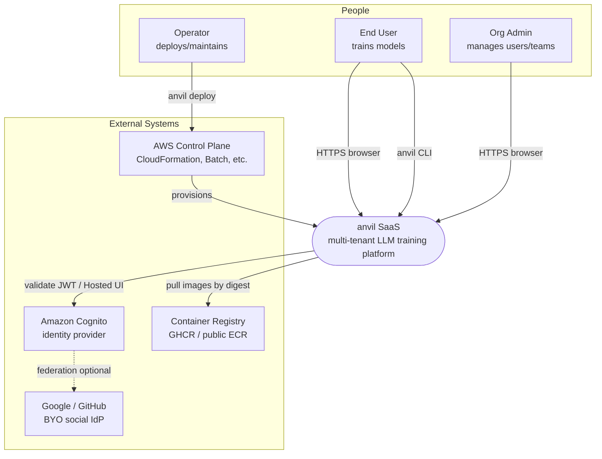
```mermaid
graph TB
    subgraph People
        END[End User<br/>trains models]
        ADMIN[Org Admin<br/>manages users/teams]
        OPER[Operator<br/>deploys/maintains]
    end

    ANVIL([anvil SaaS<br/>multi-tenant LLM training platform])

    subgraph "External Systems"
        COGNITO[Amazon Cognito<br/>identity provider]
        GOOGLE[Google / GitHub<br/>BYO social IdP]
        GHCR[Container Registry<br/>GHCR / public ECR]
        AWS[AWS Control Plane<br/>CloudFormation, Batch, etc.]
    end

    END -->|HTTPS browser| ANVIL
    END -->|anvil CLI| ANVIL
    ADMIN -->|HTTPS browser| ANVIL
    OPER -->|anvil deploy| AWS
    AWS -->|provisions| ANVIL

    ANVIL -->|validate JWT / Hosted UI| COGNITO
    COGNITO -.->|federation optional| GOOGLE
    ANVIL -->|pull images by digest| GHCR
```

## A2. C4 Level 2 — Container Diagram

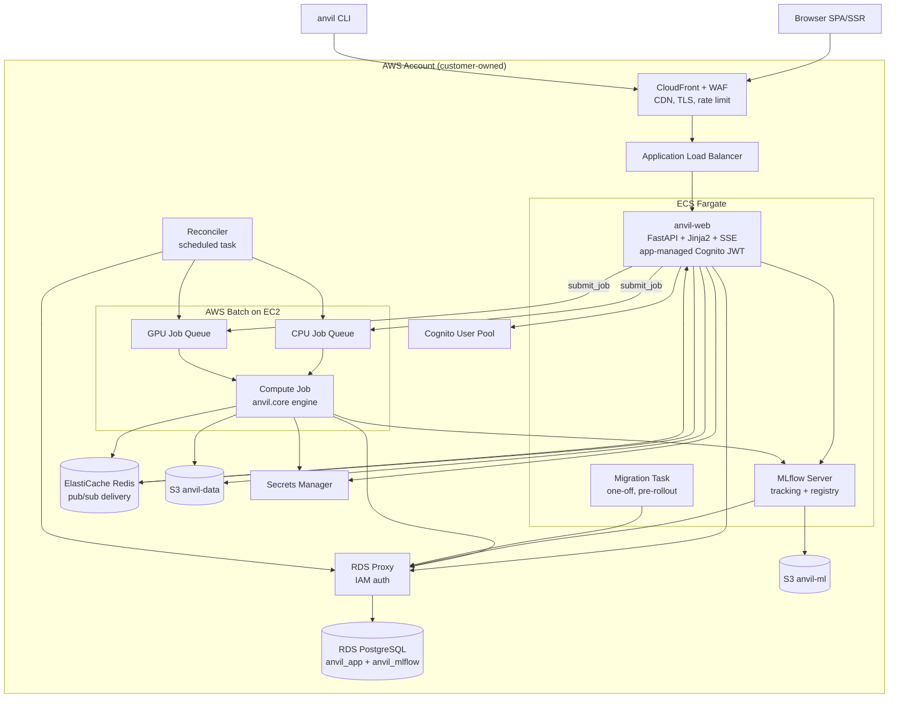
```mermaid
graph TB
    BROWSER[Browser SPA/SSR]
    CLI[anvil CLI]

    subgraph "AWS Account (customer-owned)"
        direction TB
        CF[CloudFront + WAF<br/>CDN, TLS, rate limit]
        ALB[Application Load Balancer]

        subgraph "ECS Fargate"
            WEB[anvil-web<br/>FastAPI + Jinja2 + SSE<br/>app-managed Cognito JWT]
            MLFLOW[MLflow Server<br/>tracking + registry]
            MIGRATE[Migration Task<br/>one-off, pre-rollout]
        end

        subgraph "AWS Batch on EC2"
            CPUQ[CPU Job Queue]
            GPUQ[GPU Job Queue]
            POD[Compute Job<br/>anvil.core engine]
        end

        COG[Cognito User Pool]
        PG[(RDS PostgreSQL<br/>anvil_app + anvil_mlflow)]
        PROXY[RDS Proxy<br/>IAM auth]
        REDIS[(ElastiCache Redis<br/>pub/sub delivery)]
        S3D[(S3 anvil-data)]
        S3M[(S3 anvil-ml)]
        SEC[Secrets Manager]
        REapp[Reconciler<br/>scheduled task]
    end

    BROWSER --> CF --> ALB --> WEB
    CLI --> CF

    WEB --> COG
    WEB --> PROXY --> PG
    WEB --> REDIS
    WEB --> S3D
    WEB --> MLFLOW
    WEB -->|submit_job| CPUQ
    WEB -->|submit_job| GPUQ
    CPUQ --> POD
    GPUQ --> POD
    POD --> PROXY
    POD --> REDIS
    POD --> S3D
    POD --> MLFLOW
    MLFLOW --> PROXY
    MLFLOW --> S3M
    MIGRATE --> PROXY
    WEB --> SEC
    POD --> SEC
    REapp --> PROXY
    REapp --> CPUQ
    REapp --> GPUQ
    REDIS --> WEB
```

## A3. C4 Level 3 — anvil-web Component Diagram

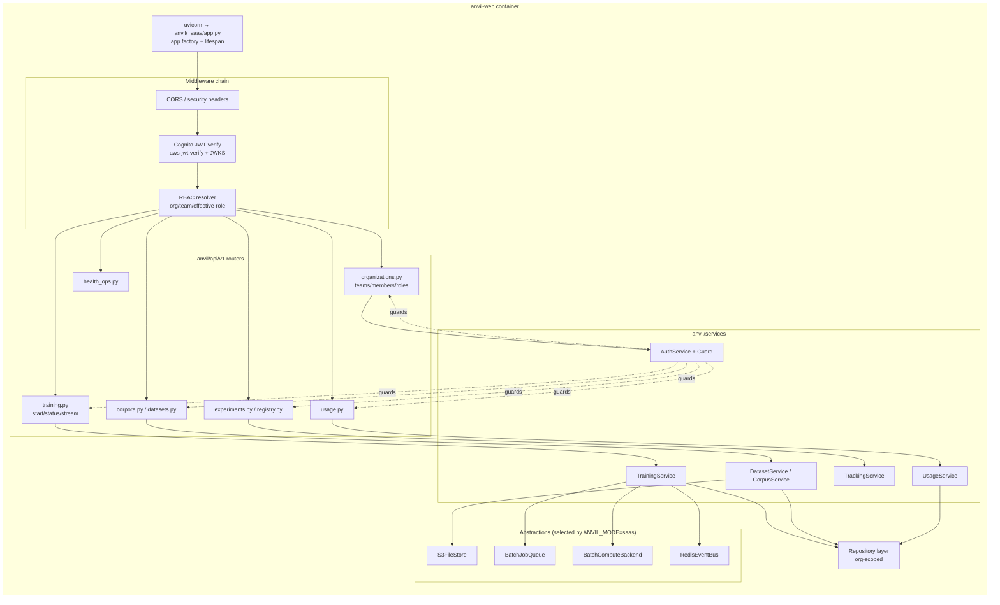
```mermaid
graph TB
    subgraph "anvil-web container"
        direction TB
        ENTRY[uvicorn → anvil/_saas/app.py<br/>app factory + lifespan]

        subgraph "Middleware chain"
            M1[CORS / security headers]
            M2[Cognito JWT verify<br/>aws-jwt-verify + JWKS]
            M3[RBAC resolver<br/>org/team/effective-role]
        end

        subgraph "anvil/api/v1 routers"
            R1[training.py<br/>start/status/stream]
            R2[corpora.py / datasets.py]
            R3[organizations.py<br/>teams/members/roles]
            R4[experiments.py / registry.py]
            R5[usage.py]
            R6[health_ops.py]
        end

        subgraph "anvil/services"
            SVC1[TrainingService]
            SVC2[DatasetService / CorpusService]
            SVC3[AuthService + Guard]
            SVC4[TrackingService]
            SVC5[UsageService]
        end

        subgraph "Abstractions (selected by ANVIL_MODE=saas)"
            A1[S3FileStore]
            A2[RedisEventBus]
            A3[BatchJobQueue]
            A4[BatchComputeBackend]
        end

        REPO[Repository layer<br/>org-scoped]
    end

    ENTRY --> M1 --> M2 --> M3
    M3 --> R1 & R2 & R3 & R4 & R5 & R6
    R1 --> SVC1
    R2 --> SVC2
    R3 --> SVC3
    R4 --> SVC4
    R5 --> SVC5
    SVC3 -. guards .-> R1 & R2 & R3 & R4 & R5
    SVC1 --> A3 & A4 & A2
    SVC2 --> A1
    SVC1 & SVC2 & SVC5 --> REPO
```

## A4. Network Topology (VPC)

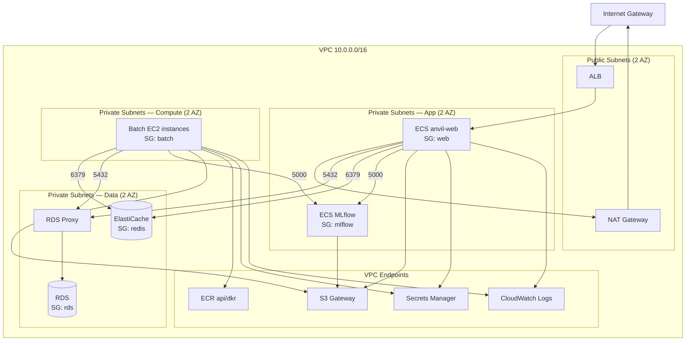
```mermaid
graph TB
    IGW[Internet Gateway]

    subgraph "VPC 10.0.0.0/16"
        subgraph "Public Subnets (2 AZ)"
            ALB[ALB]
            NAT[NAT Gateway]
        end

        subgraph "Private Subnets — App (2 AZ)"
            WEB[ECS anvil-web<br/>SG: web]
            MLF[ECS MLflow<br/>SG: mlflow]
        end

        subgraph "Private Subnets — Compute (2 AZ)"
            BATCH[Batch EC2 instances<br/>SG: batch]
        end

        subgraph "Private Subnets — Data (2 AZ)"
            PG[(RDS<br/>SG: rds)]
            PROXY[RDS Proxy]
            REDIS[(ElastiCache<br/>SG: redis)]
        end

        subgraph "VPC Endpoints"
            VE1[S3 Gateway]
            VE2[ECR api/dkr]
            VE3[Secrets Manager]
            VE4[CloudWatch Logs]
        end
    end

    IGW --> ALB
    ALB --> WEB
    WEB --> NAT --> IGW
    WEB -->|5432| PROXY --> PG
    WEB -->|6379| REDIS
    WEB -->|5000| MLF
    BATCH -->|6379| REDIS
    BATCH -->|5432| PROXY
    BATCH -->|5000| MLF
    BATCH --> VE1 & VE2 & VE3 & VE4
    WEB --> VE1 & VE3 & VE4
    MLF --> VE1
```

### Security Group Rules

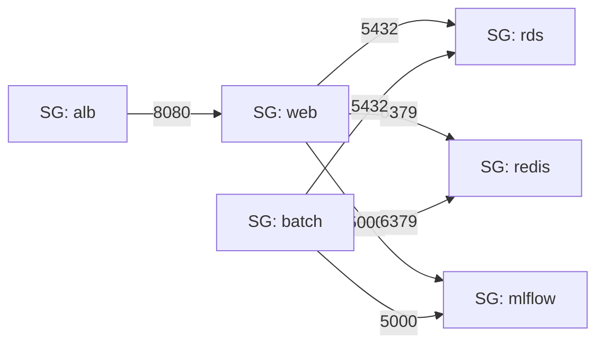
```mermaid
graph LR
    WEBSG[SG: web] -->|5432| RDSSG[SG: rds]
    WEBSG -->|6379| REDISSG[SG: redis]
    WEBSG -->|5000| MLFSG[SG: mlflow]
    BATCHSG[SG: batch] -->|5432| RDSSG
    BATCHSG -->|6379| REDISSG
    BATCHSG -->|5000| MLFSG
    ALBSG[SG: alb] -->|8080| WEBSG
```

## A5. CDK Stack Composition

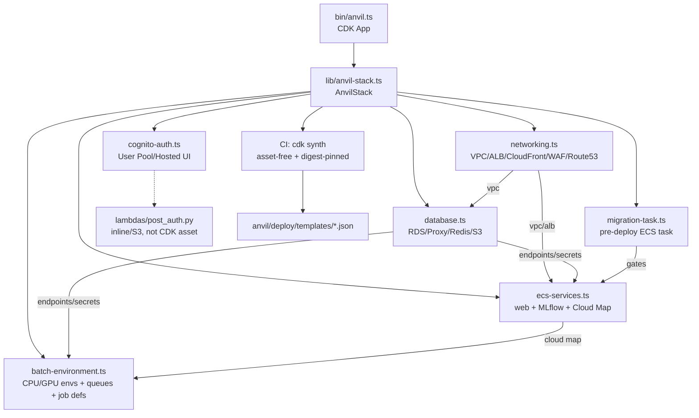
```mermaid
graph TB
    APP[bin/anvil.ts<br/>CDK App]
    STACK[lib/anvil-stack.ts<br/>AnvilStack]

    NET[networking.ts<br/>VPC/ALB/CloudFront/WAF/Route53]
    DB[database.ts<br/>RDS/Proxy/Redis/S3]
    COG[cognito-auth.ts<br/>User Pool/Hosted UI]
    ECS[ecs-services.ts<br/>web + MLflow + Cloud Map]
    BATCH[batch-environment.ts<br/>CPU/GPU envs + queues + job defs]
    MIG[migration-task.ts<br/>pre-deploy ECS task]
    LAMBDA[lambdas/post_auth.py<br/>inline/S3, not CDK asset]

    APP --> STACK
    STACK --> NET
    STACK --> DB
    STACK --> COG
    STACK --> ECS
    STACK --> BATCH
    STACK --> MIG
    COG -.-> LAMBDA

    NET -->|vpc| DB
    NET -->|vpc/alb| ECS
    DB -->|endpoints/secrets| ECS
    DB -->|endpoints/secrets| BATCH
    ECS -->|cloud map| BATCH
    MIG -->|gates| ECS

    SYNTH[CI: cdk synth<br/>asset-free + digest-pinned] --> TPL[anvil/deploy/templates/*.json]
    STACK --> SYNTH
```

---

# Part B — Data

## B1. Full Entity-Relationship Diagram

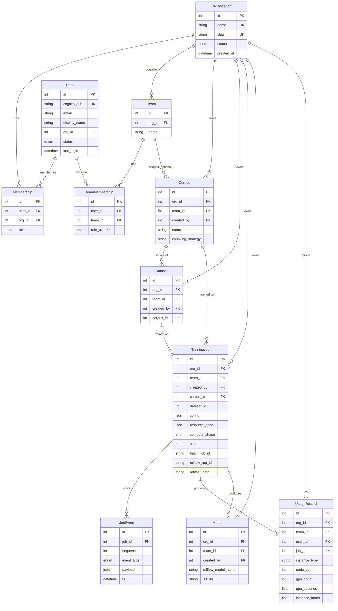
```mermaid
erDiagram
    Organization ||--o{ Membership : has
    Organization ||--o{ Team : contains
    Organization ||--o{ Corpus : owns
    Organization ||--o{ Dataset : owns
    Organization ||--o{ TrainingJob : owns
    Organization ||--o{ Model : owns
    Organization ||--o{ UsageRecord : billed

    User ||--o{ Membership : "member via"
    User ||--o{ TeamMembership : "joins via"
    Team ||--o{ TeamMembership : has
    Team ||--o{ Corpus : "scopes (optional)"

    Corpus ||--o{ Dataset : "source of"
    Corpus ||--o{ TrainingJob : "trained on"
    Dataset ||--o{ TrainingJob : "trained on"
    TrainingJob ||--o{ JobEvent : emits
    TrainingJob ||--o| UsageRecord : produces
    TrainingJob ||--o| Model : produces

    Organization {
        int id PK
        string name UK
        string slug UK
        enum status
        datetime created_at
    }
    User {
        int id PK
        string cognito_sub UK
        string email
        string display_name
        int org_id FK
        enum status
        datetime last_login
    }
    Membership {
        int id PK
        int user_id FK
        int org_id FK
        enum role
    }
    Team {
        int id PK
        int org_id FK
        string name
    }
    TeamMembership {
        int id PK
        int user_id FK
        int team_id FK
        enum role_override
    }
    Corpus {
        int id PK
        int org_id FK
        int team_id FK
        int created_by FK
        string name
        string chunking_strategy
    }
    Dataset {
        int id PK
        int org_id FK
        int team_id FK
        int created_by FK
        int corpus_id FK
    }
    TrainingJob {
        int id PK
        int org_id FK
        int team_id FK
        int created_by FK
        int corpus_id FK
        int dataset_id FK
        json config
        json resource_spec
        enum compute_shape
        enum status
        string batch_job_id
        string mlflow_run_id
        string artifact_path
    }
    JobEvent {
        int id PK
        int job_id FK
        int sequence
        enum event_type
        json payload
        datetime ts
    }
    Model {
        int id PK
        int org_id FK
        int team_id FK
        int created_by FK
        string mlflow_model_name
        string s3_uri
    }
    UsageRecord {
        int id PK
        int org_id FK
        int team_id FK
        int user_id FK
        int job_id FK
        string instance_type
        int node_count
        int gpu_count
        float gpu_seconds
        float instance_hours
    }
```

## B2. RBAC Model & Effective Role Resolution

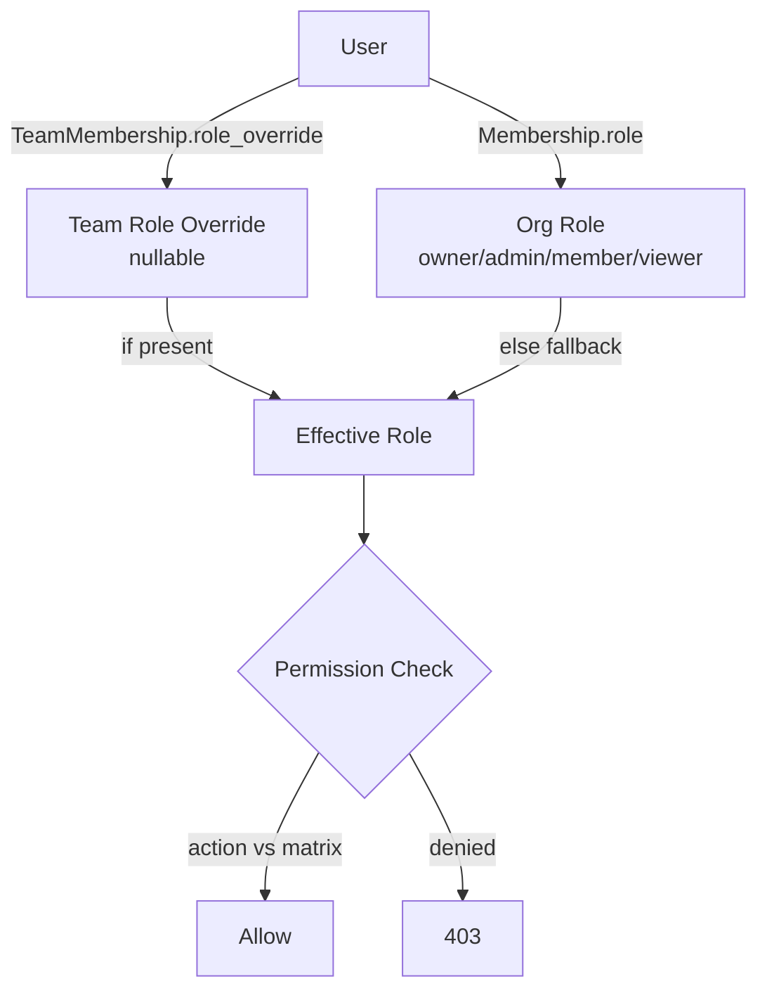
```mermaid
graph TB
    U[User] -->|Membership.role| ORGROLE[Org Role<br/>owner/admin/member/viewer]
    U -->|TeamMembership.role_override| TEAMROLE[Team Role Override<br/>nullable]

    TEAMROLE -->|if present| EFF[Effective Role]
    ORGROLE -->|else fallback| EFF

    EFF --> PERM{Permission Check}
    PERM -->|action vs matrix| ALLOW[Allow]
    PERM -->|denied| DENY[403]
```

### Permission Matrix

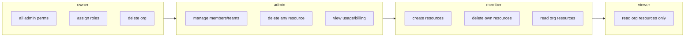
```mermaid
graph LR
    subgraph owner
        O1[all admin perms]
        O2[assign roles]
        O3[delete org]
    end
    subgraph admin
        AD1[manage members/teams]
        AD2[delete any resource]
        AD3[view usage/billing]
    end
    subgraph member
        ME1[create resources]
        ME2[delete own resources]
        ME3[read org resources]
    end
    subgraph viewer
        VI1[read org resources only]
    end
    owner --> admin --> member --> viewer
```

## B3. TrainingJob State Machine (with reconciler)

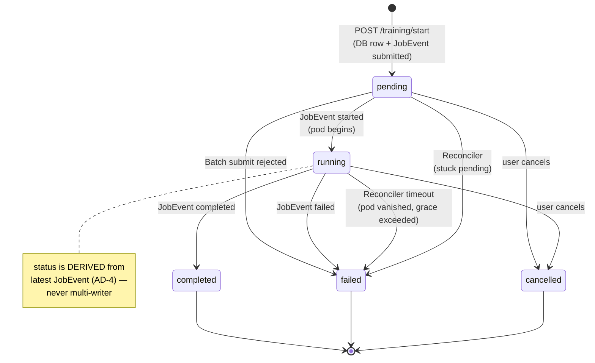
```mermaid
stateDiagram-v2
    [*] --> pending: POST /training/start<br/>(DB row + JobEvent submitted)
    pending --> running: JobEvent started<br/>(pod begins)
    pending --> failed: Batch submit rejected
    pending --> cancelled: user cancels
    running --> completed: JobEvent completed
    running --> failed: JobEvent failed
    running --> cancelled: user cancels
    running --> failed: Reconciler timeout<br/>(pod vanished, grace exceeded)
    pending --> failed: Reconciler<br/>(stuck pending)

    completed --> [*]
    failed --> [*]
    cancelled --> [*]

    note right of running
        status is DERIVED from
        latest JobEvent (AD-4) —
        never multi-writer
    end note
```

## B4. S3 Key Layout

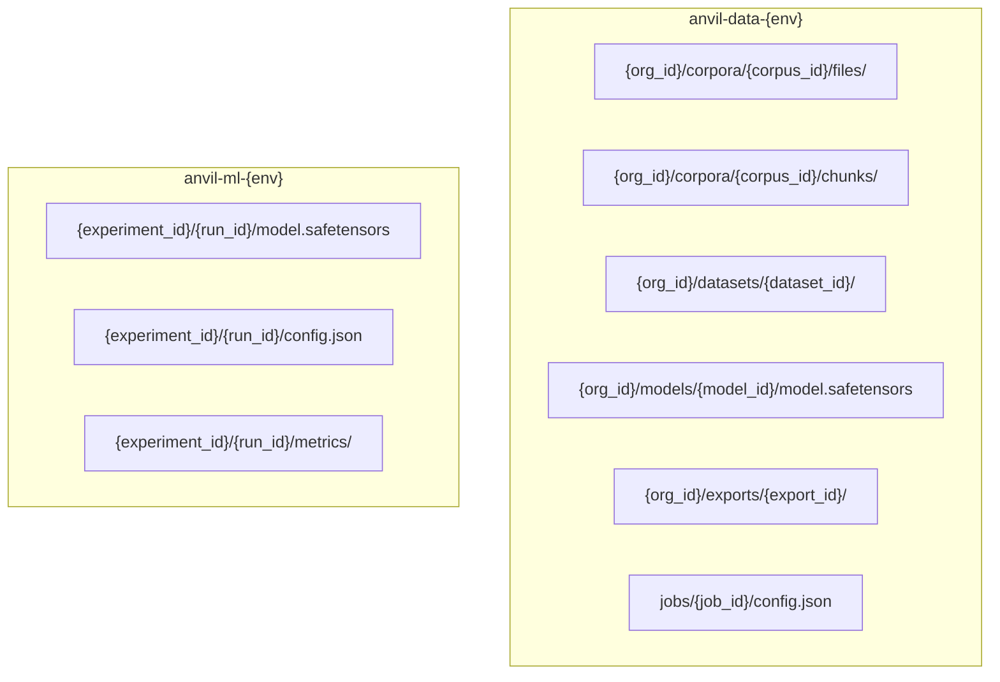
```mermaid
graph TB
    subgraph "anvil-data-{env}"
        D1["{org_id}/corpora/{corpus_id}/files/"]
        D2["{org_id}/corpora/{corpus_id}/chunks/"]
        D3["{org_id}/datasets/{dataset_id}/"]
        D4["{org_id}/models/{model_id}/model.safetensors"]
        D5["{org_id}/exports/{export_id}/"]
        D6["jobs/{job_id}/config.json"]
    end
    subgraph "anvil-ml-{env}"
        M1["{experiment_id}/{run_id}/model.safetensors"]
        M2["{experiment_id}/{run_id}/config.json"]
        M3["{experiment_id}/{run_id}/metrics/"]
    end
```

---

# Part C — Auth & Authz

## C1. Browser Login — App-Managed OIDC (AD-2)

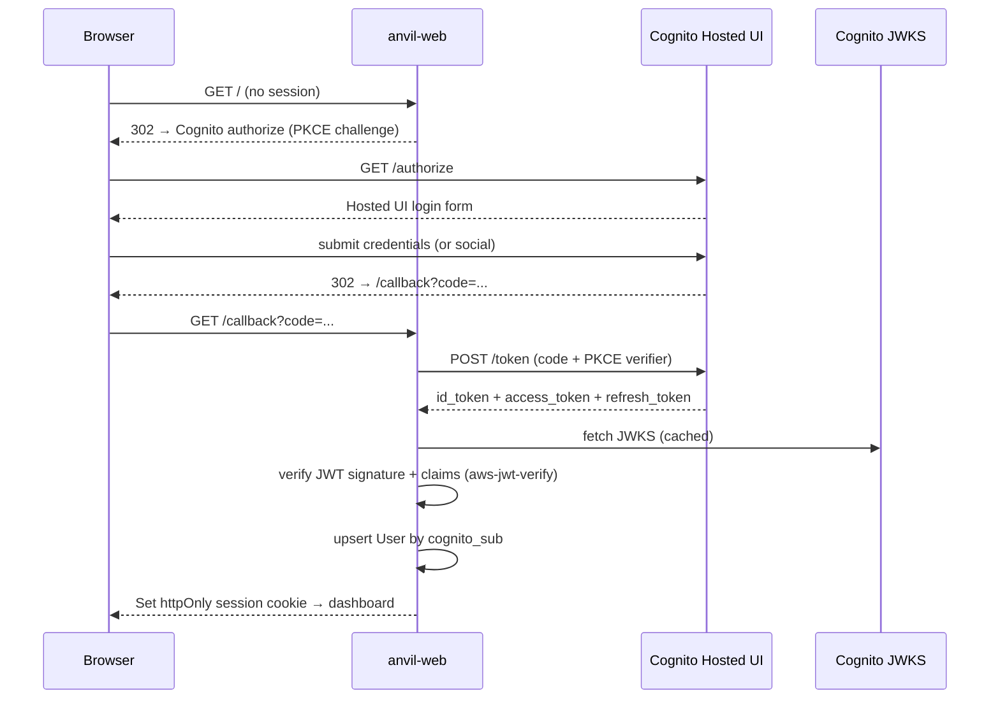
```mermaid
sequenceDiagram
    participant B as Browser
    participant W as anvil-web
    participant C as Cognito Hosted UI
    participant J as Cognito JWKS

    B->>W: GET / (no session)
    W-->>B: 302 → Cognito authorize (PKCE challenge)
    B->>C: GET /authorize
    C-->>B: Hosted UI login form
    B->>C: submit credentials (or social)
    C-->>B: 302 → /callback?code=...
    B->>W: GET /callback?code=...
    W->>C: POST /token (code + PKCE verifier)
    C-->>W: id_token + access_token + refresh_token
    W->>J: fetch JWKS (cached)
    W->>W: verify JWT signature + claims (aws-jwt-verify)
    W->>W: upsert User by cognito_sub
    W-->>B: Set httpOnly session cookie → dashboard
```

## C2. CLI Device Authorization Grant (FR-021)

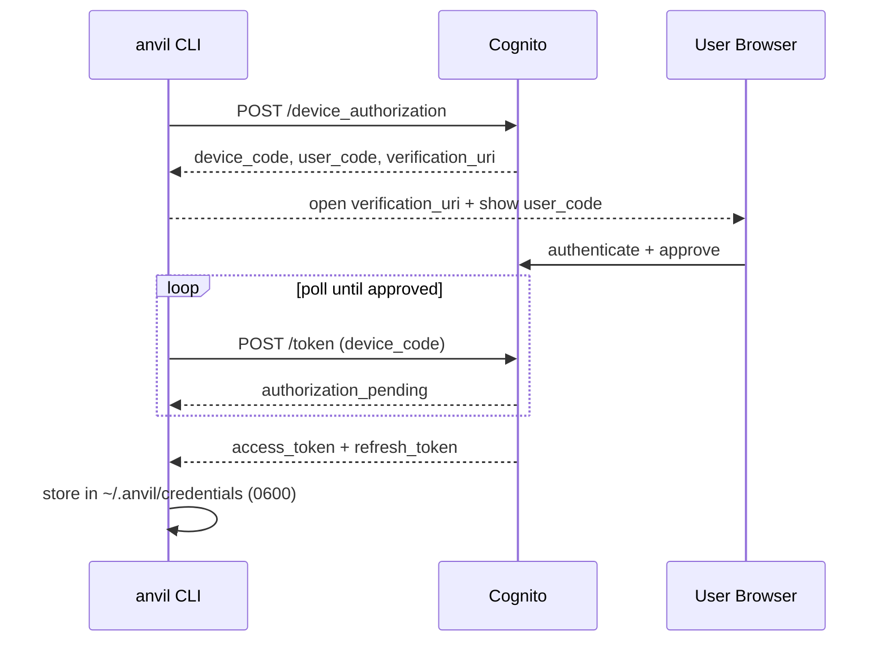
```mermaid
sequenceDiagram
    participant CLI as anvil CLI
    participant C as Cognito
    participant BR as User Browser

    CLI->>C: POST /device_authorization
    C-->>CLI: device_code, user_code, verification_uri
    CLI-->>BR: open verification_uri + show user_code
    BR->>C: authenticate + approve
    loop poll until approved
        CLI->>C: POST /token (device_code)
        C-->>CLI: authorization_pending
    end
    C-->>CLI: access_token + refresh_token
    CLI->>CLI: store in ~/.anvil/credentials (0600)
```

## C3. SSE Auth — Short-Lived Signed Token (AD-2, FR-020)

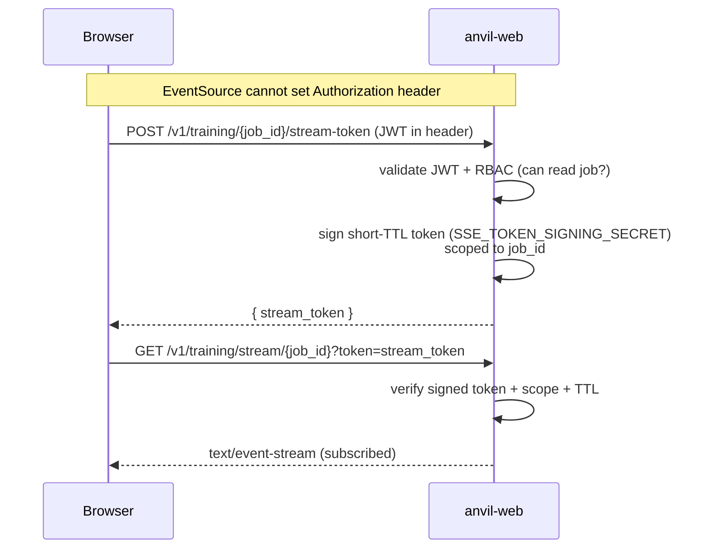
```mermaid
sequenceDiagram
    participant B as Browser
    participant W as anvil-web

    Note over B,W: EventSource cannot set Authorization header
    B->>W: POST /v1/training/{job_id}/stream-token (JWT in header)
    W->>W: validate JWT + RBAC (can read job?)
    W->>W: sign short-TTL token (SSE_TOKEN_SIGNING_SECRET)<br/>scoped to job_id
    W-->>B: { stream_token }
    B->>W: GET /v1/training/stream/{job_id}?token=stream_token
    W->>W: verify signed token + scope + TTL
    W-->>B: text/event-stream (subscribed)
```

## C4. RBAC Authorization Flow (AD-8)

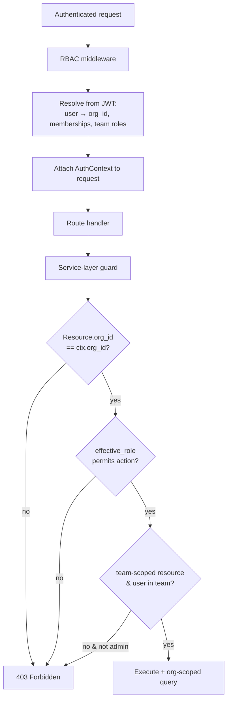
```mermaid
flowchart TB
    REQ[Authenticated request] --> MW[RBAC middleware]
    MW --> RESOLVE[Resolve from JWT:<br/>user → org_id, memberships, team roles]
    RESOLVE --> CTX[Attach AuthContext to request]
    CTX --> ROUTE[Route handler]
    ROUTE --> GUARD[Service-layer guard]
    GUARD --> Q1{Resource.org_id<br/>== ctx.org_id?}
    Q1 -->|no| D403[403 Forbidden]
    Q1 -->|yes| Q2{effective_role<br/>permits action?}
    Q2 -->|no| D403
    Q2 -->|yes| Q3{team-scoped resource<br/>& user in team?}
    Q3 -->|no & not admin| D403
    Q3 -->|yes| ALLOW[Execute + org-scoped query]
```

---

# Part D — Training & Compute

## D1. Job Submission — Shape Routing (AD-1)

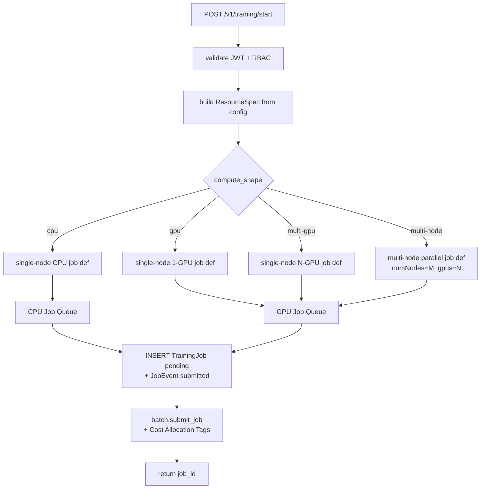
```mermaid
flowchart TB
    START[POST /v1/training/start] --> VALID[validate JWT + RBAC]
    VALID --> SPEC[build ResourceSpec from config]
    SPEC --> SHAPE{compute_shape}
    SHAPE -->|cpu| CPUJOB[single-node CPU job def]
    SHAPE -->|gpu| GPUJOB[single-node 1-GPU job def]
    SHAPE -->|multi-gpu| MGPU[single-node N-GPU job def]
    SHAPE -->|multi-node| MNODE[multi-node parallel job def<br/>numNodes=M, gpus=N]
    CPUJOB --> CPUQ[CPU Job Queue]
    GPUJOB & MGPU & MNODE --> GPUQ[GPU Job Queue]
    CPUQ & GPUQ --> DBROW[INSERT TrainingJob pending<br/>+ JobEvent submitted]
    DBROW --> SUBMIT[batch.submit_job<br/>+ Cost Allocation Tags]
    SUBMIT --> RET[return job_id]
```

## D1a. Orchestration Three-Plane Model + Policy (AD-11)

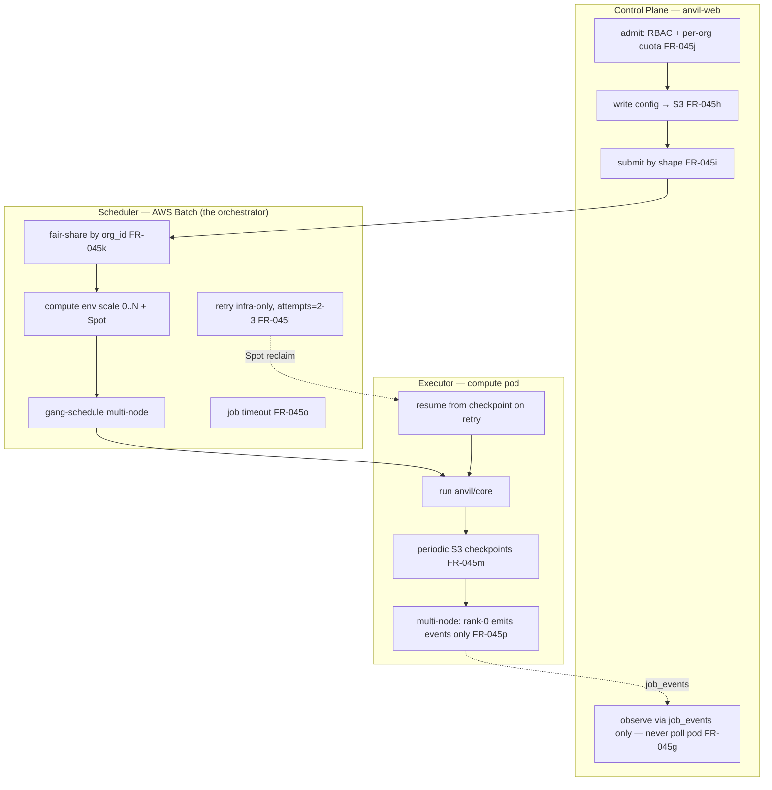
```mermaid
graph TB
    subgraph "Control Plane — anvil-web"
        ADMIT[admit: RBAC + per-org quota FR-045j]
        WRITECFG[write config → S3 FR-045h]
        SUB[submit by shape FR-045i]
        OBS[observe via job_events only — never poll pod FR-045g]
    end
    subgraph "Scheduler — AWS Batch (the orchestrator)"
        FAIR[fair-share by org_id FR-045k]
        SCALE[compute env scale 0..N + Spot]
        GANGS[gang-schedule multi-node]
        RETRYP[retry infra-only, attempts=2-3 FR-045l]
        TIMEOUT[job timeout FR-045o]
    end
    subgraph "Executor — compute pod"
        RUNENG[run anvil/core]
        CKPT[periodic S3 checkpoints FR-045m]
        RESUME[resume from checkpoint on retry]
        RANK0[multi-node: rank-0 emits events only FR-045p]
    end

    ADMIT --> WRITECFG --> SUB --> FAIR --> SCALE --> GANGS --> RUNENG
    RUNENG --> CKPT --> RANK0
    RETRYP -.Spot reclaim.-> RESUME --> RUNENG
    RANK0 -.job_events.-> OBS
```

## D1b. Failure Disposition (retry vs fail-fast, FR-045l)

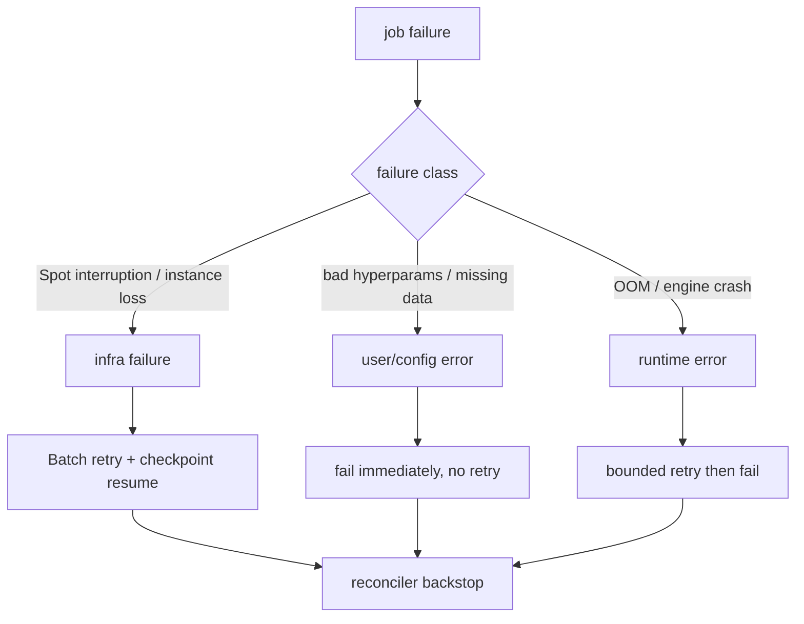
```mermaid
flowchart TB
    FAIL[job failure] --> CLASS{failure class}
    CLASS -->|Spot interruption / instance loss| INFRA[infra failure]
    CLASS -->|bad hyperparams / missing data| USER[user/config error]
    CLASS -->|OOM / engine crash| AMBIG[runtime error]
    INFRA --> RETRY[Batch retry + checkpoint resume]
    USER --> FAILFAST[fail immediately, no retry]
    AMBIG --> BOUNDED[bounded retry then fail]
    RETRY --> RECON[reconciler backstop]
    FAILFAST --> RECON
    BOUNDED --> RECON
```

## D2. Multi-Node Gang Scheduling (AD-1, FR-041)

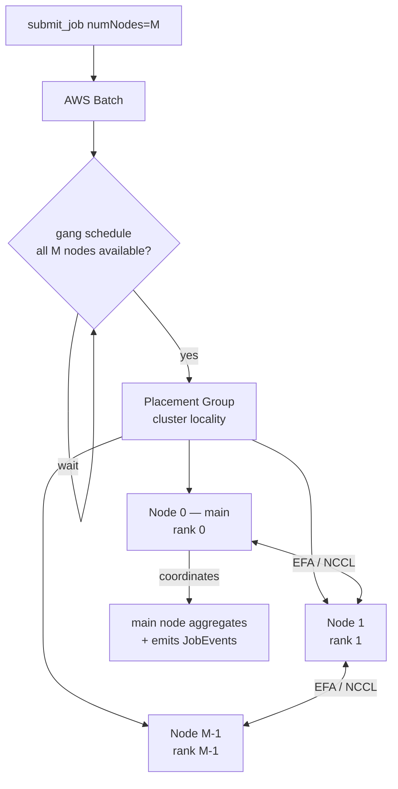
```mermaid
graph TB
    SUBMIT[submit_job numNodes=M] --> BATCH[AWS Batch]
    BATCH --> GANG{gang schedule<br/>all M nodes available?}
    GANG -->|wait| GANG
    GANG -->|yes| PG[Placement Group<br/>cluster locality]
    PG --> N0[Node 0 — main<br/>rank 0]
    PG --> N1[Node 1<br/>rank 1]
    PG --> NM[Node M-1<br/>rank M-1]
    N0 <-->|EFA / NCCL| N1
    N1 <-->|EFA / NCCL| NM
    N0 -->|coordinates| MAIN[main node aggregates<br/>+ emits JobEvents]
```

## D3. Compute Pod Lifecycle & Multi-System Writes (AD-4)

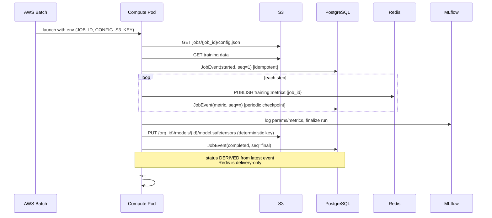
```mermaid
sequenceDiagram
    participant BA as AWS Batch
    participant P as Compute Pod
    participant S3 as S3
    participant DB as PostgreSQL
    participant R as Redis
    participant ML as MLflow

    BA->>P: launch with env (JOB_ID, CONFIG_S3_KEY)
    P->>S3: GET jobs/{job_id}/config.json
    P->>S3: GET training data
    P->>DB: JobEvent(started, seq=1)  [idempotent]
    loop each step
        P->>R: PUBLISH training:metrics:{job_id}
        P->>DB: JobEvent(metric, seq=n)  [periodic checkpoint]
    end
    P->>ML: log params/metrics, finalize run
    P->>S3: PUT {org_id}/models/{id}/model.safetensors (deterministic key)
    P->>DB: JobEvent(completed, seq=final)
    Note over P,DB: status DERIVED from latest event<br/>Redis is delivery-only
    P->>P: exit
```

## D4. Job Events + Reconciler (AD-4, FR-044)

```mermaid
flowchart TB
    subgraph "Authoritative path"
        POD[Compute Pod] -->|append idempotent| JE[(job_events<br/>job_id, sequence)]
        JE --> DERIVE[Derive TrainingJob.status<br/>= latest event]
    end

    subgraph "Reconciler (scheduled)"
        TICK[every N seconds] --> SCAN[scan non-terminal jobs]
        SCAN --> CHK{compare}
        CHK --> B1[Batch job state]
        CHK --> B2[latest job_event]
        CHK --> B3[expected S3 artifact]
        CHK --> B4[MLflow run state]
        B1 & B2 & B3 & B4 --> DECIDE{consistent?}
        DECIDE -->|pod vanished, grace exceeded| FAIL[append JobEvent failed]
        DECIDE -->|artifact present, event missing| REPAIR[append JobEvent completed]
        DECIDE -->|yes| NOOP[no-op]
    end
```

## D5. SSE Streaming with Last-Event-ID Replay (AD-5)

```mermaid
sequenceDiagram
    participant B as Browser EventSource
    participant W1 as anvil-web replica A
    participant W2 as anvil-web replica B
    participant R as Redis
    participant DB as job_events

    B->>W1: GET stream?token (Last-Event-ID: 0)
    W1->>DB: read events since 0 (replay backlog)
    W1-->>B: replay past events
    W1->>R: SUBSCRIBE training:metrics:{job_id}
    loop live
        R-->>W1: metric
        W1-->>B: event (id: seq)
    end
    Note over B,W1: replica A restarts / connection drops
    B->>W2: reconnect (Last-Event-ID: 42)
    W2->>DB: read events since 42 (no gap)
    W2-->>B: resume
    W2->>R: SUBSCRIBE
```

## D6. Usage Metering / Billback (AD-9)

```mermaid
flowchart TB
    TERM[Terminal JobEvent<br/>completed/failed] --> CALC[Completion handler]
    CALC --> RUNTIME[runtime = ended_at - started_at]
    CALC --> RESOLVE[resolve instance_type, gpu_count, node_count]
    RUNTIME & RESOLVE --> COMPUTE[gpu_seconds = runtime × gpu_count × node_count<br/>instance_hours = runtime × node_count]
    COMPUTE --> UR[(usage_records<br/>idempotent on job_id)]
    UR --> ATTR[attributed to org_id, team_id, user_id]

    TAGS[Cost Allocation Tags on Batch job] --> CE[AWS Cost Explorer]
    CE -.->|cross-check| UR

    UR --> API[GET /v1/usage<br/>aggregate per org/team/user]
```

## D7. MLflow Integration

```mermaid
graph TB
    WEB[anvil-web] -->|MlflowClient HTTP| MLF[MLflow Server ECS]
    POD[Compute Pod] -->|MlflowClient HTTP<br/>via Cloud Map| MLF
    MLF -->|backend store| PG[(anvil_mlflow DB)]
    MLF -->|artifact root| S3M[(s3://anvil-ml)]
    WEB -->|experiments tagged org_id| MLF
    WEB -->|filter tags.org_id| MLF
    MLF --> REG[Model Registry]
```

---

# Part E — Deploy & Ops

## E1. `anvil deploy init` — Full Flow (AD-6, AD-7)

```mermaid
flowchart TB
    START[anvil deploy init] --> PRE{AWS creds?}
    PRE -->|no| ERR[error: configure credentials]
    PRE -->|yes| PROMPT[interactive prompts:<br/>domain, region, route53 zone,<br/>admin email, instance size]
    PROMPT --> ASSETS[publish assets:<br/>Lambda zip → S3 versioned]
    ASSETS --> TPL[load bundled CFN template<br/>digest-pinned images]
    TPL --> CREATE[cloudformation.create_stack<br/>OnFailure=ROLLBACK]
    CREATE --> WAIT[waiter: CREATE_COMPLETE<br/>Delay=30 MaxAttempts=120]
    WAIT -->|fail| EVENTS[dump stack events → exit]
    WAIT -->|ok| MIG[run migration ECS task<br/>pre-rollout]
    MIG --> ADMIN[Cognito admin-create-user]
    ADMIN --> ORG[create Organization]
    ORG --> MEM[Membership owner]
    MEM --> CFG[save ~/.anvil/deploy-config.json]
    CFG --> OUT[output CloudFront URL + admin creds]
    OUT --> VERIFY[suggest: anvil deploy verify]
```

## E2. Migration as Pre-Deploy Step (AD-6)

```mermaid
sequenceDiagram
    participant D as deploy CLI
    participant CF as CloudFormation
    participant MT as Migration ECS Task
    participant PG as PostgreSQL
    participant WEB as anvil-web service

    D->>CF: create/update stack
    CF->>MT: run one-off task (RunTask)
    MT->>PG: alembic upgrade (anvil_app)
    MT->>PG: alembic upgrade (anvil_mlflow)
    MT-->>CF: exit 0
    CF->>WEB: roll out web service (gated on MT success)
    WEB->>PG: startup schema compatibility check
    WEB->>WEB: fail fast if mismatch
```

## E3. `anvil deploy destroy`

```mermaid
flowchart TB
    START[anvil deploy destroy] --> CFG[load deploy-config.json]
    CFG --> EXISTS{stack exists?}
    EXISTS -->|no| NOOP[clean exit: nothing to do]
    EXISTS -->|yes| CONFIRM{--force?}
    CONFIRM -->|no| TYPE[require typing stack name]
    CONFIRM -->|yes| EMPTY
    TYPE --> EMPTY[empty S3 buckets<br/>anvil-data + anvil-ml]
    EMPTY --> DEL[cloudformation.delete_stack]
    DEL --> WAITD[waiter: DELETE_COMPLETE]
    WAITD --> CLEAN[remove ~/.anvil/admin-credentials]
    CLEAN --> DONE[output: deleted]
```

## E4. `anvil deploy update`

```mermaid
flowchart TB
    START[anvil deploy update] --> CFG[load config]
    CFG --> VER[resolve target version<br/>GHCR latest or --version]
    VER --> DIGEST[resolve image digest]
    DIGEST --> MIG[run migration task if schema changed]
    MIG --> UPD[cloudformation.update_stack<br/>new image digest params]
    UPD --> WAITU[waiter: UPDATE_COMPLETE]
    WAITU --> ROLL[ECS rolling deploy<br/>no downtime]
    ROLL --> DONE[output: updated to vX.Y.Z]
```

## E5. Agentic Validation — 3-Layer Pyramid (FR-049, FR-050)

```mermaid
flowchart TB
    subgraph "Layer 1 — infra (boto3, ~10s)"
        I1[stack CREATE/UPDATE_COMPLETE]
        I2[ECS services steady]
        I3[Batch envs VALID/ENABLED]
        I4[RDS available]
        I5[Redis available]
        I6[S3 buckets + policy]
        I7[Cognito pool present]
        I8[outputs resolvable]
    end
    subgraph "Layer 2 — api canary (~3-5min)"
        A1[create native Cognito test user]
        A2[obtain JWT]
        A3[create org/team]
        A4[upload tiny corpus]
        A5[submit CPU job]
        A6[assert DB + Batch + S3 + MLflow]
        A7[SSE: assert metric event]
        A8[assert usage_record]
        A9[RBAC cross-org denied]
        A10[cleanup]
    end
    subgraph "Layer 3 — browser (Playwright)"
        B1[Hosted UI login redirect]
        B2[session through CloudFront/ALB]
        B3[SSE renders in page]
    end

    I1 --> I2 --> I3 --> I4 --> I5 --> I6 --> I7 --> I8
    I8 --> A1 --> A2 --> A3 --> A4 --> A5 --> A6 --> A7 --> A8 --> A9 --> A10
    A10 --> B1 --> B2 --> B3
```

## E6. CI/CD Release Pipeline

```mermaid
flowchart LR
    PUSH[git tag vX.Y.Z] --> BUILD[build SINGLE image<br/>multi-stage, web + compute entrypoints — AD-10]
    BUILD --> PUSHIMG[push to GHCR<br/>record one digest]
    PUSHIMG --> SYNTH[cdk synth<br/>asset-free, digest-pinned]
    SYNTH --> BUNDLE[copy templates → anvil/deploy/templates/]
    BUNDLE --> WHEEL[build wheel anvil[aws]]
    WHEEL --> E2E[throwaway AWS account:<br/>deploy init → verify --layer api → destroy]
    E2E -->|green| RELEASE[publish wheel + GitHub Release]
    E2E -->|red| FAIL[block release]
```

---

# Part F — Local Mode & Mode Selection

## F1. Local Mode Topology (contrast)

```mermaid
graph TB
    BROWSER[Browser localhost:8080] --> UVICORN[uvicorn → anvil/api/app.py]
    UVICORN --> SQLITE[(SQLite<br/>data/anvil-state.db)]
    UVICORN --> MLFLOWSUB[MLflow subprocess :5001]
    UVICORN --> FSLOCAL[LocalFileStore<br/>data/]
    UVICORN --> QUEUE[InProcessEventBus<br/>asyncio.Queue]
    UVICORN --> INPROC[In-process compute<br/>stdlib / torch thread]
    INPROC --> QUEUE
    QUEUE --> UVICORN
    MLFLOWSUB --> MLRUNS[(mlruns/)]
```

## F2. Mode Selection at Startup (two-layer: entrypoint + guard)

The **entrypoint module** is the primary switch (guarantees import isolation); `ANVIL_MODE` is the guard + config validator. Mode is explicit, never auto-detected. (FR-011a/b/c)

```mermaid
flowchart TB
    START[process start] --> ENTRY{entrypoint module}

    ENTRY -->|anvil serve| LOCAL[anvil/api/app.py<br/>no import path to _saas]
    ENTRY -->|container CMD| SAAS[anvil/_saas/app.py]

    LOCAL --> LGUARD{ANVIL_MODE}
    LGUARD -->|unset / local| LW[wire LocalFileStore,<br/>InProcessEventBus/JobQueue,<br/>Local compute]
    LGUARD -->|saas| LFAIL[FAIL FAST<br/>entrypoint/mode mismatch]
    LOCAL --> LNODEP[boto3/redis never importable here]

    SAAS --> SGUARD{ANVIL_MODE == saas?}
    SGUARD -->|no| SFAIL[FAIL FAST<br/>refuse to start]
    SGUARD -->|yes| SCFG{required cloud config present?<br/>DATABASE_URL, REDIS_URL,<br/>S3_DATA_BUCKET, COGNITO_*}
    SCFG -->|missing| CFAIL[FAIL FAST<br/>list missing vars, no fallback]
    SCFG -->|present| SW[wire S3FileStore,<br/>RedisEventBus, BatchJobQueue,<br/>BatchComputeBackend + Cognito middleware]

    LW --> SAME[same anvil/api/v1 routes<br/>same anvil/services]
    SW --> SAME
```

## F3. Three-Mode Comparison (deployment surface)

```mermaid
graph TB
    subgraph "Local User"
        LU[pip install anvil<br/>anvil serve]
    end
    subgraph "SaaS Developer"
        SD1[docker compose up<br/>PG/Redis/MinIO/MLflow]
        SD2[local code → dev AWS]
        SD3[cdk deploy → dev]
    end
    subgraph "SaaS User / Operator"
        SU[anvil deploy init<br/>→ full AWS stack]
    end

    CODE[(single anvil package)]
    CODE --> LU
    CODE --> SD1 & SD2 & SD3
    CODE --> SU
```

---

## Diagram Inventory

| Part | Diagrams |
|------|----------|
| A — Structural | C4 context, container, component, network, security groups, CDK composition (6) |
| B — Data | ERD, RBAC model, permission matrix, state machine, S3 layout (5) |
| C — Auth & Authz | browser OIDC, CLI device grant, SSE token, RBAC flow (4) |
| D — Training & Compute | orchestration three-plane + policy, failure disposition, shape routing, gang scheduling, pod lifecycle, reconciler, SSE replay, usage metering, MLflow (9) |
| E — Deploy & Ops | init, migration, destroy, update, verify pyramid, CI/CD (6) |
| F — Local & Mode Selection | local topology, mode selection, three-mode comparison (3) |

**Total: 33 diagrams.**

## See Also

- [[SaaSSecurityAndFlowDiagrams]] — user-story flows, DFDs, perimeter, egress, tenant/access boundaries (37 diagrams)
- [[SaaSArchitecture]] — narrative overview + feature matrix
- `specs/014-saas-architecture/spec.md` — AD-1..AD-11, FRs, acceptance gates
- `specs/014-saas-architecture/data-model.md` — schema detail
- `docs/vault/Decisions/ADR-030-saas-architecture.md` — decision record