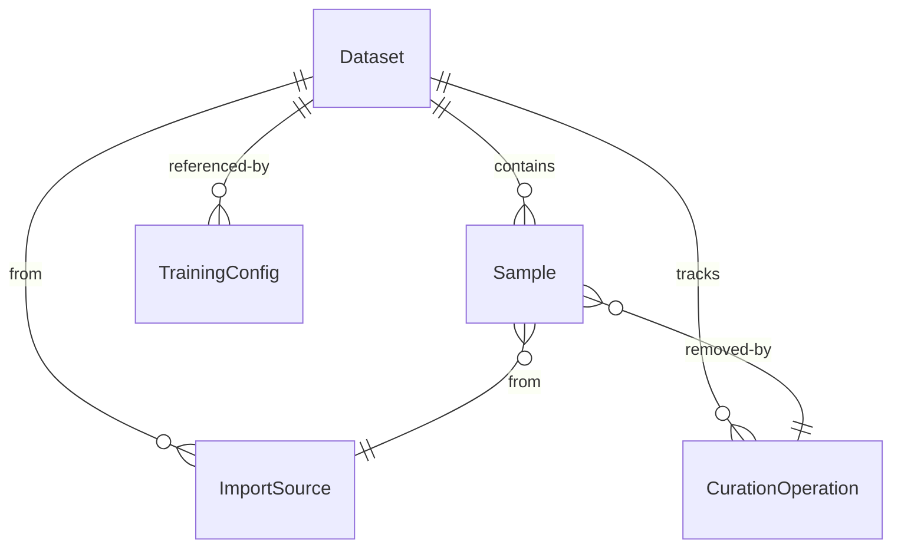
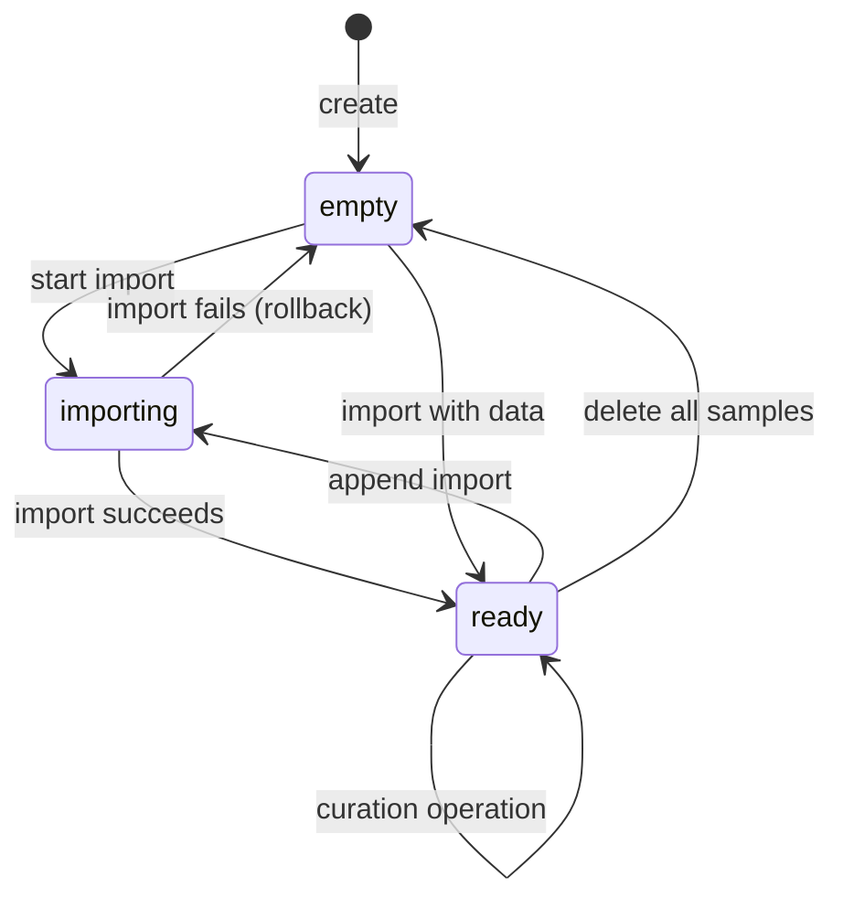

# Data Model: Dataset Curation

**Date**: 2026-06-12
**Status**: Final

> **Note on existing patterns**: All new models extend `TimestampMixin` (from `anvil/db/base.py`) for `created_at`/`updated_at`. Versioning follows the `ModelVersion` pattern: separate table with FK + auto-incrementing version number using `func.max()`. No soft-delete currently exists in codebase — `is_removed` column is new.

## Entities

### Dataset (Extended)

Extends the existing `Dataset` model with curation state tracking.

| Field | Type | Description |
|-------|------|-------------|
| id | int (PK) | Auto-increment ID |
| name | str | Human-readable name |
| description | str (optional) | Optional description |
| sample_count | int | Current number of active (non-removed) samples |
| total_size_bytes | int | Total size of sample text content |
| curation_version | int | Monotonically increasing version on each curation operation |
| status | enum | `empty` / `ready` / `importing` / `error` |
| created_at | datetime | Creation timestamp |
| updated_at | datetime | Last modification timestamp |

**Relationships**:
- Has many `Sample` records
- Has many `CurationOperation` records
- Has many `ImportSource` records
- Referenced by `TrainingConfig.dataset_id`

**Validation Rules**:
- Name must be non-empty when creating
- Cannot delete if `TrainingConfig` references this dataset

### Sample (New)

Stores individual text entries within a dataset. Text content is stored on filesystem; metadata in SQLite.

| Field | Type | Description |
|-------|------|-------------|
| id | int (PK) | Auto-increment ID |
| dataset_id | int (FK) | Parent dataset |
| index | int | Position within dataset (0-based, may have gaps due to removals) |
| content_hash | str | SHA-256 hex digest of text content (for dedup) |
| length | int | Character count of text content |
| file_path | str | Relative path within dataset's storage directory |
| is_removed | bool | Soft-delete flag (true = removed by curation) |
| removed_by_op_id | int (FK, nullable) | CurationOperation that removed this sample |
| import_source_id | int (FK) | ImportSource that added this sample |
| created_at | datetime | When the sample was added |

**Indexes**:
- `(dataset_id, index)` — ordered access for pagination
- `(dataset_id, content_hash)` — dedup lookup
- `(dataset_id, length)` — length filtering
- `(dataset_id, is_removed)` — active sample queries

**Validation Rules**:
- `content_hash` is computed server-side during import
- `file_path` points to a file managed by `LocalFileStore`
- Samples with `is_removed=true` are excluded from training consumption

**Storage Strategy**:
- Metadata in SQLite (this table)
- Text content on filesystem: `{dataset_storage_dir}/{sample_id}.txt`
- File writing via existing `LocalFileStore` abstraction

### CurationOperation (New)

Immutable log of every curation action applied to a dataset.

| Field | Type | Description |
|-------|------|-------------|
| id | int (PK) | Auto-increment ID |
| dataset_id | int (FK) | Parent dataset |
| operation_type | enum | `dedup`, `length_filter`, `regex_replace`, `bulk_delete`, `individual_edit`, `individual_delete`, `import` |
| parameters | JSON | Operation-specific parameters (e.g., `{"min_length": 50}`, `{"pattern": "foo", "replacement": "bar"}`) |
| sample_count_before | int | Active sample count before operation |
| sample_count_after | int | Active sample count after operation |
| created_at | datetime | When the operation was performed |

**operation_type parameter schemas**:

| Type | Parameters |
|------|-----------|
| `dedup` | `{}` |
| `length_filter` | `{"min_length": int?, "max_length": int?}` |
| `regex_replace` | `{"pattern": str, "replacement": str}` |
| `bulk_delete` | `{"sample_ids": [int]}` |
| `individual_edit` | `{"sample_id": int, "old_text_preview": str}` |
| `individual_delete` | `{"sample_id": int}` |
| `import` | `{"format": str, "filename": str, "row_count": int}` |

**State Transitions**:
- Operations are append-only (immutable once created)
- No update or delete allowed after creation

### ImportSource (New)

Tracks each batch of data imported into a dataset.

| Field | Type | Description |
|-------|------|-------------|
| id | int (PK) | Auto-increment ID |
| dataset_id | int (FK) | Parent dataset |
| filename | str | Original filename (or "paste" for text paste, or corpus name) |
| format | enum | `txt`, `csv`, `jsonl`, `json`, `paste`, `corpus` |
| row_count | int | Total rows imported |
| error_count | int | Rows that failed parsing (reported to user, none stored) |
| created_at | datetime | When the import completed |

## Entity Relationships (Mermaid)



## State Transitions for Dataset



## Training Consumption

The existing training flow (`TrainingService._load_docs()`) calls `CorpusService.load_docs()` which re-ingests files from disk. For curated datasets, this is replaced with:

```python
# In DatasetService (new method):
async def load_docs(self, dataset_id: int) -> list[str]:
    samples = await self._repo.get_active_samples(dataset_id)
    texts = []
    for sample in samples:
        text = await self._storage.get(sample.file_path)
        texts.append(text)
    return texts
```

The `TrainingService._load_docs()` should be extended to accept `dataset_id` as an alternative to `corpus_id`, calling the dataset path when a curated dataset is selected.

## WAL Mode Support

SQLite WAL mode is already enabled in `anvil/db/session.py` (`PRAGMA journal_mode=WAL`). This supports concurrent reads during curation operations — the training pipeline can read sample data from DB/filesystem while curation operations write to the same dataset.

## Performance Considerations

- **Sample pagination**: Query `WHERE dataset_id = ? AND is_removed = false ORDER BY index LIMIT ? OFFSET ?` — optimized by index on `(dataset_id, index)`
- **Dedup**: `SELECT content_hash, COUNT(*) FROM samples WHERE dataset_id = ? AND is_removed = false GROUP BY content_hash HAVING COUNT(*) > 1` — uses `(dataset_id, content_hash)` index
- **Length filter**: `DELETE FROM sample_files WHERE sample_id IN (SELECT id FROM samples WHERE dataset_id = ? AND is_removed = false AND length < ?)` — uses `(dataset_id, length)` index
- **Bulk file operations**: Filesystem operations (delete sample files, write export) use async I/O via aiofiles
- **1M samples**: Full table scan for metrics computation is acceptable for 1M rows in SQLite (~seconds). For larger datasets, consider periodic caching of metrics.