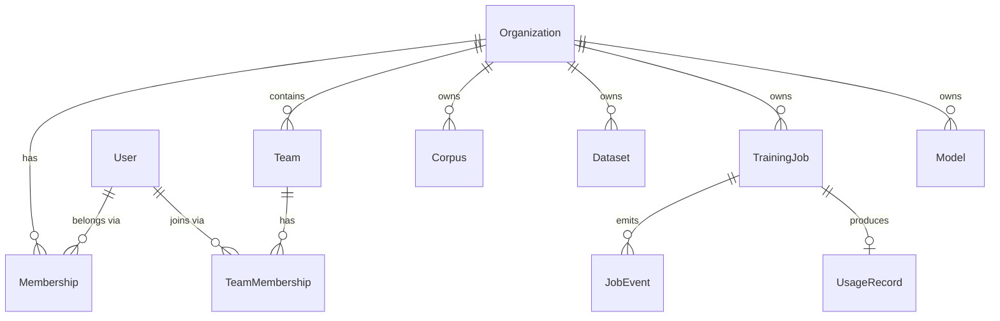
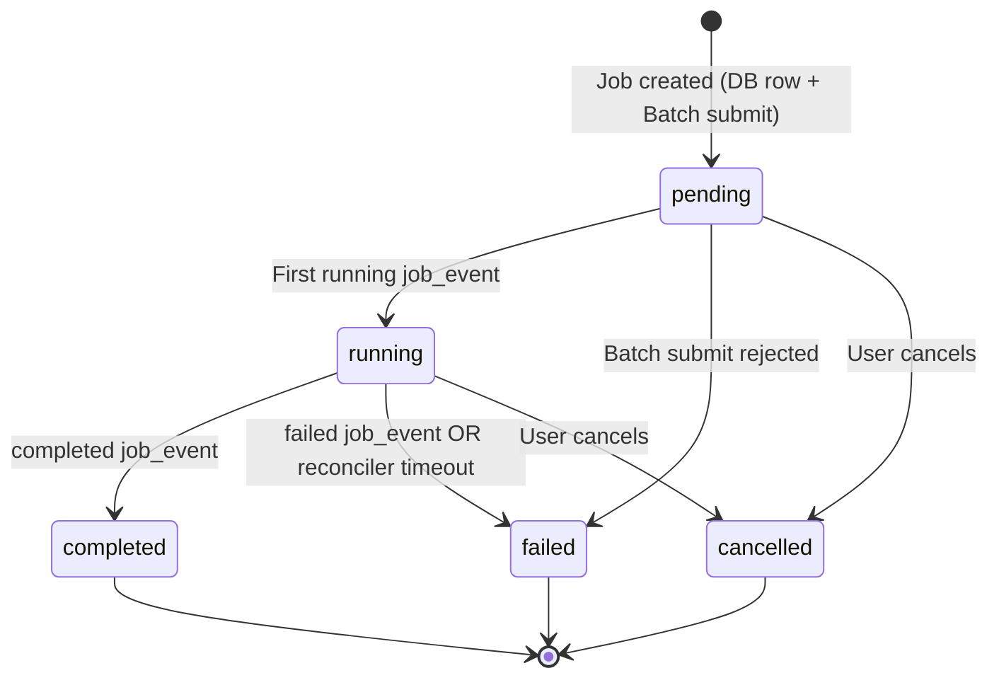
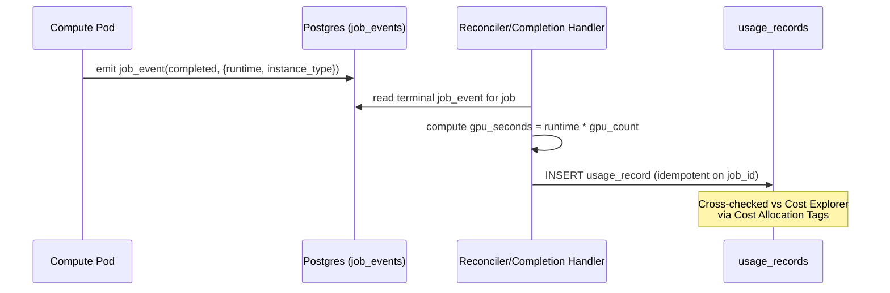

# Data Model: SaaS Architecture

This model implements full RBAC multi-tenancy (AD-8), Postgres-source-of-truth job state (AD-4), and usage metering (AD-9). All SaaS resources are owned by `org_id` and scoped by team/role.

## RBAC Hierarchy



---

## Entities

### Organization

| Field | Type | Description |
|-------|------|-------------|
| `id` | `int` (PK) | Organization ID — top-level tenant boundary |
| `name` | `str` (unique) | Organization name |
| `slug` | `str` (unique) | URL-safe identifier |
| `created_at` | `datetime` | Creation timestamp |
| `status` | `enum(active,suspended)` | Org state |

**Isolation**: The top-level boundary. No query may cross `org_id`.

---

### User

| Field | Type | Description |
|-------|------|-------------|
| `id` | `int` (PK) | Local integer ID for FK relationships |
| `cognito_sub` | `str` (unique) | Cognito `sub` UUID — canonical auth identity |
| `email` | `str` | Verified email from Cognito |
| `display_name` | `str` | From Cognito profile (optional) |
| `org_id` | `int` (FK → Organization) | The user's organization |
| `created_at` | `datetime` | First login timestamp |
| `last_login` | `datetime` | Most recent login |
| `status` | `enum(active,disabled)` | Account state |

**Uniqueness**: `cognito_sub` is unique — single source of truth for identity.

**Lifecycle**: Created on first authenticated request (middleware) OR via Cognito Post-Authentication Lambda. Belongs to exactly one organization.

---

### Membership

The User ↔ Organization association carrying org-level role.

| Field | Type | Description |
|-------|------|-------------|
| `id` | `int` (PK) | |
| `user_id` | `int` (FK → User) | |
| `org_id` | `int` (FK → Organization) | |
| `role` | `enum(owner,admin,member,viewer)` | Org-level role |
| `created_at` | `datetime` | |

**Constraint**: Unique `(user_id, org_id)`.

---

### Team

| Field | Type | Description |
|-------|------|-------------|
| `id` | `int` (PK) | |
| `org_id` | `int` (FK → Organization) | |
| `name` | `str` | Team name (unique within org) |
| `created_at` | `datetime` | |

---

### TeamMembership

| Field | Type | Description |
|-------|------|-------------|
| `id` | `int` (PK) | |
| `user_id` | `int` (FK → User) | |
| `team_id` | `int` (FK → Team) | |
| `role_override` | `enum(owner,admin,member,viewer)` (nullable) | Optional per-team role override |

**Constraint**: Unique `(user_id, team_id)`. A user may belong to multiple teams.

---

### Role Permissions

Roles are static (no policy engine). Effective role = team `role_override` if present, else org `Membership.role`.

| Action | owner | admin | member | viewer |
|--------|:-----:|:-----:|:------:|:------:|
| Read org resources | ✅ | ✅ | ✅ | ✅ |
| Create corpus/dataset/job | ✅ | ✅ | ✅ | ❌ |
| Delete own resources | ✅ | ✅ | ✅ | ❌ |
| Delete any org resource | ✅ | ✅ | ❌ | ❌ |
| Invite/remove members | ✅ | ✅ | ❌ | ❌ |
| Create/delete teams | ✅ | ✅ | ❌ | ❌ |
| Assign roles | ✅ | ❌ | ❌ | ❌ |
| Delete organization | ✅ | ❌ | ❌ | ❌ |
| View usage/billing | ✅ | ✅ | ❌ | ❌ |

---

### Corpus

*Existing entity. New ownership columns.*

| Field | Type | Notes |
|-------|------|-------|
| Existing fields | ... | Name, root_path, chunking_strategy, etc. |
| `org_id` | `int` (FK → Organization) | **NEW** — required, isolation boundary |
| `team_id` | `int` (FK → Team, nullable) | **NEW** — optional team scoping |
| `created_by` | `int` (FK → User) | **NEW** — who created it |

**Queries**: All queries scoped by `WHERE org_id = ?` + team/role visibility filter.

---

### Dataset

*Same ownership columns as Corpus: `org_id` (required), `team_id` (nullable), `created_by`.*

---

### TrainingJob

| Field | Type | Description |
|-------|------|-------------|
| `id` | `int` (PK) | Internal job ID |
| `org_id` | `int` (FK → Organization) | Owner org |
| `team_id` | `int` (FK → Team, nullable) | Optional team |
| `created_by` | `int` (FK → User) | Who submitted |
| `corpus_id` | `int` (FK → Corpus, nullable) | Trained on this corpus |
| `dataset_id` | `int` (FK → Dataset, nullable) | Or this dataset |
| `config` | `JSON` | Hyperparameters |
| `resource_spec` | `JSON` | `{node_count, gpus_per_node, vcpus, memory, instance_class}` (AD-1) |
| `compute_shape` | `enum(cpu,gpu,multi-gpu,multi-node)` | Compute shape |
| `status` | `enum(pending,running,completed,failed,cancelled)` | Lifecycle state (derived from latest job_event) |
| `batch_job_id` | `str` (nullable) | AWS Batch job ID |
| `mlflow_run_id` | `str` (nullable) | MLflow run ID |
| `artifact_path` | `str` (nullable) | Deterministic S3 key prefix |
| `final_loss` | `float` (nullable) | Final training loss |
| `error_message` | `str` (nullable) | Error details if failed |
| `started_at` | `datetime` (nullable) | When compute began |
| `completed_at` | `datetime` (nullable) | When compute finished |
| `created_at` | `datetime` | Record creation |

**State machine**:



**Status is derived** from the latest `JobEvent`, never written directly by multiple writers (AD-4).

---

### JobEvent (NEW — append-only)

The authoritative record of job lifecycle. Compute pods emit idempotent events; the application derives `TrainingJob.status` from them.

| Field | Type | Description |
|-------|------|-------------|
| `id` | `int` (PK) | |
| `job_id` | `int` (FK → TrainingJob) | |
| `sequence` | `int` | Monotonic per-job sequence number |
| `event_type` | `enum(submitted,started,metric,checkpoint,completed,failed,cancelled)` | |
| `payload` | `JSON` | Event-specific data (e.g. `{step, loss}` for metric) |
| `ts` | `datetime` | Event timestamp |

**Constraint**: Unique `(job_id, sequence)` — idempotent. Duplicate events (pod retry) are no-ops.

**Usage**: SSE `Last-Event-ID` replay reads from here (AD-5). Reconciler reads latest event per job (AD-4).

---

### Model

Owned by `org_id`/`team_id`/`created_by`. In SaaS: MLflow artifacts in `anvil-ml-*/{exp_id}/{run_id}/`, registered in MLflow Model Registry, downloaded via signed S3 URLs. In local: `data/models/{run_id}/`.

---

### Experiment

Managed by MLflow. In SaaS mode tagged with `org_id` and `user_id`; experiment listing filters `tags.org_id = ?`.

---

### UsageRecord (NEW — billback)

| Field | Type | Description |
|-------|------|-------------|
| `id` | `int` (PK) | |
| `org_id` | `int` (FK → Organization) | Billback target |
| `team_id` | `int` (FK → Team, nullable) | |
| `user_id` | `int` (FK → User) | Who ran the job |
| `job_id` | `int` (FK → TrainingJob) | |
| `instance_type` | `str` | Resolved EC2 instance type |
| `node_count` | `int` | Number of nodes |
| `gpu_count` | `int` | Total GPUs across nodes |
| `gpu_seconds` | `float` | GPU-seconds consumed |
| `instance_hours` | `float` | Instance-hours consumed |
| `started_at` | `datetime` | |
| `ended_at` | `datetime` | |
| `created_at` | `datetime` | |

**Derivation**: Written once on terminal `completed`/`failed` job_event, computed from job runtime × resolved instance type (AD-9). Cross-checked against AWS Cost Explorer via Cost Allocation Tags.

**Constraint**: One record per `job_id` (idempotent — derived from the terminal event).

---

## Abstract Implementations

### Interface → Implementation Mapping

| Interface | Local (unchanged) | SaaS (new) |
|-----------|-------------------|------------|
| `FileStore` | `LocalFileStore` | `S3FileStore` |
| `EventBus` | `InProcessEventBus` | `RedisEventBus` |
| `JobQueue` | `InProcessJobQueue` | `BatchJobQueue` |
| `ComputeBackend` | `LocalStdlibBackend`, `LocalTorchBackend`, `ModalBackend` | `BatchComputeBackend` |

### ResourceSpec (compute requirements)

The `JobQueue.submit()` / `ComputeBackend.run()` abstraction carries a structured spec so multi-node is first-class (FR-040):

```python
class ResourceSpec(BaseModel):
    node_count: int = 1           # >1 = multi-node parallel Batch job
    gpus_per_node: int = 0        # 0 = CPU-only
    vcpus: int = 2
    memory_mb: int = 4096
    instance_class: str | None = None  # e.g. "g5.xlarge"; None = let Batch choose
```

| `compute_shape` | ResourceSpec |
|-----------------|--------------|
| `cpu` | `node_count=1, gpus_per_node=0` |
| `gpu` | `node_count=1, gpus_per_node=1` |
| `multi-gpu` | `node_count=1, gpus_per_node=N` |
| `multi-node` | `node_count=M, gpus_per_node=N` (Batch multi-node parallel job) |

### Selection

```python
# anvil/config.py (extended)
if mode == "saas":
    file_store = S3FileStore(s3_bucket, s3_endpoint=None if use_aws else s3_endpoint)
    event_bus = RedisEventBus(redis_url)
    job_queue = BatchJobQueue(batch_cpu_queue_arn, batch_gpu_queue_arn)
else:
    file_store = LocalFileStore(Path("data/"))
    event_bus = InProcessEventBus()
    job_queue = InProcessJobQueue()
```

## Usage Metering Flow (AD-9)

