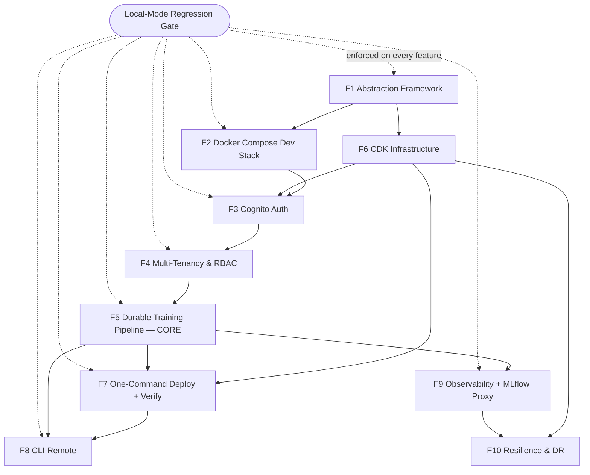

# Shippable Feature Breakdown: SaaS Architecture

This decomposes the 14-phase plan (`016 SaaS Architecture - plan.md`) and 110-task list
(`016 SaaS Architecture - tasks.md`) into **discrete, independently shippable features**, ordered
by dependency and value delivery.

> **Hard constraint — Local mode never breaks.** Every feature below carries an explicit
> **Local-Mode Regression Gate** that MUST pass before the feature is considered shipped. This is
> the spec's non-negotiable invariant (FR-011, FR-038b, SC-006, SC-007). The reference plan defers
> the dedicated local-mode verification to Phase 9, which is too late — a regression in Feature 1 or
> Feature 4 could go undetected for weeks. Instead, the local-mode gate is folded into the
> Definition of Done for **every** feature.

## The Local-Mode Invariant (applies to ALL features)

Local mode is the existing, shipped product (`pip install anvil && anvil serve`). It MUST remain
byte-for-byte behaviorally identical throughout the entire SaaS build-out. Three structural
guarantees enforce this:

1. **Separate entrypoints, no import bridge** — local launches `anvil.api.app:app`; SaaS launches
   `anvil._saas.app:app`. The local entrypoint MUST have NO static import path into `anvil/_saas/`
   (FR-011). Import isolation is structural, not runtime-checked.
2. **No cloud deps in the base package** — `boto3`, `redis`, `aws-jwt-verify`, `opentelemetry-*`,
   `prometheus-*` live only in optional extras (`[aws]`, `[monitoring]`). `pip install anvil`
   installs none of them (SC-006, SC-019).
3. **Auth + scoping are no-ops locally** — when `ANVIL_MODE` is unset/`local`, no JWT middleware is
   wired, and all repository queries return unfiltered data (FR-038b). The local user is an implicit
   full-access admin.

### Standard Local-Mode Regression Gate (LMRG)

Every feature's Definition of Done includes ALL of:

```bash
make test            # all pre-existing tests pass UNMODIFIED (SC-007)
make lint            # zero new lint errors
make typecheck       # mypy --strict clean; no SaaS imports leaking into non-SaaS modules
pip install .        # clean install
anvil serve          # boots; UI at :8080 works end-to-end (upload → train → SSE → export)
```

Plus the **import-isolation assertion** (cheap, run in CI on every feature):

```bash
# No SaaS module is reachable from the local entrypoint, and no cloud SDK is importable
# in a base (no-extras) install.
python - <<'PY'
import importlib, sys
import anvil.api.app          # local entrypoint must import with zero cloud deps
for forbidden in ("boto3", "redis", "aws_jwt_verify", "opentelemetry", "prometheus_client"):
    assert forbidden not in sys.modules, f"{forbidden} loaded by local entrypoint"
print("import isolation OK")
PY
```

---

## Feature 1 — Abstraction Framework

**Plan phases**: 1 (Setup) + 2 (Foundational Abstractions) · **Tasks**: T001–T016 · **Gates**: G1, G2

**Ships**: `anvil/_saas/` + `anvil/deploy/` package skeletons (bare `__init__.py`); `[aws]` optional
extras in `pyproject.toml`; the four core ABCs (`FileStore`, `EventBus`, `JobQueue` + `ResourceSpec`,
`ComputeBackend`); existing local implementations refactored to sit *behind* those interfaces
(`LocalFileStore`, `InProcessEventBus`, `InProcessJobQueue`); `ANVIL_MODE` selector + app-factory
guard (fail-fast on entrypoint/mode mismatch, FR-011a/b/c); CDK app skeleton; docker-compose stub.

**Value**: Foundation only — no user-visible change. Proves the multi-mode abstraction works.

**RISK TO LOCAL MODE: HIGHEST of all features.** This is the *only* feature that modifies existing
local code paths (it slides the current implementations behind new interfaces). A wrong interface
shape silently breaks every local path. This is exactly why the LMRG is front-loaded here rather
than deferred to Phase 9.

**Definition of Done**:
- Gate G2: all interfaces `mypy --strict` clean; contract tests pass against the local
  implementations; mode selector wires correctly.
- **LMRG (full)** — and specifically: the refactored `LocalFileStore` / `InProcessEventBus` /
  `InProcessJobQueue` produce **identical observable behavior** to pre-refactor. Contract tests
  (T016) run against both the local impls now and the SaaS impls later, guaranteeing parity.
- `ANVIL_MODE=saas` with the local entrypoint **fails fast** with a clear error (FR-011b) — never
  silently degrades.

---

## Feature 2 — Local SaaS Emulation (Docker Compose)

**Plan phase**: 10 (US5) — *intentionally pulled earlier than the plan's ordering* · **Tasks**: T089–T093

**Ships**: full `docker-compose.yml` (PostgreSQL 16, Redis 7, MinIO, MLflow, anvil-web);
`Dockerfile.dev` with `uvicorn --reload`; dev auth setup (dev Cognito pool or mock OIDC); seed-data
script; `make compose-up` / `make compose-down`.

**Value**: Developers iterate on **every** subsequent SaaS feature in ~2 minutes without an AWS
round-trip. The plan places this at Phase 10, but building it second means Features 3–5 get a fast
local feedback loop instead of requiring a `cdk deploy` per iteration.

**RISK TO LOCAL MODE: LOW.** All new files. `docker compose up` launches the **SaaS** entrypoint
(`anvil._saas.app:app`) — a different process from `anvil serve`. No overlap with the local path.

**Definition of Done**:
- compose stack healthy; hot-reload works; in-process compute writes to MinIO + PostgreSQL.
- **LMRG (full)** — `anvil serve` (local, non-Docker) remains untouched and passes end-to-end.

---

## Feature 3 — Cognito Authentication

**Plan phase**: 3 (US1) · **Tasks**: T017–T023, plus CDK T070-adjacent Cognito construct · **Gate**: G3

**Ships**: app-managed OIDC/JWT validation via `aws-jwt-verify` (AD-2); `get_current_user`
dependency with first-login `users`-row auto-creation; SSE short-lived signed-token auth (FR-020);
CLI OAuth2 device-grant scaffolding (FR-021); Cognito User Pool CDK construct (native email/password,
no ALB `authenticate-cognito`).

**Value**: SaaS users can register and log in. Alone, limited value (nothing org-scoped yet) — it is
the gate for Feature 4.

**RISK TO LOCAL MODE: MEDIUM.** The danger is an auth import or middleware leaking into the local
factory, or `aws-jwt-verify` creeping into the base package. Both are blocked by the separate-factory
design and the `[aws]`-extra placement.

**Definition of Done**:
- Gate G3: invalid token → 401, valid token → 200, first login creates `users` row, SSE token works.
- **LMRG (full)** — and specifically: the **local app factory wires NO JWT middleware**; `anvil serve`
  requires no token and contacts no Cognito endpoint. Import-isolation assertion confirms
  `aws_jwt_verify` is absent from a base install.

---

## Feature 4 — Multi-Tenancy & RBAC

**Plan phase**: 4 (US3) · **Tasks**: T024–T037 · **Gate**: G4

**Ships**: `Organization`, `Team`, `Membership`, `TeamMembership`, `User` models; `Role` enum +
permission matrix; `org_id`/`team_id`/`created_by` ownership columns on `Corpus`/`Dataset` (+ later
`TrainingJob`/`Model`); Alembic migration; org-scoped repository queries; RBAC resolution middleware;
service-layer permission guard; `is_cluster_admin` flag + cluster-admin action matrix (FR-037a/b);
**local-mode auth bypass (FR-038b)**; org/team/member management API; cross-org isolation tests.

**Value**: Data isolation — the core SaaS trust property. First feature delivering real multi-tenant
value (developable against Feature 2's docker stack).

**RISK TO LOCAL MODE: MEDIUM-HIGH.** Repository queries become mode-aware. If `org_id` scoping leaks
into local mode, local users would see **empty dashboards** (queries filtered by a `None`/absent org).
The mitigation: repositories accept `org_id: int | None`; **local mode passes `None` → no `WHERE
org_id` filter → all rows returned**, preserving the single-user experience.

**Definition of Done**:
- Gate G4: RBAC tables migrated; cross-org access denied (SC-014); role permissions enforced; storage
  scoped by `org_id`; cluster admin is read-wide / write-narrow (SC-020).
- **LMRG (full)** — PLUS a dedicated **local-mode "returns all rows" test** proving scoping is a no-op:
  ```python
  # tests/integration/test_local_mode_no_scoping.py
  import pytest

  @pytest.mark.asyncio
  async def test_local_mode_returns_unfiltered_data(client):
      """In local mode (no auth, org_id=None) every resource list returns all rows (FR-038b)."""
      r = await client.get("/v1/corpora")
      assert r.status_code == 200          # no 401 — auth not required locally
      # Demo bootstrap seeds corpora; local mode must see them with no org filter applied.
      assert len(r.json()["corpora"]) > 0
  ```
- The new ownership columns MUST be **nullable** (or default to a local sentinel org) so the existing
  local DB migrates without breaking demo bootstrap.

---

## Feature 5 — Durable Training Pipeline (CORE PRODUCT)

**Plan phase**: 5 (US2) · **Tasks**: T038–T058 · **Gate**: G5

**Ships**: `S3FileStore`, `RedisEventBus` (delivery-only), `BatchJobQueue` (per-shape job defs,
fair-share by `org_id`, infra-only retry, timeout, multi-node), `BatchComputeBackend` (three-plane,
never polls pod); `TrainingJob` + append-only `JobEvent` (idempotent `(job_id, sequence)`, metric
throttling — FR-043a) + `UsageRecord` models; compute worker (`_saas/compute_worker.py`: S3 config,
checkpoints, rank-0-only emission); stateless reconciler (60s/300s, dependency-degradation backoff —
FR-044a); SSE with `Last-Event-ID` replay (AD-5) + polling fallback (FR-045a/b) + server-signaled
degradation (FR-045r); per-org quota (FR-045j); usage metering (AD-9, FR-046).

**Value**: **The core product.** Upload corpus → train in the cloud → live loss curve → download
model. First end-user SaaS value. Largest single feature (~25 FRs); does not split cleanly because
Batch + Redis + job_events + SSE + reconciler are one tightly coupled correctness unit.

**RISK TO LOCAL MODE: LOW.** Every new piece is a SaaS *implementation behind an existing interface*.
Local mode keeps selecting `InProcessJobQueue` + `LocalTorchBackend`/`LocalStdlibBackend` +
`InProcessEventBus` — no local code path changes. The shared `TrainingJob`/`JobEvent` models must
remain usable by the in-process local flow (local mode emits the same events into an in-process bus).

**Definition of Done**:
- Gate G5 (full SaaS): CPU/GPU/multi-node jobs complete; quota + fair-share; Spot retry + checkpoint
  resume; cancellation/timeout terminal states; SSE delivery + reconnect replay + polling fallback;
  pod-crash reconciled (SC-012); artifact in S3 + MLflow; `usage_record` correctly attributed (SC-013).
- **LMRG (full)** — PLUS confirm the **local in-process training flow still streams metrics via
  `InProcessEventBus`** and produces a downloadable model from `data/models/`, exactly as before. The
  introduction of `JobEvent` MUST NOT change local behavior (local may persist events to SQLite but
  the user-facing SSE stream is unchanged).

---

## Feature 6 — CDK Infrastructure

**Plan phase**: 6 (US6) · **Tasks**: T059–T071

**Ships**: full CDK stack — VPC (2-AZ), RDS PostgreSQL + RDS Proxy (IAM auth, Multi-AZ, automated
snapshots/PITR), ElastiCache Redis (Multi-AZ failover), S3 (versioned data + ML buckets), Batch-on-EC2
(CPU + GPU + multi-node), ECS Fargate (web + MLflow), Cloud Map service discovery, migration task
(pre-rollout, AD-6), least-privilege IAM (execution vs job/task split, FR-045c/f), CloudFront + WAF,
post-auth Lambda, asset-free synth with digest-pinned images (AD-7).

**Value**: Codified, repeatable AWS infrastructure. `cdk deploy` → a working SaaS environment.

**RISK TO LOCAL MODE: NONE.** TypeScript in `packages/infra/`, entirely outside the Python package.

**Definition of Done**:
- `cdk synth` produces asset-free templates; `cdk deploy` to dev reaches `CREATE_COMPLETE`; CloudFront
  URL serves the login page; migration task gates web rollout.
- **LMRG (lint/typecheck/test subset)** — confirm no `packages/infra/` artifact is referenced by the
  Python package and `pip install anvil` is unaffected.

---

## Feature 7 — One-Command Deploy + Agentic Verify

**Plan phases**: 7 (US7) + 8 (US8) · **Tasks**: T072–T084 · **Gates**: G6, G7

**Ships**: CI step to synth + bundle asset-free CFN templates into the wheel; `anvil deploy
init/up/status/destroy/update/restore`; `anvil deploy config set/get/list` (+ `set-idp` for BYO social
login, AD-3); admin + default-org + owner-membership bootstrap (FR-030); destroy safety (S3 version
cleanup + final-snapshot prompt, FR-060); DR `restore --snapshot` (FR-061); non-interactive CI mode
(`ANVIL_DEPLOY_*` + `--json`, FR-028a); 3-layer `anvil deploy verify` (infra/api/browser, FR-049/050);
cluster-registry auto add/remove.

**Value**: The distribution model — `pip install anvil[aws] && anvil deploy init` → live SaaS in
~30 min (SC-008, SC-009). `anvil deploy verify --layer api` validates the whole pipeline (SC-011).

**RISK TO LOCAL MODE: LOW.** `anvil deploy` is a new CLI command group gated on the `[aws]` extra. The
command MUST fail with a clear "install anvil[aws]" message if the extra is absent — never crash with
an `ImportError`. `anvil serve` does not touch any deploy code.

**Definition of Done**:
- Gate G6: init deploys full stack, URL serves login, migrations pre-rollout, admin authenticates,
  `verify --layer api` green. Gate G7: update rolls new image, set-idp adds social, destroy removes
  everything incl. S3, double-destroy is a clean no-op.
- **LMRG (full)** — and: in a **base (no `[aws]`) install**, `anvil deploy init` exits with a clean
  actionable error, and `anvil serve` is wholly unaffected.

---

## Feature 8 — CLI Remote Push/Pull + Cluster Management

**Plan phase**: 11 (US9) · **Tasks**: T094–T099

**Ships**: `anvil remote cluster add/list/remove/configure`; `anvil remote login/logout` (device
grant, creds at `~/.anvil/credentials` 0600); `anvil remote push/pull/ls` (corpora, datasets, models,
experiments) via signed S3 URLs; `~/.anvil/clusters.json` registry (region, api_version); `GET
/v1/version` API-version negotiation (FR-014c).

**Value**: Power-user bridge between local workflows and a cloud cluster. Not a launch blocker.

**RISK TO LOCAL MODE: LOW.** New `anvil remote` command group, same `[aws]`-extra gating as deploy.

**Definition of Done**:
- device-grant login works; push creates remote resources; pull downloads artifacts; version
  negotiation refuses on `min_cli_version` mismatch.
- **LMRG (full)** — `anvil serve` and the local CLI verbs (`train`, etc.) are unaffected; `anvil
  remote` fails cleanly without the `[aws]` extra.

---

## Feature 9 — Observability + MLflow Proxy

**Plan phase**: 12 (Gate G9) · Maps to FR-052–FR-057

**Ships**: structured JSON logging (FR-052); `LogsReader` interface + `LocalLogsReader` (shared) +
`CloudWatchLogsReader` (`_saas/`); compute-pod logs in-browser via `batch_log_stream` (FR-052b);
log-viewer cost control (user-triggered refresh, FR-052c) + graceful degradation without the
`[monitoring]` extra (FR-052d); OTel → X-Ray tracing (FR-053a–d); Prometheus `/metrics` + custom
metrics (FR-054/054a); Prometheus/Grafana/Alertmanager ECS tasks (FR-054b–e); `[monitoring]` /
`[monitoring-aws]` extras (FR-055); `_saas/observability/` package (FR-055b); MLflow reverse proxy at
`/v1/mlflow-proxy/` with `--static-prefix` + CloudFront-aware URI (FR-057, ADR-035).

**Value**: Production operability. The MLflow proxy is specifically required for users to reach
experiment tracking in SaaS mode (MLflow stays private). Per ADR-035 the proxy pattern is **also**
adopted by local mode (loopback upstream) — so this feature touches local behavior and needs extra
care.

**RISK TO LOCAL MODE: MEDIUM.** Two explicit guards required:
1. FR-055a — with the `[monitoring]` extra installed locally, `setup_tracing()` defaults to a console
   exporter or no-op, `/metrics` is **NOT** mounted, and `LogsReader` falls back to `LocalLogsReader`.
   Without the extra, nothing changes.
2. ADR-035 / FR-057c — local `get_mlflow_browser_uri()` is revised to return the `/v1/mlflow-proxy`
   path (loopback upstream), and the MLflow host port is unpublished. This is a deliberate local-mode
   behavior change governed by ADR-035 (and OWASP spec 017); it MUST be validated by the existing
   local ops/experiments/models pages still resolving MLflow correctly.

**Definition of Done**:
- Gate G9: log viewer shows CloudWatch logs (SC-016); X-Ray trace map complete (SC-017); custom
  metrics in Grafana (SC-018); MLflow UI loads through the proxy (FR-057g Playwright check).
- **LMRG (full)** — PLUS: (a) `pip install anvil` (no extras) installs zero OTel/Prometheus packages
  and mounts no `/metrics` (SC-019); (b) `pip install anvil[monitoring]` locally enables console JSON
  logging only, contacts no AWS, mounts no `/metrics`; (c) local MLflow remains reachable via the
  proxy path per ADR-035 with the existing pages working.

---

## Feature 10 — Resilience & Production Hardening

**Plan phase**: 13 (Gate G10) · Maps to FR-044a, FR-045q/s, FR-058–061

**Ships**: Redis Multi-AZ failover validation (FR-045q); secret-rotation dual-key window for the SSE
signing secret + Redis auth token (FR-045s); reconciler crash-recovery + dependency-degradation
backoff chaos tests (FR-044a); RDS automated snapshots/PITR + S3 versioning final wiring
(FR-058/059); destroy-time final-snapshot safety (FR-060) + `deploy restore` DR (FR-061).

**Value**: Production trust. Lower priority than the working core product but non-negotiable before
real customer data lands.

**RISK TO LOCAL MODE: NONE.** Infrastructure hardening + chaos tests; no local code path change.

**Definition of Done**:
- Kill Redis primary → SSE degrades gracefully, failover transparent; rotate SSE signing secret →
  in-flight streams survive (dual-key verify); reconciler survives crash mid-run with no corruption.
- **LMRG (test/lint/typecheck)** — confirm no regression to the local suite.

---

## Dependency Graph



## Recommended Shipping Order

| # | Feature | Why this order | Local-mode risk |
|---|---------|----------------|-----------------|
| 1 | Abstraction Framework | Everything depends on it; highest local risk → validate first | **HIGHEST** |
| 2 | Docker Compose Dev Stack | Fast iteration loop for all SaaS work (pulled earlier than plan) | LOW |
| 3 | Cognito Auth | Gate for RBAC | MEDIUM |
| 4 | Multi-Tenancy & RBAC | Data isolation; first real SaaS value | MEDIUM-HIGH |
| 5 | **Durable Training Pipeline** | **The core product / MVP** | LOW |
| 6 | CDK Infrastructure | Can build in parallel from F1; needed before deploy | NONE |
| 7 | One-Command Deploy + Verify | Turnkey distribution; end-to-end validation | LOW |
| 8 | CLI Remote | Power-user bridge | LOW |
| 9 | Observability + MLflow Proxy | Production operability; MLflow access in SaaS | MEDIUM |
| 10 | Resilience & DR | Production trust hardening | NONE |

**MVP line**: Features 1 → 2 → 6 → 3 → 4 → 5 → 7. At Feature 7 + `verify`, the product is deployable
and validated end-to-end. Features 8–10 are post-MVP hardening and DX.

## Key Corrections vs. the Reference Plan

1. **Local-mode verification is per-feature, not Phase 9.** The plan's single late "US4 Local Verify"
   phase is replaced by the LMRG folded into every feature's Definition of Done. The biggest local
   risk lives in Feature 1 (the interface refactor), so it is validated immediately.
2. **Docker Compose is built second, not tenth.** It is the fast feedback loop every SaaS feature
   needs; deferring it to Phase 10 forces slow `cdk deploy` iteration for Features 3–5.
3. **S3FileStore is part of Feature 5, not its own feature.** It ships as a SaaS implementation behind
   the existing `FileStore` interface alongside the rest of the training pipeline.
4. **Feature 5 does not split further.** Batch + Redis + `job_events` + SSE + reconciler form one
   correctness unit; partial delivery would ship a non-functional or unsafe pipeline.

## References

- [[016 SaaS Architecture]]
- [[016 SaaS Architecture - plan|plan]]
- [[016 SaaS Architecture - spec|spec]]
- [[016 SaaS Architecture - tasks|tasks]]
- [[Decisions/ADR-030-saas-architecture|ADR-030]]
- [[Decisions/ADR-035-mlflow-reverse-proxy|ADR-035]]
