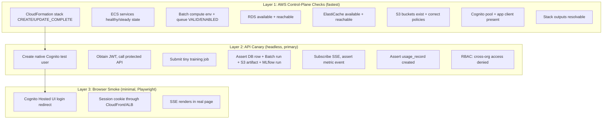

> [!WARNING] Superseded — This artifact is retained for historical reference.
> This spec has been superseded by per-feature specs 028–037. Architecture decisions (AD-1..AD-17)
> moved to [[Reference/SaaSArchitectureDecisions|SaaS Architecture Decisions]]. See
> [[Specs/016 SaaS Architecture/016 SaaS Architecture|016 index]] for the full child spec index.

# Feature Specification: SaaS Architecture — Three-Mode Operating Model

**Feature Branch**: `016-saas-architecture`
**Created**: 2026-06-19
**Status**: Draft

## User Scenarios & Testing

### User Story 1 — SaaS User Signs Up and Logs In via Google/GitHub/Email (Priority: P1)

A new user visits anvil.io and either signs in with Google/GitHub or creates a passwordless account via email magic link (Cognito Hosted UI). They are authenticated and redirected to the dashboard. Session management (tokens, refresh, MFA) is handled entirely by Cognito.

**Why this priority**: Multi-tenancy is the foundation of SaaS mode. Using Cognito means zero auth code to maintain — no password hashing, no token management, no session storage. Social login also eliminates registration friction.

**Independent Test**: Visit the SaaS deployment, click "Sign in with Google" (or use the equivalent test user in dev Cognito pool), complete the OAuth flow, and verify the user lands on the dashboard with their email displayed. Verify the session persists across page reloads.

**Acceptance Scenarios**:

1. **Given** a new user visits anvil.io, **When** they click "Sign in with Google" (or GitHub, or Apple), **Then** they are redirected to the provider's OAuth consent screen, and on approval they land on the anvil dashboard authenticated.
2. **Given** a new user visits anvil.io, **When** they choose email/password registration via Cognito Hosted UI, **Then** their account is created, they are redirected to the dashboard, and a JWT session is established.
3. **Given** a previously authenticated user returns, **When** their session is still valid (Cognito refresh token), **Then** they see the dashboard without re-authentication.
4. **Given** a user signs out, **When** they click logout, **Then** their Cognito session is revoked and they are redirected to the login page.

---

### User Story 2 — SaaS User Trains a Model and Watches Live Metrics (Priority: P1)

A logged-in SaaS user uploads a text corpus, configures hyperparameters, starts training, and watches the loss curve stream live in the browser via SSE. On completion, the model is available for download.

**Why this priority**: This is the core product experience in SaaS mode. It validates the entire pipeline: auth, data upload, compute dispatch, SSE streaming, and result storage.

**Independent Test**: Can be tested by uploading a small file, starting training with minimal hyperparameters (1 layer, 50 steps), and verifying the SSE stream shows step/loss updates and the completed model is downloadable.

**Acceptance Scenarios**:

1. **Given** a logged-in user with an uploaded corpus, **When** they configure training and click start, **Then** a training job is created (status=pending) and the browser opens an SSE connection.
2. **Given** a training job is running, **When** the compute pod completes each step, **Then** a metrics event is published to Redis, forwarded via SSE, and the browser updates the loss curve in real-time.
3. **Given** training completes, **When** the compute pod finishes, **Then** the final loss and generated samples appear in the browser and the model artifacts are stored in S3.
4. **Given** a completed training run, **When** the user clicks download, **Then** a signed S3 URL is returned and the model.safetensors file is downloaded.

---

### User Story 3 — SaaS User Sees Only Their Own Data (Priority: P1)

A user's corpora, datasets, experiments, and models are isolated from other users. No user can see or access another user's data through any API endpoint or the web UI.

**Why this priority**: Multi-tenant data isolation is non-negotiable for a SaaS product. Without this, no user will trust the platform with their data.

**Independent Test**: Create two separate user accounts (User A and User B). User A creates a corpus. Log in as User B — verify User B sees an empty corpus list. User B creates their own corpus and confirms they see only their own.

**Acceptance Scenarios**:

1. **Given** two registered users with data, **When** either user views their dashboard, **Then** they see only their own corpora, datasets, experiments, and models.
2. **Given** a user makes an API call, **When** the request is processed, **Then** all database queries are scoped by `org_id` (resolved from the user's membership) and filtered by team/role visibility.
3. **Given** one user's training job is running, **When** another user starts a job, **Then** both jobs run concurrently in separate compute pods with no data cross-contamination.

---

### User Story 4 — Local User Runs anvil Unchanged (Priority: P1)

A local user installs anvil via pip, runs `anvil serve`, and all existing functionality works exactly as before. No SaaS code is loaded, no cloud dependencies are required.

**Why this priority**: The local mode is the existing product. Breaking it for existing users is unacceptable. This must remain untouched.

**Independent Test**: Run `pip install anvil && anvil serve` and verify the web UI at localhost:8080 works with all existing features (corpus upload, training, SSE, model export).

**Acceptance Scenarios**:

1. **Given** a clean Python environment, **When** the user runs `pip install anvil`, **Then** no `boto3`, `redis-py`, or other cloud SDKs are installed.
2. **Given** a local install, **When** the user runs `anvil serve`, **Then** SQLite is used, MLflow runs as a subprocess, training runs in-process, and no cloud services are contacted.
3. **Given** a local install, **When** the user imports `anvil`, **Then** no code from `anvil/_saas/` is loaded.

---

### User Story 5 — SaaS Developer Runs Full Stack Locally (Priority: P2)

A developer clones the repo and runs `docker compose up` to start PostgreSQL, Redis, MinIO, MLflow, and the anvil web service with hot-reload. They can make changes to the code and see them reflected immediately.

**Why this priority**: Developer velocity directly impacts how fast SaaS features ship. Docker compose emulation is the fastest iteration loop.

**Independent Test**: Run `docker compose up`, verify the anvil web UI loads at localhost:8080, register a user, upload a corpus, and start a training job (compute runs in-process for dev speed). Verify SSE metrics stream in the browser.

**Acceptance Scenarios**:

1. **Given** the developer runs `docker compose up`, **When** all containers are healthy, **Then** the anvil web UI is available at localhost:8080.
2. **Given** the developer modifies Python code in the mounted volume, **When** the file is saved, **Then** the uvicorn process reloads and the change is reflected without container rebuild.
3. **Given** the docker compose stack is running, **When** the developer starts a training job, **Then** compute runs in-process (not Batch), writing results to the local MinIO and PostgreSQL containers.

---

### User Story 6 — SaaS Developer Deploys Branch to Dev AWS (Priority: P2)

A developer wants to test their changes against real AWS infrastructure. They run `cdk deploy` from `packages/infra/`, which builds the Docker image, pushes it to ECR, and updates the dev ECS service.

**Why this priority**: Some changes (Batch compute, Redis SSE, S3 storage) can only be fully validated against real AWS services.

**Independent Test**: Run `cdk deploy` from the infra package, verify the CloudFormation stack updates successfully, visit the dev CloudFront URL, and confirm the newly deployed version reflects the developer's changes.

**Acceptance Scenarios**:

1. **Given** a developer has made changes, **When** they run `cdk deploy`, **Then** the Docker image is built, tagged with the git commit hash, pushed to ECR, and the ECS service is updated.
2. **Given** a dev stack is deployed, **When** a user visits the dev CloudFront URL, **Then** they see the updated version of the application.
3. **Given** a dev stack with infrastructure changes, **When** `cdk diff` is run, **Then** it shows the planned changes before deployment.

---

### User Story 7 — User Deploys anvil SaaS into Their AWS Account with One Command (Priority: P1)

A user runs a single command to deploy the full anvil SaaS stack into their own AWS account. The command checks prerequisites, prompts for configuration, deploys all infrastructure, creates an admin account, and outputs the live URL. No manual AWS console steps, no Node.js, no CDK knowledge required.

**Why this priority**: Self-hosted deployability is the distribution model for the SaaS product. If deployment requires reading a 20-step manual, adoption will be near zero.

**Independent Test**: Run `anvil deploy init` in an AWS account with no prior anvil infrastructure. Verify the command completes without error and the user can access the web UI at the output URL. Then run `anvil deploy destroy` and verify all resources are cleaned up.

**Acceptance Scenarios**:

1. **Given** a user with AWS credentials configured, **When** they run `anvil deploy init`, **Then** they are interactively prompted for domain, region, and admin email, and the stack is deployed with no further manual steps.
2. **Given** the stack is deployed, **When** the command completes, **Then** it outputs the CloudFront URL and saves admin credentials to `~/.anvil/`.
3. **Given** a deployed stack, **When** the user visits the CloudFront URL, **Then** they see the login page and can log in with the admin credentials.
4. **Given** the stack is deployed, **When** the user runs `anvil deploy status`, **Then** they see the CloudFront URL, stack status, and current version.

---

### User Story 8 — User Destroys, Upgrades, or Reconfigures the SaaS Deploy (Priority: P2)

A user needs to tear down their anvil deployment, upgrade to a new version, or change configuration. Each operation is a single command with clear prompts and safe defaults.

**Why this priority**: Day-2 operations (destroy, upgrade, reconfigure) are what separate a hobby project from production software. Without clean destroy, users won't trust deploying at all.

**Independent Test**: Deploy a stack, reconfigure it (change domain), upgrade it (simulate a version bump), then destroy it. Verify each step completes and the final destroy removes all AWS resources including S3 buckets.

**Acceptance Scenarios**:

1. **Given** a deployed stack, **When** the user runs `anvil deploy destroy`, **Then** they are prompted for confirmation (skippable with `--force`), the S3 data buckets are emptied, and the CloudFormation stack is deleted.
2. **Given** a deployed stack and a newer version available, **When** the user runs `anvil deploy update`, **Then** the ECS services are updated with the new container image and any infrastructure changes are applied.
3. **Given** a deployed stack, **When** the user runs `anvil deploy config set --key domain --value new.example.com`, **Then** the CloudFormation stack is updated with the new domain.
4. **Given** a destroyed stack, **When** the user verifies in the AWS console, **Then** all stack resources (including S3 buckets containing data) are removed.

---

### User Story 9 — Local User Uses CLI to Push/Pull Data from SaaS (Priority: P3)

A local user has `anvil` installed and wants to upload a corpus from their local machine to the SaaS deployment. They run `anvil remote login`, then `anvil remote push corpus ./my-data/`. Later, they pull a trained model with `anvil remote pull model 42`.

**Why this priority**: The CLI bridge connects local workflows to cloud compute. Important for power users, but the web UI upload/download is the primary path.

**Independent Test**: Install anvil locally, run `anvil remote login` against a dev SaaS deployment, run `anvil remote push corpus ./test-data/`, verify the corpus appears in the web UI, run `anvil remote pull model 1`, and verify the file is downloaded locally.

**Acceptance Scenarios**:

1. **Given** a user with a local anvil install, **When** they run `anvil remote login https://dev.anvil.io`, **Then** they are prompted for credentials and a JWT pair is stored in `~/.anvil/credentials`.
2. **Given** an authenticated CLI session, **When** the user runs `anvil remote push corpus ./my-corpus/`, **Then** the files are uploaded to S3 and a corpus is created in the SaaS database.
3. **Given** an authenticated CLI session, **When** the user runs `anvil remote pull model 42`, **Then** a signed S3 URL is generated and the model artifacts are downloaded locally.

---

### Edge Cases

- What happens when a **compute pod** crashes mid-training (Spot reclaim, instance failure)? Training execution stops, but `job_events` in PostgreSQL preserves all progress (AD-4). The reconciler detects the dead Batch job (Batch status FAILED, or grace timeout with no new events) and appends a terminal `failed` event, moving the job out of `running`. For Spot-interrupted jobs, optional retry per FR-042. No job stays stuck `running` indefinitely (SC-012).
- What happens when a **web pod** (ECS replica) serving an SSE stream goes down? Training is unaffected (it runs in a separate Batch pod). The browser's `EventSource` fires `onerror` and auto-reconnects through the ALB to any healthy replica, sending `Last-Event-ID`; the new replica replays `job_events` since that sequence and resubscribes to Redis — no metrics gap (FR-045, AD-5).
- What happens when SSE cannot be established at all (corporate proxy strips `text/event-stream`)? The client auto-degrades to polling `GET /v1/training/{job_id}/events?since=` (FR-045a/b). Both paths read the same `job_events` source of truth, so the loss curve and terminal state are always reachable.
- What happens when the Redis pub/sub connection drops during training? The SSE stream pauses. Mitigation: the serving replica reconnects to Redis and resubscribes; any events missed during the gap are recovered from `job_events` on the next `Last-Event-ID` cycle (Redis is delivery-only, not the source of truth).
- What happens when two users register with the same email? Cognito enforces email uniqueness in the user pool. The second registration attempt receives an error from Cognito Hosted UI.
- What happens when a user's social login account (Google/GitHub) is deactivated? Cognito's federation means the user can no longer authenticate through that provider. They may have a separate email/password account or need to contact support.
- What happens if the user forgets their password? Cognito Hosted UI provides a built-in "Forgot password" flow with email verification code or magic link.
- What happens to a user's data when their account is deleted? The `users` table entry and all scoped data remain (orphaned) unless a cleanup process is triggered. Mitigation: admin can delete user via Cognito + cascade delete local data.
- What happens when S3 upload fails mid-transfer? The client retries with exponential backoff (handled by boto3). If all retries are exhausted, the upload endpoint returns an error status.
- What happens in local mode when `ANVIL_MODE=saas` is not set? Local mode runs the `anvil.api.app:app` entrypoint, which has no import path to `anvil/_saas/` — SaaS modules are never loaded and no cloud service is contacted (FR-011, FR-011a).
- What happens if the local entrypoint is launched with `ANVIL_MODE=saas` (or the SaaS entrypoint with mode unset/local)? The factory detects the entrypoint/mode mismatch and **fails fast** with a clear error — it does not reinterpret or silently switch (FR-011b).
- What happens if `ANVIL_MODE=saas` but a required cloud variable (e.g., `DATABASE_URL`) is missing? The SaaS factory fails fast at startup listing the missing variables, before wiring any implementation — it never falls back to SQLite/local (FR-011c).
- What happens when a user has no data yet? The dashboard shows empty states with guidance on how to upload data and start training.
- What happens if `anvil deploy` is run without AWS credentials? The command checks for credentials first and exits with a clear error message instructing the user to configure them.
- What happens if the CloudFormation stack creation fails partway through? The command outputs the specific failure, rolls back nothing (CloudFormation auto-rolls back), and the user can fix the issue and re-run.
- What happens if the deploy config file at `~/.anvil/` is corrupted? The deploy command validates the config on load and falls back to interactive prompting if validation fails.
- What happens if `anvil deploy destroy` is run on a stack that has already been destroyed? The command detects the stack does not exist and exits cleanly with a message.
- What happens if AWS service limits are hit (e.g., VPC limit)? The CloudFormation stack will roll back with a clear error indicating which limit was hit. The user can request a limit increase and re-run.
- What happens to a compute pod's DB access mid-job when its 15-minute IAM token expires? The SQLAlchemy token-provider callback regenerates a fresh token on the next connection from the pool (FR-045e); existing pooled connections through RDS Proxy remain valid. No job interruption.
- What happens if a secret is rotated (e.g., Redis auth token) while pods are running? New pods pick up the rotated value via the `secrets:` injection at launch; the rotation policy and a rolling restart propagate it to running services. DB access is unaffected (IAM auth, no static secret).

## Requirements

### Functional Requirements

- **FR-001**: System MUST use Amazon Cognito User Pools as the sole authentication provider for SaaS mode — no custom auth code (no password hashing, no JWT issuance, no token storage in the application).
- **FR-002**: Cognito MUST be configured with at least one social identity provider (Google or GitHub) plus email/password via Cognito Hosted UI.
- **FR-003**: System MUST scope all data access (corpora, datasets, experiments, models) by the Cognito `sub` (user UUID) derived from the authenticated JWT, mapped to a local integer `user_id` on first login.
- **FR-004**: System MUST support SSE-based live training metrics streaming via Redis pub/sub (SaaS mode) or in-process `asyncio.Queue` (local mode).
- **FR-005**: System MUST dispatch training jobs to AWS Batch (SaaS mode) or run in-process (local mode), selected at deploy time.
- **FR-006**: System MUST store application data in S3 (SaaS mode) or local filesystem (local mode), selected at deploy time.
- **FR-007**: System MUST track training job lifecycle (pending → running → completed/failed) in PostgreSQL (SaaS mode) or SQLite (local mode).
- **FR-008**: System MUST serve the web UI and API from the same origin in SaaS mode (no CORS needed).
- **FR-009**: System MUST support CloudFront CDN with cached static assets and proxied API requests.
- **FR-010**: System MUST deploy infrastructure via AWS CDK (`packages/infra/`) for SaaS mode.
- **FR-011**: System MUST NOT load any SaaS-only code (`boto3`, `redis-py`) in local mode. The local entrypoint module (`anvil/api/app.py`) MUST have no static import path to `anvil/_saas/`, so import isolation is structurally guaranteed (not merely runtime-checked).
- **FR-011a**: Mode selection MUST use two layers: (1) the **entrypoint module** is the primary switch — local launches `anvil.api.app:app`, SaaS launches `anvil._saas.app:app`; (2) the `ANVIL_MODE` env var is an explicit guard and config selector. Mode MUST be explicit and is NEVER auto-detected.
- **FR-011b**: Each app factory MUST validate `ANVIL_MODE` matches its module on startup and **fail fast** on mismatch (e.g., local entrypoint started with `ANVIL_MODE=saas`, or vice versa). No silent reinterpretation.
- **FR-011c**: When `ANVIL_MODE=saas`, the SaaS factory MUST validate that all required cloud configuration (`DATABASE_URL`, `REDIS_URL`, `S3_DATA_BUCKET`, `COGNITO_USER_POOL_ID`, `COGNITO_CLIENT_ID`, `MLFLOW_TRACKING_URI`) is present BEFORE wiring implementations, and fail fast listing any missing variables. It MUST NEVER silently fall back to local implementations.
- **FR-012**: System MUST support a docker compose development environment that emulates SaaS infrastructure (PostgreSQL, Redis, MinIO, MLflow) for local development.
- **FR-013**: System MUST support three developer iteration modes: docker compose, local code against dev AWS, and cdk deploy to dev environment.
- **FR-014**: CLI MUST support remote cluster management and data commands:
  - `anvil remote cluster add <url>` — guided wizard to connect to a running SaaS cluster. Prompts for cluster alias, authenticates via Cognito device grant (or deploy credentials for the initial admin), and saves the cluster configuration to the local cluster registry.
  - `anvil remote cluster list` — list all configured clusters with their status (connected/disconnected) and URL.
  - `anvil remote cluster remove <name>` — remove a cluster configuration from the registry.
  - `anvil remote cluster configure <name> [--key value]` — update cluster alias, URL, or credential settings.
  - `anvil remote login <cluster>` — authenticate to a specific cluster via Cognito device authorization grant (RFC 8628), caching the JWT.
  - `anvil remote logout <cluster>` — clear cached credentials for a cluster.
  - `anvil remote push <cluster> corpus <path>` — upload a corpus to the specified cluster.
  - `anvil remote push <cluster> dataset <path>` — upload a dataset.
  - `anvil remote pull <cluster> model <id>` — download a model artifact from the cluster.
  - `anvil remote pull <cluster> experiment <id>` — download experiment data.
  - `anvil remote ls <cluster> <corpora|datasets|experiments>` — list resources on the cluster.
  - If a single cluster is configured, the `<cluster>` argument SHOULD be optional and default to that cluster.
- **FR-014a — Cluster registry**: The CLI MUST maintain a cluster registry at `~/.anvil/clusters.json` containing an array of cluster objects, each with: `name` (alias), `url` (CloudFront URL), `api_url` (API base path), `region` (AWS region the cluster is deployed in), `auth_method` ("deploy" or "device_grant"), `cognito_domain` (for device grant), `api_version` (the cluster's reported API version, see FR-014c), `deployed_at`, and `last_login`. The `anvil deploy init` command MUST automatically add the newly deployed cluster to the registry as a cluster entry named after the stack, with `auth_method: "deploy"`, the deployment `region`, and the admin credentials cached. Region-scoped credential resolution (e.g., per-region Cognito pools) MUST use the `region` field. (FR-014a)
- **FR-014c — API version negotiation**: Every SaaS deployment MUST expose its API version via an unauthenticated `GET /v1/version` endpoint returning `{api_version, anvil_version, min_cli_version}`. The CLI MUST call this on `cluster add` and before each remote operation, caching `api_version` in the registry. If the CLI's own version is below the cluster's `min_cli_version`, the CLI MUST refuse the operation with a clear "upgrade your anvil CLI" message rather than failing with an opaque API error. This prevents silent breakage when `anvil deploy update` rolls a newer API to a cluster while operators run older CLIs. (FR-014c)
- **FR-014b — Active cluster concept**: The CLI SHOULD support an active/default cluster concept. When a cluster is specified via `--cluster` flag or `ANVIL_ACTIVE_CLUSTER` env var, remote data commands omit the `<cluster>` argument. If zero clusters are configured, remote data commands MUST fail with a clear message directing the user to run `anvil remote cluster add` or `anvil deploy init`. (FR-014b)
- **FR-015**: SaaS mode MUST support concurrent training jobs across multiple users and multiple jobs per user.
- **FR-016**: The core abstraction interfaces (`FileStore`, `EventBus`, `JobQueue`, `ComputeBackend`, `LogsReader`, and `VersionedContentStore`) MUST be defined with local implementations alongside them and SaaS implementations in `anvil/_saas/implementations/`. Blob/runtime interfaces live in `anvil/storage/`; the `VersionedContentStore` content-repository interface lives in `anvil/services/content/` (spec 016). `VersionedContentStore` is the versioned content-repository substrate: local mode uses a pure-Python, content-addressed implementation (no external service); SaaS mode uses a LakeFS-backed implementation behind the same interface (see the "Content Repository (versioned)" requirement group below and AD-17).
- **FR-017**: MLflow in SaaS mode MUST use the same PostgreSQL server as the application (separate `anvil_mlflow` database) with artifacts on S3.
- **FR-018**: Cognito Hosted UI MUST handle user-facing login, registration, password reset, and MFA enrollment. The anvil application does not implement any of these flows.
- **FR-019**: Authentication MUST use the **app-managed OIDC/JWT** pattern (NOT ALB-managed auth). The FastAPI backend receives the Cognito bearer token directly and validates it against Cognito's JWKS endpoint via `aws-jwt-verify` in a middleware dependency. ALB does NOT perform `authenticate-cognito`. This single pattern works identically across CloudFront, ALB, direct API access, and CLI.
- **FR-020**: SSE endpoints MUST authenticate via a short-lived signed token passed as a query parameter (since `EventSource` cannot set custom headers). The server issues this token from a validated session; it is single-use or short-TTL and scoped to the specific job stream.
- **FR-021**: CLI authentication MUST use Cognito's OAuth2 device authorization grant (RFC 8628) — the CLI opens a browser for the user to authenticate, then polls the token endpoint. No hardcoded API keys, no custom token endpoints.
- **FR-021a**: Native Cognito email/password users MUST work out of the box with zero post-deploy configuration. Social login (Google, GitHub) MUST be optional and configured AFTER deploy via `anvil deploy config set-idp` once the CloudFront/custom domain (and therefore the OAuth callback URL) is known. The customer brings their own OAuth client ID and secret (BYO identity provider).
- **FR-022**: The anvil application's Cognito User Pool MUST be deployed via the CDK stack as a first-class resource — no separate Cognito setup outside of `anvil deploy`.
- **FR-023**: A local `users` table in PostgreSQL MUST map Cognito `sub` (UUID) to a local integer `user_id` for efficient FK relationships. The mapping is created on first login via a Cognito post-authentication Lambda trigger or a first-request middleware handler.
- **FR-024**: A single `anvil deploy init` command MUST bootstrap the full SaaS stack — including VPC, RDS, Redis, ECS, MLflow, S3, Batch, CloudFront, Route53, WAF, and Cognito — into the user's AWS account with interactive prompting for required configuration.
- **FR-025**: A single `anvil deploy destroy` command MUST tear down the entire stack, including emptying and deleting S3 data buckets that would otherwise block CloudFormation stack deletion.
- **FR-026**: A single `anvil deploy update` command MUST upgrade the deployment to the latest available version by updating container images and applying any infrastructure changes.
- **FR-027**: A single `anvil deploy config set/get/list` command MUST allow changing deployment configuration (domain, region, instance sizing, etc.) without a full re-deploy where possible.
- **FR-028**: The deploy command MUST work with only Python + AWS credentials — no Node.js, no CDK CLI, no manual bootstrapping steps required on the user's machine.
- **FR-028a — Non-interactive / CI deploy**: `anvil deploy up` MUST support a fully non-interactive mode for CI/CD pipelines (e.g., GitHub Actions). In this mode:
  - All configuration MUST be resolvable from environment variables with an `ANVIL_DEPLOY_` prefix (e.g., `ANVIL_DEPLOY_STACK_NAME`, `ANVIL_DEPLOY_REGION`, `ANVIL_DEPLOY_DOMAIN`, `ANVIL_DEPLOY_ADMIN_EMAIL`) — NOT requiring `~/.anvil/deploy-config.json` to exist.
  - AWS credentials MUST be sourced via the standard boto3 chain (env vars, OIDC web-identity role, instance profile) — NOT requiring `~/.aws/credentials`.
  - A `--non-interactive` flag MUST cause any missing required value to fail fast with a clear error naming the missing variable, rather than prompting (which would hang a CI job).
  - All deploy commands (`init`, `up`, `update`, `destroy`, `verify`) MUST support a `--json` flag for machine-readable output so CI can parse results. `destroy` in CI requires `--force`.
  (FR-028a)
- **FR-029**: CloudFormation templates MUST be pre-synthesized from the CDK source during CI and bundled directly in the pip package so the Python CLI can deploy them via `boto3`.
- **FR-030**: The deploy command MUST create an initial admin user via Cognito, a default Organization, and a Membership making that admin the org `owner`. The admin user MUST have `is_cluster_admin = true`, granting cross-org read visibility and the cluster-operation action matrix (FR-037a/b). The command MUST output the login URL after successful stack creation.
- **FR-031**: The deploy destroy command MUST require user confirmation (with `--force` to skip) and MUST handle the case where the stack has never been deployed (no-op).
- **FR-032**: The deploy system MUST support multiple independent environments (dev, staging, prod) in the same AWS account using different stack names.
- **FR-033**: The deploy system MUST save its configuration (stack name, region, domain, etc.) to `~/.anvil/` so subsequent commands (`destroy`, `update`, `config`, `status`) can find it without re-prompting.

#### RBAC & Multi-Tenancy

- **FR-034**: The system MUST implement a two-tier admin hierarchy with org-scoped RBAC beneath it. The tiers are:
  1. **Cluster admin** — a system-level principal with cross-org **read** visibility and a fixed cluster-operation action matrix (FR-037a/b). Cluster admins view all orgs/jobs/experiments, perform cluster operations (suspend orgs, cancel jobs, manage cluster admins), and manage the deployment (update, destroy, configure). They do NOT get blanket write access to tenant data. A user is a cluster admin by virtue of the `is_cluster_admin` boolean flag on their `users` row, not by org membership.
  2. **Org-scoped RBAC** (below): `Organization` (top-level isolation/billing boundary) → `Team` (group within an org) → `User` (member of org/teams). A regular user belongs to exactly one organization but MAY belong to multiple teams within it.
- **FR-035**: The system MUST support org-scoped roles `owner`, `admin`, `member`, `viewer` assigned at the organization level and optionally overridden at the team level. Additionally, the `is_cluster_admin` boolean on the `users` table provides read-wide cross-org visibility plus the cluster-operation action matrix (FR-037a/b) — it does NOT bypass the org-role guard for tenant-data writes. A user MAY be both a cluster admin and an org member simultaneously. Role determines permitted actions (create/read/update/delete/manage-members).
- **FR-036**: Every resource (corpus, dataset, training job, model) MUST be owned by `org_id` (required), `team_id` (optional), and `created_by` user_id. Repository **read/list** queries MUST be scoped by `org_id` for regular users and unfiltered (cross-org) for cluster admins (FR-037a). Repository **write/mutate** operations remain gated by the org-role guard for all users, including cluster admins (FR-037b) — the cross-org read elevation does NOT extend to writes.
- **FR-037**: Authorization MUST be enforced at three layers: (1) a FastAPI middleware that resolves the caller's org/team/role and `is_cluster_admin` flag from the validated JWT, (2) a service-layer permission guard that checks the action against the resource owner and the caller's role, and (3) the cluster-admin elevation described in FR-037a. No DB query may return cross-org data for non-cluster-admin users.
- **FR-037a — Cluster admin scope (read-wide, write-narrow)**: The `is_cluster_admin` flag elevates a caller for **org-ID scoping** (read/list visibility) but does NOT grant a blanket bypass of all permission checks. Precisely:
  - **Read/list operations**: a cluster admin bypasses `org_id` scoping — repository queries return cross-org data. This is the "read-wide" capability.
  - **Write/mutate operations**: a cluster admin is evaluated against an explicit **cluster-admin action matrix**, NOT the org role matrix and NOT an unconditional allow. Destructive tenant-data operations (delete corpus/dataset/model/job in an org the admin is not an owner of) are NOT permitted by the cluster-admin flag alone.
  - This resolves the apparent conflict: there is no "skip all checks" path. The flag changes the *scoping predicate* (which rows are visible) and grants a *fixed set of cluster-operation permissions* (FR-038a), but tenant-data mutation still flows through the org-role guard.
- **FR-037b — Cluster-admin action matrix**: The set of actions a cluster admin MAY perform purely by virtue of `is_cluster_admin` (without org membership) MUST be explicitly enumerated and is limited to:
  - READ/LIST any resource in any org (corpora, datasets, jobs, models, experiments, usage, members)
  - Suspend/reactivate an organization (org lifecycle, not data deletion)
  - Create and remove other cluster admins (up to a configurable limit)
  - Cluster operations: view health, view logs, restart cluster services, view cross-org usage/billing
  - Cancel any running training job (operational safety — runaway job mitigation)
  - Actions NOT in this matrix (e.g., delete a corpus, modify a dataset, change an org's settings) require the cluster admin to ALSO hold the appropriate org role. A cluster admin who is not a member of Org B cannot delete Org B's corpus.
- **FR-038**: An organization owner/admin MUST be able to invite users, create teams, assign roles, and remove members via API. The first admin (created at deploy) is created as a cluster admin AND org owner of the default org.
- **FR-038a — Cluster admin capabilities**: A cluster admin MUST be able to (per the FR-037b action matrix):
  - View and list all organizations, their members, and their resources (cross-org read)
  - Access the MLflow proxy across all orgs (read)
  - View all jobs, experiments, models, and usage across the cluster (read)
  - Access the operations page and System Actions (health, logs, service control) for the entire deployment
  - Suspend/reactivate organizations and cancel runaway jobs (cluster operations)
  - Invite new cluster admins (self-service, up to a configurable limit)
  - A cluster admin MUST NOT delete or mutate tenant data (corpora, datasets, models) in an org where they do not hold an org `owner`/`admin` role. Cluster admin scope is cross-org observation, org lifecycle, and cluster operations — NOT tenant data ownership. (Enforced by FR-037b, not merely advisory.)
- **FR-038b — Local mode auth bypass**: In local mode (`ANVIL_MODE` unset or `local`), the system MUST NOT require JWT authentication. All API routes and UI pages MUST be accessible without authentication. All repository queries MUST return unfiltered data (no org scoping). All documented cluster admin capabilities (FR-038a) are implicitly available to the local-mode user — the `is_cluster_admin` flag and org roles are not consulted in local mode. This preserves the existing single-user experience where `anvil serve` works immediately with no auth setup.

#### Compute (CPU / GPU / Multi-Node)

- **FR-039**: The compute layer MUST support four job shapes: `cpu` (CPU-only), `gpu` (single GPU), `multi-gpu` (N GPUs on one node), and `multi-node` (M nodes × N GPUs, gang-scheduled). SaaS mode dispatches to AWS Batch on EC2; local mode runs in-process.
- **FR-040**: The `JobQueue.submit()` / `ComputeBackend.run()` abstraction MUST express compute requirements as a structured `ResourceSpec` (`{node_count, gpus_per_node, vcpus, memory, instance_class}`) so multi-node jobs are first-class, not a special case.
- **FR-041**: Multi-node training jobs MUST use AWS Batch multi-node parallel job definitions with gang scheduling; placement-group locality and EFA networking MUST be configurable for high-bandwidth inter-node communication.
- **FR-042**: The Batch compute environment MUST support EC2 Spot for cost reduction with graceful handling of Spot interruption (job retry / checkpoint resume where supported).

#### Job State Consistency

- **FR-043**: PostgreSQL MUST be the single source of truth for job lifecycle. Job state transitions MUST be recorded in an append-only `job_events` table with idempotent keys `(job_id, sequence)`. Redis is delivery-only and MUST NOT be treated as authoritative.
- **FR-043a — `job_events` capacity & lifecycle**: Because each training step may append an event, the `job_events` table is high-volume (a 10K-step job ≈ 10K rows). The design MUST address growth:
  - **Metric granularity control**: per-step metric events MUST be throttled to a configurable cadence (default: emit a metric event at most every N steps or every T seconds, whichever is coarser) so a 100K-step job does not produce 100K rows. Authoritative lifecycle events (submitted/started/completed/failed/cancelled) are always written; metric events are sampled. SSE live granularity (via Redis) is independent and can be finer.
  - **Index strategy**: unique index on `(job_id, sequence)` (correctness + idempotency); secondary index on `(org_id, job_id, ts)` for org-scoped listing; partial index on non-terminal status for the reconciler scan. Indexes MUST be chosen to not degrade append throughput.
  - **Retention/archival**: a scheduled job MUST archive `job_events` rows for terminal jobs older than a configurable window (default 30 days) to a `job_events_archive` table (or cold storage). The hot table stays bounded. UsageRecords (FR-046) are already derived and persisted, so archival of raw events does not lose billing data.
  - **Autovacuum**: the table requires tuned autovacuum (it is append-heavy with periodic bulk archival deletes). Deployment docs MUST note recommended `autovacuum_vacuum_scale_factor` for this table.
  (FR-043a)
- **FR-044**: Compute pods MUST write artifacts to deterministic S3 keys and emit idempotent lifecycle events. A reconciler MUST periodically compare Batch job state, DB state, MLflow run state, and expected S3 artifacts, and repair any job stuck in a non-terminal state beyond a configurable grace period.
- **FR-044a — Reconciler operating parameters**: The reconciler MUST be specified precisely:
  - **Period**: runs on a fixed schedule, default every 60 seconds, configurable via `ANVIL_RECONCILER_INTERVAL_SECONDS`. The grace period before declaring a non-terminal job dead is separately configurable (default 300s) via `ANVIL_RECONCILER_GRACE_SECONDS`.
  - **Stateless**: the reconciler holds NO in-memory state between runs. Each run is a full scan of non-terminal jobs from PostgreSQL. A reconciler crash mid-run causes no corruption — the next run re-scans from scratch. It MUST be safe to run multiple reconciler instances concurrently (idempotent appends via `(job_id, sequence)` unique key).
  - **Idempotency / race with live pods**: before appending a terminal `failed` event, the reconciler MUST re-check the latest `job_events` sequence for that job to avoid racing a healthy pod that is actively writing. If a newer event appeared since the scan began, the reconciler skips that job this cycle. The `(job_id, sequence)` unique constraint is the final guard — a duplicate append is rejected by the DB, not silently doubled.
  - **Dependency degradation backoff**: the reconciler reads four surfaces (Batch API, PostgreSQL, S3, MLflow). If ANY surface returns errors/throttling, the reconciler MUST back off and NOT mark jobs as failed on incomplete information — a transient Batch API outage MUST NOT cause healthy jobs to be reaped. It logs the degradation and retries on the next cycle.
  - **Heartbeat**: the reconciler MUST emit a heartbeat metric/log each cycle so Alertmanager can detect a dead reconciler (FR-054e dead-man's switch).
  (FR-044a)
- **FR-045**: SSE streaming MUST support `Last-Event-ID` replay backed by `job_events`, so a client reconnecting to any replica resumes the stream without gaps.
- **FR-045a**: The system MUST expose a metrics polling endpoint `GET /v1/training/{job_id}/events?since={sequence}` that returns the `job_events` backlog (status + metrics) after a given sequence. This is the durable fallback used when SSE cannot be established (proxies blocking `text/event-stream`) or for clients that prefer polling. It reads the same `job_events` source of truth as SSE.
- **FR-045b**: The browser client MUST auto-degrade: attempt SSE first; on repeated connection failure (EventSource `onerror` without open), fall back to polling `GET /v1/training/{job_id}/events?since=` on a fixed interval. Both paths render identically because both read `job_events`. The job's terminal state is always reachable via polling even if SSE never connects.
- **FR-045q — Redis high availability**: The ElastiCache Redis cluster MUST be deployed in **Multi-AZ mode with automatic failover** (a replication group with at least one replica in a second AZ). A single-AZ Redis is NOT acceptable — Redis is the live SSE delivery path and its loss degrades all active streams. Failover MUST be transparent to the web tier via the ElastiCache primary endpoint.
- **FR-045r — Server-signaled SSE degradation**: When the serving web replica cannot establish or loses its Redis subscription (Redis outage, failover in progress), the SSE handler MUST send an explicit `event: degraded` SSE message instructing the browser client to switch to polling `GET /v1/training/{job_id}/events?since=` immediately, rather than waiting for the client-side `onerror` heuristic. When Redis recovers, the server MAY send `event: live` to allow the client to resume SSE. This makes degradation deterministic (server-driven) rather than relying solely on client timeout heuristics (FR-045b). Both paths read the same `job_events` source of truth, so no metrics are lost during the Redis outage — they are replayed from `job_events` on the next poll or `Last-Event-ID` cycle. (FR-045r)

#### Training Job Orchestration

- **FR-045g**: Training orchestration MUST follow a three-plane model: **control plane** (anvil-web admits, configures, submits, and observes — never tracks progress by polling the pod), **scheduler** (AWS Batch owns queueing, compute-environment scaling, gang-scheduling, and retries), **executor** (the compute pod runs `anvil/core` and emits events). Planes communicate only through durable records (`job_events`, S3), never direct mutation.
- **FR-045h**: Job configuration MUST be split into four concerns: hyperparameters (`TrainingJob.config`), `ResourceSpec` (compute), data binding (`corpus_id`/`dataset_id`), and job policy (timeout/retry/priority). Hyperparameters and data references MUST be delivered to the pod via an S3 config object (`jobs/{job_id}/config.json`), not env vars; the pod receives only small pointers (`JOB_ID`, `CONFIG_S3_KEY`) as env.
- **FR-045i**: Batch job definitions MUST be pre-registered per compute shape (`anvil-cpu`, `anvil-gpu`, `anvil-multigpu`, `anvil-multinode`) and parameterized per job via container overrides from `ResourceSpec` — not dynamically created per submission.
- **FR-045j** — Quota: anvil-web MUST enforce per-org quotas (max concurrent jobs, max total GPUs) before submitting to Batch; jobs exceeding quota are rejected or queued with a clear reason. Batch fair-share scheduling provides the second layer.
- **FR-045k** — Fair-share scheduling: The Batch job queue MUST use a fair-share scheduling policy keyed on `org_id` so no organization can starve others. No user-facing priority tiers in v1.
- **FR-045l** — Retry policy: Infrastructure failures (Spot interruption, instance failure) MUST auto-retry (Batch `attempts` = 2–3) and resume from the last checkpoint; user/config errors (invalid hyperparameters, missing data) MUST fail immediately without retry. The reconciler is the backstop for jobs that escape both paths.
- **FR-045m** — Checkpointing: Long-running and multi-node jobs MUST write periodic checkpoints to S3 (deterministic keys). On Spot reclaim + retry, the worker MUST resume from the last checkpoint rather than restarting from scratch.
- **FR-045n** — Cancellation: A user with permission MUST be able to cancel a pending or running job; cancellation terminates the Batch job and records a `cancelled` `JobEvent`. Cancellation is idempotent.
- **FR-045o** — Timeout: Each job MUST have a maximum duration (Batch job timeout + reconciler grace); exceeding it transitions the job to `failed` with a timeout reason.
- **FR-045p** — Multi-node coordination: For multi-node parallel jobs, only the main node (rank 0) MUST emit authoritative `JobEvent`s and write the final artifact; worker nodes participate in training (NCCL/EFA) but do not write job state, preventing duplicate/conflicting events.

#### Secrets Management & Credential Flow

- **FR-045c**: Compute pods and the web tier MUST authenticate to PostgreSQL via **RDS Proxy + IAM database authentication** (`rds-db:connect`). Static database passwords MUST NOT flow to pods. Each connection uses a short-lived (≤15 min) IAM-derived auth token generated from the task's IAM role. The real DB master password is held only by RDS Proxy (read from Secrets Manager) and is never injected into any application container.
- **FR-045d**: Secrets that cannot use IAM auth (Redis auth token, SSE signing secret, social OAuth client secrets) MUST be stored in Secrets Manager and delivered to containers via the ECS/Batch task `secrets:` mechanism (execution role pulls and injects as env at launch). Secrets MUST NEVER be baked into images, written to logs, or passed as plaintext container overrides.
- **FR-045e**: Long-lived SQLAlchemy connection pools (web tier, MLflow) MUST use a token-provider callback that regenerates the IAM auth token on new connections, so pools survive beyond the 15-minute token lifetime without manual credential rotation.
- **FR-045f**: IAM permissions MUST be least-privilege and split: the **execution role** grants ECR pull, CloudWatch Logs, and scoped Secrets Manager reads; the **job/task role** grants `rds-db:connect`, S3 read/write on the org-scoped prefix, and Redis connectivity. No role grants broader access than its function requires.
- **FR-045s — Secret rotation discipline**: Rotation of the injected secrets (Redis auth token, SSE signing secret, OAuth client secrets) MUST be specified, not hand-waved:
  - **ECS `secrets:` injection happens at task launch** — rotating a Secrets Manager value does NOT affect running tasks until they restart. Rotation therefore requires a rolling ECS deployment to propagate. This is documented operational behavior.
  - **SSE signing secret dual-key window**: the SSE signed token (FR-020) MUST be verified against BOTH the current and the previous signing secret during a rotation overlap window. The secret is stored as a small JSON set `{current, previous}` in Secrets Manager. On rotation, `current` becomes `previous` and a new `current` is generated; tokens signed with either verify until the next rotation. This prevents rotation from instantly invalidating all in-flight SSE streams. Verification tries `current` first, then `previous`.
  - **Redis auth token**: ElastiCache supports two-token rotation (SET then ROTATE) so the cluster accepts both old and new during the window. Rotation MUST use this two-step flow plus a rolling web/compute restart.
  - A rotation does NOT affect DB access (IAM auth, no static DB secret — FR-045c).
  (FR-045s)

#### Usage Metering & Billback

- **FR-046**: On every job completion, the system MUST write a `usage_record` capturing GPU-seconds and instance-hours (derived from job runtime × resolved instance type), attributed to `org_id`, `team_id`, `user_id`, and `job_id`. Records MUST derive from `job_events` (the authoritative lifecycle), not a separate write path.
- **FR-047**: Batch jobs MUST be tagged with AWS Cost Allocation Tags (`org_id`, `team_id`, `user_id`) so internal `usage_records` can be cross-checked against AWS Cost Explorer.
- **FR-048**: The system MUST expose a usage query API returning aggregated usage per organization, team, and user over a time range, for billback reporting.

#### Agentic Validation

- **FR-049**: The system MUST provide an `anvil deploy verify` command with three layers: `--layer infra` (AWS control-plane checks via boto3), `--layer api` (headless end-to-end API canary), and `--layer browser` (Playwright smoke test for Hosted UI/SSE). Each layer exits non-zero on failure and reports the failing check.
- **FR-050**: The API canary MUST programmatically create a native Cognito test user, exercise the full pipeline (auth → org/team → upload → train → SSE → artifact → usage record → RBAC negative test), and clean up afterward — with no human or browser interaction.

#### Migrations

- **FR-051**: Alembic migrations for both `anvil_app` and `anvil_mlflow` MUST run as a single pre-deploy step (one-off ECS task or CFN custom resource) that completes BEFORE the web service rolls out. The web service MUST perform only a schema-compatibility check on startup and fail fast on mismatch.

#### Backup, Durability & Disaster Recovery

- **FR-058 — RDS backups**: The RDS PostgreSQL instance MUST have automated backups enabled by default (backup retention ≥ 7 days, configurable) and point-in-time recovery (PITR) enabled. These are first-class CDK construct settings, not manual console actions. The `instance_size` setting MAY scale retention.
- **FR-059 — S3 versioning**: Both data buckets (`anvil-data-{env}`, `anvil-ml-{env}`) MUST have S3 versioning enabled by default so accidental overwrites/deletes are recoverable. A lifecycle policy MUST expire noncurrent versions after a configurable window (default 30 days) to bound storage cost.
- **FR-060 — Destroy safety**: The `anvil deploy destroy` command MUST, before deleting any resource: (1) warn that ALL data including RDS backups and S3 versions will be permanently lost, (2) offer to take a final RDS snapshot (`--final-snapshot` flag, default prompt), (3) require typing the stack name to confirm (unless `--force`). When a final snapshot is requested, the CFN deletion MUST use `DeletionPolicy: Snapshot` on the RDS instance so the snapshot survives stack deletion. The user MUST be told the snapshot name and that it incurs ongoing storage cost until manually deleted.
- **FR-061 — Recovery documentation**: The deploy CLI MUST provide an `anvil deploy restore --snapshot <id>` command (or documented runbook) to stand up a new stack from an RDS snapshot, for disaster recovery. Cross-region replication is a documented post-v1 option, not a v1 default.

#### Observability — Structured Logging

- **FR-052**: All SaaS services (anvil-web, MLflow, compute worker) MUST emit JSON-structured logs to stdout with fields: `timestamp`, `level`, `service`, `message`, `trace_id`, `org_id`, `job_id` (where applicable). The local mode log-file format MUST remain unchanged. Structured logging is configured by the SaaS factory at startup and MUST NOT affect local mode.
- **FR-052a**: The anvil-web service MUST expose `GET /v1/services/logs/{name}?lines=N` (SaaS mode) that reads from CloudWatch Logs via `boto3 logs filter-log-events` for ECS service log groups (`/ecs/anvil-web`, `/ecs/anvil-mlflow`). The existing local-mode endpoint (reads disk files) MUST continue to work unchanged. This follows the same abstraction-interface pattern as FileStore/EventBus/JobQueue: a `LogsReader` interface with `LocalLogsReader` and `CloudWatchLogsReader` implementations.
- **FR-052c — Log viewer cost control**: In SaaS mode the operations page MUST NOT auto-refresh logs on a timer. The local-mode ops page auto-refreshes every 10s from cheap local files; in SaaS mode this would hammer the CloudWatch `FilterLogEvents` API (billed per request, throttled at 5 TPS/account/region). The SaaS log viewer MUST refresh only on explicit user action (a "Refresh" button), and SHOULD cache the last result for a short TTL. System-resource polling (CPU/mem) may continue, but log fetches are user-triggered only. (FR-052c)
- **FR-052d — Log viewer graceful degradation**: If the `[monitoring]` extra is not installed (no `CloudWatchLogsReader` available) in SaaS mode, the log viewer endpoints MUST return a structured "monitoring not configured" response (HTTP 200 with an explanatory payload), NOT a 500 from a failed import. The ops page MUST render a clear "Log viewer requires the monitoring extra" message. The `LogsReader` resolution MUST degrade to a null reader rather than crash. (FR-052d)
- **FR-052b**: The system MUST expose `GET /v1/training/{job_id}/logs?lines=N` to surface compute pod logs post-hoc. The `batch_log_stream` name (predictable from `{batch_job_id}/default` per AWS Batch log stream naming) MUST be stored on the `training_jobs` row at job submission time so the API can query CloudWatch Logs for the terminated pod's log stream.

#### Observability — Distributed Tracing

- **FR-053**: The SaaS system MUST use OpenTelemetry SDK with auto-instrumentation for distributed tracing across all service boundaries. Traces MUST be exported to AWS X-Ray via the AWS Distro for OpenTelemetry (ADOT) or the OTLP exporter. The following auto-instrumentation packages cover the majority of the stack: `opentelemetry-instrumentation-fastapi`, `opentelemetry-instrumentation-redis`, `opentelemetry-instrumentation-boto3`, `opentelemetry-instrumentation-httpx`.
- **FR-053a**: Trace context MUST propagate from the web service into ephemeral Batch compute pods. When submitting a Batch job, the web service MUST extract the W3C `traceparent` header from the current span context and pass it as a `TRACEPARENT` environment variable in the Batch container overrides. The compute worker MUST extract this on startup and continue the trace, creating a child span for the training run. (FR-053a)
- **FR-053b**: The SSE metrics path (compute pod → Redis pub/sub → web pod → browser) MUST propagate trace context manually through the Redis message payload. The compute pod MUST inject its current `traceparent` as an envelope field in each published Redis message; the web pod subscriber MUST extract it and continue the trace when forwarding to the browser `EventSource`. This manual propagation is required because auto-instrumentation cannot connect traces across the Redis pub/sub boundary. (FR-053b)
- **FR-053c**: Sampling MUST be configured to manage X-Ray cost in the multi-tenant setting. The web service MUST use head-based sampling (e.g., reservoir + rate: first request/second then 5%). The compute pod MUST sample training step spans (not every step, e.g., every 10th step via a configurable `OTEL_TRACES_SAMPLER` / `OTEL_TRACES_SAMPLER_ARG`). Trace context MUST still be propagated even for non-sampled spans to preserve the trace tree shape. (FR-053c)
- **FR-053d**: Long-lived SQLAlchemy connection pools and Redis pub/sub operations in the web tier MUST be wrapped in traced spans so DB query latency and Redis publish latency appear in the X-Ray trace map.

#### Observability — Prometheus Metrics

- **FR-054**: The SaaS app factory MUST mount a `GET /metrics` endpoint on the anvil-web service via `prometheus-fastapi-instrumentator`, exposing at minimum: HTTP request rate, request duration histogram (p50/p95/p99) by method/path/status, error rate, and in-flight request count. (FR-054)
- **FR-054a**: Custom Prometheus metrics MUST be defined for application-level observability, including:
  - `anvil_jobs_submitted_total{compute_shape, org_id}` — counter
  - `anvil_jobs_completed_total{compute_shape, org_id}` — counter
  - `anvil_jobs_failed_total{compute_shape, org_id, reason}` — counter
  - `anvil_sse_publish_latency_seconds` — histogram (subscribe-to-browser latency)
  - `anvil_concurrent_jobs{org_id}` — gauge (current running count)
  - `anvil_org_quota_remaining{org_id}` — gauge (remaining concurrent job quota)
  - `anvil_training_steps_total{org_id, compute_shape}` — counter
  - Labels MUST be kept low-cardinality: `org_id` on gauges and high-level counters only. Step-level counters use `compute_shape` without per-org labels to avoid cardinality explosion.
- **FR-054b**: A Prometheus server MUST be deployed as an ECS Fargate task with `ecs_sd_configs` to discover anvil-web ECS tasks for scraping. Sizing and durability requirements:
  - **Sizing**: default 1 vCPU / 2 GB (NOT 0.25 vCPU / 512 MB — that is insufficient for `ecs_sd_configs` plus TSDB). Sizing MUST be configurable via the deploy `instance_size` setting.
  - **Scrape interval**: 30 seconds (not 15s) to reduce ECS API pressure and TSDB churn.
  - **Persistent storage**: the Prometheus TSDB MUST be backed by an **EFS volume** mounted into the Fargate task, NOT ephemeral task storage. A task restart MUST NOT lose historical metrics. The EFS filesystem is a first-class CDK construct.
  - **ECS API rate limiting**: `ecs_sd_configs` calls `ListTasks` + `DescribeTasks` per scrape. The Prometheus service discovery MUST be configured with a refresh interval (≥60s, decoupled from scrape interval) and retry/backoff so it does not exceed the ECS API rate limit (40 TPS/account) as task count grows. The Prometheus task role grants only `ecs:ListTasks` and `ecs:DescribeTasks`.
  (FR-054b)
- **FR-054c**: A Grafana dashboard MUST be deployed (as an ECS Fargate task or via Grafana Cloud) to visualize the default and custom Prometheus metrics. The dashboard MUST include at minimum: request rate/error/duration (RED method), job lifecycle overview (submitted/running/completed/failed), SSE latency heatmap, concurrent jobs per org, and system health summary. Grafana MUST use a CloudWatch data source (in addition to Prometheus) so compute-pod EMF metrics appear alongside web metrics. (FR-054c)
- **FR-054d**: Batch compute pods (ephemeral, minutes-to-hours lifetime) MUST NOT expose a Prometheus `/metrics` endpoint — the scrape interval cannot reliably capture them. Instead, compute pods MUST emit custom metrics via CloudWatch Embedded Metric Format (EMF): a single structured JSON log line to stdout creates auto-extracted CloudWatch custom metrics (`TrainingSteps`, `JobDuration`) with dimensions `org_id` and `compute_shape`. These CW metrics are surfaced in Grafana via the CloudWatch data source (FR-054c). (FR-054d)
- **FR-054e — Alerting**: A Prometheus Alertmanager MUST be deployed as an ECS Fargate task (1 replica) with a default alert ruleset and routing to an SNS topic (email/webhook configurable at deploy). Default alert rules MUST include at minimum:
  - Job stuck in `pending` > 5 minutes (scheduler/quota problem)
  - SSE publish latency p95 > 1s (SC-002 breach)
  - ECS service `runningCount < desiredCount` for > 2 minutes (capacity/health)
  - Batch job queue depth > configurable threshold (backlog)
  - RDS connection failures / free storage < 10%
  - Reconciler not running (dead-man's switch: no reconciler heartbeat in N minutes)
  Alert routing target (SNS topic ARN or webhook URL) is set via `anvil deploy config set alert-target`. (FR-054e)

#### Observability — Package Structure & Mode Selection

- **FR-055**: All observability dependencies (`opentelemetry-*`, `prometheus-*`, `aws-opentelemetry-distro`) MUST be declared as an optional `[monitoring]` extra in `pyproject.toml`. A composite `[monitoring-aws]` extra MUST combine `[monitoring]` and the ADOT exporter. Neither the base package nor the `[aws]` extra MUST include any of these dependencies. This preserves the zero-cloud-dep local mode and allows SaaS deployers to opt into monitoring. (FR-055)
- **FR-055a**: The `[monitoring]` extra MUST function in local mode without AWS credentials. When the OTel SDK is installed but `ANVIL_MODE` is not `saas`, `setup_tracing()` MUST default to a console exporter (`OTEL_TRACES_EXPORTER=console`) or be a no-op. The `/metrics` endpoint MUST NOT be mounted in local mode. The `LogsReader` abstraction MUST fall back to `LocalLogsReader` (file-based) when no CloudWatch Logs client is configured. (FR-055a)
- **FR-055b**: All observability code MUST live in `anvil/_saas/observability/` with the following structure:
  ```
  anvil/_saas/observability/
  ├── __init__.py
  ├── logging.py       # JsonFormatter, setup_logging()
  ├── tracing.py       # setup_tracing(), TRACEPARENT propagation helpers
  └── metrics.py       # Prometheus custom metric definitions
  ```
  The `LogsReader` abstract interface and `LocalLogsReader` live in `anvil/storage/logs.py` (shared, no cloud deps). The `CloudWatchLogsReader` lives in `anvil/_saas/implementations/cw_logs_reader.py` (boto3). (FR-055b)

- **FR-056**: The `training_jobs` table MUST gain a `batch_log_stream` column (nullable `varchar`) to store the CloudWatch Logs stream name for the compute pod, populated at Batch job submission time. No other schema changes are required for observability — traces and metrics are ephemeral (X-Ray spans TTL = 30 days, Prometheus data retention configured per deployment).

#### MLflow Proxy — Browser Access to Internal MLflow

> **Cross-reference (added 2026-06-21): ADR-035 unifies this pattern across local and SaaS modes.**
> The OWASP remediation (spec 017, FR-004) adopts this same `/v1/mlflow-proxy/` reverse proxy for
> **local mode** so that local MLflow is also accessed only through the authenticated app (loopback
> bind, unpublished host port). The proxy mechanism, `--static-prefix`, and `get_mlflow_browser_uri`
> behavior are now shared by both modes; the only differences are the upstream target
> (`ANVIL_MLFLOW_INTERNAL_URI`: loopback locally vs Cloud Map DNS in SaaS) and the auth scheme
> (single API key / session locally vs Cognito JWT in SaaS). See ADR-035 for the binding decision.

- **FR-057**: The SaaS anvil-web application MUST expose an authenticated reverse proxy route at `/v1/mlflow-proxy/{path:path}` that forwards requests to the internal MLflow ECS Fargate service (`mlflow.svc.local:5000`). This is the sole mechanism for browser access to the MLflow UI in SaaS mode — MLflow MUST remain in a private subnet with no direct ALB, CloudFront, or internet route. (FR-057)
- **FR-057a**: The proxy route MUST enforce the same Cognito JWT authentication and RBAC authorization as all other `/v1/*` endpoints (AD-2). Unauthenticated requests MUST return 401. Auth-gating ensures that exposing MLflow through the proxy does not bypass the application's multi-tenant access controls. (FR-057a)
- **FR-057b**: The proxy MUST forward the full request path and query string to the internal MLflow server and stream the response back, including correct `Content-Type` headers for MLflow's HTML pages, JavaScript, CSS, and API JSON responses. The proxy MUST handle MLflow's URL conventions correctly:
  - **Relative URLs and hash-routes** (`#/experiments/...`): resolve automatically under `/v1/mlflow-proxy/` — no rewriting needed.
  - **Absolute AJAX paths** (`/ajax-api/2.0/mlflow/...`): MLflow's SPA issues `fetch`/XHR calls to absolute root-relative paths that would NOT route through the proxy by default. The proxy MUST handle these via one of two mechanisms (chosen at implementation time after testing the bundled MLflow version): (a) configure MLflow's `--static-prefix=/v1/mlflow-proxy` so the SPA emits prefixed paths natively (preferred — MLflow supports this flag), OR (b) the proxy rewrites the served `index.html` to inject a `<base href="/v1/mlflow-proxy/">` tag and rewrites absolute `/ajax-api/` and `/static-files/` references. Mechanism (a) is preferred because it requires no body rewriting.
  - **Static assets** (`/static-files/...`): served through the same prefix mechanism as AJAX paths.
  - The proxy MUST NOT rewrite response bodies if mechanism (a) (`--static-prefix`) is used. Body rewriting (mechanism b) is permitted only as a fallback and only for the `index.html` document, never for streamed artifact downloads. (FR-057b)
- **FR-057g**: The bundled MLflow server MUST be launched with `--static-prefix=/v1/mlflow-proxy` (or equivalent for the pinned MLflow version) so the SPA emits correctly-prefixed AJAX and static-asset URLs. The exact flag and version compatibility MUST be validated in an integration test (a Playwright check that the MLflow experiments list loads and an AJAX call succeeds through the proxy) before the phase gate passes. If the pinned MLflow version does not support `--static-prefix`, the implementation MUST fall back to FR-057b mechanism (b) and the limitation MUST be documented. (FR-057g)
- **FR-057c**: The `get_mlflow_browser_uri(request)` function (in `anvil/config.py`) MUST produce CloudFront-aware URLs in SaaS mode. When `ANVIL_MODE=saas`, it MUST return `{request.base_url}v1/mlflow-proxy` using the CloudFront origin from the request's `Host` header and the `X-Forwarded-Proto` header for scheme (`https`). **REVISED per ADR-035 (2026-06-21): local mode MUST ALSO return the `/v1/mlflow-proxy` URL (not the direct `:5001` subprocess URL) so local MLflow is reached only through the authenticated app.** The local upstream is loopback (`ANVIL_MLFLOW_INTERNAL_URI` default `http://127.0.0.1:5001`) and its host port is no longer published. This function is consumed by the experiments page, models page, and operations page to generate links to MLflow. A corresponding override service in `anvil/_saas/` supplies the SaaS-mode upstream/auth specifics. (FR-057c)
- **FR-057d**: The MLflow proxy route MUST support long-lived HTTP streaming for MLflow's artifact downloads and metric export endpoints. The proxy timeout MUST be configured to match the MLflow server's timeout (default 60s for UI pages, 300s for artifact downloads). The proxy MUST propagate `Transfer-Encoding: chunked` for streaming responses. (FR-057d)
- **FR-057e**: The internal Cloud Map service name and port for the MLflow target MUST be configurable via the `ANVIL_MLFLOW_INTERNAL_URI` environment variable. If this variable is unset in SaaS mode, the factory MUST fail fast at startup (consistent with FR-011c). The default value is `http://mlflow.svc.local:5000`. (FR-057e)
- **FR-057f**: MLflow experiments and runs MUST be tagged with `org_id` at creation time (by the anvil-web service on the user's behalf). The proxy route does NOT filter experiments by org — filtering happens at the application layer before the user reaches the MLflow proxy. The experiments page (`/v1/experiments-page`) provides the org-scoped list; clicking into an experiment navigates to the proxy at `/v1/mlflow-proxy/#/experiments/{mlflow_exp_id}`. Cross-org experiment visibility through the proxy is prevented by the application layer never linking to experiments the user cannot access. (FR-057f)

#### Content Repository (versioned) — SaaS integration of spec 016

> Imported from feature 016 (Content Repository). Local mode ships a pure-Python,
> content-addressed `VersionedContentStore`; SaaS mode implements the **same interface**
> over LakeFS. These requirements bind the SaaS body of work. See AD-17 and ADR-030.

- **FR-062**: SaaS mode MUST provide a `LakeFSVersionedContentStore` in `anvil/_saas/implementations/` that implements the `VersionedContentStore` interface (FR-016, spec 016 contracts/versioned-content-store.md) and MUST present the content repository as a **fully managed component** with status/health visible alongside the other managed services (maps to spec 016 US9/FR-041).
- **FR-063**: The SaaS content substrate MUST be **LakeFS** backed by the org-scoped S3 data bucket (a LakeFS repository per the content storage namespace), with metadata in the application PostgreSQL. Content blobs and versions MUST be tenant-isolated by `org_id` consistent with FR-035/FR-037 (cross-org isolation applies to corpora/versions/blobs).
- **FR-064 — RBAC reconciliation (CRITICAL)**: Fine-grained, per-branch/per-namespace RBAC and merge restriction are **enterprise-only in LakeFS OSS**. Therefore producer/data-plane scoping and management-action authorization MUST be enforced at the **application layer** (the management-action authz seam from spec 016 FR-036 + the org/team/role RBAC of FR-035/FR-037), NOT delegated to LakeFS OSS. If LakeFS Enterprise is adopted, its RBAC MAY supplement but MUST NOT replace the app-level org-isolation guarantees. The deployment MUST NOT assume OSS LakeFS can scope injector credentials to a branch namespace.
- **FR-065**: Content validation gates MUST run **in-process** in the anvil application (per spec 016), NOT as LakeFS pre-commit/pre-merge webhooks — to avoid the branch-lock loopback deadlock (a pre-\* hook locks the branch while calling back into the same app, which then cannot write). LakeFS provides storage/versioning only; gating, isolation, and serialized acceptance remain app-level.
- **FR-066 — Cross-mode parity & reproducibility**: The content-addressed **manifest digest** MUST remain the pinnable reproducibility ref in SaaS exactly as in local mode (spec 016 FR-002/003, SC-001); behavior MUST be identical across modes (spec 016 FR-042/SC-011). LakeFS commit refs MAY be used internally by the SaaS impl but MUST NOT change the externally-pinned ref. Browser/direct uploads of content MAY use signed object-store URLs (consistent with the SaaS `FileStore` signed-URL contract).
- **FR-067**: SaaS content-repository dependencies (`lakefs` and/or `lakefs-spec`; optional `sqladmin` for a `/admin` back-office per spec 016 FR-037) MUST be confined to optional extras and `anvil/_saas/`; **local mode MUST gain no new runtime dependency** from the content repository.

### Key Entities

- **Cluster admin**: A system-level principal identified by `users.is_cluster_admin = true`. Has **read-wide** cross-org visibility (all resources, jobs, experiments, MLflow data) and a fixed **cluster-operation action matrix** (FR-037b: org suspend/reactivate, cancel any job, manage cluster admins, view health/logs). Does NOT have blanket write access to tenant data — deleting/mutating another org's corpora/datasets/models requires an explicit org role in that org. Manages deployment lifecycle (update, destroy, configure) via the deploy CLI. Distinct from org-scoped RBAC roles — a single user may be both a cluster admin and an org member. The deploy-created user is the initial cluster admin.
- **Organization**: The top-level tenant and billing boundary. Owns all resources. Has one owner, many admins/members. Cluster admins can view all organizations regardless of membership.
- **Team**: A group of users within an organization. Resources MAY be scoped to a team. A user may belong to multiple teams.
- **Role**: One of `owner`, `admin`, `member`, `viewer` — scoped to an organization. The `is_cluster_admin` flag on the user is separate and provides system-level access that bypasses all org-scoped role checks. A cluster admin may also hold any org role simultaneously.
- **User**: An authenticated account managed by Cognito, identified by Cognito `sub` (UUID). Local `users` table maps `cognito_sub` → integer `user_id`. Carries an `is_cluster_admin` boolean (default `false`). Belongs to one organization, zero or more teams. In local mode, authentication is bypassed and all operations run as an implicit admin.
- **Membership**: The association of a User to an Organization (with role) and to Teams (with optional role override).
- **Corpus**: A collection of text files. Owned by `org_id` (+ optional `team_id` + `created_by`). Scoped by org/team/role. *(Note: the legacy directory-based corpus is "Directory Corpus (deprecated)" per spec 016 FR-038b; the canonical versioned corpus is the Content Corpus below.)*
- **Content Corpus (versioned)**: The canonical versioned content unit (spec 016), backed by `VersionedContentStore` (LakeFS in SaaS). Org/team/role-scoped like other tenant data. Has a history of immutable Content Versions and a mutable canonical "latest" pointer.
- **Content Version**: An immutable, content-addressed snapshot identified by a **manifest digest** — the pinnable reproducibility ref recorded against training runs (org-isolated, retention-protected when referenced). See spec 016 contracts/manifest.schema.md.
- **Dataset**: A curated subset of a corpus with chunking configuration. Owned by `org_id` (+ optional `team_id` + `created_by`).
- **TrainingJob**: A training run with hyperparameters, `ResourceSpec`, status, and artifact references. Owned by `org_id`/`team_id`/`created_by`. Carries a `batch_log_stream` column populated at submission time so compute pod logs can be retrieved post-hoc via CloudWatch Logs. In SaaS mode backed by AWS Batch; in local mode runs in-process.
- **JobEvent**: An append-only lifecycle event `(job_id, sequence, event_type, payload, ts)`. The authoritative record of job state transitions.
- **Model**: A trained model artifact (safetensors + config). Owned by `org_id`/`team_id`/`created_by`. Stored in S3 (SaaS) or filesystem (local), registered in MLflow.
- **Experiment**: An MLflow experiment tracking runs and metrics. In SaaS mode stored in `anvil_mlflow`, tagged with `org_id`/`user_id`.
- **UsageRecord**: A billback record `(org_id, team_id, user_id, job_id, gpu_seconds, instance_hours, instance_type, started_at, ended_at)`. Derived from `job_events`.

## Success Criteria

### Measurable Outcomes

- **SC-001**: A new user can register, log in, upload data, start training, and see live metrics — all from the browser — within 5 minutes of first visiting anvil.io.
- **SC-002**: Training metrics appear in the browser within 1 second of the compute pod reporting them (SSE latency via Redis pub/sub).
- **SC-003**: Users can run 10+ concurrent training jobs across different accounts without interference or performance degradation.
- **SC-004**: A developer can go from `git clone` to running the full SaaS stack locally (docker compose) in under 3 minutes.
- **SC-005**: The SaaS deployment maintains 99.5% availability for the web UI and API (measured monthly).
- **SC-006**: Local mode (`pip install anvil && anvil serve`) has zero SaaS dependencies and no behavioral changes from the pre-SaaS version.
- **SC-007**: All existing local-mode tests pass without modification after the abstraction layer is introduced.
- **SC-008**: A user can deploy a complete SaaS instance into a fresh AWS account by running a single command (`anvil deploy init`) with no manual AWS console steps, no Node.js installation, and no CDK knowledge.
- **SC-009**: A complete deploy cycle (init → verify → destroy) takes under 30 minutes of wall-clock time.
- **SC-010**: The deploy CLI fits in the same `anvil` pip package as an optional `[aws]` extra — no separate package for deployment.
- **SC-011**: `anvil deploy verify --layer api` validates the entire pipeline (auth, RBAC, upload, training, SSE, artifacts, usage metering) programmatically with zero manual steps, and exits non-zero on any component failure identifying the failing step.
- **SC-012**: A training job that loses its compute pod mid-run is detected and reconciled to a terminal state (`failed` or recovered) within the configured grace period — no job remains stuck in `running` indefinitely.
- **SC-013**: Every completed training job produces exactly one `usage_record` attributing GPU-seconds/instance-hours to the correct `org_id`, `team_id`, and `user_id`.
- **SC-014**: A user in one organization can never read, list, or mutate any resource owned by another organization, verified by automated cross-org RBAC negative tests.
- **SC-015**: Multi-node distributed training jobs (M nodes × N GPUs) gang-schedule and complete; the JobQueue/ComputeBackend abstraction expresses all four compute shapes (cpu, gpu, multi-gpu, multi-node).
- **SC-016**: In-app log viewer (`GET /v1/services/logs/{name}` and `GET /v1/training/{job_id}/logs`) displays CloudWatch Logs content for ECS services and terminated Batch compute pods within 2 seconds of request. Existing local-mode ops page continues working unchanged.
- **SC-017**: An X-Ray trace map visualizes the complete request path for a training job: browser → web → Redis → Batch pod → DB/S3/MLflow, with spans for each service hop including the SSE metrics path.
- **SC-018**: Custom Prometheus metrics (jobs submitted/completed/failed, SSE latency, concurrent jobs) are available in Grafana within 60 seconds of the instrumented event. The `/metrics` endpoint reports standard RED metrics (rate, errors, duration) for all HTTP routes.
- **SC-019**: Installing `pip install anvil` (no extras) does not install any OpenTelemetry or Prometheus packages. Installing `pip install anvil[monitoring]` in local mode enables structured JSON logging to console but does not contact any AWS service, mount `/metrics`, or emit traces to X-Ray.
- **SC-020**: A cluster admin (created by `anvil deploy init`) can log in and **view** resources across all organizations, access the MLflow proxy across all experiments, and use the operations page — without being an explicit member of any org. A cluster admin who is NOT an org member of Org B is **denied** when attempting to delete/mutate Org B's tenant data (read-wide, write-narrow per FR-037a/b). A non-admin user in Org A cannot see Org B's data. In local mode (`anvil serve`), the user has full access without authentication.
- **SC-021**: The content repository behaves identically across local and SaaS modes (a version pinned by a training run re-resolves to byte-identical content via its manifest digest in both modes); in SaaS it appears as a managed component with visible status/health, content is org-isolated, and a user in one org can never read/list/mutate another org's corpora, versions, or blobs (verified by cross-org negative tests). Installing `pip install anvil` (no extras) adds no LakeFS/content dependency.

## Assumptions

- The SaaS deployment runs entirely within AWS (Route53, CloudFront, ECS Fargate, RDS PostgreSQL, ElastiCache Redis, S3, AWS Batch). Cloudflare is used only if implementation constraints demand it.
- The same `anvil` Python package serves both local and SaaS modes. The mode is selected by the `ANVIL_MODE` environment variable at deploy time and is never auto-detected.
- Local mode uses SQLite, in-process MLflow, local filesystem, and in-process compute — unchanged from current behavior.
- SaaS mode uses RDS PostgreSQL, dedicated ECS MLflow service, S3 object store, ElastiCache Redis, and AWS Batch.
- MLflow shares the same PostgreSQL server as the application but uses a separate database (`anvil_mlflow`).
- AWS Batch uses EC2 compute environments (CPU + GPU instance families) with Spot for cost reduction. Multi-node parallel job definitions provide gang-scheduled distributed training. Fargate is used only for small CPU jobs where GPU is not required. (See AD-1.)
- The CDK stack is the single source of truth for SaaS infrastructure. Manual console changes will be overwritten.
- Secrets Manager stores credentials, but **DB credentials never flow to compute pods**: pods authenticate to PostgreSQL via RDS Proxy + IAM auth using short-lived role-derived tokens (FR-045c). The RDS master password is read only by RDS Proxy. Secrets that flow to containers (Redis auth token, SSE signing secret, social OAuth secrets) are injected via the ECS/Batch `secrets:` mechanism, never baked into images or logged (FR-045d). Cognito issues and signs user JWTs — the app validates via JWKS and holds no JWT signing secret.
- The CDK stack lives in `packages/infra/` using TypeScript.
- No changes to `anvil/core/` — the training engine remains zero-dependency.
- Existing compute backends (`local-stdlib`, `local-torch`, `modal`) continue to work in local mode.
- SaaS authentication is handled by Cognito — the application never manages passwords, sessions, or tokens. This removes an entire class of security vulnerabilities and audit requirements.
- Social login (Google, GitHub, Apple) is the primary auth path. Email/password via Cognito Hosted UI is the fallback.
- The Cognito User Pool is created by the CDK stack. The app client, domain name (e.g., `auth.anvil.io`), and identity providers are configured in CDK.
- Authentication is app-managed (AD-2): the FastAPI app validates Cognito JWTs in middleware via `aws-jwt-verify`. The ALB does NOT perform `authenticate-cognito`. Unauthenticated browser requests are redirected to Cognito Hosted UI by the application, not the ALB.
- **Local mode has no authentication**: When `ANVIL_MODE` is unset or `local`, JWT validation middleware is not wired, the Cognito redirect does not apply, and all API routes operate without auth. The local-mode user implicitly has all cluster admin capabilities (FR-038b) — they see all data, can perform all actions, and no RBAC checks are applied. This is unchanged from the pre-SaaS behavior.
- SSE authentication: since EventSource cannot set custom headers, the SSE endpoint reads a short-lived signed token from a query parameter, issued by the app from a validated session (FR-020).
- CLI authentication uses Cognito's OAuth2 device authorization grant flow: the CLI opens a browser window for the user to sign in, then exchanges the authorization code for tokens.
- A local `users` table exists in PostgreSQL to map Cognito `sub` (UUID) to a local integer `user_id`. This is populated on first login via a Cognito post-authentication trigger (Lambda) or an application middleware that checks and creates the mapping on each authenticated request.
- The target SaaS domain is `anvil.io` (placeholder — configurable per environment).
- No WebSocket support is needed — SSE is sufficient for the current real-time requirements.
- Existing pre-existing LSP errors in JS files are not in scope for this feature.
- The CDK app in `packages/infra/` is the canonical infrastructure definition used by the development team to iterate on the stack. CloudFormation templates are pre-synthesized from it during CI and bundled in the pip package.
- The `anvil deploy` CLI uses those pre-synthesized CloudFormation templates via `boto3` — it does not run CDK or Node.js on the user's machine.
- The deploy configuration is stored at `~/.anvil/deploy-config.json` and contains stack name, region, domain, admin email, and version pin.
- S3 buckets are emptied before CloudFormation stack deletion during `destroy`. Users are warned about data loss.
- The deploy command requires AWS credentials with sufficient permissions (AdministratorAccess or a scoped policy). It does not create or manage IAM users/roles itself.
- A single SaaS container image (web + compute worker, selected by entrypoint per AD-10) is published to a public registry (e.g., GitHub Container Registry) so `deploy up` can reference it by digest without an ECR push step. ECR is used only for custom/dev images. (Split into a dedicated compute image only if the AD-10 reversal trigger is hit.)
- Route53 zone must already exist in the account or be delegated. The deploy command can create Route53 records in an existing zone but cannot create a new public zone or transfer domain registration.
- Observability dependencies (`opentelemetry-*`, `prometheus-*`) are optional extras — they are NOT required for the SaaS to function. A deployment without the `[monitoring]` extra operates identically except the `/metrics` endpoint is absent, tracing is disabled, and logs are available via CloudWatch Logs console rather than the in-app viewer.
- CloudWatch Logs is the durable log store for all SaaS services (ECS and Batch). Compute pod logs are available in CloudWatch even after the pod terminates.
- X-Ray traces have a default 30-day retention. Prometheus server storage is configured to match the deployment's data retention needs (default 15 days for the ECS-hosted server).
- Prometheus scraping of ECS Fargate tasks uses `ecs_sd_configs` — the Prometheus server discovers tasks via the ECS API, which requires the `ecs:ListTasks` and `ecs:DescribeTasks` permissions on the Prometheus execution role.
- Compute pod custom metrics use CloudWatch EMF because the pod is ephemeral and cannot be scraped by Prometheus. EMF metrics are billed as CloudWatch custom metrics and subject to standard CW pricing.
- The OTel SDK and Prometheus client libraries are pure Python (prometheus_client) or have minimal C extensions (OTel gRPC exporter) — they do not significantly increase container image size (~20 MB added to a ~300 MB image).
- The existing local-mode operations page (`/v1/operations`) displays logs from local disk files and manages MLflow as a subprocess. In SaaS mode, the same page becomes a CloudWatch Logs-backed viewer for web and MLflow service logs, plus per-job compute pod logs accessible from the training job detail view.
- MLflow in SaaS mode is **never exposed directly to the internet**. Browser access is exclusively through the anvil-web reverse proxy at `/v1/mlflow-proxy/` (FR-057). The MLflow ECS task resides in a private subnet with only an internal Cloud Map DNS name (`mlflow.svc.local:5000`). The ALB, CloudFront, and all internet routes terminate at the anvil-web service — there is no separate ingress path to MLflow.
- The MLflow proxy is a standard FastAPI `httpx.AsyncClient` reverse proxy and does not require any additional runtime dependency beyond `httpx` (already installed as a FastAPI dependency). No separate proxy container or sidecar is required.
- The cluster registry (`~/.anvil/clusters.json`) is a local-only file, separate from the deploy config (`~/.anvil/deploy-config.json`). A single machine may manage multiple clusters in different regions. A single cluster may be managed by multiple machines (each maintains its own registry). The registry stores no secrets — only JWT cache paths and OAuth configuration references. Actual credentials are stored in `~/.anvil/credentials/` with `0600` permissions.
- The deployment is **single-region** in v1. Each `anvil deploy init` creates one regional stack. Operators wanting multiple regions deploy multiple stacks and manage them via the multi-cluster registry. Cross-region replication of data (RDS/S3) is a documented post-v1 option, not a v1 default.
- High availability is **within-region, multi-AZ**: RDS Multi-AZ standby, Redis Multi-AZ failover, ECS tasks spread across 2 AZs, NAT per AZ. There is no cross-region failover in v1.
- Backups are default-on: RDS automated snapshots (7-day retention) + PITR, S3 versioning with noncurrent-version lifecycle expiry. `anvil deploy destroy` is genuinely destructive and offers a final RDS snapshot before deletion (FR-060).
- The reconciler runs as a scheduled, stateless task (default 60s period, 300s grace) and backs off rather than reaping jobs when any of its four read surfaces (Batch/DB/S3/MLflow) is degraded (FR-044a).
- Prometheus TSDB is persisted on EFS so a Prometheus task restart does not lose metrics history (FR-054b). Alertmanager routes default alerts to an SNS topic configured at deploy (FR-054e).
- The bundled MLflow runs with `--static-prefix=/v1/mlflow-proxy` so its SPA emits proxy-correct AJAX/static URLs; this is validated by an integration test before the observability gate passes (FR-057g).

## Non-Goals (v1)

Explicit scope boundaries. These are deliberate exclusions, not oversights.

- **NG-1 — No customer/custom training containers.** Training jobs run anvil's own fixed engine (`anvil/core`) inside the single SaaS image (AD-10). Users supply hyperparameters, data, and a `ResourceSpec` — not custom Docker images or arbitrary training code. This keeps AD-10 (single fixed image) intact and avoids the large security surface of arbitrary code execution (container escape, exfiltration, per-org registries, cross-tenant sandboxing). **Rationale**: anvil is a from-scratch LLM training platform built around its own RoPE/SwiGLU/RMSNorm engine, not a general bring-your-own-container ML platform.
- **NG-2 — No BYO dependency injection.** Users cannot add arbitrary pip packages or custom layers to the training runtime in v1. The runtime is the fixed anvil image.
- **NG-3 — No custom-container support in hosted multi-tenant mode.** (Follows from NG-1; would require Firecracker/gVisor sandboxing, image scanning/signing, and per-org ECR — out of scope.)
- **NG-4 — No managed observability vendor in v1.** The Prometheus server is self-hosted on ECS Fargate (1 replica, single-binary). No Datadog, Grafana Cloud, or other paid observability SaaS is included in v1. A deployment may optionally bring its own observability backend (e.g., point the OTel exporter at a self-hosted Tempo or Grafana Cloud) but this is not part of the default stack. **Rationale**: Keeping the default observability stack in-house (self-hosted Prometheus + X-Ray + CloudWatch Logs) avoids per-deployment SaaS costs and external vendor dependencies, matching the self-deploy ethos.
- **NG-5 — No real-time log tailing in v1.** The in-app log viewer polls CloudWatch Logs (`FilterLogEvents`) on user request — it is not a streaming log tail. Live tail is available via the CloudWatch Logs console or `aws logs tail`. **Rationale**: Real-time log streaming would require a persistent WebSocket or SSE connection per log viewer, adding significant complexity to the web service for a marginal UX gain.

**Clean extension path (post-v1, if ever needed)**: because the compute worker is isolated in `anvil/_saas/compute_worker.py` and dispatch goes through the `JobQueue`/`ComputeBackend` abstraction with a structured `ResourceSpec`, adding a "custom image" job shape later is additive — it would introduce a per-job image reference and the corresponding security controls (scanning, scoped IAM, hardened egress, sandboxed runtime) without disturbing the fixed-engine path.

## Deploy CLI Architecture

### Commands

```
anvil deploy init         # Interactive: prompts for config, deploys stack, creates admin user
                          # Auto-adds cluster to ~/.anvil/clusters.json
anvil deploy up           # Non-interactive: deploys from env vars (ANVIL_DEPLOY_*) or config
                          # --non-interactive fails fast on missing values (CI-safe)
anvil deploy destroy      # Tears down stack (requires confirmation, --force to skip)
                          # --final-snapshot takes a final RDS snapshot before delete
                          # Removes cluster from registry on success
anvil deploy update       # Upgrades to latest version (new image tag + infra changes)
anvil deploy status       # Shows stack status, CloudFront URL, version
anvil deploy restore --snapshot <id>     # Stand up a new stack from an RDS snapshot (DR)
anvil deploy config set <key> <value>    # Update a config value (e.g. alert-target)
anvil deploy config get <key>            # Read a config value
anvil deploy config list                 # Show all config

# All deploy commands accept --json for machine-readable CI output.
# Config resolvable from ANVIL_DEPLOY_* env vars; AWS creds via standard boto3 chain (OIDC ok).
```

### Cluster Registry

In addition to the deploy configuration, the CLI maintains a **cluster registry** at `~/.anvil/clusters.json`. Each entry represents a known SaaS deployment that the local CLI can interact with:

```json
{
  "active": "prod",
  "clusters": [
    {
      "name": "prod",
      "url": "https://models.example.com",
      "api_url": "https://models.example.com/v1",
      "region": "us-east-1",
      "auth_method": "device_grant",
      "cognito_domain": "auth.models.example.com",
      "api_version": "1.0",
      "deployed_at": "2026-06-19T00:00:00Z",
      "last_login": "2026-06-20T12:00:00Z"
    },
    {
      "name": "staging-eu",
      "url": "https://staging.anvil.io",
      "api_url": "https://staging.anvil.io/v1",
      "region": "eu-west-1",
      "auth_method": "device_grant",
      "cognito_domain": "auth.staging.anvil.io",
      "api_version": "1.0",
      "deployed_at": "2026-06-18T00:00:00Z",
      "last_login": null
    }
  ]
}
```

The `anvil deploy init` command automatically adds an entry after successful deployment. The `anvil deploy destroy` command removes the entry on success. The `anvil remote cluster add` wizard creates entries for clusters not deployed by this local CLI (e.g., a cluster deployed by another operator or a hosted anvil.io instance).

### Configuration

Stored at `~/.anvil/deploy-config.json`:

```json
{
  "stack_name": "anvil-prod",
  "region": "us-east-1",
  "domain": "models.example.com",
  "route53_zone_id": "Z1234567890",
  "cognito_domain": "auth.models.example.com",
  "admin_email": "admin@example.com",
  "social_providers": ["Google", "GitHub"],
  "container_image_tag": "v1.2.3",
  "instance_size": "medium",
  "deployed_at": "2026-06-19T00:00:00Z"
}
```

### Deployment Flow

```
anvil deploy init
│
├── 1. Check prerequisites
│     ├── AWS credentials available (boto3.Session)
│     ├── Region set (env, config, or prompt)
│     └── Domain + Route53 zone (prompt or config)
│
├── 2. Gather configuration (interactive prompts)
│     ├── Stack name [default: anvil-{env}]
│     ├── Domain name (e.g., models.example.com)
│     ├── Route53 zone ID (auto-detected or manual)
│     ├── Social login providers [Google/GitHub/Apple]
│     ├── Admin email for initial user
│     └── Instance size [small/medium/large]
│
├── 3. Deploy CloudFormation stack
│     ├── Cognito User Pool + app client + domain + IdP config
│     ├── ALB + CloudFront + WAF + Route53 records
│     ├── ECS services (anvil-web + mlflow + prometheus + grafana + alertmanager)
│     ├── RDS PostgreSQL (anvil_app + anvil_mlflow) — automated snapshots, PITR
│     ├── ElastiCache Redis — Multi-AZ with automatic failover
│     ├── S3 buckets (data + mlflow artifacts) — versioning enabled
│     ├── EFS filesystem (Prometheus TSDB persistence)
│     ├── AWS Batch compute environment + job queue
│     ├── SNS topic (Alertmanager routing)
│     └── Secrets Manager entries
│
├── 4. Post-deployment setup
│     ├── Run migration task (Alembic, pre-rollout — AD-6)
│     ├── Create Cognito user for admin
│     ├── Create default Organization
│     ├── Insert local `users` mapping for admin with `is_cluster_admin=true`
│     └── Create Membership(admin, org, role=owner) — RBAC bootstrap (AD-8)
│
└── 5. Output
      ├── CloudFront URL: https://d123.cloudfront.net
      ├── Custom domain: https://models.example.com
      ├── Auth domain: https://auth.models.example.com
      ├── Admin email: admin@example.com
      ├── Cluster admin: yes (cross-org access, deployment management)
      ├── Credentials saved to: ~/.anvil/admin-credentials
      └── Cluster added to: ~/.anvil/clusters.json (name: prod, auth: deploy)

### Destroy Flow

```
anvil deploy destroy [--force] [--final-snapshot/--no-final-snapshot]
│
├── 1. Load config from ~/.anvil/deploy-config.json
├── 2. Confirm (unless --force)
│     ├── "WARNING: This destroys ALL data, RDS backups, and S3 versions."
│     ├── "Take a final RDS snapshot before deleting? [Y/n]" (--final-snapshot)
│     └── "Type the stack name to confirm:"
├── 3. Optional final RDS snapshot
│     └── If requested: RDS DeletionPolicy=Snapshot → snapshot survives stack delete
├── 4. Empty + delete S3 data buckets (incl. all object versions)
│     ├── anvil-data-{env}: delete all objects + versions
│     └── anvil-ml-{env}: delete all objects + versions
├── 5. Delete CloudFormation stack
│     └── client.delete_stack(StackName=...)
├── 6. Clean up
│     ├── Remove ~/.anvil/admin-credentials (stale)
│     └── Remove cluster entry from ~/.anvil/clusters.json
└── 7. Output: "Stack anvil-prod deleted. Final snapshot: anvil-prod-final-20260619 (incurs storage cost)"
```

### Upgrade Flow

```
anvil deploy update
│
├── 1. Load config from ~/.anvil/deploy-config.json
├── 2. Check for latest available version
│     └── Query GHCR for latest tag, or use --version flag
├── 3. Update config with new image tag
├── 4. Update CloudFormation stack with new parameters
│     └── client.update_stack(...)
├── 5. Wait for UPDATE_COMPLETE
└── 6. Output: "Updated to v1.2.3"
```

---

## Architecture Decisions (Post-Review)

These decisions resolve critical issues raised in the pre-implementation architecture review (Oracle, ADR-030 review pass). Each is binding on the implementation.

### AD-1: Compute Substrate — AWS Batch on EC2 (CPU + GPU + Multi-Node)

**Decision**: AWS Batch with EC2 compute environments. Supports CPU jobs (Fargate or EC2), single-GPU and multi-GPU-per-node (g4dn/g5/p4 instances), and multi-node distributed training via Batch **multi-node parallel jobs**. Boring, managed, reliable — no Kubernetes.

**Rationale**: Fargate has NO GPU support (review CRITICAL finding). EKS+Kubeflow is not "boring." SageMaker is opinionated and pricey. AWS Batch on EC2 natively supports gang-scheduled multi-node parallel jobs, GPU instance types, and Spot. This is the simplest substrate covering all four compute shapes.

**Compute shapes the JobQueue/ComputeBackend MUST express**:
- `cpu` — CPU-only job (small stdlib engine training)
- `gpu` — single GPU
- `multi-gpu` — N GPUs on one node
- `multi-node` — M nodes × N GPUs (Batch multi-node parallel job, gang-scheduled)

**Gotchas to handle**: placement groups for multi-node locality, EFA networking for inter-node bandwidth (p4/p5), gang scheduling (Batch handles via multi-node job definition `numNodes`), Spot interruption handling for long jobs.

### AD-2: Authentication — App-Managed OIDC/JWT

**Decision**: FastAPI validates Cognito JWTs directly via `aws-jwt-verify`. ALB does NOT do `authenticate-cognito`. (See FR-019.)

**Rationale**: Review CRITICAL finding — ALB-managed and app-managed auth are different patterns and must not be mixed. App-managed works identically across CloudFront, ALB, direct API, and CLI, and is the only pattern compatible with bearer-token CLI access.

### AD-3: Social Login — Native Default, BYO Social

**Decision**: Email/password Cognito users work out of the box. Social login is post-deploy, optional, BYO OAuth credentials. (See FR-021a.)

**Rationale**: Review HIGH finding — per-customer Cognito pools need per-customer OAuth apps with callback URLs not known until after deploy. Making social login post-deploy preserves the true one-command install.

### AD-4: Job State Consistency — Postgres Source of Truth + Append-Only Events

**Decision**: PostgreSQL is the single source of truth for job lifecycle. An append-only `job_events` table records idempotent events keyed by `(job_id, sequence)`. Redis is **delivery-only** (transient SSE fan-out), never the source of truth. A reconciler compares Batch job state, DB state, MLflow run state, and expected S3 artifacts to repair stuck/terminal jobs.

**Rationale**: Review CRITICAL finding — a compute pod writing to Postgres + S3 + MLflow + Redis with no transaction boundary creates split-brain state on crash. Deterministic S3 keys + idempotent event keys + a reconciler make the system self-healing.

### AD-5: SSE — Serving Replica Subscribes Per-Connection + Replay

**Decision**: A browser's `EventSource` connection pins to one ECS replica (long-lived HTTP). That replica subscribes to the Redis channel for that specific job. SSE supports `Last-Event-ID` replay backed by the `job_events` table so a reconnect to a different replica resumes without gaps. CloudFront/ALB idle timeouts are tuned and a 30s heartbeat keeps connections alive.

**Rationale**: Review HIGH finding — raw Redis pub/sub drops events when no subscriber is attached (reconnect/replica restart). DB-backed replay makes streaming correct, not just live.

### AD-6: Migrations — Single Pre-Deploy Step

**Decision**: Alembic migrations run as a single one-off ECS task (or CFN custom resource) BEFORE the web service rolls out. The web service does only a schema-compatibility check on startup and fails fast on mismatch. This applies to both `anvil_app` and `anvil_mlflow` schemas.

**Rationale**: Review HIGH finding — running Alembic on startup with 2+ replicas is a race. Pre-deploy migration with rollout gating eliminates it.

### AD-7: Deploy Asset Model — Immutable Image Digests, No CDK Asset References

**Decision**: Pre-synthesized CloudFormation templates MUST be asset-free. Container images are referenced by **immutable digest** (`@sha256:...`) from a public registry (GHCR or public ECR). Lambda code (post-auth trigger, reconciler) is inlined or referenced from a versioned S3 object the deploy CLI publishes into the customer account before stack creation. No dependency on `cdk bootstrap` / CDKToolkit stack in the customer account.

**Rationale**: Review HIGH finding — standard CDK synth output assumes bootstrap state and asset buckets. Asset-free templates + digest-pinned images make the boto3 deploy truly portable.

### AD-8: Multi-Tenancy — Full RBAC (Cluster Admin + Organization → Team → User → Role)

**Decision**: Two-tier admin model from v1. `is_cluster_admin` is a boolean flag on the `users` table providing **read-wide, write-narrow** system access: it bypasses `org_id` scoping for READ/LIST operations and grants a fixed cluster-operation action matrix (FR-037b), but does NOT bypass the org-role guard for tenant-data WRITES. Below that, `Organization` is the top-level billing/isolation boundary. `Team` groups users within an org. `Role` (owner/admin/member/viewer) governs permissions within an org. All resources are owned by `org_id` (+ optional `team_id` + `created_by` user_id). Authorization is a middleware + service-layer guard; the cluster-admin elevation changes the read-scoping predicate and adds cluster-operation permissions — it is NOT a blanket "skip all checks" bypass.

**Rationale**: User requirement — full RBAC with tenant/team/group/role/user. Review HIGH finding — retrofitting `tenant_id` after launch is painful, so it is first-class now. The cluster admin tier is necessary because: (1) the deploy operator needs application-level access to manage the deployment, not just IAM access, (2) without it, no user can see cross-org data for operational visibility, and (3) local mode (no auth) implicitly provides full access, and the cluster admin concept formalizes that for SaaS mode. The read-wide/write-narrow split (FR-037a/b) prevents the operational-visibility need from becoming an accidental "god mode" that can silently destroy any tenant's data.

### AD-9: Usage Metering for Billback

**Decision**: Per-user AND per-org usage is captured from job lifecycle events. When a job completes, its runtime × instance type (GPU-seconds, instance-hours) is recorded in a `usage_records` table attributed to `org_id`, `team_id`, `user_id`, and `job_id`. Records derive from the authoritative `job_events` (AD-4), not from a separate write path. Cost Allocation Tags on Batch jobs provide a cross-check against AWS Cost Explorer.

**Rationale**: User requirement — billback per user and organization. Deriving from `job_events` keeps a single source of truth.

### AD-10: Container Strategy — Single Image, Two Entrypoints

**Decision**: One container image serves both the web tier and the compute worker, selected by entrypoint/`CMD` (`anvil._saas.app:app` for web, `anvil/_saas/compute_worker.py` for Batch). Built once, pushed once, referenced by a single digest. A multi-stage build keeps it lean. NOT split into separate `anvil-web` / `anvil-compute` images for v1.

**Rationale**:
- **Version consistency is a correctness property** — web and compute share the `job_events` schema, deterministic S3 key layout, and MLflow conventions. A single image makes version skew structurally impossible.
- **Matches digest-pinned turnkey deploy (AD-7)** — one digest in the CFN template, not two that must stay in lockstep across customer accounts.
- **Cold-start cost is amortized** — training jobs run minutes-to-hours; the Batch compute environment layer-caches the image. Extra pull time is negligible against job duration.
- **Simplest CI/CD** — one build/scan/push/sign, aligning with the boring/reliable mandate.

**Reversal trigger**: Split into a minimal `anvil-compute` image (core + boto3 + redis, no FastAPI) only if measured Batch cold-start dominates short jobs OR compliance requires minimizing the compute attack surface. `compute_worker.py` already isolates the compute entrypoint, so the split is mechanical later — no re-architecture.

### AD-11: Training Orchestration — Three-Plane Model, Batch-Owned Scheduling

**Decision**: Training jobs use a three-plane model (control plane = anvil-web, scheduler = AWS Batch, executor = compute pod). **AWS Batch is the orchestrator** — it owns queueing, compute-environment scaling, gang-scheduling, and retries. anvil-web admits/configures/submits/observes; it does not build a custom scheduler. Orchestration policy: app-level per-org quotas + Batch fair-share scheduling (keyed on `org_id`); infra-only auto-retry with checkpoint resume; periodic S3 checkpointing for long/multi-node jobs; pre-registered per-shape job definitions parameterized by `ResourceSpec`. (FR-045g–FR-045p)

**Rationale**: "Simple and boring orchestration" mandate — Batch already solves queueing/scaling/gang-scheduling/Spot retries reliably; building a custom orchestrator would be the opposite of boring. Fair-share prevents tenant starvation; app-level quotas give hard per-org caps and cost control; infra-only retry avoids burning compute on doomed user-error jobs; checkpointing makes cheap Spot capacity viable for long jobs. Config-via-S3 keeps the pod interface small and auditable. The three-plane separation enforces AD-4 (Postgres source of truth) — planes never mutate each other directly.

---

### AD-17: Content Repository Substrate — LakeFS (SaaS) behind a shared `VersionedContentStore`, app-level RBAC

**Decision**: The versioned content repository (spec 016) is fronted by a `VersionedContentStore` interface. **Local mode** uses a pure-Python, content-addressed implementation (no external service, no new dependency). **SaaS mode** uses a **LakeFS-backed** implementation over the org-scoped S3 bucket, presented as a managed component. **Validation, isolation, and serialized acceptance remain app-level/in-process** (NOT LakeFS hooks). **Producer/data-plane scoping and management-action authorization are enforced in the application layer** (org/team/role RBAC + the spec 016 management-authz seam), because fine-grained per-branch RBAC is enterprise-only in LakeFS OSS. The content-addressed **manifest digest** is the externally-pinned reproducibility ref in both modes. (FR-016, FR-062–FR-067; spec 016 research D1–D8.)

**Rationale**: Three research findings forced this: (1) LakeFS is a non-pip Go binary and its RBAC is enterprise-only — unsuitable as a transparent local sidecar and insufficient for tenant isolation on its own; (2) LakeFS `pre-*` hooks lock the branch and would deadlock when calling back into the same app, so gating must be in-process; (3) the spec is substrate-agnostic, so a content-addressed manifest digest gives reproducibility-by-reference without coupling to LakeFS commit semantics. Keeping one interface lets local stay zero-dependency while SaaS gains LakeFS's storage/versioning — with parity guaranteed by the shared interface and digest model. **Alternatives rejected**: LakeFS as a local sidecar (violates zero-config/pip promise); delegating tenant isolation to LakeFS OSS RBAC (does not exist); LakeFS hooks for validation (loopback deadlock).

---

## Acceptance Gates

Every phase has a **binding acceptance gate** — a set of objective, verifiable criteria that MUST pass before the phase is considered complete and dependent phases may begin. Gates are enforced programmatically wherever possible.

### Gate Format

Each gate specifies: **G-{phase}.{n}** — the criterion, the verification method (automated test, AWS API check, manual), and the pass condition.

### Phase 1 — Setup Gate (G1)

| ID | Criterion | Verification | Pass Condition |
|----|-----------|--------------|----------------|
| G1.1 | `anvil/_saas/` package exists and is never imported in local mode | `python -c "import anvil"` with import tracing | No `anvil._saas` module loaded |
| G1.2 | `boto3`, `redis`, `aws-jwt-verify` are optional extras only | `pip install anvil` in clean venv, then `pip list` | None of the SaaS deps present |
| G1.3 | CDK app synthesizes | `cd packages/infra && cdk synth` | Exit 0, templates produced |

### Phase 2 — Foundational Gate (G2)

| ID | Criterion | Verification | Pass Condition |
|----|-----------|--------------|----------------|
| G2.1 | All 4 abstraction interfaces defined with full type signatures | `mypy --strict anvil/storage/` | Zero errors |
| G2.2 | Local implementations satisfy interfaces | Contract tests in `tests/contract/` | All pass |
| G2.3 | Local mode unchanged — existing suite passes | `make test` | 100% pass, coverage ≥ baseline |
| G2.4 | `ANVIL_MODE` selector wires correct implementations | Unit test asserting local vs saas wiring | Both modes wire correctly |
| G2.5 | Entrypoint/mode mismatch fails fast | Unit test: local factory with `ANVIL_MODE=saas` and vice versa | Raises clear error, no silent switch |
| G2.6 | SaaS factory fails fast on missing cloud config | Unit test: `ANVIL_MODE=saas` with `DATABASE_URL` unset | Raises listing missing vars, no local fallback |

### Phase 3 — Auth Gate (G3)

| ID | Criterion | Verification | Pass Condition |
|----|-----------|--------------|----------------|
| G3.1 | Cognito User Pool created with native email/password | AWS API: `cognito-idp describe-user-pool` | Pool exists, email sign-in enabled |
| G3.2 | FastAPI rejects requests with no/invalid JWT | API canary: request without token | 401 returned |
| G3.3 | FastAPI accepts valid Cognito JWT | API canary: token from test user | 200 + correct user context |
| G3.4 | First login creates local `users` mapping | API canary: new test user → check DB | `users` row with `cognito_sub` exists |
| G3.5 | SSE auth via signed query-param token works | API canary: open SSE with token | Stream connects; without token → 401 |

### Phase 4 — RBAC + Data Isolation Gate (G4)

| ID | Criterion | Verification | Pass Condition |
|----|-----------|--------------|----------------|
| G4.1 | Org/Team/Role/User schema migrated including `is_cluster_admin` column | AWS API: query `information_schema` | All RBAC tables present, `users.is_cluster_admin` exists |
| G4.2 | User in Org A cannot see Org B data | API canary: two orgs, cross-access attempt | 403/empty for cross-org |
| G4.3 | Role permissions enforced (viewer cannot delete) | API canary: viewer attempts delete | 403 returned |
| G4.4 | Cluster admin reads cross-org but cannot write foreign tenant data | API canary: admin with `is_cluster_admin=true` lists cross-org (returns data) AND attempts delete in a non-member org (denied) | Cross-org read returns data; foreign-org delete → 403 |
| G4.5 | Storage paths scoped by org_id | Inspect S3 keys after upload | Keys under `{org_id}/...` |
| G4.6 | Local mode allows all operations without auth | `make run` + API calls without JWT | 200, all data returned unfiltered |

### Phase 5 — Training Pipeline Gate (G5)

| ID | Criterion | Verification | Pass Condition |
|----|-----------|--------------|----------------|
| G5.1 | CPU training job completes end-to-end | API canary: submit tiny job, poll | Job reaches `completed` |
| G5.2 | GPU job dispatches to GPU queue | API canary: submit gpu job | Batch job on GPU instance type |
| G5.3 | Multi-node job gang-schedules | API canary: submit 2-node job | Both nodes start, job completes |
| G5.4 | Live metrics stream via SSE | API canary: subscribe during job | ≥1 metric event received |
| G5.5 | Job state survives pod crash (reconciler) | Chaos test: kill pod mid-job | Reconciler marks job failed/recovered |
| G5.6 | Model artifact lands in S3 + MLflow | Check S3 + MLflow run after completion | Artifact + run present |
| G5.7 | Usage record created with org/user attribution | Query `usage_records` after job | Record with correct GPU-seconds |

### Phase 6 — Deploy CLI Gate (G6)

| ID | Criterion | Verification | Pass Condition |
|----|-----------|--------------|----------------|
| G6.1 | `anvil deploy init` deploys full stack in fresh account | Integration test in throwaway AWS account | Stack `CREATE_COMPLETE` |
| G6.2 | Output URL serves login page | HTTP GET CloudFront URL | 200 + login page HTML |
| G6.3 | Migrations ran before web service | Check migration task completed pre-rollout | Schema at HEAD before web healthy |
| G6.4 | Admin user can authenticate | API canary against deployed stack | Admin login succeeds |

### Phase 7 — Deploy Lifecycle Gate (G7)

| ID | Criterion | Verification | Pass Condition |
|----|-----------|--------------|----------------|
| G7.1 | `anvil deploy update` rolls new image | Deploy, update, check image digest | New digest live, no downtime |
| G7.2 | `anvil deploy config set-idp` adds social login | Configure, check Cognito IdP | IdP present in pool |
| G7.3 | `anvil deploy destroy` removes ALL resources | Destroy, then AWS API sweep | Zero stack resources remain (incl. S3) |
| G7.4 | Destroy on non-existent stack is a clean no-op | Run destroy twice | Second run exits cleanly |

### Phase 8 — Local Mode Regression Gate (G8)

| ID | Criterion | Verification | Pass Condition |
|----|-----------|--------------|----------------|
| G8.1 | `pip install anvil && anvil serve` works unchanged | Clean install + smoke test | UI loads, training works |
| G8.2 | No SaaS code path reachable in local mode | Import-trace audit | Zero `anvil._saas` imports |
| G8.3 | All pre-existing tests pass | `make test` | 100% pass |

### Phase 9 — Observability + MLflow Proxy Gate (G9)

| ID | Criterion | Verification | Pass Condition |
|----|-----------|--------------|----------------|
| G9.1 | MLflow UI loads through the proxy | Playwright: navigate to `/v1/mlflow-proxy/`, assert experiments list renders | Page renders, no broken assets |
| G9.2 | MLflow AJAX calls route through proxy | Playwright: open an experiment, assert `/ajax-api/` XHR returns 200 through `/v1/mlflow-proxy/` | AJAX succeeds, run data displayed |
| G9.3 | MLflow proxy enforces auth | Request `/v1/mlflow-proxy/` without JWT | 401 returned |
| G9.4 | In-app log viewer returns CW logs | API canary: `GET /v1/services/logs/web` | Recent log lines returned |
| G9.5 | Compute pod logs retrievable post-job | API canary: `GET /v1/training/{job_id}/logs` after job done | Pod log lines returned |
| G9.6 | `/metrics` exposes RED metrics | `GET /metrics` on web | Prometheus exposition with http_request_* |
| G9.7 | Prometheus scrapes web tasks | Query Prometheus for `up{job="anvil-web"}` | Value 1 for each web task |
| G9.8 | X-Ray trace spans full request path | Submit job, inspect X-Ray service map | Spans for web→Redis→Batch pod present |
| G9.9 | Alertmanager fires on stuck job | Chaos: leave job pending > threshold | Alert routed to configured sink |
| G9.10 | Log viewer degrades gracefully without `[monitoring]` | Deploy without monitoring extra, hit ops page | Clear "monitoring not configured" message, no 500 |

### Phase 10 — Resilience & DR Gate (G10)

| ID | Criterion | Verification | Pass Condition |
|----|-----------|--------------|----------------|
| G10.1 | RDS automated snapshots enabled | AWS API: `rds.describe_db_instances` | `BackupRetentionPeriod` ≥ 7 |
| G10.2 | S3 data buckets versioned | AWS API: `s3.get_bucket_versioning` | Status `Enabled` |
| G10.3 | Redis Multi-AZ enabled | AWS API: `elasticache.describe_replication_groups` | `AutomaticFailover` enabled |
| G10.4 | SSE degrades to polling on Redis loss | Chaos: block Redis, observe client | Client falls back to polling, curve still updates |
| G10.5 | Reconciler recovers after its own crash | Chaos: kill reconciler mid-scan, restart | No jobs left non-terminal beyond grace |
| G10.6 | Destroy warns before deleting backups | Run `deploy destroy`, inspect prompt | Prompt offers final snapshot, warns on data loss |

---

## Agentic Validation Loop (Programmatic AWS Verification)

A central requirement: after any deploy, an automated agent MUST be able to validate that **every component works programmatically via AWS APIs**, with a minimal browser layer only where unavoidable (OAuth redirect flows). This is the `anvil deploy verify` command and the CI E2E harness.

### Three-Layer Validation Pyramid



### Layer 1 — AWS Control-Plane Checks (`anvil deploy verify --layer infra`)

Pure `boto3` API calls. Fast, no auth needed beyond AWS creds. Each is a discrete check with pass/fail:

| Check | AWS API | Pass Condition |
|-------|---------|----------------|
| Stack status | `cloudformation.describe_stacks` | `CREATE_COMPLETE` or `UPDATE_COMPLETE` |
| ECS web service | `ecs.describe_services` | `runningCount == desiredCount`, steady state |
| ECS MLflow service | `ecs.describe_services` | Healthy |
| Batch CPU compute env | `batch.describe_compute_environments` | `VALID` + `ENABLED` |
| Batch GPU compute env | `batch.describe_compute_environments` | `VALID` + `ENABLED` |
| Batch job queues | `batch.describe_job_queues` | `VALID` + `ENABLED` |
| RDS instance | `rds.describe_db_instances` | `available` |
| ElastiCache | `elasticache.describe_*` | `available` |
| S3 data bucket | `s3.head_bucket` + `get_bucket_policy` | Exists, correct policy |
| S3 MLflow bucket | `s3.head_bucket` | Exists |
| Cognito pool | `cognito-idp.describe_user_pool` | Exists, email sign-in on |
| Secrets | `secretsmanager.describe_secret` | All required secrets present |
| Stack outputs | `cloudformation.describe_stacks` Outputs | CloudFront URL, auth domain resolvable |

### Layer 2 — API Canary (`anvil deploy verify --layer api`)

The primary validation. Drives a full end-to-end flow through the API with a programmatically created test user. NO browser needed — uses Cognito admin APIs to create + authenticate the test user.

```
1. Create native Cognito test user (cognito-idp.admin-create-user + admin-set-password)
2. Authenticate (cognito-idp.admin-initiate-auth ADMIN_USER_PASSWORD_AUTH) → JWT
3. Call GET /v1/health with JWT → 200
4. Create test org + team via API → assert RBAC rows
5. Upload a tiny corpus via signed S3 URL → assert S3 object + DB row
6. Submit a CPU training job (1 layer, 20 steps) → assert TrainingJob row, Batch job submitted
7. Open SSE stream with signed token → assert ≥1 metrics event arrives
8. Poll job to completion → assert status=completed
9. Assert model artifact in S3 + MLflow run finalized
10. Assert usage_record created with correct org_id/user_id/gpu_seconds
11. RBAC negative test: second user in different org cannot read first org's corpus → 403
12. Cleanup: delete test resources, delete test Cognito user
```

Each step is an independent assertion with a clear pass/fail. The canary exits non-zero on any failure and reports which step failed.

### Layer 3 — Browser Smoke (`anvil deploy verify --layer browser`)

Minimal Playwright-driven checks for what cannot be validated headlessly:

| Check | Method | Pass Condition |
|-------|--------|----------------|
| Hosted UI login redirect | Playwright navigates to app, redirected to Cognito | Reaches Hosted UI |
| Native login + callback | Playwright fills email/password, submits | Lands authenticated on dashboard |
| Session through CloudFront/ALB | Cookie persists across navigation | Dashboard stays authenticated |
| SSE in real page | Start a job in UI, watch loss curve | Curve updates live |

Social login (Google/GitHub) is configuration-validated only (IdP present in pool) unless the customer supplies test social identities — full social login cannot be validated without real provider credentials.

### Verify Command

```
anvil deploy verify                      # Run all three layers
anvil deploy verify --layer infra        # Layer 1 only (fast, ~10s)
anvil deploy verify --layer api          # Layer 1 + 2 (canary, ~3-5 min for tiny job)
anvil deploy verify --layer browser      # All layers including Playwright
anvil deploy verify --json               # Machine-readable report for CI
```

The CI E2E harness runs `deploy init → deploy verify --layer api → deploy destroy` in a throwaway AWS account on every release, gating the release on a green verify.