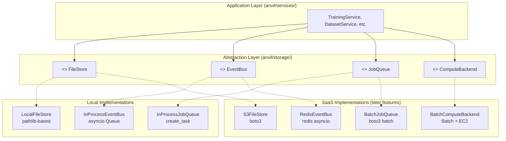
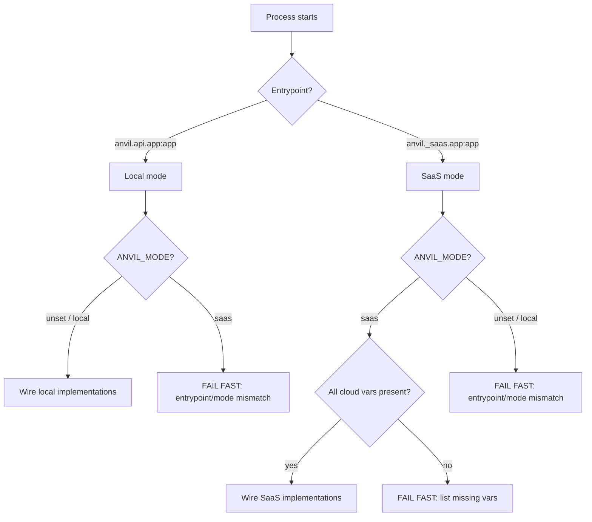

# Data Model: SaaS Abstraction Framework

This defines the core abstraction interfaces and supporting data types that decouple business logic from infrastructure. Local implementations sit behind these interfaces; SaaS implementations (in later features) implement the same contracts.

## Interface Architecture



### Selection Mechanism

```python
# anvil/config.py (extended)
if mode == "saas":
    file_store = S3FileStore(s3_bucket)
    event_bus = RedisEventBus(redis_url)
    job_queue = BatchJobQueue(batch_cpu_queue_arn, batch_gpu_queue_arn)
else:
    file_store = LocalFileStore(Path("data/"))
    event_bus = InProcessEventBus()
    job_queue = InProcessJobQueue()
```

## Interface Definitions

### FileStore

| Method | Signature | Description |
|--------|-----------|-------------|
| `read` | `async (path: str) -> bytes` | Read file contents |
| `write` | `async (path: str, data: bytes) -> None` | Write data to path, creating parent dirs |
| `delete` | `async (path: str) -> None` | Delete file at path |
| `list` | `async (prefix: str) -> list[str]` | List all file paths under prefix |
| `exists` | `async (path: str) -> bool` | Check if file exists |
| `signed_download_url` | `async (path: str, expires_in: int = 3600) -> str` | Time-limited download URL |
| `signed_upload_url` | `async (path: str, expires_in: int = 3600) -> str` | Time-limited upload URL |
| `copy` | `async (source: str, dest: str) -> None` | Copy file within store |

### EventBus

| Method | Signature | Description |
|--------|-----------|-------------|
| `publish` | `async (channel: str, event: dict) -> None` | Publish event to channel |
| `subscribe` | `async (channel: str) -> AsyncIterator[dict]` | Subscribe, yielding events as they arrive |
| `close` | `async () -> None` | Release all resources |

### JobQueue

| Method | Signature | Description |
|--------|-----------|-------------|
| `submit` | `async (job: TrainingJob) -> str` | Submit job, return external job ID |
| `cancel` | `async (job_id: str) -> None` | Cancel pending/running job |
| `status` | `async (job_id: str) -> JobStatus` | Query current job status |
| `list_active` | `async (user_id: int) -> list[TrainingJob]` | List active jobs for a user |

### ComputeBackend

| Method | Signature | Description |
|--------|-----------|-------------|
| `run` | `async (job: TrainingJob, event_bus: EventBus, progress_callback: Callable | None = None) -> dict` | Execute training job, return results |

## Shared Types

### ResourceSpec

```python
from pydantic import BaseModel

class ResourceSpec(BaseModel):
    """Structured compute requirements for a training job."""
    node_count: int = 1           # >1 = multi-node parallel Batch job
    gpus_per_node: int = 0        # 0 = CPU-only
    vcpus: int = 2
    memory_mb: int = 4096
    instance_class: str | None = None  # e.g. "g5.xlarge"; None = let Batch choose
```

| `compute_shape` | ResourceSpec |
|-----------------|--------------|
| `cpu` | `node_count=1, gpus_per_node=0` |
| `gpu` | `node_count=1, gpus_per_node=1` |
| `multi-gpu` | `node_count=1, gpus_per_node=N` |
| `multi-node` | `node_count=M, gpus_per_node=N` (Batch multi-node parallel job) |

### JobStatus

```python
from enum import StrEnum

class JobStatus(StrEnum):
    """Status of a training job in the system."""
    PENDING = "pending"
    RUNNING = "running"
    COMPLETED = "completed"
    FAILED = "failed"
    CANCELLED = "cancelled"
```

### TrainingJob

```python
from dataclasses import dataclass, field
from datetime import datetime

@dataclass
class TrainingJob:
    """A training job specification."""
    job_id: str
    user_id: int
    config: dict
    corpus_id: int | None = None
    dataset_id: int | None = None
    status: JobStatus = JobStatus.PENDING
    created_at: datetime = field(default_factory=datetime.utcnow)
    started_at: datetime | None = None
    completed_at: datetime | None = None
    error: str | None = None
    artifact_path: str | None = None
    mlflow_run_id: str | None = None
    batch_job_id: str | None = None
```

## Interface → Implementation Mapping

| Interface | Local (refactored) | SaaS (future) |
|-----------|-------------------|---------------|
| `FileStore` | `LocalFileStore` | `S3FileStore` |
| `EventBus` | `InProcessEventBus` | `RedisEventBus` |
| `JobQueue` | `InProcessJobQueue` | `BatchJobQueue` |
| `ComputeBackend` | `LocalStdlibBackend`, `LocalTorchBackend` | `BatchComputeBackend` |

## Mode Selection Flow

