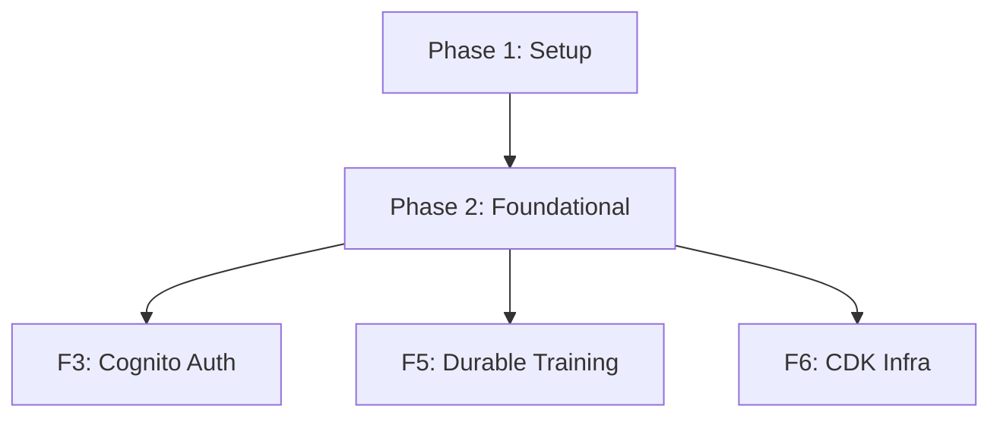

# Tasks: SaaS Abstraction Framework

**Input**: Design documents from `docs/vault/Specs/028 SaaS Abstraction Framework/`
**Prerequisites**: plan.md, spec.md, research.md, data-model.md, contracts/

**Organization**: Tasks grouped by phase. Each phase ends at an **Acceptance Gate** (G1, G2 in spec.md) that MUST pass before dependent phases begin.

## Format: `[ID] [P?] Description`

- **[P]**: Can run in parallel (different files, no dependencies)
- Include exact file paths in descriptions

---

## Phase 1: Setup (Shared Infrastructure)

**Purpose**: Project initialization, package structure, dependency management

- [ ] T001 Create `anvil/_saas/` package with bare docstring `__init__.py` at `anvil/_saas/__init__.py`
- [ ] T002 [P] Create `anvil/_saas/implementations/` sub-package `__init__.py` at `anvil/_saas/implementations/__init__.py`
- [ ] T003 Add `boto3`, `redis`, `aws-jwt-verify` as optional `[aws]` extras in `pyproject.toml`
- [ ] T004 [P] Create `anvil/deploy/` package at `anvil/deploy/__init__.py` with `cloudformation.py` and `command.py` stubs
- [ ] T005 Create `packages/infra/` CDK app structure at `packages/infra/bin/anvil.ts` and `packages/infra/package.json`
- [ ] T006 [P] Create initial `docker-compose.yml` at repo root (PostgreSQL + Redis + MinIO stubs)

**Gate G1** (spec.md): SaaS package never imported in local mode; cloud deps are optional extras; CDK synthesizes.

---

## Phase 2: Foundational Abstractions (Blocking Prerequisites)

**Purpose**: Core abstraction interfaces decoupling business logic from infrastructure. (FR-016, AD-1, AD-4)

**⚠️ CRITICAL**: No user story work begins until this phase completes.

- [ ] T007 Define `FileStore` ABC at `anvil/storage/filestore.py` (from `contracts/filestore.py`)
- [ ] T008 [P] Define `EventBus` ABC at `anvil/storage/event_bus.py` (from `contracts/event_bus.py`)
- [ ] T009 [P] Define `JobQueue` ABC + `TrainingJob` + `JobStatus` + `ResourceSpec` at `anvil/storage/job_queue.py` (Pydantic BaseModel; ResourceSpec per AD-1)
- [ ] T010 [P] Define `ComputeBackend` ABC at `anvil/storage/compute_backend.py`
- [ ] T011 Refactor `LocalFileStore` (`anvil/storage/local.py`) to implement `FileStore`
- [ ] T012 Implement `InProcessEventBus` (wraps `asyncio.Queue`) at `anvil/storage/in_process_event_bus.py`
- [ ] T013 Implement `InProcessJobQueue` (immediate `asyncio.create_task`) at `anvil/storage/in_process_job_queue.py`
- [ ] T014 Add `ANVIL_MODE` env var selector in `anvil/config.py` — guard (entrypoint/mode match, fail fast on mismatch) + SaaS cloud-config validation (fail fast on missing vars, never fall back) per FR-011a/b/c
- [ ] T015 [P] Create bare `__init__.py` files for `anvil/storage/` per Article VI
- [ ] T016 [P] Write contract tests for all 4 interfaces at `tests/contract/test_storage_interfaces.py`

**Gate G2** (spec.md): All interfaces `mypy --strict` clean; contract tests pass; `make test` 100%; mode selector wires correctly.

---

## Dependencies & Execution Order

### Key Dependencies
- **Phase 2 (Foundational) depends on Phase 1 (Setup)** — need package structure before code
- All subsequent SaaS features depend on Phase 2 interfaces being defined

### Parallel Opportunities
- Phase 1: T002, T004, T006 (independent stubs)
- Phase 2: T008–T010, T016 (independent interfaces + contract tests)

## Implementation Strategy

### Core MVP (Phase 1 → 2)
Setup → abstractions → local unchanged. At Phase 2 + Gate G2, the abstraction foundation is proven and the next SaaS feature can begin.

## Summary

| Metric | Count |
|--------|-------|
| **Total Tasks** | 16 |
| **Acceptance Gates** | G1, G2 |
| **Parallelizable [P]** | 6 tasks |