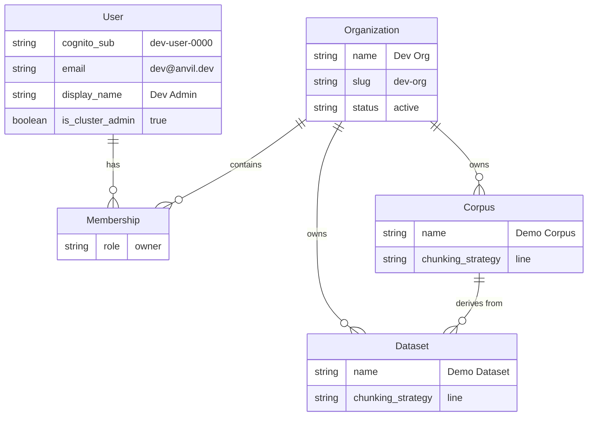

# Data Model: SaaS Dev Stack — Seed Data & Dev Auth

This spec does not define new database models — it reuses the existing model layer (026 SaaS Architecture's Organization, User, Membership, Corpus, Dataset models). This document describes the **seed data** entity relationships and the dev auth identity resolution.

## Dev User Identity

The dev auth middleware resolves all requests to a single dev admin identity:

| Field | Value |
|-------|-------|
| `cognito_sub` | `dev-user-0000` (fixed UUID) |
| `email` | `dev@anvil.dev` |
| `display_name` | `Dev Admin` |
| `is_cluster_admin` | `true` |
| `org_id` | Points to `Dev Org` |

## Seed Data ERD

## Dev Auth Configuration

The dev auth middleware uses these environment variables:

| Variable | Purpose | Default |
|----------|---------|---------|
| `ANVIL_DEV_MODE` | Enable dev auth (set to `true`) | — |
| `ANVIL_DEV_API_KEY` | Static API key for Authorization header | `anvil-dev-key-change-me` |

## Seed Data Lifecycle

1. **First compose start**: `make compose-up` runs `scripts/seed-dev-data.py` which connects to PostgreSQL and creates all seed entities idempotently.
2. **Restart (no -v)**: Seed script runs again but is a no-op (entities already exist).
3. **Reset**: `make compose-reset` (`docker compose down -v`) removes the PostgreSQL volume. Next `compose-up` creates fresh seed data.

## See Also

- [[029 SaaS Dev Stack - spec|spec]] — Feature specification with service contracts
- [[029 SaaS Dev Stack - plan|plan]] — Implementation plan
- [[Specs/016 SaaS Architecture/016 SaaS Architecture - data-model|016 Data Model]] — The full SaaS data model this reuses