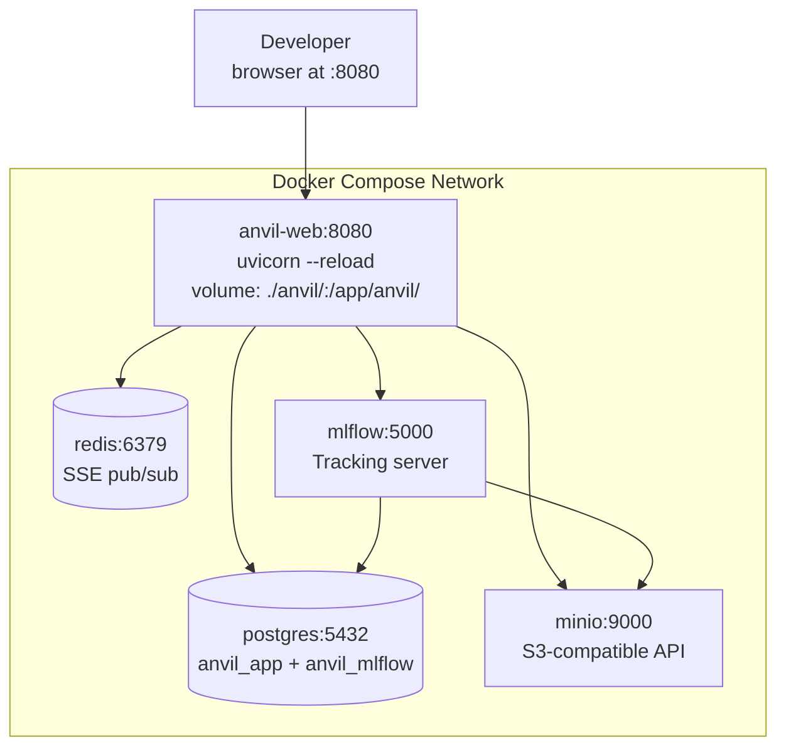
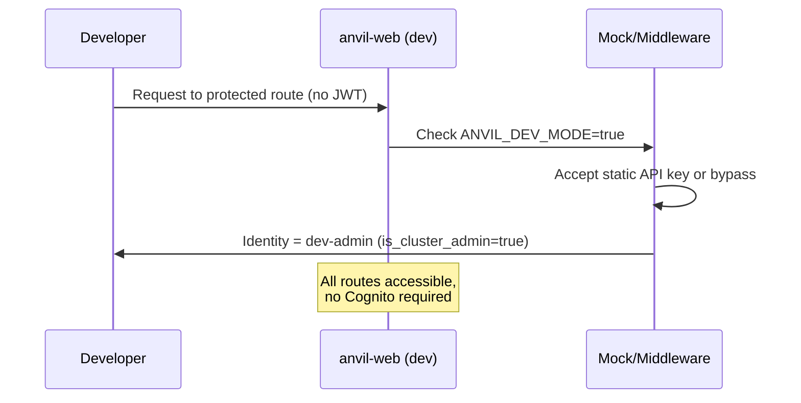

# Implementation Plan: SaaS Dev Stack — Docker Compose Local SaaS Emulation

**Branch**: `029-saas-dev-stack` | **Date**: 2026-06-27
**Spec**: `docs/vault/Specs/029 SaaS Dev Stack/029 SaaS Dev Stack - spec.md`

## Summary

Build a full Docker Compose development stack that emulates the SaaS infrastructure locally. This gives developers a ~2-minute feedback loop for every SaaS feature — PostgreSQL 16, Redis 7, MinIO (S3-compatible), MLflow, and the anvil-web FastAPI service with uvicorn `--reload` for hot code reload. Also includes dev auth bypass (API key or mock OIDC) so SaaS-mode routes are accessible without a real Cognito pool, and a seed-data script that bootstraps the dev environment on first start.

## Shipping Intent

This feature is intentionally shipped **2nd** (after Feature 1: Abstraction Framework) despite being plan phase 10 in the umbrella ordering, because it is the fast iteration loop every subsequent SaaS feature needs.

## Phase 10 — Docker Compose Dev Stack (US5)

Full local SaaS emulation + hot-reload + dev auth + seed data.

### Tasks

| ID | Description |
|----|-------------|
| T089 | Complete `docker-compose.yml` — PostgreSQL 16, Redis 7, MinIO, MLflow, anvil-web (volume-mounted hot-reload) |
| T090 | Create `Dockerfile.dev` — uvicorn `--reload`, dev deps |
| T091 | Create dev auth setup at `anvil/_saas/auth/dev_setup.py` — dev Cognito pool or mock OIDC |
| T092 | Create seed data script at `scripts/seed-dev-data.py` — admin, org, demo data |
| T093 | Add `make compose-up` and `make compose-down` targets |

### Gate

Compose stack healthy; hot-reload works; in-process compute writes to MinIO + PostgreSQL.

## Project Structure Changes

### New Files

```text
docker-compose.yml              # Full dev stack: postgres, redis, minio, mlflow, anvil-web
Dockerfile.dev                  # Dev-stage image: editable install, uvicorn --reload
anvil/_saas/auth/dev_setup.py   # Dev auth: API key bypass or mock OIDC
scripts/seed-dev-data.py        # Bootstrap: admin user, org, demo corpus
```

### Makefile Changes

```makefile
compose-up:    # docker compose build && docker compose up -d --wait
compose-down:  # docker compose down
compose-reset: # docker compose down -v
```

## Docker Compose Architecture



## Dev Auth Architecture



## Complexity Tracking

| Item | Justification |
|------|---------------|
| Dev auth bypass middleware | Required because production Cognito pools cannot be simulated in docker compose. The bypass is gated on `ANVIL_DEV_MODE=true` and is never active in production SaaS mode. |
| MinIO as S3 emulation | MinIO is the standard local S3 emulator. Uses the same `boto3` S3 API so `S3FileStore` works against either MinIO or real S3 without changes. |
| Seed data script | Avoids a "fresh stack has nothing" problem. Developer starts with an admin user, org, and demo corpus immediately usable. |

## Dependency Changes

None. All tools are Docker images pulled at runtime. The `Dockerfile.dev` uses `python:3.11-slim` base with existing dev dependencies (`uvicorn[standard]` for `--reload`).

## See Also

- [[029 SaaS Dev Stack - spec|spec]] — Full feature specification
- [[029 SaaS Dev Stack - tasks|tasks]] — T089–T093 task breakdown
- [[029 SaaS Dev Stack - quickstart|quickstart]] — Developer quickstart
- [[Specs/016 SaaS Architecture/016 SaaS Architecture - plan|016 Plan (superseded)]] — Original umbrella plan