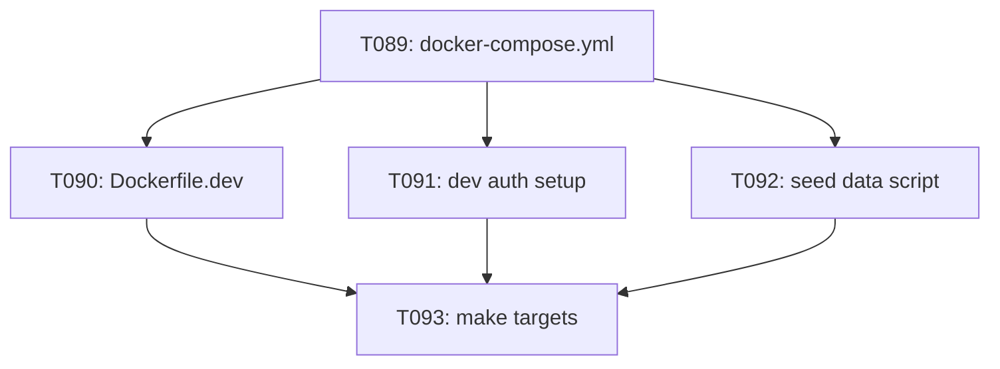

# Tasks: SaaS Dev Stack — Docker Compose Local SaaS Emulation

**Input**: Design documents from `docs/vault/Specs/029 SaaS Dev Stack/`
**Prerequisites**: plan.md, spec.md
**Organization**: Tasks from umbrella Phase 10 (T089–T093). All tasks can run in parallel.

## Phase 10: SaaS Developer Local Stack (US5) — Tasks T089–T093

**Goal**: `docker compose up` runs PostgreSQL, Redis, MinIO, MLflow, anvil-web with hot-reload.

**Independent Test**: `docker compose up` → all healthy → register user (dev pool/mock) → upload → train → SSE metrics.

---

- [ ] T089 [US5] Complete `docker-compose.yml` — PostgreSQL 16, Redis 7, MinIO, MLflow, anvil-web (volume-mounted hot-reload)

  - Service definitions for all 5 containers
  - Named volumes for postgres (`pgdata`), minio (`minio-data`), mlflow (`mlflow-data`)
  - Health checks on all services
  - `depends_on` ordering: postgres + redis → mlflow, all → anvil-web
  - Environment variables for each service (matching quickstart.md defaults)
  - Network: `anvil-dev` bridge network

  **Files**: `docker-compose.yml` (repo root)

---

- [ ] T090 [P] [US5] Create `Dockerfile.dev` — uvicorn `--reload`, dev deps

  - Extends `python:3.11-slim`
  - Installs project in editable mode: `pip install -e .[dev]`
  - `uvicorn[standard]` for `--reload` support (excludes uvloop which breaks reload)
  - Entrypoint: `uvicorn anvil._saas.app:app --reload --host 0.0.0.0 --port 8080`
  - Volume-mounted source directory at `/app/`

  **Files**: `Dockerfile.dev` (repo root)

---

- [ ] T091 [P] [US5] Create dev auth setup at `anvil/_saas/auth/dev_setup.py` — dev Cognito pool or mock OIDC

  - Module MUST be gated on `ANVIL_DEV_MODE=true` env var
  - When active, accepts a static API key from `ANVIL_DEV_API_KEY` env var (or default dev key)
  - When active, resolves the caller identity to a known dev user with `is_cluster_admin=true`
  - Replaces the Cognito JWT validation middleware in the dev compose stack
  - MUST NOT activate in production SaaS mode (`ANVIL_DEV_MODE` absent or false)
  - Returns a FastAPI `Depends` that provides `get_current_user` with dev identity
  - Dev user details: email = `dev@anvil.dev`, display_name = `Dev Admin`, is_cluster_admin = true

  **Files**: `anvil/_saas/auth/dev_setup.py`

---

- [ ] T092 [P] [US5] Create seed data script at `scripts/seed-dev-data.py` — admin, org, demo data

  - Python script (NOT shell — follow the "Python over bash" convention from AGENTS.md)
  - Connects to PostgreSQL via `DATABASE_URL` env var
  - Creates:
    1. Admin user: email `dev@anvil.dev`, cognito_sub placeholder UUID, `is_cluster_admin=true`
    2. Default Organization: name `Dev Org`, slug `dev-org`
    3. Membership linking admin to org as `owner`
    4. Demo corpus from an embedded text sample (e.g., a small excerpt about what anvil is)
    5. Demo dataset with default chunking strategy
  - Idempotent: safe to run multiple times (checks existence before creating)
  - Prints success message with dev login credentials

  **Files**: `scripts/seed-dev-data.py`

---

- [ ] T093 [P] [US5] Add `make compose-up` and `make compose-down` targets

  - `make compose-up`:
    - Builds Dockerfile.dev via `docker compose build`
    - Starts stack: `docker compose up -d --wait`
    - Runs seed data script after stack is healthy (or as an init container)
    - Prints "anvil SaaS dev stack ready at http://localhost:8080"
  - `make compose-down`:
    - Stops stack: `docker compose down` (preserves volumes)
    - Prints status
  - `make compose-reset` (bonus):
    - Stops + removes volumes: `docker compose down -v`
    - Prints "Dev stack reset to clean state"

  **Files**: `Makefile` (modifications to existing)

---

## Dependencies & Execution Order

T089 is the structural foundation (defines the service topology). T090, T091, and T092 are independent file creations that feed into T093 (the Makefile integration).

## Implementation Strategy

1. Write `docker-compose.yml` first — defines the full topology. Use health checks and `depends_on` to enforce startup order.
2. Write `Dockerfile.dev` — the anvil-web service image. Keep it minimal (`python:3.11-slim` + editable pip install).
3. Write `anvil/_saas/auth/dev_setup.py` — simple module, gated on env var.
4. Write `scripts/seed-dev-data.py` — stand-alone Python script.
5. Add Makefile targets last — ties everything together.

## Summary

| Metric | Count |
|--------|-------|
| **Total Tasks** | 5 (T089–T093) |
| **Parallelizable [P]** | 4 tasks |
| **New files** | 4 (docker-compose.yml, Dockerfile.dev, dev_setup.py, seed-dev-data.py) |
| **Modified files** | 1 (Makefile) |
| **External images** | postgres:16-alpine, redis:7-alpine, minio/minio, python:3.11-slim |