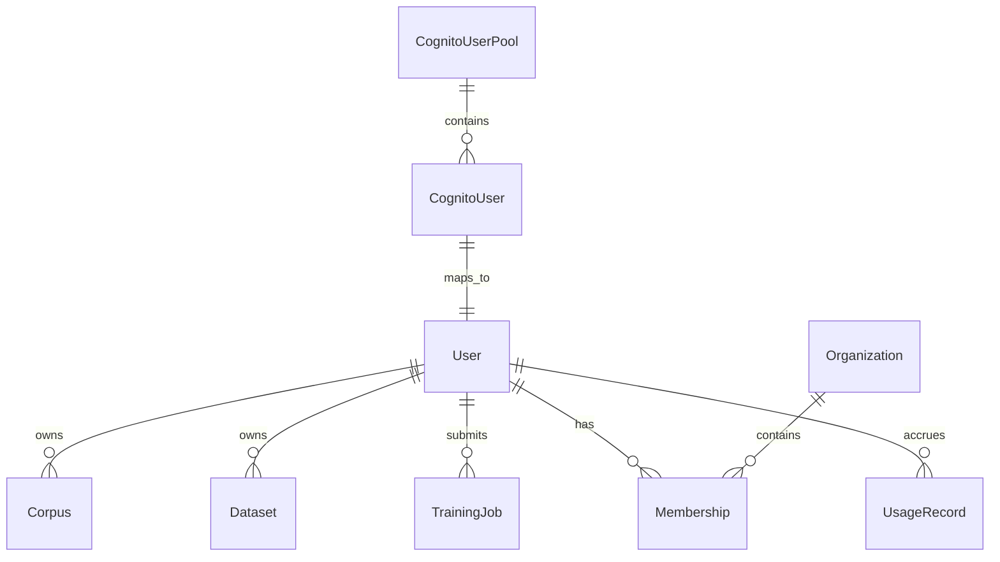
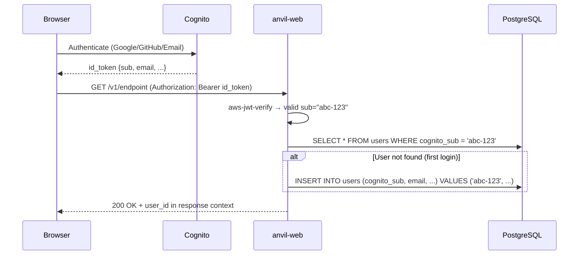

# Data Model: SaaS Authentication — User Table & Cognito Mapping

This data model covers the auth-specific entities for the anvil SaaS mode. The core entity is the `users` table, which maps Cognito `sub` (UUID) to a local integer `user_id` for efficient FK relationships. The mapping is created on first login via a Cognito post-authentication Lambda trigger or a first-request middleware handler (FR-023).

## User Table

### Entity: User

The `users` table is the bridge between Cognito-managed auth identities and the application's relational data model. It is created on first login of each user.

| Field | Type | Constraints | Description |
|-------|------|-------------|-------------|
| `id` | `int` | PK, auto-increment | Local integer ID for FK relationships |
| `cognito_sub` | `str` | UNIQUE, NOT NULL | Cognito `sub` UUID — canonical auth identity |
| `email` | `str` | NOT NULL | Verified email from Cognito |
| `display_name` | `str` | nullable | From Cognito profile (optional) |
| `org_id` | `int` | FK → Organization, nullable before RBAC | The user's organization (populated by deploy bootstrap or later assignment) |
| `is_cluster_admin` | `bool` | DEFAULT false | System-level admin flag (read-wide, write-narrow per FR-037a/b) |
| `created_at` | `datetime` | NOT NULL, DEFAULT now() | First login timestamp |
| `last_login` | `datetime` | nullable | Most recent login |
| `status` | `enum(active,disabled)` | NOT NULL, DEFAULT 'active' | Account state |

**Uniqueness**: `cognito_sub` is unique — single source of truth for identity. No two users may share the same Cognito `sub`.

**Lifecycle**:
1. User authenticates via Cognito Hosted UI (Google/GitHub/Email)
2. Cognito returns tokens including `id_token` with `sub` claim (UUID)
3. On first authenticated request, either:
   a. Cognito Post-Authentication Lambda fires, upserts `users` row (preferred for production)
   b. `get_current_user` middleware detects unknown `cognito_sub`, creates row (acceptable for v1)
4. Subsequent requests find the existing row by `cognito_sub`

**Local mode**: In local mode (`ANVIL_MODE` unset or `local`), no JWT middleware is wired and the `users` table is not consulted. The local-mode user implicitly has all access.

## Auth Token Store (CLI)

The CLI caches Cognito JWT pairs locally for device-grant auth sessions (FR-021).

| File | Permissions | Contents |
|------|-------------|----------|
| `~/.anvil/credentials/` | `0700` | Directory per cluster |
| `~/.anvil/credentials/{cluster_name}` | `0600` | JSON: `{access_token, id_token, refresh_token, expires_at}` |

Not a database table — purely a local CLI credential cache.

## Entity Relationship



## Migration

```sql
-- v1: Core User table (SaaS auth)
CREATE TABLE users (
    id              INTEGER PRIMARY KEY AUTOINCREMENT,  -- SQLite
    -- SERIAL PRIMARY KEY for PostgreSQL
    cognito_sub     VARCHAR(255) NOT NULL UNIQUE,
    email           VARCHAR(255) NOT NULL,
    display_name    VARCHAR(255),
    org_id          INTEGER REFERENCES organizations(id),
    is_cluster_admin BOOLEAN NOT NULL DEFAULT FALSE,
    created_at      TIMESTAMP NOT NULL DEFAULT NOW(),
    last_login      TIMESTAMP,
    status          VARCHAR(20) NOT NULL DEFAULT 'active'
        CHECK (status IN ('active', 'disabled'))
);

CREATE INDEX idx_users_cognito_sub ON users(cognito_sub);
CREATE INDEX idx_users_org_id ON users(org_id);

-- Note: org_id FK depends on the Organization table (Spec 031 RBAC).
-- In the auth-only migration, org_id is nullable to allow auth to ship before RBAC.
```

## Token Flow



## References

- [[030 SaaS Authentication]]
- [[030 SaaS Authentication - spec|spec]] (FR-003, FR-023)
- [[Specs/031 SaaS Multi-Tenancy RBAC/031 SaaS Multi-Tenancy RBAC|031 SaaS RBAC]] (Organization, Membership, Team models)
- [[Reference/SaaSArchitectureDecisions|SaaS Architecture Decisions]] (AD-2, AD-3)