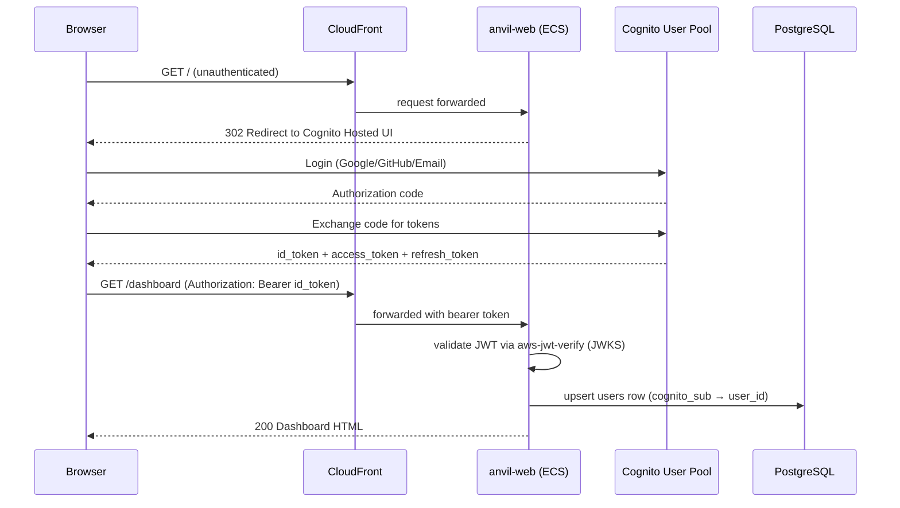

# Implementation Plan: SaaS Authentication — App-Managed Cognito OIDC/JWT

**Branch**: `030-saas-authentication` | **Date**: 2026-06-27 | **Spec**: docs/vault/Specs/030 SaaS Authentication/spec.md
**Input**: Feature specification from `docs/vault/Specs/030 SaaS Authentication/spec.md`

## Summary

Implement app-managed OIDC/JWT authentication via Amazon Cognito User Pools. The FastAPI backend validates Cognito bearer tokens directly using `aws-jwt-verify` (AD-2) — no ALB `authenticate-cognito`, no custom auth code, no password hashing, no JWT issuance. Native email/password users work out of the box via Cognito Hosted UI; social login (Google, GitHub) is optional and configured post-deploy via BYO OAuth credentials (AD-3). SSE endpoints authenticate via short-lived signed query-param tokens (FR-020). CLI authentication uses the OAuth2 device authorization grant flow (RFC 8628, FR-021). A Cognito User Pool is deployed via the CDK stack as a first-class resource (FR-022). A local `users` table maps Cognito `sub` (UUID) to a local integer `user_id`, created on first login via a Cognito post-authentication Lambda trigger or a first-request middleware handler (FR-023).

## Auth Architecture



## Dependency Changes

### New optional extras (pyproject.toml)

```toml
[project.optional-dependencies]
aws = [
    "boto3>=1.35",
    "redis>=5.0",
    "aws-jwt-verify>=4.0",
]
```

`aws-jwt-verify` is the only auth-specific addition. It is an optional `[aws]` extra — never installed in the base package.

## Source Code Structure (Auth-specific)

```
anvil/_saas/auth/
├── __init__.py                # Package docstring
├── verify_jwt.py              # Cognito JWT validation via aws-jwt-verify
├── deps.py                    # get_current_user FastAPI dependency
├── sse_token.py               # SSE short-lived signed-token auth (FR-020)
├── device_grant.py            # CLI OAuth2 device grant scaffolding (FR-021)
└── rbac.py                    # RBAC resolution middleware

packages/infra/lib/cognito-auth.ts  # Cognito User Pool CDK construct
packages/infra/lambdas/post_auth.py # Cognito post-auth Lambda (user mapping)
```

## Phasing

### Phase 3 — Cognito Auth (US1)

Tasks T017–T023. App-managed OIDC/JWT via `aws-jwt-verify` (AD-2). Native email/password; social BYO post-deploy (AD-3). SSE signed-token auth. CLI device grant. **Gate G3.**

## Complexity Tracking

| Item | Justification |
|------|---------------|
| `aws-jwt-verify` new dependency | Optional `[aws]` extra only; never installed or imported in local mode. LMRG enforces import isolation. |
| SSE signed-token auth | Necessary because `EventSource` cannot set custom headers. Short-TTL, single-use, scoped to specific job stream. |
| CLI device grant (RFC 8628) | Standard OAuth2 pattern; no custom token endpoints. Cognito natively supports device authorization grant. |
| Post-auth Lambda for user mapping | Needed to populate local `users` table on first login. Only triggers for SaaS mode. |

## Constitution Check

### Article I — Zero-Dependency Core
- `anvil/core/` is untouched. ✓

### Article II — TDD Mandatory
- Tests must be written before or alongside auth code.
- Contract tests for JWT validation, SSE token generation/verification, and user creation.

### Article V — Async-First
- All auth middleware, dependencies, and handlers follow async patterns. ✓

### Article VI — `__init__.py` Ownership Policy
- `anvil/_saas/auth/` is a new authoritative level — bare docstring-only `__init__.py`. ✓

### Article IX — Pit of Success
- Local mode: `anvil serve` works with zero auth config, no JWT middleware wired. ✓
- SaaS mode: `anvil deploy init` creates the Cognito pool; auth works out of the box. ✓

### Gate Evaluation

**Gate G3**: Cognito pool exists; invalid token → 401; valid token → 200; first login creates `users` row; SSE token auth works.

## See Also

- [[030 SaaS Authentication - spec|spec]]
- [[030 SaaS Authentication - tasks|tasks]]
- [[Reference/SaaSArchitectureDecisions|SaaS Architecture Decisions]] (AD-2, AD-3)