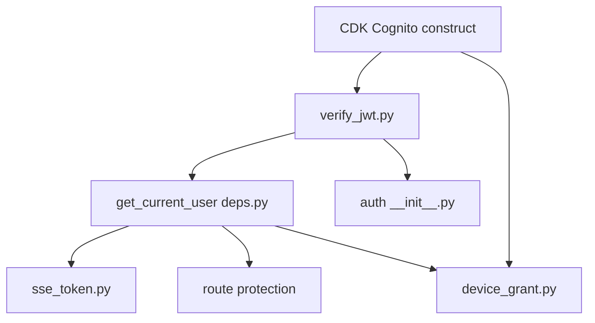

# Tasks: SaaS Authentication — App-Managed Cognito OIDC/JWT

**Input**: Design documents from `docs/vault/Specs/030 SaaS Authentication/`
**Prerequisites**: Spec 028 (package structure), Spec 029 (abstractions)

**Organization**: Tasks lifted from the umbrella spec Phase 3 (US1). Each phase ends at an **Acceptance Gate G3**.

## Format: `[ID] [P?] [Story] Description`

- **[P]**: Can run in parallel (different files, no dependencies)
- **[Story]**: Which user story this task belongs to (US1)
- Include exact file paths in descriptions

---

## Phase 3: User Story 1 — Sign Up / Log In via Cognito (Priority: P1)

**Goal**: App-managed OIDC/JWT auth via Cognito. Native email/password out of the box; social BYO post-deploy. No custom auth code. (AD-2, AD-3, FR-018–FR-021a)

**Independent Test**: API canary creates a native Cognito test user, obtains JWT, calls a protected endpoint (200), calls without token (401). **Gate G3.**

- [ ] T017 [P] [US1] Create Cognito CDK construct at `packages/infra/lib/cognito-auth.ts` — User Pool, native email/password, app client, Hosted UI domain (NO ALB authenticate-cognito)
- [ ] T018 [US1] Implement Cognito JWT validation middleware at `anvil/_saas/auth/verify_jwt.py` using `aws-jwt-verify` (validates bearer token against JWKS)
- [ ] T019 [US1] Implement `get_current_user` FastAPI dependency at `anvil/_saas/auth/deps.py` — reads bearer JWT, returns local `User`, auto-creates on first login
- [ ] T020 [US1] Implement SSE auth via short-lived signed query-param token at `anvil/_saas/auth/sse_token.py` (FR-020)
- [ ] T021 [US1] Mark routes public vs protected — only auth/health public, all others require `get_current_user`
- [ ] T022 [US1] Implement CLI OAuth2 device authorization grant flow scaffolding at `anvil/_saas/auth/device_grant.py` (FR-021)
- [ ] T023 [US1] Create `anvil/_saas/auth/__init__.py` with bare docstring

## Acceptance Gate G3

Cognito pool exists; invalid token → 401; valid token → 200; first login creates `users` row; SSE token auth works.

## Dependencies & Execution Order

### Key Dependencies
- T017 (CDK construct) must complete before any Cognito-dependent auth code can be tested against a real pool
- T018 (JWT validation) is the foundation — T019 (get_current_user) depends on it
- T019 is consumed by T020 (SSE token), T021 (route protection), and T022 (device grant)
- T023 (bare `__init__.py`) is an independent packaging task

### Parallel Opportunities
- T017 can run in parallel with T023 (no code dependencies)
- T020, T021, T022 can be developed in parallel once T018+T019 are stable

## Implementation Strategy

Build bottom-up: CDK construct first (real Cognito pool for testing) → JWT validation middleware → get_current_user dependency → SSE token → route protection → device grant scaffolding.