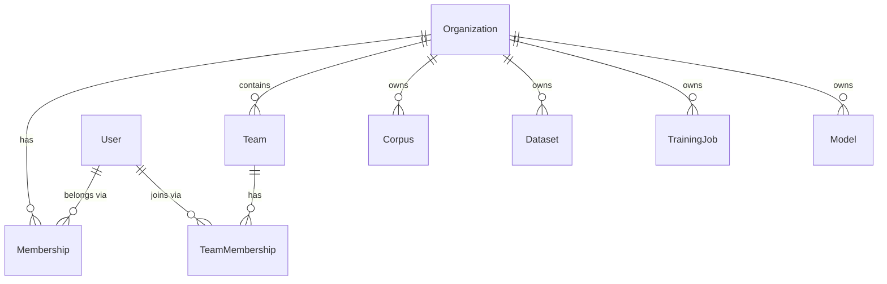

# Data Model: SaaS Multi-Tenancy & RBAC

This model implements full RBAC multi-tenancy (AD-8). Organization is the top-level tenant boundary. Team groups users within an org. Role governs permissions. The `is_cluster_admin` flag on `users` provides system-level read-wide, write-narrow access. All SaaS resources are owned by `org_id` and scoped by team/role.

## RBAC Hierarchy

## Entities

### Organization

| Field | Type | Description |
|-------|------|-------------|
| `id` | `int` (PK) | Organization ID — top-level tenant boundary |
| `name` | `str` (unique) | Organization name |
| `slug` | `str` (unique) | URL-safe identifier |
| `created_at` | `datetime` | Creation timestamp |
| `status` | `enum(active,suspended)` | Org state |

**Isolation**: The top-level boundary. No query may cross `org_id` for non-cluster-admin users.

---

### User

| Field | Type | Description |
|-------|------|-------------|
| `id` | `int` (PK) | Local integer ID for FK relationships |
| `cognito_sub` | `str` (unique, nullable) | Cognito `sub` UUID — canonical auth identity. Nullable in local mode (no auth). |
| `email` | `str` | Verified email from Cognito |
| `display_name` | `str` | From Cognito profile (optional) |
| `org_id` | `int` (FK → Organization, nullable) | The user's organization. Nullable for local mode. |
| `is_cluster_admin` | `bool` | Default `false`. Grants read-wide cross-org visibility + cluster-operation action matrix (FR-037a/b). |
| `created_at` | `datetime` | First login timestamp |
| `last_login` | `datetime` | Most recent login |
| `status` | `enum(active,disabled)` | Account state |

**Uniqueness**: `cognito_sub` is unique — single source of truth for identity. Nullable for local mode where no Cognito exists.

**Lifecycle**: Created on first authenticated request (middleware) OR via Cognito Post-Authentication Lambda. In local mode, a single default user exists with `is_cluster_admin=true` and `org_id=None`.

---

### Membership

The User ↔ Organization association carrying org-level role.

| Field | Type | Description |
|-------|------|-------------|
| `id` | `int` (PK) | |
| `user_id` | `int` (FK → User) | |
| `org_id` | `int` (FK → Organization) | |
| `role` | `enum(owner,admin,member,viewer)` | Org-level role |
| `created_at` | `datetime` | |

**Constraint**: Unique `(user_id, org_id)`.

---

### Team

| Field | Type | Description |
|-------|------|-------------|
| `id` | `int` (PK) | |
| `org_id` | `int` (FK → Organization) | |
| `name` | `str` | Team name (unique within org) |
| `created_at` | `datetime` | |

---

### TeamMembership

| Field | Type | Description |
|-------|------|-------------|
| `id` | `int` (PK) | |
| `user_id` | `int` (FK → User) | |
| `team_id` | `int` (FK → Team) | |
| `role_override` | `enum(owner,admin,member,viewer)` (nullable) | Optional per-team role override |

**Constraint**: Unique `(user_id, team_id)`. A user may belong to multiple teams.

---

### Role Permissions

Roles are static (no policy engine). Effective role = team `role_override` if present, else org `Membership.role`.

| Action | owner | admin | member | viewer |
|--------|:-----:|:-----:|:------:|:------:|
| Read org resources | ✅ | ✅ | ✅ | ✅ |
| Create corpus/dataset/job | ✅ | ✅ | ✅ | ❌ |
| Delete own resources | ✅ | ✅ | ✅ | ❌ |
| Delete any org resource | ✅ | ✅ | ❌ | ❌ |
| Invite/remove members | ✅ | ✅ | ❌ | ❌ |
| Create/delete teams | ✅ | ✅ | ❌ | ❌ |
| Assign roles | ✅ | ❌ | ❌ | ❌ |
| Delete organization | ✅ | ❌ | ❌ | ❌ |
| View usage/billing | ✅ | ✅ | ❌ | ❌ |

### Cluster-Admin Action Matrix (FR-037b)

Actions permitted by `is_cluster_admin=true` without org membership:

| Action | Cluster admin |
|--------|:-------------:|
| READ/LIST any resource in any org | ✅ |
| Suspend/reactivate organization | ✅ |
| Create/remove cluster admins | ✅ |
| View health, logs, cross-org usage/billing | ✅ |
| Cancel any running training job | ✅ |
| Delete tenant data in foreign org | ❌ (requires org role) |

---

### Corpus

*Existing entity. New ownership columns — all nullable.*

| Field | Type | Notes |
|-------|------|-------|
| Existing fields | ... | Name, root_path, chunking_strategy, etc. |
| `org_id` | `int` (FK → Organization, nullable) | **NEW** — isolation boundary |
| `team_id` | `int` (FK → Team, nullable) | **NEW** — optional team scoping |
| `created_by` | `int` (FK → User, nullable) | **NEW** — who created it |

**Queries**: All queries accept `org_id: int | None`. When `org_id` is None (local mode), no org filter is applied. When `is_cluster_admin` is true (SaaS), org filter is also bypassed for read/list.

---

### Dataset

*Same ownership columns as Corpus: `org_id` (nullable), `team_id` (nullable), `created_by` (nullable).*

---

### TrainingJob

Owned by `org_id`/`team_id`/`created_by`. All ownership columns nullable for local-mode compatibility.

---

### Model

Owned by `org_id`/`team_id`/`created_by`. In SaaS: MLflow artifacts in `anvil-ml-*/{exp_id}/{run_id}/`. In local: `data/models/{run_id}/`. Ownership columns nullable.

---

## Local-Mode Semantics (FR-038b)

- `org_id` columns are **nullable** on all resource tables
- Local mode passes `org_id=None` to all repository queries → **no `WHERE org_id` filter** → all rows returned
- The `is_cluster_admin` flag is not consulted in local mode — the local user is an implicit full-access admin
- No RBAC middleware is wired in the local app factory
- Nullable ownership ensures the existing local DB (with zero org/team data) migrates cleanly and demo bootstrap works unchanged

## References

- [[031 SaaS Multi-Tenancy RBAC]]
- [[031 SaaS Multi-Tenancy RBAC - spec|spec]]
- [[Reference/SaaSArchitectureDecisions|SaaS Architecture Decisions]] (AD-8, AD-14)
