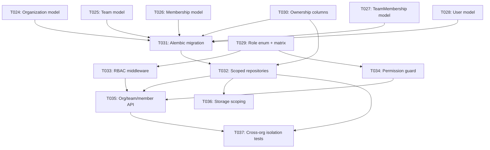

# Tasks: SaaS Multi-Tenancy & RBAC

**Input**: Spec `031 SaaS Multi-Tenancy RBAC - spec.md`, plan.md, data-model.md, contracts/
**Prerequisites**: Phase 3 (Auth) — Cognito JWT identity resolution

**Organization**: Tasks follow the Phase 4 grouping from the parent umbrella. **Gate G4** must pass.

## Format: `[ID] [P?] [US3] Description`

- **[P]**: Can run in parallel (different files, no dependencies)
- **[US3]**: All tasks belong to User Story 3 (RBAC Multi-Tenancy)
- Include exact file paths in descriptions

---

## Phase 4: User Story 3 — RBAC Multi-Tenancy & Data Isolation (Priority: P1)

**Goal**: Full RBAC (Organization → Team → Role → User). Resources owned by `org_id` (+ team_id + created_by). Cross-org access impossible. (AD-8, FR-034–FR-038)

**Independent Test**: Two orgs; Org B sees nothing from Org A and gets 403 on direct access; viewer cannot delete, admin can. **Gate G4.**

- [ ] T024 [P] [US3] Create `Organization` model at `anvil/db/models/organization.py`
- [ ] T025 [P] [US3] Create `Team` model at `anvil/db/models/team.py`
- [ ] T026 [P] [US3] Create `Membership` model at `anvil/db/models/membership.py`
- [ ] T027 [P] [US3] Create `TeamMembership` model at `anvil/db/models/team_membership.py`
- [ ] T028 [P] [US3] Create `User` model with `is_cluster_admin` flag and `org_id` at `anvil/db/models/user.py`
- [ ] T029 [US3] Define `Role` enum + permission matrix at `anvil/services/auth/role.py`
- [ ] T030 [US3] Add `org_id`/`team_id`/`created_by` ownership columns to `Corpus` and `Dataset` models — nullable for existing local DB compatibility
- [ ] T031 [US3] Add Alembic migration for RBAC tables + ownership columns at `anvil/_resources/migrations/`
- [ ] T032 [US3] Update `CorpusRepository` + `DatasetRepository` — scoped by `org_id` (accepts `int | None`; None = no filter) + team/role visibility
- [ ] T033 [US3] Implement RBAC resolution middleware at `anvil/_saas/auth/rbac.py` — resolves org/team/effective-role from JWT
- [ ] T034 [US3] Implement service-layer permission guard at `anvil/services/auth/guard.py`
- [ ] T035 [US3] Implement org/team/member management API at `anvil/api/v1/organizations.py`
- [ ] T036 [US3] Update storage paths — SaaS uses `{org_id}/...` prefix via `S3FileStore`
- [ ] T037 [US3] Add cross-org RBAC negative tests at `tests/integration/test_rbac_isolation.py` + local-mode "returns all rows" test at `tests/integration/test_local_mode_no_scoping.py`

**Gate G4** (spec.md): RBAC tables migrated; cross-org access denied; role permissions enforced; storage scoped by org_id; local mode returns all rows unfiltered.

## Dependencies & Execution Order

### Parallel Opportunities
- T024–T028 (independent RBAC models)
- T030 (ownership columns on existing models)

## Summary

| Metric | Count |
|--------|-------|
| **Total Tasks** | 14 (T024–T037) |
| **Acceptance Gates** | G4 |
| **Parallelizable [P]** | 5 tasks |
| **New ORM models** | 5 (Organization, Team, Membership, TeamMembership, User) |
| **Modified models** | 2 (Corpus, Dataset — ownership columns) |

## References

- [[031 SaaS Multi-Tenancy RBAC - spec|spec]]
- [[031 SaaS Multi-Tenancy RBAC - plan|plan]]
- [[031 SaaS Multi-Tenancy RBAC - data-model|data-model]]
- [[Reference/SaaSArchitectureDecisions|SaaS Architecture Decisions]] (AD-8, AD-14)
