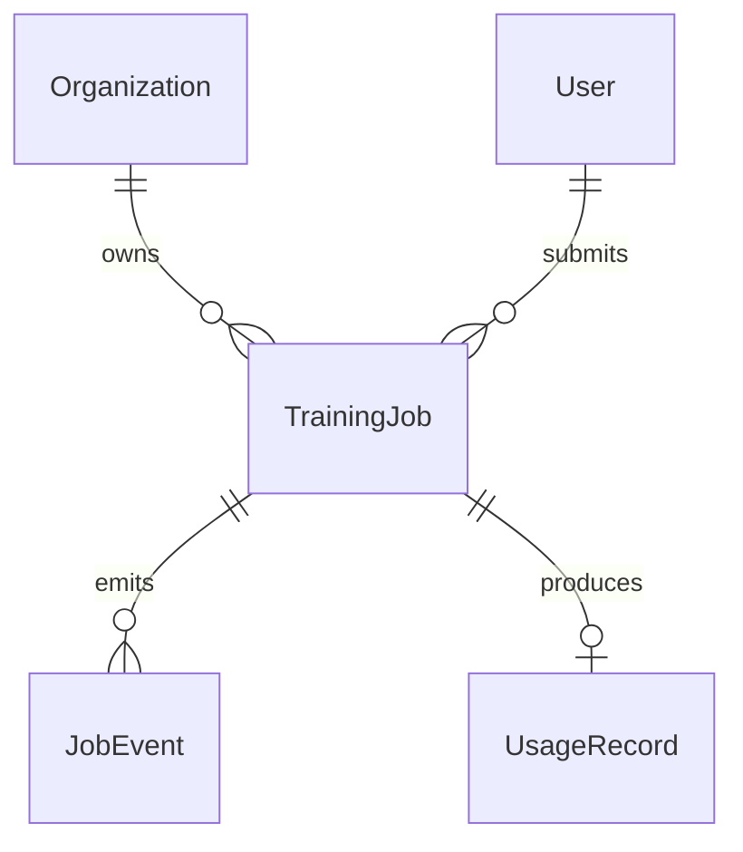
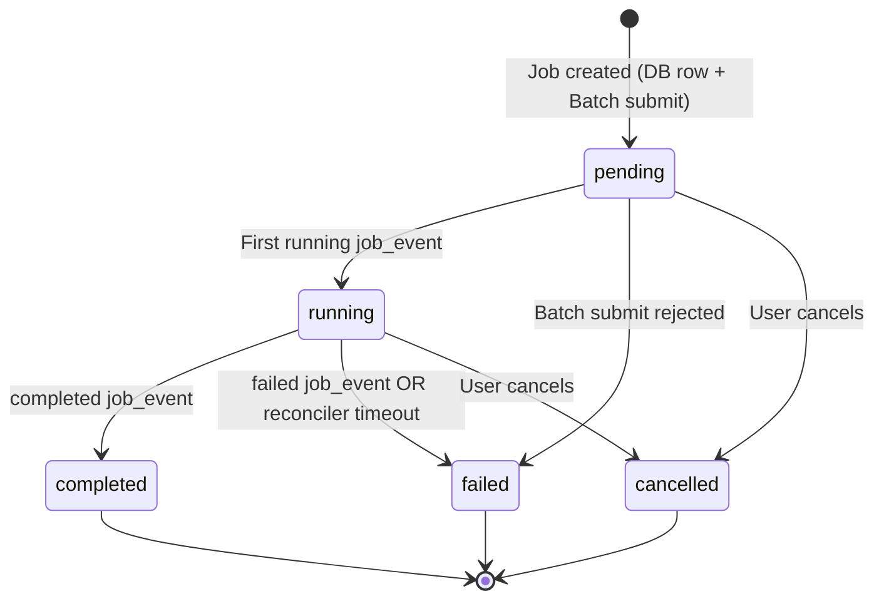
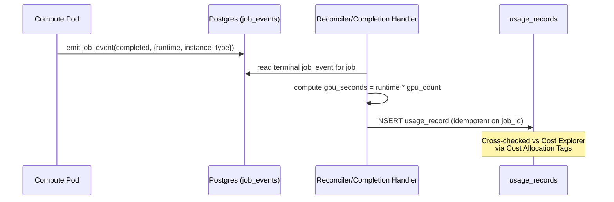

# Data Model: SaaS Training Pipeline

This model implements Postgres-source-of-truth job state (AD-4), append-only job events with metric throttling (FR-043a), and usage metering for billback (AD-9). All resources are owned by `org_id` per the RBAC models from [[Specs/031 SaaS Multi-Tenancy RBAC/031 SaaS Multi-Tenancy RBAC - data-model|031 data-model]].

## Entity Relationship

---

## Entities

### TrainingJob

| Field | Type | Description |
|-------|------|-------------|
| `id` | `int` (PK) | Internal job ID |
| `org_id` | `int` (FK → Organization) | Owner org |
| `team_id` | `int` (FK → Team, nullable) | Optional team |
| `created_by` | `int` (FK → User) | Who submitted |
| `corpus_id` | `int` (FK → Corpus, nullable) | Trained on this corpus |
| `dataset_id` | `int` (FK → Dataset, nullable) | Or this dataset |
| `config` | `JSON` | Hyperparameters |
| `resource_spec` | `JSON` | `{node_count, gpus_per_node, vcpus, memory, instance_class}` (AD-1) |
| `compute_shape` | `enum(cpu,gpu,multi-gpu,multi-node)` | Compute shape |
| `status` | `enum(pending,running,completed,failed,cancelled)` | Lifecycle state (derived from latest job_event) |
| `batch_job_id` | `str` (nullable) | AWS Batch job ID |
| `mlflow_run_id` | `str` (nullable) | MLflow run ID |
| `artifact_path` | `str` (nullable) | Deterministic S3 key prefix |
| `batch_log_stream` | `str` (nullable) | CloudWatch Logs stream name for compute pod |
| `final_loss` | `float` (nullable) | Final training loss |
| `error_message` | `str` (nullable) | Error details if failed |
| `started_at` | `datetime` (nullable) | When compute began |
| `completed_at` | `datetime` (nullable) | When compute finished |
| `created_at` | `datetime` | Record creation |

**Status is derived** from the latest `JobEvent`, never written directly by multiple writers (AD-4).

**State machine**:

---

### JobEvent (NEW — append-only)

The authoritative record of job lifecycle. Compute pods emit idempotent events; the application derives `TrainingJob.status` from them.

| Field | Type | Description |
|-------|------|-------------|
| `id` | `int` (PK) | |
| `job_id` | `int` (FK → TrainingJob) | |
| `sequence` | `int` | Monotonic per-job sequence number |
| `event_type` | `enum(submitted,started,metric,checkpoint,completed,failed,cancelled)` | |
| `payload` | `JSON` | Event-specific data (e.g. `{step, loss}` for metric) |
| `ts` | `datetime` | Event timestamp |

**Constraint**: Unique `(job_id, sequence)` — idempotent. Duplicate events (pod retry) are no-ops.

**Index strategy** (FR-043a):
- Unique index on `(job_id, sequence)` — correctness + idempotency
- Secondary index on `(org_id, job_id, ts)` — org-scoped listing
- Partial index on `event_type NOT IN (completed, failed, cancelled)` — reconciler scan

**Metric granularity control** (FR-043a): per-step metric events throttled to a configurable cadence (default: emit at most every N steps or every T seconds, whichever coarser). Lifecycle events always written.

**Retention/archival** (FR-043a): rows for terminal jobs older than configurable window (default 30 days) archived to `job_events_archive` table (or cold storage).

**Usage**: SSE `Last-Event-ID` replay reads from here (AD-5). Reconciler reads latest event per job (AD-4). `UsageRecord` derived from terminal event (AD-9).

---

### UsageRecord (NEW — billback)

| Field | Type | Description |
|-------|------|-------------|
| `id` | `int` (PK) | |
| `org_id` | `int` (FK → Organization) | Billback target |
| `team_id` | `int` (FK → Team, nullable) | |
| `user_id` | `int` (FK → User) | Who ran the job |
| `job_id` | `int` (FK → TrainingJob) | |
| `instance_type` | `str` | Resolved EC2 instance type |
| `node_count` | `int` | Number of nodes |
| `gpu_count` | `int` | Total GPUs across nodes |
| `gpu_seconds` | `float` | GPU-seconds consumed |
| `instance_hours` | `float` | Instance-hours consumed |
| `started_at` | `datetime` | |
| `ended_at` | `datetime` | |
| `created_at` | `datetime` | |

**Derivation**: Written once on terminal `completed`/`failed` job_event, computed from job runtime × resolved instance type (AD-9). Cross-checked against AWS Cost Explorer via Cost Allocation Tags.

**Constraint**: One record per `job_id` (idempotent — derived from the terminal event).

---

### ResourceSpec (compute requirements)

The `JobQueue.submit()` / `ComputeBackend.run()` abstraction carries a structured spec so multi-node is first-class (FR-040):

| Field | Type | Default | Description |
|-------|------|---------|-------------|
| `node_count` | `int` | `1` | >1 = multi-node parallel Batch job |
| `gpus_per_node` | `int` | `0` | 0 = CPU-only |
| `vcpus` | `int` | `2` | |
| `memory_mb` | `int` | `4096` | |
| `instance_class` | `str` or None | `None` | e.g. `"g5.xlarge"`; None = let Batch choose |

| `compute_shape` | ResourceSpec |
|-----------------|--------------|
| `cpu` | `node_count=1, gpus_per_node=0` |
| `gpu` | `node_count=1, gpus_per_node=1` |
| `multi-gpu` | `node_count=1, gpus_per_node=N` |
| `multi-node` | `node_count=M, gpus_per_node=N` (Batch multi-node parallel job) |

---

## Implementation Mapping

| Interface | Local (unchanged) | SaaS (new in this spec) |
|-----------|-------------------|------------------------|
| `FileStore` | `LocalFileStore` | `S3FileStore` |
| `EventBus` | `InProcessEventBus` | `RedisEventBus` |
| `JobQueue` | `InProcessJobQueue` | `BatchJobQueue` |
| `ComputeBackend` | `LocalStdlibBackend`, `LocalTorchBackend` | `BatchComputeBackend` |

---

## Usage Metering Flow (AD-9)

