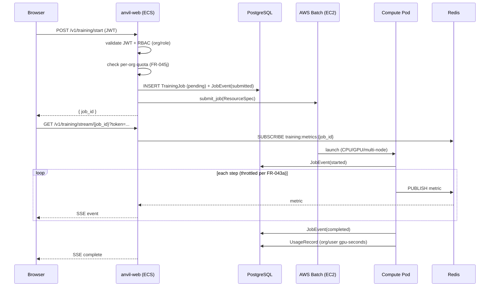

# Implementation Plan: SaaS Training Pipeline — Durable Job State & Live Metrics

**Branch**: `032-saas-training-pipeline` | **Date**: 2026-06-27
**Spec**: `docs/vault/Specs/032 SaaS Training Pipeline/spec.md`
**Input**: Feature specification, [[Reference/SaaSArchitectureDecisions|SaaS Architecture Decisions]] (AD-1, AD-4, AD-5, AD-9, AD-11)

## Summary

Implement the core SaaS training pipeline: durable job state (PostgreSQL `job_events` append-only log + reconciler), AWS Batch dispatch (CPU/GPU/multi-node), live SSE metrics (Redis pub/sub → browser), usage metering, and all SaaS implementations behind the abstraction interfaces. This is the largest single feature of the SaaS body of work (~25 FRs, 21 tasks). Does not cleanly split because Batch + Redis + `job_events` + SSE + reconciler form one tightly coupled correctness unit.

## Architecture

### Three-Plane Model (AD-11)

```mermaid
graph TB
    subgraph "Control Plane (anvil-web)"
        CP1[POST /v1/training/start<br/>validate JWT + RBAC + quota]
        CP2[GET /v1/training/stream/{id}<br/>SSE handler]
        CP3[POST /v1/training/{id}/cancel]
        CP4[Reconciler<br/>stateless, 60s period]
    end

    subgraph "Scheduler (AWS Batch)"
        SCH1[CPU queue<br/>fair-share by org_id]
        SCH2[GPU queue<br/>fair-share by org_id]
        SCH3[Multi-node queue<br/>gang-scheduled]
    end

    subgraph "Executor (Compute Pod)"
        EX1[Read config from S3]
        EX2[Run anvil/core engine]
        EX3[Emit JobEvents to Postgres]
        EX4[Publish metrics to Redis]
        EX5[Write checkpoints to S3]
        EX6[Log runs to MLflow]
    end

    CP1 --> SCH1
    CP1 --> SCH2
    CP1 --> SCH3
    SCH1 --> EX1
    SCH2 --> EX1
    SCH3 --> EX1
    EX3 --> CP4
    CP4 --> CP1
```

### Data Flow



## Implementation Phases

Since this is a single tightly-coupled feature, the work is organized as concurrent workstreams rather than sequential phases.

### Workstream A — Data Models & Repositories

- `TrainingJob` ORM model (`anvil/db/models/training_job.py`)
- `JobEvent` ORM model (`anvil/db/models/job_event.py`) — append-only, idempotent `(job_id, sequence)`
- `UsageRecord` ORM model (`anvil/db/models/usage_record.py`)
- `TrainingJobRepository` + `JobEventRepository` at `anvil/db/repositories/`
- Derive `TrainingJob.status` from latest `JobEvent` at service layer (never multi-writer)

### Workstream B — SaaS Implementations

- `S3FileStore` at `anvil/_saas/implementations/s3_file_store.py`
- `RedisEventBus` at `anvil/_saas/implementations/redis_event_bus.py`
- `BatchJobQueue` at `anvil/_saas/implementations/batch_job_queue.py`
- `BatchComputeBackend` at `anvil/_saas/implementations/batch_compute_backend.py`
- Wire SaaS implementations in `anvil/_saas/app.py`

### Workstream C — Compute Worker

- `anvil/_saas/compute_worker.py` — reads config from S3, runs `anvil/core`, emits idempotent `JobEvent`s, periodic S3 checkpoints, rank-0-only event/artifact emission, publishes to Redis, logs to MLflow

### Workstream D — Reconciler

- `anvil/_saas/reconciler.py` — compares Batch/DB/MLflow/S3, repairs stuck jobs, dependency degradation backoff, heartbeat

### Workstream E — API Endpoints & SSE

- `POST /v1/training/start` — create job, enforce quota, write config to S3, submit to BatchJobQueue
- `GET /v1/training/stream/{job_id}` — SSE with `Last-Event-ID` replay + server-signaled degradation
- `GET /v1/training/{job_id}/events?since=` — metrics polling fallback
- `GET /v1/training/{job_id}` — status endpoint
- `POST /v1/training/{job_id}/cancel` — cancel endpoint
- Usage query API (FR-048)
- Client-side SSE→polling auto-degrade in `anvil/api/static/js/sse.js`

### Workstream F — Usage Metering

- Write `UsageRecord` from terminal `JobEvent`
- Tag Batch jobs with Cost Allocation Tags (`org_id`, `team_id`, `user_id`)
- Usage query endpoint

### Workstream G — Testing

- Chaos test: kill compute pod mid-job, assert reconciler marks failed
- Resilience test: drop SSE connection mid-job, assert `Last-Event-ID` replay + polling fallback recover with no gap

## Complexity Tracking

| Item | Justification |
|------|---------------|
| `job_events` high-volume table | Metric-event throttling (sampled cadence), composite indexes, 30-day archival to `job_events_archive`, tuned autovacuum. Prevents unbounded growth from per-step events. |
| Reconciler operating parameters | 60s period, 300s grace, stateless, idempotent, dependency-degradation backoff — all required for correctness when coordinating 4 read surfaces (Batch/DB/S3/MLflow). |
| Three-plane orchestration | Avoids planes mutating each other directly; enforced by AD-4 (Postgres as durable record, not direct mutation). |
| SSE with dual fallback | `Last-Event-ID` + polling + server-signaled degradation — three mechanisms ensuring streaming correctness under all failure modes. |
| Rank-0-only emission | Multi-node jobs prevent duplicate/conflicting events from worker nodes. |

## Dependency Changes

No new `pyproject.toml` dependencies. All SaaS implementations use `boto3` and `redis` which are already declared in the `[aws]` optional extra by Spec 028.