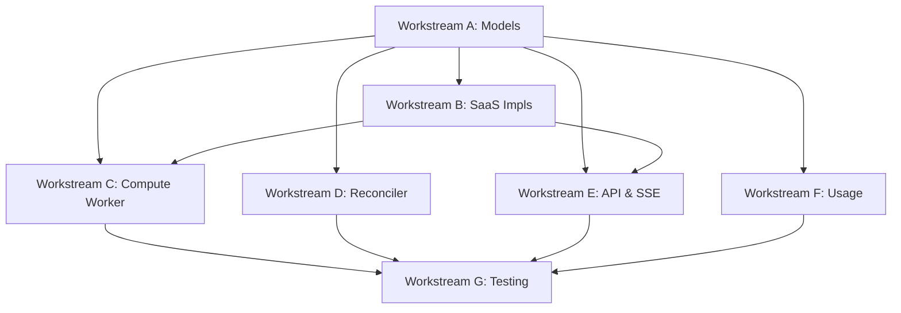

# Tasks: SaaS Training Pipeline — Durable Job State & Live Metrics

**Input**: Design documents from `docs/vault/Specs/032 SaaS Training Pipeline/`
**Prerequisites**: [[Specs/028 SaaS Abstraction Framework/028 SaaS Abstraction Framework|028 SaaS Abstraction Framework]], [[Specs/029 SaaS Dev Stack/029 SaaS Dev Stack|029 SaaS Dev Stack]], [[Specs/030 SaaS Authentication/030 SaaS Authentication|030 SaaS Authentication]], [[Specs/031 SaaS Multi-Tenancy RBAC/031 SaaS Multi-Tenancy RBAC|031 SaaS Multi-Tenancy]]

**Parent tasks**: T038–T058 from `016 SaaS Architecture - tasks.md`.

## Format: `[ID] [P?] [Story] Description`

- **[P]**: Can run in parallel (different files, no dependencies)
- **[Story]**: US2 — this is the only user story for this spec
- Include exact file paths in descriptions

---

## Workstream A — Data Models & Repositories

- [ ] T038 [P] [US2] Create `TrainingJob` model (org/team/created_by, resource_spec, compute_shape, batch_log_stream) at `anvil/db/models/training_job.py`
- [ ] T039 [P] [US2] Create `JobEvent` append-only model at `anvil/db/models/job_event.py` (idempotent `(job_id, sequence)`, metric throttling per FR-043a)
- [ ] T040 [P] [US2] Create `UsageRecord` model at `anvil/db/models/usage_record.py`
- [ ] T041 [US2] Create `TrainingJobRepository` + `JobEventRepository` at `anvil/db/repositories/`
- [ ] T048 [US2] Derive `TrainingJob.status` from latest `JobEvent` (never multi-writer) at service layer

## Workstream B — SaaS Implementations

- [ ] T042 [US2] Implement `S3FileStore` at `anvil/_saas/implementations/s3_file_store.py` (deterministic keys, signed URLs)
- [ ] T043 [US2] Implement `RedisEventBus` at `anvil/_saas/implementations/redis_event_bus.py` (delivery-only pub/sub)
- [ ] T044 [US2] Implement `BatchJobQueue` at `anvil/_saas/implementations/batch_job_queue.py` — pre-registered per-shape job defs (cpu/gpu/multigpu/multinode, FR-045i), CPU + GPU queues with fair-share scheduling keyed on `org_id` (FR-045k), retry attempts for infra failures only (FR-045l), per-job timeout (FR-045o), multi-node parallel job defs from `ResourceSpec` (FR-040/041)
- [ ] T045 [US2] Implement `BatchComputeBackend` at `anvil/_saas/implementations/batch_compute_backend.py` — three-plane control-plane submit/observe, never polls pod (FR-045g)
- [ ] T056 [US2] Wire SaaS implementations in `anvil/_saas/app.py` — `ANVIL_MODE=saas` selector; configure SaaS async SQLAlchemy engine with IAM auth token-provider callback (RDS Proxy, regenerates ≤15-min tokens per connection — FR-045c/e); inject Redis token via `secrets:` (FR-045d)

## Workstream C — Compute Worker

- [ ] T046 [US2] Write compute worker entrypoint at `anvil/_saas/compute_worker.py` — reads config from S3 (FR-045h), runs `anvil/core`, emits idempotent `JobEvent`s, periodic S3 checkpoints with resume-on-retry (FR-045m), multi-node rank-0-only event/artifact emission (FR-045p), publishes to Redis, logs MLflow

## Workstream D — Reconciler

- [ ] T047 [US2] Implement job state reconciler at `anvil/_saas/reconciler.py` — compares Batch/DB/MLflow/S3, repairs stuck jobs (AD-4, FR-044), with operating parameters (60s period, 300s grace, stateless, idempotent race check, dependency-degradation backoff, heartbeat per FR-044a)

## Workstream E — API Endpoints & SSE

- [ ] T050 [US2] Create SSE endpoint with `Last-Event-ID` replay from `job_events` at `anvil/api/v1/training.py` (AD-5, FR-045), including server-signaled degradation (FR-045r)
- [ ] T051 [US2] Create training start endpoint `POST /v1/training/start` — enforce per-org quota (max concurrent jobs, max GPUs) before submit (FR-045j); write config to S3 `jobs/{id}/config.json` (FR-045h); create job, submit to BatchJobQueue with ResourceSpec
- [ ] T052 [US2] Create training status + cancellation + usage query endpoints — `GET /v1/training/{id}`, `POST /v1/training/{id}/cancel` (terminate Batch job + idempotent `cancelled` event, FR-045n), usage query (FR-048)
- [ ] T053 [US2] Create metrics polling endpoint `GET /v1/training/{job_id}/events?since={seq}` reading `job_events` backlog (FR-045a)
- [ ] T054 [US2] Implement client SSE→polling auto-degrade in `anvil/api/static/js/sse.js` — fall back to polling on EventSource failure (FR-045b); handle `event: degraded` server signal (FR-045r)
- [ ] T055 [US2] Implement file upload/download via signed S3 URLs (`POST /v1/corpora/upload`, model download)

## Workstream F — Usage Metering

- [ ] T049 [US2] Implement usage metering — write `UsageRecord` from terminal `JobEvent` (AD-9, FR-046); tag Batch jobs with Cost Allocation Tags (FR-047)

## Workstream G — Testing

- [ ] T057 [US2] Chaos test: kill compute pod mid-job, assert reconciler marks failed at `tests/integration/test_reconciler.py`
- [ ] T058 [US2] Resilience test: drop SSE connection mid-job, assert Last-Event-ID replay + polling fallback recover with no gap at `tests/integration/test_sse_resilience.py`

---

## Dependencies & Execution Order

### Key Dependencies
- **Workstream A** must precede all others (models are needed everywhere)
- **Workstream B** must precede Workstream C and E (SaaS impls needed for wiring)
- All workstreams converge into Workstream G (testing)

### Parallel Opportunities
- T038, T039, T040 (independent models)
- T042, T043, T044, T045 (independent SaaS implementations)
- T050, T051, T052, T053 (independent endpoint logic, but all depend on models)

## Gate G5

**Gate G5** (full SaaS): CPU/GPU/multi-node jobs complete; per-org quota enforced + fair-share prevents starvation; Spot interruption auto-retries + resumes from checkpoint; user-error fails fast (no retry); cancellation terminates + records `cancelled`; timeout → `failed`; SSE delivers metrics; SSE reconnect replays without gap; polling fallback reaches terminal state; server-signaled degradation switches to polling; pod-crash reconciled; artifact in S3+MLflow; `usage_record` with correct attribution.

Plus the **Local-Mode Regression Gate**: local in-process flow unchanged, `make test` 100%, `make typecheck` clean, import isolation passes.