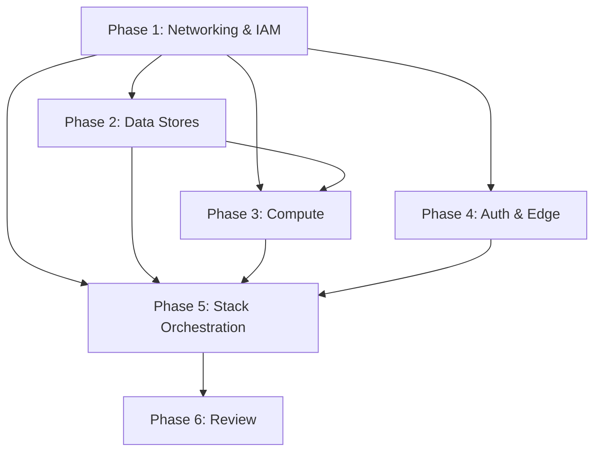

# Tasks: SaaS CDK Infrastructure

**Input**: Design documents from `docs/vault/Specs/033 SaaS CDK Infrastructure/`
**Prerequisites**: plan.md, spec.md, research.md, data-model.md, contracts/
**Parent tasks**: T059–T071 from `016 SaaS Architecture - tasks.md` Phase 6 (US6)

**Organization**: Tasks grouped by CDK construct dependency order. Each group ends with a verification checkpoint.

## Format: `[ID] [P] [Construct] Description`

- **[P]**: Can run in parallel (different files, no dependencies)
- **[Construct]**: Which CDK construct this task belongs to
- Include exact file paths in descriptions

---

## Phase 1: Networking & Core Infrastructure

**Purpose**: VPC foundation, IAM security boundaries, and secrets infrastructure. Everything depends on the VPC. IAM roles and Secrets Manager entries are prerequisites for all resource-creating constructs.

- [ ] T059 [P] [Networking] CDK networking construct at `packages/infra/lib/networking.ts` — VPC (2 AZ), public/private subnets, NAT Gateways (one per AZ), Internet Gateway, VPC Gateway Endpoints (S3), VPC Interface Endpoints (ECR API + DKR, Secrets Manager, CloudWatch Logs), ALB (internet-facing, SG)
- [ ] T066 [P] [IAM] CDK IAM construct at `packages/infra/lib/iam.ts` — define all roles (AnvilExecutionRole, AnvilTaskRole, MlflowTaskRole, BatchExecutionRole, BatchJobRole, ReconcilerExecutionRole, ReconcilerTaskRole, PostAuthLambdaRole) with least-privilege policies per FR-045f. No static DB password in any task definition (FR-045c).
- [ ] T066b [P] [Secrets] CDK Secrets Manager entries — `anvil/{env}/db-master-password` (RDS Proxy only), `anvil/{env}/redis-auth-token`, `anvil/{env}/sse-signing-secret` (JSON `{current, previous}` set), `anvil/{env}/oauth-google`, `anvil/{env}/oauth-github` (post-deploy stubs)

**Verification**: VPC shows in AWS console with 2 AZs, correct subnets, NAT per AZ, all VPC endpoints. IAM roles have no `*` wildcard on sensitive actions. Secrets exist in Secrets Manager.

---

## Phase 2: Data Stores

**Purpose**: Durable storage and caching — RDS, ElastiCache, S3. These depend on VPC (Phase 1) for networking.

- [ ] T060 [P] [Database] CDK database construct at `packages/infra/lib/database.ts` — RDS PostgreSQL (both `anvil_app` and `anvil_mlflow` schemas on same instance), DB subnet group, parameter group with tuned settings, RDS Proxy with IAM database authentication (`rds-db:connect`), automated backups (≥7 day retention, configurable per instance_size), PITR enabled (FR-058). The real DB master password lives only in Secrets Manager, read by RDS Proxy, never injected into any container.
- [ ] T061 [P] [Redis] CDK Redis construct at `packages/infra/lib/redis.ts` — ElastiCache Redis replication group (Multi-AZ with automatic failover per FR-045q), subnet group, security group allowing inbound 6379 from ECS + Batch SGs, in-transit encryption, Redis auth token from Secrets Manager (`secrets:` injection)
- [ ] T062 [P] [S3] CDK S3 construct at `packages/infra/lib/s3-storage.ts` — `anvil-data-{env}` bucket (corpora, datasets, models, checkpoints) and `anvil-ml-{env}` bucket (MLflow artifacts). Both versioned by default (FR-059). Lifecycle policy expires noncurrent versions after configurable window (default 30d). Bucket policies enforce least-privilege access: separate read/write resource ARNs, org-scoped prefix convention for data bucket.

**Verification**: RDS instance `available`, RDS Proxy `available` with IAM auth, `BackupRetentionPeriod` ≥ 7. Redis replication group with `AutomaticFailover: Enabled`, ≥ 2 nodes across AZs. S3 buckets versioned, lifecycle policy present.

---

## Phase 3: Compute — Batch & ECS

**Purpose**: Compute substrate — AWS Batch for training jobs, ECS Fargate for web and MLflow services. These depend on Phase 1 (VPC, IAM) and Phase 2 (RDS, Redis, S3).

- [ ] T063 [US6] CDK Batch-on-EC2 construct at `packages/infra/lib/batch-environment.ts` — CPU compute environment (Spot, managed EC2), GPU compute environment (g4dn/g5 instances, Spot), CPU + GPU job queues with fair-share scheduling policy keyed on `org_id` (FR-045k), pre-registered per-shape job definitions (`anvil-cpu`, `anvil-gpu`, `anvil-multigpu`, `anvil-multinode`) parameterized by `ResourceSpec` (FR-045i), multi-node parallel job definitions (AD-1), placement group support for multi-node locality, EFA networking support for p4/p5 instances, retry policy (infra failures only — FR-045l), per-job timeout (FR-045o), Cost Allocation Tags (`org_id`, `team_id`, `user_id` — FR-047)
- [ ] T064 [US6] CDK ECS services construct at `packages/infra/lib/ecs-services.ts` — ECS cluster (Fargate), anvil-web task definition + service (2+ replicas, auto-scaling on CPU/memory, ALB target group, health check), MLflow task definition + service (1 replica, Cloud Map service registration as `mlflow.svc.local:5000`), Cloud Map private DNS namespace, security groups (web SG → ALB SG, web SG → RDS Proxy SG:5432, web SG → Redis SG:6379, mlflow SG → web SG:5000)
- [ ] T065 [US6] CDK migration task construct at `packages/infra/lib/migration-task.ts` — ECS Fargate run-task definition for Alembic migrations, CFN Custom Resource or ECS `RunTask` invocation gated before web service reaches steady state (AD-6), runs `alembic upgrade head` on both `anvil_app` and `anvil_mlflow` schemas, exits non-zero on failure (blocks web rollout)

**Verification**: Batch compute environments `VALID` + `ENABLED`. ECS services `runningCount == desiredCount`. Migration task completes before web service healthy.

---

## Phase 4: Auth & Edge

**Purpose**: Authentication and content delivery — Cognito, CloudFront, WAF, and the post-auth Lambda trigger. Cognito is standalone; CloudFront/WAF depend on ALB (Phase 1).

- [ ] T069 [US6] CDK post-auth Lambda at `packages/infra/lambdas/post_auth.py` — inline Python code (not CDK asset — referenced as inline or uploaded to versioned S3 path per AD-7), triggered on Cognito `PostAuthentication`, upserts `users` table mapping Cognito `sub` → local integer `user_id`
- [ ] T067b [US6] CDK Cognito auth construct at `packages/infra/lib/cognito-auth.ts` — Cognito User Pool (native email/password sign-in, no ALB `authenticate-cognito`, FR-022), app client (OAuth2 flows, callback URLs), User Pool domain (e.g., `auth.{domain}`), identity provider stubs for Google/GitHub (configured post-deploy via `deploy config set-idp`, AD-3), post-auth Lambda trigger binding
- [ ] T068 [US6] CDK CloudFront + WAF construct — CloudFront distribution with ALB origin (SSE-compatible timeouts: origin keepalive 60s, origin read 60s, viewer timeout 60s; 30s heartbeat), WAF ACL (rate limiting, SQL injection protection, XSS protection), CloudFront origin access control, optional Route53 A record alias

**Verification**: Cognito User Pool exists with email sign-in, app client configured. CloudFront distribution `Deployed`, ALB as origin, SSE timeouts tuned. WAF ACL `Active`, associated with distribution. Post-auth trigger configured on User Pool.

---

## Phase 5: Stack Orchestration & CI Integration

**Purpose**: Wire all constructs into the main stack, wire the CDK entrypoint for asset-free synth, and integrate CI for pre-synthesized template bundling.

- [ ] T070 [US6] Main CDK stack at `packages/infra/lib/anvil-stack.ts` — imports and configures all constructs, injects environment parameters (envName, domainName, instanceSize, imageDigest, etc.), configures stack outputs (CloudFront URL, ALB DNS name, Cognito pool ID, app client ID, bucket names, cluster name, RDS Proxy endpoint, Redis primary endpoint)
- [ ] T071 [US6] CDK app entrypoint at `packages/infra/bin/anvil.ts` — env-specific parameter loading (`ANVIL_ENV` or `--context env=...`), asset-free synth configuration (no CDK asset references, digest-pinned image URIs per AD-7), tags applied to all resources (Environment, Project=anvil)
- [ ] T072 [CI] CI synth step — after CDK code merged, CI runs: `cd packages/infra && npm ci && npx cdk synth --output cdk.out/` → copies `cdk.out/*.template.json` to `anvil/deploy/templates/` → records image digests → packages into wheel via `pyproject.toml` `package-data`

**Verification**: `cdk synth` produces asset-free templates (no CDKToolkit references, no asset bucket references). Templates parseable by `boto3` CloudFormation `create_stack`/`update_stack`. CI-embedded template matches `cdk synth` output exactly.

---

## Phase 6: Snapshot Review & Testing

**Purpose**: Validate the complete stack against all gate criteria.

- [ ] T073 [Review] Verify CDK gates G6-INFRA.1 through G6-INFRA.14 against a dev deployment
- [ ] T074 [Review] IAM policy audit: confirm least-privilege split (no `*` wildcards on sensitive actions, execution vs task role separation, no role broader than its function requires)
- [ ] T075 [Review] Asset-free template audit: verify no CDK asset references, no CDKToolkit dependencies, digest-pinned image references only
- [ ] T076 [Docs] Document CloudFormation stack outputs contract in `contracts/stack-outputs-schema.md`
- [ ] T077 [Docs] Document CFN parameter schema in `contracts/cfn-parameter-schema.md`

---

## Dependencies & Execution Order

### Parallel Opportunities

- Phase 1: T059 (Networking), T066 (IAM), T066b (Secrets) — parallel independent constructs
- Phase 2: T060 (RDS), T061 (Redis), T062 (S3) — parallel independent constructs
- Phase 4: T069 (Lambda), T067b (Cognito) — parallel independent constructs
- Phase 6: T074 (IAM audit), T075 (asset-free audit), T076 (outputs docs), T077 (params docs) — parallel

## Summary

| Metric | Count |
|--------|-------|
| **Total Tasks** | 19 (T059–T077) |
| **CDK Constructs** | 9 (networking, database, redis, s3, batch, ecs, migration, cognito, iam) + stack + entrypoint |
| **Construct Parallel Groups** | 3 |
| **Verification Gates** | 14 (G6-INFRA.1 through G6-INFRA.14) |
| **Risk to local mode** | NONE — TypeScript in `packages/infra/`, entirely outside Python package |

## References

- [[033 SaaS CDK Infrastructure]]
- [[033 SaaS CDK Infrastructure - spec|spec]]
- [[033 SaaS CDK Infrastructure - plan|plan]]
- [[016 SaaS Architecture - tasks]]

### Task Provenance

The 13 core tasks (T059–T071) are lifted from `016 SaaS Architecture - tasks.md` Phase 6 (US6). The mapping:

| 016 Task ID | 033 Task | Notes |
|-------------|----------|-------|
| T059 | T059 | Networking construct — identical scope |
| T060 | T060 | Database construct — identical scope |
| T061 | T061 | Redis construct — pulled into its own file for clarity |
| T062 | T062 | S3 construct — identical scope |
| T063 | T063 | Batch-on-EC2 construct — identical scope |
| T064 | T064 | ECS services construct — identical scope |
| T065 | T065 | Migration task — identical scope |
| T066 | T066 | IAM roles — expanded with explicit role matrix |
| — | T066b | Secrets Manager entries — new sub-task (part of T066 scope) |
| T067 | T067b | Cognito construct — expanded in own file (016 had it in-line) |
| T068 | T068 | CloudFront + WAF construct — identical scope |
| T069 | T069 | Post-auth Lambda — identical scope |
| T070 | T070 | Main stack orchestration — identical scope |
| T071 | T071 | CDK app entrypoint — identical scope |
