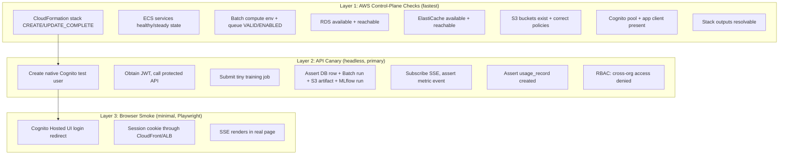

# Feature Specification: SaaS One-Command Deploy + Agentic Verify

**Feature Branch**: `034-saas-one-command-deploy`
**Created**: 2026-06-27
**Status**: Draft
**Parent spec**: [[Specs/016 SaaS Architecture/016 SaaS Architecture - spec|016 SaaS Architecture (superseded umbrella)]]

## User Stories

### User Story 7 — User Deploys anvil SaaS into Their AWS Account with One Command (Priority: P1)

A user runs a single command to deploy the full anvil SaaS stack into their own AWS account. The command checks prerequisites, prompts for configuration, deploys all infrastructure, creates an admin account, and outputs the live URL. No manual AWS console steps, no Node.js, no CDK knowledge required.

**Why this priority**: Self-hosted deployability is the distribution model for the SaaS product. If deployment requires reading a 20-step manual, adoption will be near zero.

**Independent Test**: Run `anvil deploy init` in an AWS account with no prior anvil infrastructure. Verify the command completes without error and the user can access the web UI at the output URL. Then run `anvil deploy destroy` and verify all resources are cleaned up.

**Acceptance Scenarios**:

1. **Given** a user with AWS credentials configured, **When** they run `anvil deploy init`, **Then** they are interactively prompted for domain, region, and admin email, and the stack is deployed with no further manual steps.
2. **Given** the stack is deployed, **When** the command completes, **Then** it outputs the CloudFront URL and saves admin credentials to `~/.anvil/`.
3. **Given** a deployed stack, **When** the user visits the CloudFront URL, **Then** they see the login page and can log in with the admin credentials.
4. **Given** the stack is deployed, **When** the user runs `anvil deploy status`, **Then** they see the CloudFront URL, stack status, and current version.

---

### User Story 8 — User Destroys, Upgrades, or Reconfigures the SaaS Deploy (Priority: P2)

A user needs to tear down their anvil deployment, upgrade to a new version, or change configuration. Each operation is a single command with clear prompts and safe defaults.

**Why this priority**: Day-2 operations (destroy, upgrade, reconfigure) are what separate a hobby project from production software. Without clean destroy, users won't trust deploying at all.

**Independent Test**: Deploy a stack, reconfigure it (change domain), upgrade it (simulate a version bump), then destroy it. Verify each step completes and the final destroy removes all AWS resources including S3 buckets.

**Acceptance Scenarios**:

1. **Given** a deployed stack, **When** the user runs `anvil deploy destroy`, **Then** they are prompted for confirmation (skippable with `--force`), the S3 data buckets are emptied, and the CloudFormation stack is deleted.
2. **Given** a deployed stack and a newer version available, **When** the user runs `anvil deploy update`, **Then** the ECS services are updated with the new container image and any infrastructure changes are applied.
3. **Given** a deployed stack, **When** the user runs `anvil deploy config set --key domain --value new.example.com`, **Then** the CloudFormation stack is updated with the new domain.
4. **Given** a destroyed stack, **When** the user verifies in the AWS console, **Then** all stack resources (including S3 buckets containing data) are removed.

---

### Agentic Validation (cross-cutting)

The system MUST provide an automated verification loop (`anvil deploy verify`) that validates every component works programmatically via AWS APIs, with a minimal Playwright browser layer only where unavoidable (OAuth redirect flows).

**Why this priority**: Without automated validation, a deploy that "succeeds" (CFN `CREATE_COMPLETE`) may have silently broken internal components. The 3-layer pyramid catches infra, API, and browser issues before end users encounter them.

## Edge Cases

- What happens if `anvil deploy` is run without AWS credentials? The command checks for credentials first and exits with a clear error message instructing the user to configure them.
- What happens if the CloudFormation stack creation fails partway through? The command outputs the specific failure, rolls back nothing (CloudFormation auto-rolls back), and the user can fix the issue and re-run.
- What happens if the deploy config file at `~/.anvil/` is corrupted? The deploy command validates the config on load and falls back to interactive prompting if validation fails.
- What happens if `anvil deploy destroy` is run on a stack that has already been destroyed? The command detects the stack does not exist and exits cleanly with a message (FR-031).
- What happens if AWS service limits are hit (e.g., VPC limit)? The CloudFormation stack will roll back with a clear error indicating which limit was hit. The user can request a limit increase and re-run.
- What happens when a user runs `anvil deploy` without the `[aws]` extra installed? The command fails with a clear actionable error directing them to install `anvil[aws]` — never an `ImportError`.
- What happens in a CI environment where no prompt is available? The `--non-interactive` flag causes the command to fail fast on any missing required value, naming the missing variable (FR-028a).
- What happens if the `[aws]` extra is not installed? `anvil deploy init` exits with a clean actionable error ("install anvil[aws]"), never an `ImportError`. `anvil serve` is wholly unaffected.

## Requirements

### Functional Requirements

- **FR-024**: A single `anvil deploy init` command MUST bootstrap the full SaaS stack — including VPC, RDS, Redis, ECS, MLflow, S3, Batch, CloudFront, Route53, WAF, and Cognito — into the user's AWS account with interactive prompting for required configuration.
- **FR-025**: A single `anvil deploy destroy` command MUST tear down the entire stack, including emptying and deleting S3 data buckets that would otherwise block CloudFormation stack deletion.
- **FR-026**: A single `anvil deploy update` command MUST upgrade the deployment to the latest available version by updating container images and applying any infrastructure changes.
- **FR-027**: A single `anvil deploy config set/get/list` command MUST allow changing deployment configuration (domain, region, instance sizing, etc.) without a full re-deploy where possible.
- **FR-028**: The deploy command MUST work with only Python + AWS credentials — no Node.js, no CDK CLI, no manual bootstrapping steps required on the user's machine.
- **FR-028a — Non-interactive / CI deploy**: `anvil deploy up` MUST support a fully non-interactive mode for CI/CD pipelines (e.g., GitHub Actions). In this mode:
  - All configuration MUST be resolvable from environment variables with an `ANVIL_DEPLOY_` prefix (e.g., `ANVIL_DEPLOY_STACK_NAME`, `ANVIL_DEPLOY_REGION`, `ANVIL_DEPLOY_DOMAIN`, `ANVIL_DEPLOY_ADMIN_EMAIL`) — NOT requiring `~/.anvil/deploy-config.json` to exist.
  - AWS credentials MUST be sourced via the standard boto3 chain (env vars, OIDC web-identity role, instance profile) — NOT requiring `~/.aws/credentials`.
  - A `--non-interactive` flag MUST cause any missing required value to fail fast with a clear error naming the missing variable, rather than prompting (which would hang a CI job).
  - All deploy commands (`init`, `up`, `update`, `destroy`, `verify`) MUST support a `--json` flag for machine-readable output so CI can parse results. `destroy` in CI requires `--force`.
  (FR-028a)
- **FR-029**: CloudFormation templates MUST be pre-synthesized from the CDK source during CI and bundled directly in the pip package so the Python CLI can deploy them via `boto3`.
- **FR-030**: The deploy command MUST create an initial admin user via Cognito, a default Organization, and a Membership making that admin the org `owner`. The admin user MUST have `is_cluster_admin = true`, granting cross-org read visibility and the cluster-operation action matrix. The command MUST output the login URL after successful stack creation.
- **FR-031**: The deploy destroy command MUST require user confirmation (with `--force` to skip) and MUST handle the case where the stack has never been deployed (no-op).
- **FR-032**: The deploy system MUST support multiple independent environments (dev, staging, prod) in the same AWS account using different stack names.
- **FR-033**: The deploy system MUST save its configuration (stack name, region, domain, etc.) to `~/.anvil/` so subsequent commands (`destroy`, `update`, `config`, `status`) can find it without re-prompting.

#### Agentic Validation

- **FR-049**: The system MUST provide an `anvil deploy verify` command with three layers: `--layer infra` (AWS control-plane checks via boto3), `--layer api` (headless end-to-end API canary), and `--layer browser` (Playwright smoke test for Hosted UI/SSE). Each layer exits non-zero on failure and reports the failing check.
- **FR-050**: The API canary MUST programmatically create a native Cognito test user, exercise the full pipeline (auth → org/team → upload → train → SSE → artifact → usage record → RBAC negative test), and clean up afterward — with no human or browser interaction.

#### Backup, Durability & Disaster Recovery

- **FR-060 — Destroy safety**: The `anvil deploy destroy` command MUST, before deleting any resource: (1) warn that ALL data including RDS backups and S3 versions will be permanently lost, (2) offer to take a final RDS snapshot (`--final-snapshot` flag, default prompt), (3) require typing the stack name to confirm (unless `--force`). When a final snapshot is requested, the CFN deletion MUST use `DeletionPolicy: Snapshot` on the RDS instance so the snapshot survives stack deletion. The user MUST be told the snapshot name and that it incurs ongoing storage cost until manually deleted.
- **FR-061 — Recovery documentation**: The deploy CLI MUST provide an `anvil deploy restore --snapshot <id>` command (or documented runbook) to stand up a new stack from an RDS snapshot, for disaster recovery. Cross-region replication is a documented post-v1 option, not a v1 default.

#### Cluster Registry

- **FR-014a — Cluster registry**: The CLI MUST maintain a cluster registry at `~/.anvil/clusters.json` containing an array of cluster objects, each with: `name` (alias), `url` (CloudFront URL), `api_url` (API base path), `region` (AWS region the cluster is deployed in), `auth_method` ("deploy" or "device_grant"), `cognito_domain` (for device grant), `api_version` (the cluster's reported API version, see FR-014c), `deployed_at`, and `last_login`. The `anvil deploy init` command MUST automatically add the newly deployed cluster to the registry as a cluster entry named after the stack, with `auth_method: "deploy"`, the deployment `region`, and the admin credentials cached. Region-scoped credential resolution (e.g., per-region Cognito pools) MUST use the `region` field. (FR-014a)
- **FR-014c — API version negotiation**: Every SaaS deployment MUST expose its API version via an unauthenticated `GET /v1/version` endpoint returning `{api_version, anvil_version, min_cli_version}`. The CLI MUST call this on `cluster add` and before each remote operation, caching `api_version` in the registry. If the CLI's own version is below the cluster's `min_cli_version`, the CLI MUST refuse the operation with a clear "upgrade your anvil CLI" message rather than failing with an opaque API error. (FR-014c)
- **FR-014b — Active cluster concept**: The CLI SHOULD support an active/default cluster concept. When a cluster is specified via `--cluster` flag or `ANVIL_ACTIVE_CLUSTER` env var, remote data commands omit the `<cluster>` argument. If zero clusters are configured, remote data commands MUST fail with a clear message directing the user to run `anvil remote cluster add` or `anvil deploy init`. (FR-014b)

## Deploy CLI Architecture

### Commands

```
anvil deploy init         # Interactive: prompts for config, deploys stack, creates admin user
                          # Auto-adds cluster to ~/.anvil/clusters.json
anvil deploy up           # Non-interactive: deploys from env vars (ANVIL_DEPLOY_*) or config
                          # --non-interactive fails fast on missing values (CI-safe)
anvil deploy destroy      # Tears down stack (requires confirmation, --force to skip)
                          # --final-snapshot takes a final RDS snapshot before delete
                          # Removes cluster from registry on success
anvil deploy update       # Upgrades to latest version (new image tag + infra changes)
anvil deploy status       # Shows stack status, CloudFront URL, version
anvil deploy restore --snapshot <id>     # Stand up a new stack from an RDS snapshot (DR)
anvil deploy config set <key> <value>    # Update a config value (e.g. alert-target)
anvil deploy config get <key>            # Read a config value
anvil deploy config list                 # Show all config

# All deploy commands accept --json for machine-readable CI output.
# Config resolvable from ANVIL_DEPLOY_* env vars; AWS creds via standard boto3 chain (OIDC ok).
```

### Cluster Registry

In addition to the deploy configuration, the CLI maintains a **cluster registry** at `~/.anvil/clusters.json`. Each entry represents a known SaaS deployment that the local CLI can interact with:

```json
{
  "active": "prod",
  "clusters": [
    {
      "name": "prod",
      "url": "https://models.example.com",
      "api_url": "https://models.example.com/v1",
      "region": "us-east-1",
      "auth_method": "device_grant",
      "cognito_domain": "auth.models.example.com",
      "api_version": "1.0",
      "deployed_at": "2026-06-19T00:00:00Z",
      "last_login": "2026-06-20T12:00:00Z"
    }
  ]
}
```

The `anvil deploy init` command automatically adds an entry after successful deployment. The `anvil deploy destroy` command removes the entry on success.

### Configuration

Stored at `~/.anvil/deploy-config.json`:

```json
{
  "stack_name": "anvil-prod",
  "region": "us-east-1",
  "domain": "models.example.com",
  "route53_zone_id": "Z1234567890",
  "cognito_domain": "auth.models.example.com",
  "admin_email": "admin@example.com",
  "social_providers": ["Google", "GitHub"],
  "container_image_tag": "v1.2.3",
  "instance_size": "medium",
  "deployed_at": "2026-06-19T00:00:00Z"
}
```

### Deployment Flow

```
anvil deploy init
│
├── 1. Check prerequisites
│     ├── AWS credentials available (boto3.Session)
│     ├── Region set (env, config, or prompt)
│     └── Domain + Route53 zone (prompt or config)
│
├── 2. Gather configuration (interactive prompts)
│     ├── Stack name [default: anvil-{env}]
│     ├── Domain name (e.g., models.example.com)
│     ├── Route53 zone ID (auto-detected or manual)
│     ├── Social login providers [Google/GitHub/Apple]
│     ├── Admin email for initial user
│     └── Instance size [small/medium/large]
│
├── 3. Deploy CloudFormation stack
│     ├── Cognito User Pool + app client + domain + IdP config
│     ├── ALB + CloudFront + WAF + Route53 records
│     ├── ECS services (anvil-web + mlflow + prometheus + grafana + alertmanager)
│     ├── RDS PostgreSQL (anvil_app + anvil_mlflow) — automated snapshots, PITR
│     ├── ElastiCache Redis — Multi-AZ with automatic failover
│     ├── S3 buckets (data + mlflow artifacts) — versioning enabled
│     ├── EFS filesystem (Prometheus TSDB persistence)
│     ├── AWS Batch compute environment + job queue
│     ├── SNS topic (Alertmanager routing)
│     └── Secrets Manager entries
│
├── 4. Post-deployment setup
│     ├── Run migration task (Alembic, pre-rollout — AD-6)
│     ├── Create Cognito user for admin
│     ├── Create default Organization
│     ├── Insert local `users` mapping for admin with `is_cluster_admin=true`
│     └── Create Membership(admin, org, role=owner) — RBAC bootstrap (AD-8)
│
└── 5. Output
      ├── CloudFront URL: https://d123.cloudfront.net
      ├── Custom domain: https://models.example.com
      ├── Auth domain: https://auth.models.example.com
      ├── Admin email: admin@example.com
      ├── Cluster admin: yes (cross-org access, deployment management)
      ├── Credentials saved to: ~/.anvil/admin-credentials
      └── Cluster added to: ~/.anvil/clusters.json (name: prod, auth: deploy)
```

### Destroy Flow

```
anvil deploy destroy [--force] [--final-snapshot/--no-final-snapshot]
│
├── 1. Load config from ~/.anvil/deploy-config.json
├── 2. Confirm (unless --force)
│     ├── "WARNING: This destroys ALL data, RDS backups, and S3 versions."
│     ├── "Take a final RDS snapshot before deleting? [Y/n]" (--final-snapshot)
│     └── "Type the stack name to confirm:"
├── 3. Optional final RDS snapshot
│     └── If requested: RDS DeletionPolicy=Snapshot → snapshot survives stack delete
├── 4. Empty + delete S3 data buckets (incl. all object versions)
│     ├── anvil-data-{env}: delete all objects + versions
│     └── anvil-ml-{env}: delete all objects + versions
├── 5. Delete CloudFormation stack
│     └── client.delete_stack(StackName=...)
├── 6. Clean up
│     ├── Remove ~/.anvil/admin-credentials (stale)
│     └── Remove cluster entry from ~/.anvil/clusters.json
└── 7. Output: "Stack anvil-prod deleted. Final snapshot: anvil-prod-final-20260619 (incurs storage cost)"
```

### Upgrade Flow

```
anvil deploy update
│
├── 1. Load config from ~/.anvil/deploy-config.json
├── 2. Check for latest available version
│     └── Query GHCR for latest tag, or use --version flag
├── 3. Update config with new image tag
├── 4. Update CloudFormation stack with new parameters
│     └── client.update_stack(...)
├── 5. Wait for UPDATE_COMPLETE
└── 6. Output: "Updated to v1.2.3"
```

## Agentic Validation Loop (Programmatic AWS Verification)

A central requirement: after any deploy, an automated agent MUST be able to validate that **every component works programmatically via AWS APIs**, with a minimal browser layer only where unavoidable (OAuth redirect flows). This is the `anvil deploy verify` command and the CI E2E harness.

### Three-Layer Validation Pyramid



### Layer 1 — AWS Control-Plane Checks (`anvil deploy verify --layer infra`)

Pure `boto3` API calls. Fast, no auth needed beyond AWS creds. Each is a discrete check with pass/fail:

| Check | AWS API | Pass Condition |
|-------|---------|----------------|
| Stack status | `cloudformation.describe_stacks` | `CREATE_COMPLETE` or `UPDATE_COMPLETE` |
| ECS web service | `ecs.describe_services` | `runningCount == desiredCount`, steady state |
| ECS MLflow service | `ecs.describe_services` | Healthy |
| Batch CPU compute env | `batch.describe_compute_environments` | `VALID` + `ENABLED` |
| Batch GPU compute env | `batch.describe_compute_environments` | `VALID` + `ENABLED` |
| Batch job queues | `batch.describe_job_queues` | `VALID` + `ENABLED` |
| RDS instance | `rds.describe_db_instances` | `available` |
| ElastiCache | `elasticache.describe_*` | `available` |
| S3 data bucket | `s3.head_bucket` + `get_bucket_policy` | Exists, correct policy |
| S3 MLflow bucket | `s3.head_bucket` | Exists |
| Cognito pool | `cognito-idp.describe_user_pool` | Exists, email sign-in on |
| Secrets | `secretsmanager.describe_secret` | All required secrets present |
| Stack outputs | `cloudformation.describe_stacks` Outputs | CloudFront URL, auth domain resolvable |

### Layer 2 — API Canary (`anvil deploy verify --layer api`)

The primary validation. Drives a full end-to-end flow through the API with a programmatically created test user. NO browser needed — uses Cognito admin APIs to create + authenticate the test user.

```
1. Create native Cognito test user (cognito-idp.admin-create-user + admin-set-password)
2. Authenticate (cognito-idp.admin-initiate-auth ADMIN_USER_PASSWORD_AUTH) → JWT
3. Call GET /v1/health with JWT → 200
4. Create test org + team via API → assert RBAC rows
5. Upload a tiny corpus via signed S3 URL → assert S3 object + DB row
6. Submit a CPU training job (1 layer, 20 steps) → assert TrainingJob row, Batch job submitted
7. Open SSE stream with signed token → assert ≥1 metrics event arrives
8. Poll job to completion → assert status=completed
9. Assert model artifact in S3 + MLflow run finalized
10. Assert usage_record created with correct org_id/user_id/gpu_seconds
11. RBAC negative test: second user in different org cannot read first org's corpus → 403
12. Cleanup: delete test resources, delete test Cognito user
```

Each step is an independent assertion with a clear pass/fail. The canary exits non-zero on any failure and reports which step failed.

### Layer 3 — Browser Smoke (`anvil deploy verify --layer browser`)

Minimal Playwright-driven checks for what cannot be validated headlessly:

| Check | Method | Pass Condition |
|-------|--------|----------------|
| Hosted UI login redirect | Playwright navigates to app, redirected to Cognito | Reaches Hosted UI |
| Native login + callback | Playwright fills email/password, submits | Lands authenticated on dashboard |
| Session through CloudFront/ALB | Cookie persists across navigation | Dashboard stays authenticated |
| SSE in real page | Start a job in UI, watch loss curve | Curve updates live |

Social login (Google/GitHub) is configuration-validated only (IdP present in pool) unless the customer supplies test social identities — full social login cannot be validated without real provider credentials.

### Verify Command

```
anvil deploy verify                      # Run all three layers
anvil deploy verify --layer infra        # Layer 1 only (fast, ~10s)
anvil deploy verify --layer api          # Layer 1 + 2 (canary, ~3-5 min for tiny job)
anvil deploy verify --layer browser      # All layers including Playwright
anvil deploy verify --json               # Machine-readable report for CI
```

The CI E2E harness runs `deploy init → deploy verify --layer api → deploy destroy` in a throwaway AWS account on every release, gating the release on a green verify.

## Acceptance Gates

### Gate G6 — Deploy CLI Gate

| ID | Criterion | Verification | Pass Condition |
|----|-----------|--------------|----------------|
| G6.1 | `anvil deploy init` deploys full stack in fresh account | Integration test in throwaway AWS account | Stack `CREATE_COMPLETE` |
| G6.2 | Output URL serves login page | HTTP GET CloudFront URL | 200 + login page HTML |
| G6.3 | Migrations ran before web service | Check migration task completed pre-rollout | Schema at HEAD before web healthy |
| G6.4 | Admin user can authenticate | API canary against deployed stack | Admin login succeeds |

### Gate G7 — Deploy Lifecycle Gate

| ID | Criterion | Verification | Pass Condition |
|----|-----------|--------------|----------------|
| G7.1 | `anvil deploy update` rolls new image | Deploy, update, check image digest | New digest live, no downtime |
| G7.2 | `anvil deploy config set-idp` adds social login | Configure, check Cognito IdP | IdP present in pool |
| G7.3 | `anvil deploy destroy` removes ALL resources | Destroy, then AWS API sweep | Zero stack resources remain (incl. S3) |
| G7.4 | Destroy on non-existent stack is a clean no-op | Run destroy twice | Second run exits cleanly |

## Success Criteria

- **SC-008**: A user can deploy a complete SaaS instance into a fresh AWS account by running a single command (`anvil deploy init`) with no manual AWS console steps, no Node.js installation, and no CDK knowledge.
- **SC-009**: A complete deploy cycle (init → verify → destroy) takes under 30 minutes of wall-clock time.
- **SC-010**: The deploy CLI fits in the same `anvil` pip package as an optional `[aws]` extra — no separate package for deployment.
- **SC-011**: `anvil deploy verify --layer api` validates the entire pipeline (auth, RBAC, upload, training, SSE, artifacts, usage metering) programmatically with zero manual steps, and exits non-zero on any component failure identifying the failing step.

## Key Entities

- **Deploy config**: A JSON file at `~/.anvil/deploy-config.json` storing the stack name, region, domain, admin email, and other deployment parameters. Created by `deploy init`, read by all subsequent lifecycle commands.
- **Cluster registry**: A JSON file at `~/.anvil/clusters.json` storing an array of cluster objects the local CLI can interact with. Each entry captures URL, region, auth method, and API version. Populated automatically by `deploy init`, cleaned by `deploy destroy`.
- **Admin credentials**: Stored at `~/.anvil/admin-credentials` after init. Contains the admin username and temporary password for first login. Revoked by `deploy destroy`.
- **Pre-synthesized CFN templates**: CloudFormation JSON templates produced by `cdk synth` during CI, bundled as `anvil/deploy/templates/*.json` in the pip wheel. Asset-free and digest-pinned per AD-7.
- **API canary**: A headless test program (part of `anvil deploy verify --layer api`) that exercises the full SaaS pipeline through Cognito admin APIs and HTTP calls.
- **Verify report**: Machine-readable JSON output from `anvil deploy verify --json` reporting pass/fail per check across all layers.

## Local-Mode Regression Gate

This feature carries **LOW** local-mode risk: `anvil deploy` is a new CLI command group gated on the `[aws]` extra. However, the following invariants MUST hold:

```bash
make test            # all pre-existing tests pass UNMODIFIED
make lint            # zero new lint errors
make typecheck       # mypy --strict clean; no SaaS imports leaking into non-SaaS modules
pip install .        # clean install (no [aws] extra)
anvil serve          # boots; UI at :8080 works end-to-end (upload → train → SSE → export)
```

```bash
# Import-isolation assertion — no deploy modules are reachable from local entrypoint,
# and no cloud SDK is importable in a base (no-extras) install.
python - <<'PY'
import importlib, sys
import anvil.api.app          # local entrypoint must import with zero cloud deps
for forbidden in ("boto3", "redis", "aws_jwt_verify"):
    assert forbidden not in sys.modules, f"{forbidden} loaded by local entrypoint"
print("import isolation OK")
PY
```

```bash
# Deploy CLI without [aws] extra — must fail cleanly
pip install .
anvil deploy init  # MUST exit with a clear actionable error, never ImportError
```

## Architecture Decisions

The following architecture decisions from [[Reference/SaaSArchitectureDecisions|SaaS Architecture Decisions]] govern this feature:

- **AD-3** — Social login: Native Cognito users default; BYO social post-deploy via `anvil deploy config set-idp`.
- **AD-6** — Migrations: Single pre-deploy step (one-off ECS task), gating web rollout.
- **AD-7** — Deploy asset model: Asset-free CloudFormation templates with digest-pinned container images from public registry. No `cdk bootstrap` dependency in customer accounts.

## Dependencies

- **033 — CDK Infrastructure**: This spec consumes the pre-synthesized CloudFormation templates produced by 033's CI step. Without those templates, `deploy init` cannot create the stack.
- **032 — Durable Training Pipeline**: The API canary in `deploy verify --layer api` exercises the training pipeline (submit job, assert artifact, subscribe SSE). Without that pipeline, the canary cannot pass.