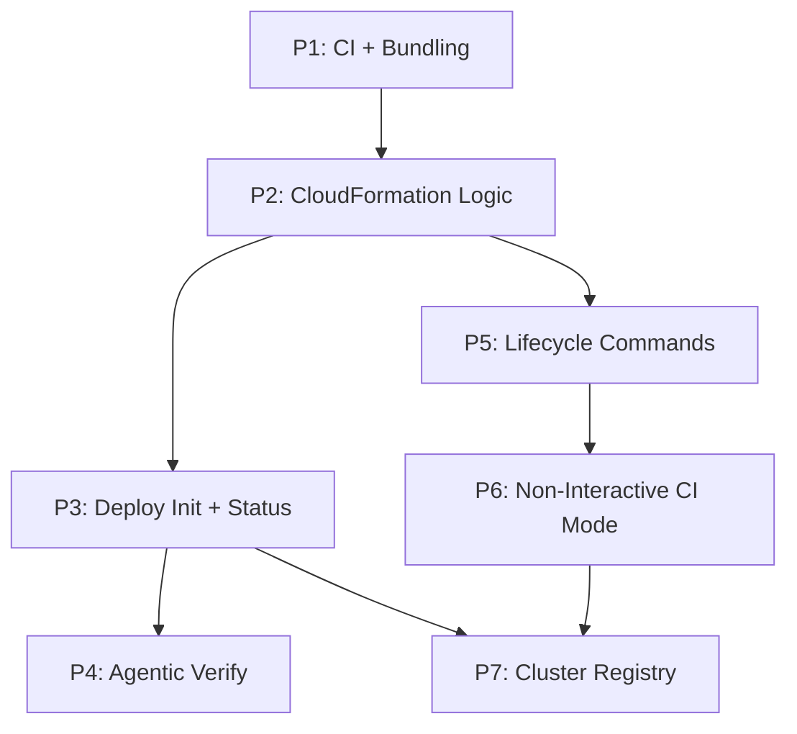

# Tasks: SaaS One-Command Deploy + Agentic Verify

**Input**: Design documents from `docs/vault/Specs/034 SaaS One-Command Deploy/`
**Prerequisites**: plan.md, spec.md, research.md, data-model.md
**Parent tasks**: [[Specs/016 SaaS Architecture/016 SaaS Architecture - tasks|016 SaaS Architecture - tasks]] (T072–T084)

**Organization**: Tasks grouped by phase. Each phase ends at an **Acceptance Gate** (G6, G7 in spec.md) that MUST pass before dependent phases begin.

## Format: `[ID] [P?] Description`

- **[P]**: Can run in parallel (different files, no dependencies)
- Include exact file paths in descriptions

---

## Phase 1: CI Pipeline + Template Bundling

**Purpose**: CI step synthesizes asset-free CFN templates from CDK source and bundles them in the pip wheel.

- [ ] T072 CI step: `cdk synth` → copy asset-free templates to `anvil/deploy/templates/`, record image digests
- [ ] T073 Bundle templates via `pyproject.toml` `[tool.setuptools.package-data]` — `anvil = ["deploy/templates/*.json"]`

---

## Phase 2: CloudFormation Logic

**Purpose**: Core CFN stack management: create, update, describe, wait, output retrieval.

- [ ] T074 [P] Implement CloudFormation logic at `anvil/deploy/cloudformation.py` — create-or-update, waiters (`stack_create_complete`, `stack_update_complete`), output retrieval, asset publishing (Lambda to S3)
- [ ] T075 [P] Implement deploy config save/load at `anvil/deploy/config.py` — `~/.anvil/deploy-config.json` read/write/validate

---

## Phase 3: Deploy Init + Status

**Purpose**: Interactive first-time deploy with full stack creation, post-deploy bootstrap, and status reporting.

- [ ] T076 Implement `anvil deploy init` at `anvil/deploy/command.py` — prompts, deploy, run migration task, create admin via Cognito, create default org + owner membership, output URL
- [ ] T077 Implement `anvil deploy status` — stack status, CloudFront URL, version from `~/.anvil/deploy-config.json`

**Gate G6** (spec.md): init deploys full stack; URL serves login; migrations ran pre-rollout; admin authenticates.

---

## Phase 4: Agentic Verify

**Purpose**: 3-layer automated validation loop.

- [ ] T078 Implement `anvil deploy verify --layer infra` at `anvil/deploy/verify.py` — boto3 control-plane checks (12 discrete assertions: stack status, ECS services, Batch envs, RDS, ElastiCache, S3, Cognito, Secrets, stack outputs)
- [ ] T079 Implement `anvil deploy verify --layer api` — headless end-to-end API canary (FR-050): create Cognito test user, obtain JWT, exercise full pipeline, cleanup
- [ ] T080 Implement `anvil deploy verify --layer browser` — Playwright smoke test (Hosted UI redirect, native login, session persistence, SSE in-page)

---

## Phase 5: Lifecycle Commands

**Purpose**: Destroy (safe), update, restore, config management, social IdP BYO.

- [ ] T081 Implement `anvil deploy destroy` — empty S3 buckets (incl. versions), delete CFN stack, clean up credentials + cluster entry; no-op if stack absent (FR-031)
- [ ] T082 Implement `anvil deploy update` — update stack with new image digest, wait `UPDATE_COMPLETE`
- [ ] T083 Implement `anvil deploy config set/get/list` — stack name, region, domain, instance_size, alert-target
- [ ] T084 Implement `anvil deploy config set-idp` — add Google/GitHub social login post-deploy with BYO OAuth credentials (AD-3, FR-021a)

**Gate G7** (spec.md): update rolls new image no-downtime; set-idp adds IdP; destroy removes ALL resources; double-destroy clean.

---

## Phase 6: Non-Interactive CI Mode

**Purpose**: CI/CD pipeline support — env-var config, non-interactive flags, machine-readable output.

- [ ] T085 Implement `ANVIL_DEPLOY_*` env var resolution — `ANVIL_DEPLOY_STACK_NAME`, `ANVIL_DEPLOY_REGION`, `ANVIL_DEPLOY_DOMAIN`, `ANVIL_DEPLOY_ADMIN_EMAIL`, etc.
- [ ] T086 Implement `--non-interactive` flag — fail fast on missing required value, naming the missing variable
- [ ] T087 Add `--json` output to all deploy commands — machine-readable pass/fail report
- [ ] T088 CI E2E harness: `pip install anvil[aws]` → `deploy init` (non-interactive) → `deploy verify --layer api` → `deploy destroy --force --no-final-snapshot`

---

## Phase 7: Cluster Registry Integration

**Purpose**: Keep the local CLI in sync with the deployments it manages.

- [ ] T089 Implement cluster registry at `anvil/deploy/cluster_registry.py` — `~/.anvil/clusters.json` schema read/write/validate
- [ ] T090 Auto-add cluster entry on `deploy init` success — name=stack_name, auth_method=deploy, region, cached admin credentials
- [ ] T091 Auto-remove cluster entry on `deploy destroy` success
- [ ] T092 Implement `anvil remote cluster add/list/remove` for non-deployed clusters — device_grant auth, manual URL, API version negotiation (FR-014c)

---

## Dependencies & Execution Order

### Key Dependencies
- **P3 (Deploy Init) depends on P2 (CFN Logic)** — needs create_stack waiter
- **P4 (Verify) depends on P3 (Init)** — needs a deployed stack to verify
- **P5 (Lifecycle) depends on P2 (CFN Logic)** — needs update_stack and delete_stack
- **P6 (CI Mode) depends on P5 (Lifecycle)** — CI destroy needs destroy command

### Parallel Opportunities
- P1 (CI + Bundling) is a CI pipeline change — can be developed alongside P2

## Summary

| Metric | Count |
|--------|-------|
| **Total Tasks** | 21 |
| **Acceptance Gates** | G6, G7 |
| **Implementations** | 8: command.py, cloudformation.py, config.py, verify.py, cluster_registry.py + templates |
| **CI pipeline** | synth steps + E2E harness |