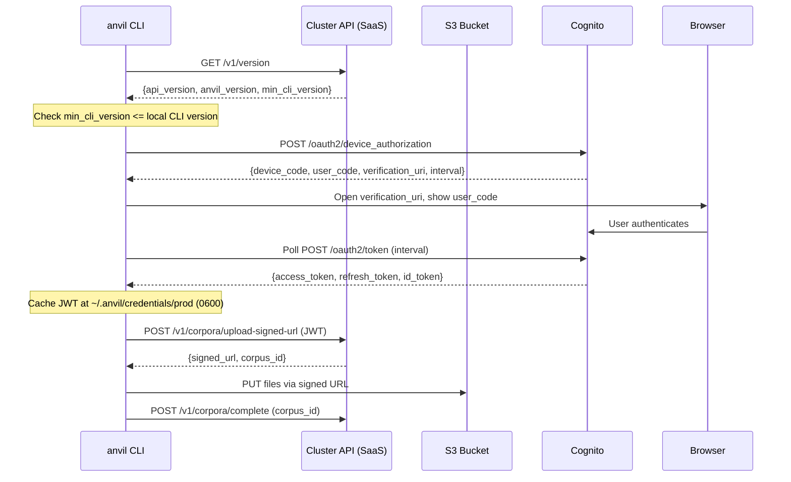

# Quickstart: CLI Remote & Cluster Management

## Prerequisites

- anvil installed with `[aws]` extra: `pip install anvil[aws]`
- A running SaaS deployment (see [[Specs/034 SaaS One-Command Deploy/034 SaaS One-Command Deploy|034 SaaS Deploy]])

---

## Add a Cluster

```bash
# Guided wizard — prompts for alias, authenticates, saves to registry
anvil remote cluster add https://models.example.com

# Alias: prod
# Region: us-east-1
# Authenticating... (device grant opens browser)
# Cluster "prod" added.
```

---

## Login / Logout

```bash
# Authenticate to a cluster (device authorization grant)
anvil remote login prod
# → Browser opens; authenticate; CLI caches JWT at ~/.anvil/credentials/prod

# Clear cached credentials
anvil remote logout prod
```

---

## Manage Clusters

```bash
# List configured clusters
anvil remote cluster list
# prod      https://models.example.com  connected  2026-06-20
# staging   https://staging.anvil.io    disconnected  -

# Remove a cluster
anvil remote cluster remove staging

# Update cluster config
anvil remote cluster configure prod --key region --value eu-west-1
```

---

## Push Data to a Cluster

```bash
# Push a corpus (local directory)
anvil remote push prod corpus ./my-training-data/
# → Files uploaded via signed S3 URLs
# → Corpus created on cluster
# → Corpus ID: abc123

# Push a dataset (local directory with chunking config)
anvil remote push prod dataset ./curated-data/
```

---

## Pull Data from a Cluster

```bash
# Pull a trained model
anvil remote pull prod model 42
# → Signed URL downloaded to ./model-42/
# → model.safetensors + config.json

# Pull experiment data
anvil remote pull prod experiment 7
```

---

## List Remote Resources

```bash
# List all corpora on the cluster
anvil remote ls prod corpora

# List datasets
anvil remote ls prod datasets

# List experiments
anvil remote ls prod experiments
```

---

## Working with a Single Cluster

When only one cluster is configured, the `<cluster>` argument is optional:

```bash
anvil remote login        # Uses the only configured cluster
anvil remote ls corpora   # Lists corpora on the only cluster
```

---

## Version Check

```bash
# The CLI checks version automatically before every remote operation
# If your CLI is too old:
#   Error: anvil CLI v1.0.0 is below cluster minimum v1.1.0
#   Upgrade: pip install --upgrade anvil
```

---

## What's Happening Under the Hood



---

## Troubleshooting

| Problem | Likely Cause | Fix |
|---------|-------------|-----|
| `anvil remote: command not found` | `[aws]` extra not installed | `pip install anvil[aws]` |
| `No clusters configured` | No clusters in registry | Run `anvil remote cluster add <url>` |
| `CLI version too old` | CLI < cluster's `min_cli_version` | `pip install --upgrade anvil` |
| `Authentication timed out` | User didn't complete browser flow in time | Run `anvil remote login <cluster>` again |
| `Cannot reach {url}` | Cluster is down or URL is wrong | Check URL; verify cluster is running |
| `Permission denied: ~/.anvil/credentials` | Wrong file permissions | Run `chmod -R 700 ~/.anvil/credentials` |
