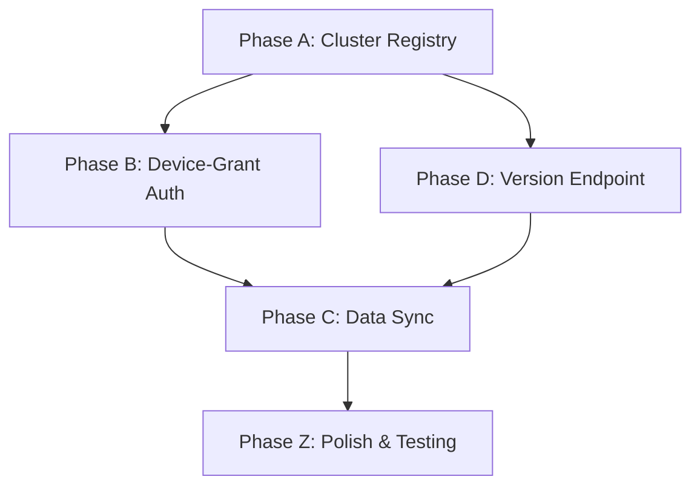

# Tasks: SaaS CLI Remote & Cluster Management

**Input**: spec.md, plan.md, data-model.md, contracts/
**Prerequisites**: [[Specs/030 SaaS Authentication/030 SaaS Authentication|030 SaaS Auth]] (Cognito pool, device-grant server-side), [[Specs/034 SaaS One-Command Deploy/034 SaaS One-Command Deploy|034 SaaS Deploy]] (cluster registry auto-add)

**Organization**: Four sub-phases (A–D). Tasks inherited from umbrella 016 Phase 11 (T094–T099) with sub-task breakdown for implementation tracking.

### Reference (inherited from 016 Phase 11)

```
[ ] T094 [US9] Implement `anvil remote login` — OAuth2 device grant, store JWT in `~/.anvil/credentials` (0600)
[ ] T095 [US9] Implement `anvil remote logout`
[ ] T096 [US9] Implement `anvil remote push corpus <path>` — signed-URL S3 upload + corpus create
[ ] T097 [US9] Implement `anvil remote push dataset <path>`
[ ] T098 [US9] Implement `anvil remote pull model <id>` — signed-URL download
[ ] T099 [US9] Implement `anvil remote ls <corpora|datasets|experiments>`
```

---

## Phase A — Cluster Registry & Command Group

**Purpose**: `anvil remote cluster *` commands, `~/.anvil/clusters.json` registry with CRUD + validation, active cluster concept, credentials directory layout.

- [ ] T094a Create `anvil/cli/remote.py` — `anvil remote` Typer/Click command group with `[aws]`-extra guard (fail cleanly if boto3/aws-jwt-verify not importable)
- [ ] T094b Implement `ClusterRegistry` at `anvil/cli/remote/cluster_registry.py`:
  - [ ] Load/save `~/.anvil/clusters.json` with JSON schema validation
  - [ ] `add_cluster(name, url, api_url, region, auth_method, cognito_domain, cognito_client_id, api_version, deployed_at, last_login=None)`
  - [ ] `list_clusters()` — return all entries with status (connected if `last_login` within token expiry)
  - [ ] `remove_cluster(name)` — delete entry, cascade-clean credentials
  - [ ] `update_cluster(name, **kwargs)` — update specific fields
  - [ ] `get_active_cluster()` — return active/default cluster or single-cluster auto-default
  - [ ] `set_active_cluster(name)` — set active via `--cluster` flag or env var
- [ ] T094c Implement `CredentialStore` at `anvil/cli/remote/credential_store.py`:
  - [ ] Store/load/delete per-cluster JWT files at `~/.anvil/credentials/<cluster_name>` with `0o600` permissions
  - [ ] Enforce `~/.anvil/credentials/` directory permissions ≤ `0o700`
  - [ ] Warn on overly permissive credential files
- [ ] T094d Implement `VersionNegotiator` at `anvil/cli/remote/version_negotiation.py`:
  - [ ] Call `GET /v1/version` on cluster add and before each remote operation
  - [ ] Cache `api_version` in registry entry
  - [ ] Refuse operation if CLI version < `min_cli_version`
  - [ ] Graceful fallback if version endpoint unreachable (warn, proceed)
- [ ] T094e Implement cluster subcommands in `anvil/cli/cluster_commands.py`:
  - [ ] `anvil remote cluster add <url>` — guided wizard (prompts for alias, negotiates version, saves)
  - [ ] `anvil remote cluster list` — table output with name, url, status, last_login
  - [ ] `anvil remote cluster remove <name>` — confirm, delete registry entry + credentials
  - [ ] `anvil remote cluster configure <name> --key value` — update single field

**Gate G9a**: `cluster add/list/remove/configure` all work; `~/.anvil/clusters.json` validates on load/save; active cluster concept works with single-cluster auto-default.

---

## Phase B — Device-Grant Authentication

**Purpose**: `anvil remote login/logout` — OAuth2 device authorization grant (RFC 8628), JWT caching.

- [ ] T094 (decomposed) Implement `DeviceGrantAuth` at `anvil/cli/remote/device_grant.py`:
  - [ ] Initiate device-grant flow: POST to Cognito token endpoint `device_authorization` endpoint
  - [ ] Display user code + verification URI; open browser automatically
  - [ ] Poll token endpoint at interval per device-grant response (`interval` field)
  - [ ] On success, extract JWT (access_token, refresh_token, id_token) + expiry
  - [ ] Store credentials via CredentialStore
  - [ ] Detect expired token on subsequent operations and transparently re-authenticate
  - [ ] Handle device-code expiry: report timeout and instruct user to retry
- [ ] T095 Implement auth subcommands in `anvil/cli/auth_commands.py`:
  - [ ] `anvil remote login <cluster>` — resolve cluster from registry, start device-grant flow
  - [ ] `anvil remote logout <cluster>` — delete credential file for cluster
  - [ ] `anvil remote login` (no cluster) — use active cluster or fail with guidance

**Gate G9b**: Device-grant login opens browser, polls successfully, caches JWT with 0600 permissions; logout removes cached credentials; expired tokens trigger re-auth.

---

## Phase C — Data Sync

**Purpose**: `anvil remote push/pull/ls` — upload/download/list remote resources via signed S3 URLs.

- [ ] T096 Implement `anvil remote push corpus <path>` in `anvil/cli/sync_commands.py`:
  - [ ] Resolve cluster + authenticate (via DeviceGrantAuth / CredentialStore)
  - [ ] Read local directory/corpus file
  - [ ] Upload to S3 via signed URL from cluster API
  - [ ] Create corpus record on cluster via REST API
- [ ] T097 Implement `anvil remote push dataset <path>` (analogous to corpus push):
  - [ ] Upload dataset content via signed S3 URL
  - [ ] Create dataset record via REST API
- [ ] T098 Implement `anvil remote pull model <id>`:
  - [ ] Resolve cluster + authenticate
  - [ ] Request signed S3 download URL from cluster API
  - [ ] Download model.safetensors + config.json to local filesystem
- [ ] T098a Implement `anvil remote pull experiment <id>`:
  - [ ] Download experiment data via signed URL
- [ ] T099 Implement `anvil remote ls <resource_type>`:
  - [ ] Fetch and display list of corpora/datasets/experiments from cluster
  - [ ] Table output with name, ID, size, created_at
  - [ ] Support `corpora`, `datasets`, `experiments` as resource types
- [ ] T099a Implement `RemoteSync` base class at `anvil/cli/remote/sync.py`:
  - [ ] Common push/pull/ls logic (HTTP client, auth header management, error handling)
  - [ ] Signed URL request pattern
  - [ ] Exponential backoff for network errors
  - [ ] Progress indication for large uploads/downloads

**Gate G9c**: Push creates remote resource visible in web UI; pull downloads artifact to local filesystem; ls returns accurate remote listing; errors handled gracefully.

---

## Phase D — Version Endpoint (SaaS-Side)

**Purpose**: `GET /v1/version` unauthenticated endpoint on the SaaS API.

- [ ] T094d (shared) Create `GET /v1/version` at `anvil/api/v1/version.py`:
  - [ ] Return `{api_version, anvil_version, min_cli_version}` JSON response
  - [ ] Unauthenticated (no JWT required)
  - [ ] `api_version` from config or hardcoded "1.0" for v1
  - [ ] `anvil_version` from `anvil.__version__`
  - [ ] `min_cli_version` from config (default same as `anvil_version`)
  - [ ] Register route in v1 router
- [ ] Test: `GET /v1/version` returns 200 with correct shape; no auth required

**Gate G9d**: `GET /v1/version` endpoint exists and returns expected JSON; CLI version negotiation refuses operation on version mismatch.

---

## Phase Z — Polish & Testing

- [ ] Write unit tests for:
  - [ ] ClusterRegistry load/save/CRUD with valid and corrupt JSON
  - [ ] CredentialStore permissions enforcement
  - [ ] VersionNegotiator min-version comparison
  - [ ] DeviceGrantAuth polling logic
- [ ] Write e2e tests for:
  - [ ] Full `remote cluster add → login → push → ls → pull → logout → remove` cycle against dev cluster
- [ ] Local-mode regression gate tests:
  - [ ] `pip install .` (no [aws]) → `anvil remote` → clean error
  - [ ] `anvil serve` boots and works end-to-end
  - [ ] Import-isolation assertion passes
- [ ] `make lint` + `make typecheck` — zero new errors

**Gate G9e**: Active cluster auto-defaults; `ANVIL_ACTIVE_CLUSTER` env var overrides; single cluster works without `<cluster>` arg.

**Gate G9f** (LMRG): Base install: `anvil remote` fails cleanly; `anvil serve` and local CLI verbs unaffected.

---

## Dependencies & Execution Order



### Key Dependencies
- **Phase B depends on Phase A** — login needs the cluster registry to resolve Cognito domain
- **Phase C depends on Phase A + B** — push/pull/ls needs registry + authentication
- **Phase D is parallel with A** — SaaS-side endpoint and CLI-side negotiator can be built independently

### External Dependencies
- **Spec 030** — must provide Cognito User Pool with device-grant OAuth scope enabled; CLI-side device-grant client in this spec assumes the Cognito domain and client ID are known
- **Spec 034** — `anvil deploy init` auto-adds cluster entry to registry; this spec provides the registry schema and write API; 034 is the caller

---

## Implementation Strategy

1. Build Phase A (registry CRUD) + Phase D (version endpoint) in parallel — no external dependencies
2. Build Phase B (device-grant auth) — depends on Cognito pool from 030
3. Build Phase C (data sync) — depends on registry + auth
4. Polish + local-mode regression gate

## Summary

| Metric | Count |
|--------|-------|
| **Inherited Tasks** | T094–T099 (6 parent tasks) |
| **Sub-tasks (this breakdown)** | ~25 |
| **Acceptance Gates** | G9a–G9f |
| **Parallelizable** | Phase A + Phase D |
| **External Dependencies** | Spec 030 (Cognito device-grant), Spec 034 (deploy auto-add) |
