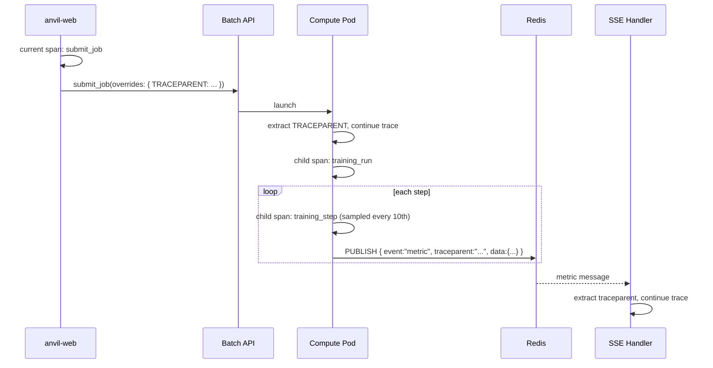
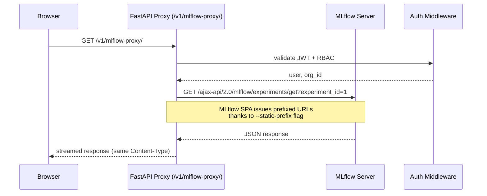

# Research: SaaS Observability & MLflow Proxy

**Phase 0 output** — resolves all research unknowns for implementation planning.

## 1. CloudWatch Logs Integration

### Decision

Use `boto3 logs filter-log-events` to read log streams for ECS services (`/ecs/anvil-web`, `/ecs/anvil-mlflow`) and terminated Batch compute pods (`/aws/batch/job`). The `LogsReader` abstraction wraps the CW API call; `LocalLogsReader` wraps the existing file-based log reading for local mode.

### Key Findings

| Aspect | Decision |
|--------|----------|
| **Library** | `boto3` `logs` client (existing `[aws]` extra dependency) |
| **API** | `filter_log_events(logGroupName=..., logStreamNames=..., limit=N)` |
| **Log group naming** | ECS: `/ecs/anvil-web`, `/ecs/anvil-mlflow`; Batch: `/aws/batch/job` |
| **Log stream naming (Batch)** | `{batch_job_id}/default` (predictable per AWS Batch convention) |
| **Pagination** | `filter_log_events` returns up to 10K events per call; `nextToken` for pagination |
| **Rate limits** | `FilterLogEvents` throttled at 5 TPS per account per region (us-east-1) — hence cost control (FR-052c) |
| **Cost** | `FilterLogEvents` is billed per request (~$0.01/10K requests for the first 10K); ingestion billed per GB |
| **LocalLogsReader** | Reads `data/logs/{service}.log` files via `pathlib.Path.read_text()` splitlines — existing behavior |
| **Degradation** | NullLogsReader returns `{"status": "not_configured"}` via HTTP 200 when `[monitoring]` extra absent |

### Alternatives Considered

- CloudWatch Logs Insights (`start_query` + `get_query_results`): More powerful queries but higher latency (async polling) and costs. Rejected for simple log tailing.
- AWS SDK for Pandas (`awswrangler`): Additional dependency; not needed for basic FilterLogEvents. Rejected.
- Direct S3 export of log groups: Better for long-term archival but adds latency. Deferred.

---

## 2. OpenTelemetry → X-Ray

### Decision

Use the OpenTelemetry SDK with auto-instrumentation packages exporting to AWS X-Ray via the AWS Distro for OpenTelemetry (ADOT) or the OTLP/gRPC exporter. All instrumentation is gated behind the `[monitoring]` extra.

### Key Findings

| Aspect | Decision |
|--------|----------|
| **SDK** | `opentelemetry-distro[otlp]` — bundles API, SDK, and OTLP exporter |
| **Auto-instrumentation** | `opentelemetry-instrumentation-fastapi`, `-redis`, `-boto3`, `-httpx` |
| **X-Ray exporter** | `aws-opentelemetry-distro` (ADOT) provides the `AWSXRaySpanExporter` |
| **Sampling (web)** | Head-based: `ParentBased(root=TraceIdRatioBased(0.05))` — 5% of requests |
| **Sampling (compute)** | Per-step sampling via `OTEL_TRACES_SAMPLER_ARG` env var — every 10th step |
| **traceparent propagation** | W3C `traceparent` header extracted from current span → passed as env var to Batch pod |
| **Redis pub/sub propagation** | Manual envelope field `"traceparent": "..."` in Redis message payload |
| **Local mode** | Console exporter only (`OTEL_TRACES_EXPORTER=console`) — no X-Ray dependency |

### Batch Pod Trace Flow



### Alternatives Considered

- X-Ray SDK directly (`aws-xray-sdk`): Mature but less portable; Lacks OTel ecosystem. ADOT is the AWS-recommended path. Rejected in favor of OTel (vendor-neutral, larger ecosystem).
- Jaeger: Self-hosted OTel collector; adds operational overhead. X-Ray is zero-ops on AWS. Rejected.

---

## 3. Prometheus Metrics

### Decision

Deploy a Prometheus server on ECS Fargate (1 vCPU/2GB) with `ecs_sd_configs` task discovery, EFS-backed TSDB, and 30s scrape interval. Custom application metrics registered via `prometheus_client` and the `prometheus-fastapi-instrumentator`.

### Key Findings

| Aspect | Decision |
|--------|----------|
| **Library** | `prometheus-fastapi-instrumentator` for standard RED metrics; `prometheus_client` for custom metrics |
| **/metrics endpoint** | Mounted at `GET /metrics` in SaaS app factory only; NOT mounted in local mode |
| **Prometheus server** | ECS Fargate, 1 vCPU / 2 GB, official `prom/prometheus` image |
| **TSDB persistence** | EFS filesystem mounted into task; `/prometheus` data directory |
| **Service discovery** | `ecs_sd_configs` with ≥60s refresh interval, rate-limited ECS API access |
| **Scrape interval** | 30 seconds (not 15s) to reduce ECS API pressure and TSDB churn |
| **Retention** | Default 15 days, configurable via `--storage.tsdb.retention.time` |
| **Custom metrics** | Defined in `anvil/_saas/observability/metrics.py` — counters, histograms, gauges per FR-054a |
| **IAM role** | `ecs:ListTasks`, `ecs:DescribeTasks` only |
| **Compute pod metrics** | CloudWatch EMF (not Prometheus scrape) — ephemeral pods cannot be scraped |

### Custom Metric Definitions

```python
# anvil/_saas/observability/metrics.py
from prometheus_client import Counter, Histogram, Gauge

jobs_submitted = Counter(
    "anvil_jobs_submitted_total",
    "Total training jobs submitted",
    ["compute_shape", "org_id"],
)
jobs_completed = Counter(
    "anvil_jobs_completed_total",
    "Total training jobs completed",
    ["compute_shape", "org_id"],
)
jobs_failed = Counter(
    "anvil_jobs_failed_total",
    "Total training jobs failed",
    ["compute_shape", "org_id", "reason"],
)
sse_publish_latency = Histogram(
    "anvil_sse_publish_latency_seconds",
    "SSE publish latency (subscribe-to-browser)",
    buckets=[0.01, 0.05, 0.1, 0.25, 0.5, 1.0, 2.5],
)
concurrent_jobs = Gauge(
    "anvil_concurrent_jobs",
    "Current number of running training jobs",
    ["org_id"],
)
org_quota_remaining = Gauge(
    "anvil_org_quota_remaining",
    "Remaining concurrent job quota for org",
    ["org_id"],
)
training_steps = Counter(
    "anvil_training_steps_total",
    "Total training steps completed",
    ["org_id", "compute_shape"],
)
```

### Alternatives Considered

- Prometheus sidecar per ECS task: Scales with task count but adds resource overhead. Rejected for ECS-level central prometheus.
- CloudWatch EMF for all metrics (no Prometheus): Simpler but limits query flexibility. Rejected — Prometheus is the standard for application metrics.
- Grafana Cloud: Managed, simpler, but adds cost and external dependency. Rejected for v1 self-hosted approach.

---

## 4. Grafana Dashboard

### Decision

Deploy Grafana as an ECS Fargate task with pre-configured Prometheus and CloudWatch data sources. Default dashboard includes RED method, job lifecycle, SSE latency heatmap, concurrent jobs per org, and system health summary.

### Key Findings

| Aspect | Decision |
|--------|----------|
| **Image** | `grafana/grafana` (OSS edition) |
| **Data sources** | Prometheus (in-cluster) + CloudWatch (via `cloudwatch` plugin, built-in) |
| **Dashboard provisioning** | JSON dashboard files mounted via config or baked into image |
| **Auth** | Grafana admin credentials stored in Secrets Manager; exposed through deploy config |
| **Persistence** | Grafana SQLite database on ephemeral storage (configuration survives via provisioning) |

### Alternatives Considered

- Grafana Cloud: Managed, reduces ops burden. Deferred to post-v1 — keeping the stack self-hosted matches the deploy ethos.

---

## 5. Alertmanager

### Decision

Deploy Alertmanager (1 replica) on ECS Fargate with default alert rules pointing to SNS topic. The SNS topic ARN is configurable at deploy time via `anvil deploy config set alert-target`.

### Default Alert Rules (Prometheus `alert.rules`)

```yaml
groups:
  - name: anvil_alerts
    rules:
      - alert: JobStuckPending
        expr: time() - anvil_jobs_submitted_total{status="pending"} > 300
        for: 1m
        labels: { severity: warning }
        annotations: { summary: "Job stuck pending >5 minutes" }
      - alert: SSELatencyHigh
        expr: histogram_quantile(0.95, rate(anvil_sse_publish_latency_seconds_bucket[5m])) > 1.0
        for: 1m
        labels: { severity: critical }
        annotations: { summary: "SSE publish p95 latency >1s" }
      - alert: ECSCapacityLow
        expr: ecs_service_running{service="anvil-web"} < ecs_service_desired{service="anvil-web"}
        for: 2m
        labels: { severity: critical }
        annotations: { summary: "anvil-web runningCount < desiredCount" }
      - alert: BatchQueueDepth
        expr: anvil_batch_queue_depth > 10
        for: 5m
        labels: { severity: warning }
        annotations: { summary: "Batch job queue depth > 10" }
      - alert: ReconcilerDead
        expr: time() - anvil_reconciler_last_heartbeat > 300
        for: 1m
        labels: { severity: critical }
        annotations: { summary: "Reconciler heartbeat not received in 5 minutes" }
```

### Alternatives Considered

- PagerDuty / Opsgenie webhooks: Not included in v1. Can be added as an Alertmanager receiver configuration post-deploy.

---

## 6. MLflow Reverse Proxy

### Decision

Use ADR-035's unified pattern: an in-process FastAPI reverse proxy at `/v1/mlflow-proxy/{path:path}` using `httpx.AsyncClient`, with MLflow launched via `--static-prefix=/v1/mlflow-proxy`. The proxy is auth-gated identically to all other `/v1/*` endpoints.

### Key Findings

| Aspect | Decision |
|--------|----------|
| **Proxy mechanism** | FastAPI `@router.api_route("/v1/mlflow-proxy/{path:path}")` → `httpx.AsyncClient` forward |
| **Streaming** | `StreamingResponse(proxy_stream())` with `Transfer-Encoding: chunked` |
| **MLflow flag** | `--static-prefix=/v1/mlflow-proxy` (supported since MLflow 1.x) |
| **Auth** | Same JWT validator as other `/v1/*` routes (AD-2) |
| **Upstream (SaaS)** | `http://mlflow.svc.local:5000` via Cloud Map DNS |
| **Upstream (local)** | `http://127.0.0.1:5001` loopback — not published to host |
| **URI function** | `get_mlflow_browser_uri(request)` returns `{request.base_url}v1/mlflow-proxy` |
| **Timeout (UI)** | 60s default |
| **Timeout (artifacts)** | 300s for artifact download endpoints |
| **Validation** | Playwright check: authenticated proxy serves MLflow experiments list; AJAX calls succeed |

### Proxy Flow



### Alternatives Considered

- Separate nginx/Caddy sidecar container: Adds operational complexity. MLflow proxy is a few hundred lines with httpx. Rejected.
- Direct CloudFront → MLflow with WAF ACL: Exposes MLflow endpoint to internet (even with WAF). Violates AD-13. Rejected.
- ALB path-based routing to MLflow target group: Works but bypasses app auth. Rejected.

---

## 7. Cost Control — CloudWatch FilterLogEvents

### Decision

The SaaS ops page log viewer uses user-triggered refresh (not auto-refresh) to control CloudWatch `FilterLogEvents` API costs. System-resource polling (CPU/mem) continues on a timer, but log fetches are manual only.

### Cost Analysis

| Factor | Estimate |
|--------|----------|
| **FilterLogEvents cost** | $0.01 per 10K requests (first 10K free/month) |
| **Auto-refresh cost (no control)** | ~4.3M requests/month (1 user, 5s interval, 24/7) = $4.30/month |
| **With user-triggered refresh** | ~100 requests/hour = ~72K requests/month ≪ free tier |
| **ECS API pressure** | 5 TPS per account per region — 4.3M requests/month would exceed throttle |
| **Recommendation** | User-triggered refresh + client-side cache (TTL 30s) |

### Alternatives Considered

- WebSocket/SSE log streaming: Avoids per-request cost but adds persistent connection complexity. Deferred to post-v1 (NG-5).
- CloudWatch Logs Live Tail: Feature preview (~$0.10/hour). Would be cost-prohibitive for always-on use. Rejected.