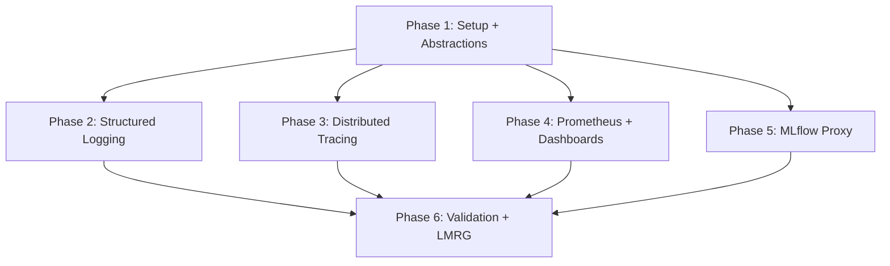

# Tasks: SaaS Observability & MLflow Proxy

**Input**: spec.md, plan.md
**Prerequisites**: 032 Durable Training Pipeline (TrainingJob model, Batch job submission pattern, JobEvent model)
**Dependencies on 036**: 037 Resilience & DR (Alertmanager rules, log archival)

## Format: `[ID] [P?] Description`

- **[P]**: Can run in parallel (different files, no dependencies)
- Include exact file paths in descriptions

---

## Phase 1: Package Setup & Shared Abstractions

- [ ] T001 Create `anvil/_saas/observability/` package with bare docstring `__init__.py` at `anvil/_saas/observability/__init__.py`
- [ ] T002 Define `LogsReader` ABC + `LocalLogsReader` at `anvil/storage/logs.py` — `read(service_name, lines=N)` + `read_job(job_id, lines=N)` methods
- [ ] T003 Add `[monitoring]`, `[monitoring-aws]`, `saas` optional extras in `pyproject.toml`
- [ ] T004 Implement `CloudWatchLogsReader` at `anvil/_saas/implementations/cw_logs_reader.py` — `boto3 logs filter-log-events` for ECS service and Batch compute pod log groups
- [ ] T005 Add `batch_log_stream` column (nullable `varchar`) to `TrainingJob` model — populated at Batch job submission time
- [ ] T006 [P] Create Alembic migration for `batch_log_stream` column

**Gate**: LogsReader ABC mypy-clean; `pip install anvil` installs zero monitoring deps; migration applies.

---

## Phase 2: Structured JSON Logging

- [ ] T007 Implement `JsonFormatter` (subclasses `logging.Formatter`) + `setup_logging()` at `anvil/_saas/observability/logging.py` — emits JSON with `timestamp`, `level`, `service`, `message`, `trace_id`, `org_id`, `job_id`
- [ ] T008 Wire structured logging in SaaS app factory (`anvil/_saas/app.py`) — install `JsonFormatter` on root logger on startup when `[monitoring]` extra present
- [ ] T009 Update ops page log viewer endpoint `GET /v1/services/logs/{name}?lines=N` — use `LogsReader` abstraction; SaaS mode reads from CloudWatch, local mode reads disk via `LocalLogsReader`
- [ ] T010 Implement SaaS log viewer cost control — ops page in SaaS mode does NOT auto-refresh logs; only "Refresh" button triggers fetch (FR-052c)
- [ ] T011 Implement log viewer graceful degradation — when `CloudWatchLogsReader` unavailable, return HTTP 200 with "monitoring not configured" payload; render message in ops page (FR-052d)
- [ ] T012 [P] Implement `GET /v1/training/{job_id}/logs?lines=N` endpoint — read compute pod logs from CloudWatch via `batch_log_stream` stored on the `TrainingJob` row (FR-052b)

**Gate**: SaaS log viewer fetches from CloudWatch; local ops page reads disk files unchanged; "monitoring not configured" response without the extra.

---

## Phase 3: Distributed Tracing (OTel → X-Ray)

- [ ] T013 Implement `setup_tracing()` at `anvil/_saas/observability/tracing.py` — configure OTel SDK with batch OTLP exporter → X-Ray (via ADOT)
- [ ] T014 Wire OTel auto-instrumentation in SaaS factory — install `opentelemetry-instrumentation-fastapi`, `opentelemetry-instrumentation-redis`, `opentelemetry-instrumentation-boto3`, `opentelemetry-instrumentation-httpx`
- [ ] T015 Implement `traceparent` propagation into Batch compute pods — extract W3C `traceparent` from current span context, pass as `TRACEPARENT` env var in Batch container overrides (FR-053a)
- [ ] T016 Implement manual Redis pub/sub trace context propagation — inject `traceparent` as envelope field in published Redis messages; extract and continue trace in web pod subscriber (FR-053b)
- [ ] T017 Configure sampling: head-based reservoir+rate for web service (first/second then 5%); compute pod samples every 10th training step via `OTEL_TRACES_SAMPLER_ARG` (FR-053c)
- [ ] T018 Wrap SQLAlchemy connection pools and Redis pub/sub operations in traced spans (FR-053d)

**Gate**: X-Ray trace map shows browser → web → Redis → Batch pod → DB/S3/MLflow path; sampling limits cost.

---

## Phase 4: Prometheus Metrics & Dashboards

- [ ] T019 Wire `GET /metrics` endpoint via `prometheus-fastapi-instrumentator` in SaaS factory — RED metrics (request rate, duration histogram p50/p95/p99, error rate, in-flight count) (FR-054)
- [ ] T020 Define custom Prometheus metrics at `anvil/_saas/observability/metrics.py` — counters for jobs submitted/completed/failed, SSE publish latency histogram, concurrent jobs gauge, org quota gauge, training steps counter. Low-cardinality labels (FR-054a)
- [ ] T021 [P] CDK: Prometheus ECS Fargate task construct — 1 vCPU/2GB, EFS-backed TSDB (persistent), `ecs_sd_configs` with ≥60s refresh interval, rate-limited ECS API access. IAM role: `ecs:ListTasks`, `ecs:DescribeTasks` (FR-054b)
- [ ] T022 [P] CDK: EFS filesystem construct for Prometheus TSDB — first-class CDK construct, mounted into Prometheus Fargate task (FR-054b)
- [ ] T023 [P] CDK: Grafana ECS Fargate task construct — Prometheus data source (in-cluster) + CloudWatch data source (for EMF metrics). Default dashboard: RED method, job lifecycle, SSE latency heatmap, concurrent jobs, system health (FR-054c)
- [ ] T024 Implement compute pod CloudWatch EMF metrics — emit single JSON log line to stdout with `TrainingSteps` and `JobDuration` metrics, dimensions `org_id` and `compute_shape` (FR-054d)
- [ ] T025 [P] CDK: Alertmanager ECS Fargate task construct (1 replica) — default alert rules (job stuck pending >5min, SSE p95 latency >1s, ECS runningCount < desiredCount >2min, Batch queue depth threshold, RDS free storage <10%, reconciler dead-man's switch) → SNS topic routing configurable via `anvil deploy config set alert-target` (FR-054e)
- [ ] T026 [P] CDK: Monitoring construct group at `packages/infra/lib/monitoring.ts` — bundles Prometheus, Grafana, Alertmanager, EFS

**Gate**: `/metrics` returns RED + custom metrics; Grafana dashboard shows job lifecycle; Alertmanager rules loaded; EFS persists across task restarts.

---

## Phase 5: MLflow Reverse Proxy (SaaS layers on top of Spec 056)

> **Dependency**: The generic proxy route, `httpx` streaming, registry, loopback
> bind, `--static-prefix`, and `get_mlflow_browser_uri` are delivered by
> [[Specs/056 Reverse-Proxy Registry/056 Reverse-Proxy Registry - tasks|Spec 056]]
> (T001–T007). The tasks below now layer ONLY the SaaS-specific concerns. T027,
> T029, T031, T032 are SUPERSEDED by Spec 056 and retained as cross-references.

- [ ] T027 **SUPERSEDED by Spec 056 T001/T002** — the `/v1/mlflow-proxy/{path:path}` route + `httpx.AsyncClient` streaming are the generic mechanism owned by 056. (Was: implement the route in `anvil/api/v1/mlflow_proxy.py`.)
- [ ] T028 Enforce **Cognito JWT authentication + RBAC authorization** on the (056-provided) proxy route — apply the SaaS auth middleware so unauthenticated requests return 401 (FR-057a). *SaaS-specific; not in 056.*
- [ ] T029 **SUPERSEDED by Spec 056 T005** — `MLflowService.start()` `--static-prefix` + loopback bind are owned by 056. SaaS adds only the Cloud Map upstream via `ANVIL_MLFLOW_INTERNAL_URI` (T033).
- [ ] T030 Provide the **CloudFront-aware** branch of `get_mlflow_browser_uri(request)` — SaaS scheme via `X-Forwarded-Proto` (FR-057c). *Layers on 056 T006, which provides the scheme-aware unified-origin builder.*
- [ ] T031 **SUPERSEDED by Spec 056 T005/T006** — MLflow SPA absolute-path handling via `--static-prefix` is part of 056's mechanism (FR-057b mechanism a).
- [ ] T032 **SUPERSEDED by Spec 056 T001** — long-lived streaming + chunked pass-through are part of 056's registry (per-upstream timeouts: 60s UI, 300s artifact downloads). SaaS sets the timeout *values* via config (FR-057d).
- [ ] T033 Set the SaaS value of `ANVIL_MLFLOW_INTERNAL_URI` (Cloud Map default `http://mlflow.svc.local:5000`); fail-fast on missing value in SaaS mode (FR-057e). *The env var is read by 056 T004; this task supplies the SaaS default + fail-fast.*
- [ ] T034 Tag MLflow experiments with `org_id` at creation time in the experiment-creation service call (FR-057f). *SaaS-specific; not in 056.*
- [ ] T035 Write Playwright integration test for the SaaS-authenticated MLflow proxy — Cognito-authenticated `GET /v1/mlflow-proxy/` returns the experiments list; AJAX calls succeed (FR-057g verification). *Complements 056 T004t, which covers the local-auth path.*

**Gate**: MLflow UI loads through the (056-provided) proxy under SaaS Cognito auth; AJAX calls succeed; unauthenticated requests return 401; `org_id` tagging verified; Playwright check passes.

---

## Phase 6: Validation & Local-Mode Regression

- [ ] T036 Verify zero OTel/Prometheus packages installed by `pip install anvil` (no extras) — import-trace audit confirms SC-019
- [ ] T037 Verify `pip install anvil[monitoring]` in local mode activates console logging only — no `/metrics`, no CloudWatch, no X-Ray
- [ ] T038 Verify local MLflow reachable via `/v1/mlflow-proxy` path — existing ops/experiments/models pages resolve correctly (ADR-035)
- [ ] T039 Run `make test` — all pre-existing tests pass unmodified
- [ ] T040 Run `make lint` + `make typecheck` — zero new errors
- [ ] T041 Run `make vault-audit` — zero vault errors

---

## Dependencies & Execution Order

### Key Dependencies
- **Phase 2–5 depend on Phase 1** — package structure, `LogsReader` interface, extras, and migration must exist first.
- **Phases 2, 3, 4, 5 are parallel** — different files, no cross-dependencies.
- **Phase 6** is the final validation gate and cannot begin until all prior phases pass.
- **External dependency**: TrainingJob model (+ `batch_job_id` column) from 032 Durable Training Pipeline must exist before Phase 2 (T012), Phase 3 (T015), and Phase 5 (T029).

### Parallel Opportunities
- T005/T006 (model + migration), T012 (job logs endpoint) — independent
- T021–T026 (CDK constructs) — independent of each other
- T013–T018 (tracing) — independent of T019–T026 (metrics)
- T036–T041 (validation) — independent of each other

## Summary

| Metric | Count |
|--------|-------|
| **Total Tasks** | 41 |
| **Acceptance Gate** | G9 (one gate for the feature) |
| **Parallelizable [P]** | 9 tasks |
| **Phase 5 (MLflow proxy)** | 9 tasks — largest single phase |
| **Phase 4 (Prometheus)** | 6 tasks — second largest |
| **Local-mode risk** | MEDIUM — two explicit guards (FR-055a, ADR-035) |