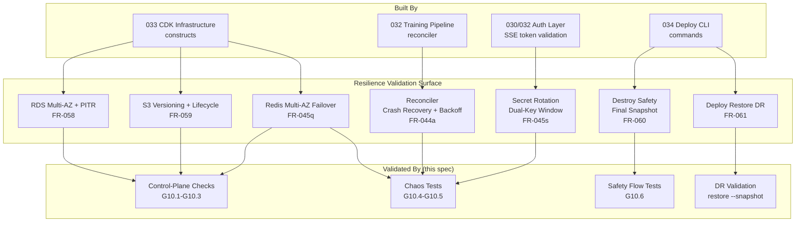
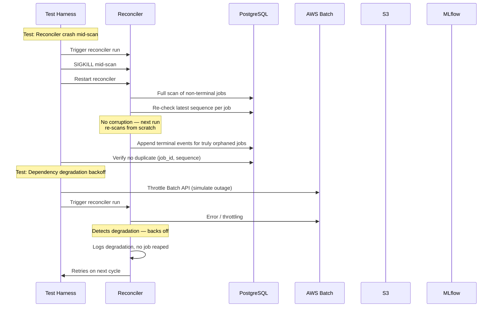
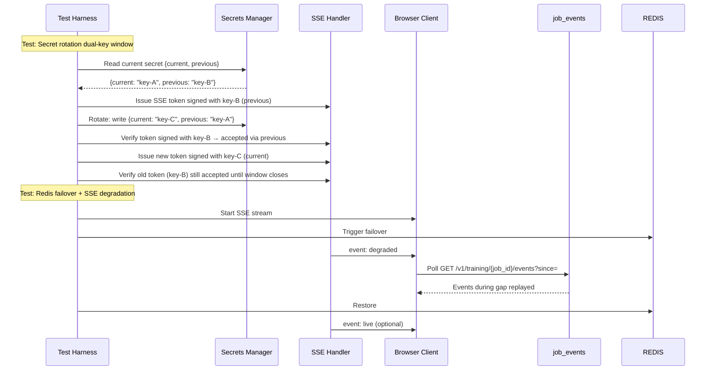

# Implementation Plan: SaaS Resilience & Disaster Recovery

**Branch**: `037-saas-resilience-dr` | **Date**: 2026-06-27 | **Spec**: docs/vault/Specs/037 SaaS Resilience DR/spec.md
**Input**: Feature specification from `docs/vault/Specs/037 SaaS Resilience DR/spec.md`; umbrella spec Phase 13 plan from `docs/vault/Specs/016 SaaS Architecture/plan.md`

## Summary

Production hardening of the SaaS deployment: Redis Multi-AZ failover validation, secret-rotation dual-key window for SSE signing secret + Redis auth token, reconciler crash-recovery + dependency-degradation backoff chaos tests, RDS automated snapshots/PITR + S3 versioning final validation, destroy-time final-snapshot safety validation, and deploy restore DR validation. This spec is a **validation + hardening** layer atop the CDK constructs (spec 033), deploy CLI commands (spec 034), and reconciler (spec 032). It does not build new constructs or commands — it validates them under fault conditions and adds the dual-key rotation logic.

## High-Level Architecture

### Chaos Test Architecture

## Technical Context

**Language/Version**: Python 3.11+ (chaos tests, validation scripts), TypeScript 5.x (CDK already done — no changes needed), shell (DR runbook steps)
**Primary Dependencies**: `boto3` (AWS API checks — already in `[aws]` extra), `pytest` (chaos test harness — existing)
**Testing**: pytest chaos tests run against a deployed stack or docker-compose emulation; AWS CLI for control-plane checks; manual destruction verification for destroy safety
**Target Platform**: AWS (verification), macOS/Linux (test development)
**Constraints**: Chaos tests MUST be safe to run in a dev/staging environment — never in production without explicit opt-in; secret rotation tests MUST use a dedicated test secret, not the production secret; destroy-safety tests MUST use a throwaway stack

## Phasing

### Phase 1 — RDS/S3/Redis Control-Plane Validation
Implement and orchestrate G10.1–G10.3: automated AWS API validation checks that verify RDS backup retention ≥ 7, S3 versioning enabled, and Redis Multi-AZ automatic failover enabled. These extend `anvil deploy verify --layer infra`.

### Phase 2 — SSE Degradation & Redis Failover Chaos
Implement G10.4: chaos tests that simulate Redis primary failure and validate that SSE degrades gracefully to polling with no metric loss. Test both `event: degraded` signaling and the client-side polling fallback.

### Phase 3 — Secret Rotation Dual-Key Window
Implement FR-045s rotation logic: SSE signing secret structure `{current, previous}`, rotation procedure (move current→previous, generate new current), verification that tries current first then previous. Tests for rotation safety (in-flight streams survive) and window expiry.

### Phase 4 — Reconciler Crash-Recovery & Backoff Chaos
Implement G10.5: chaos tests for reconciler crash mid-scan (stateless recovery), race-with-live-pod detection, and dependency-degradation backoff (throttle each of the four read surfaces and verify the reconciler backs off rather than reaping).

### Phase 5 — Destroy Safety & DR Validation
Implement G10.6: automated safety flow test for `deploy destroy` prompts (warns, offers final snapshot, requires confirmation), and DR validation for `deploy restore --snapshot`. Produce the DR runbook ([[037 SaaS Resilience DR - quickstart]]).

## Complexity Tracking

| Item | Justification |
|------|---------------|
| Dual-key secret rotation window (SSE signing secret) | Not speculative — this solves a concrete problem: a single-key rotation instantly invalidates all in-flight SSE streams, breaking every active training dashboard simultaneously. A JSON `{current, previous}` set in Secrets Manager is the simplest correct solution. |
| Chaos tests with dependency degradation backoff | The reconciler reads four surfaces; without explicit backoff, a transient Batch API outage would cause the reconciler to reap healthy jobs. This is a safety-critical correctness property of a core component (AD-4). |
| Redis failover chaos test | Redis is the live SSE delivery path. Multi-AZ failover must be validated because CloudFormation `AutomaticFailoverEnabled: true` is configuration — it does not guarantee the client-side degradation path works. |
| Destroy safety test requires throwaway stack | The only way to verify `DeletionPolicy: Snapshot` survives stack deletion is to actually delete a stack. This MUST run in a throwaway environment. Documented as such. |

## Dependency Changes

None. All validation uses existing tools and dependencies (`boto3`, `pytest`, AWS CLI). No new pip packages, no new CDK constructs, no new CLI commands (validation tests use existing `deploy verify --layer infra` and `deploy destroy` / `deploy restore`).

## Cross-References

| Spec | Relationship |
|------|-------------|
| [[Specs/033 SaaS CDK Infrastructure/033 SaaS CDK Infrastructure - spec|033 CDK Infrastructure]] | Construct-level settings for RDS backup retention, S3 versioning, Redis Multi-AZ |
| [[Specs/034 SaaS One-Command Deploy/034 SaaS One-Command Deploy - spec|034 Deploy CLI]] | `destroy --final-snapshot` and `restore --snapshot` command implementation |
| [[Specs/032 SaaS Training Pipeline/032 SaaS Training Pipeline - spec|032 Training Pipeline]] | Reconciler implementation, SSE `event: degraded` handler |
| [[Specs/036 SaaS Observability MLflow Proxy/036 SaaS Observability MLflow Proxy - spec|036 Observability]] | Alertmanager rules for failover detection, reconciler heartbeat monitoring |
| [[Reference/SaaSArchitectureDecisions|SaaS Architecture Decisions]] | AD-16 (production posture) |