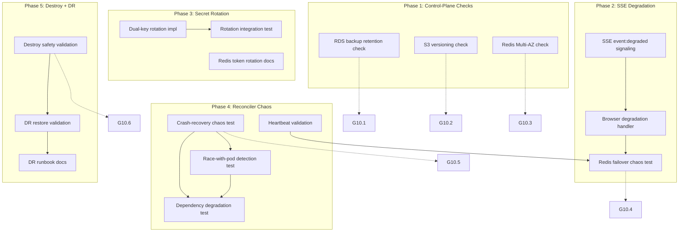

# Task Breakdown: SaaS Resilience & Disaster Recovery

**Owner spec**: [[037 SaaS Resilience DR - spec]]
**Plan reference**: [[037 SaaS Resilience DR - plan]]
**Gate**: G10 (Phase 13 of umbrella 016 plan)

## Conventions

- Each task is a single executable unit: one PR, one review, one merge.
- Dependencies: `→ T001` means "depends on T001"
- FRs: each task references the FR(s) it implements
- Verification: each task lists how it is validated

---

## Phase 1 — RDS/S3/Redis Control-Plane Validation (G10.1–G10.3)

### T001 — RDS backup retention validation check
**FRs**: FR-058
**Depends on**: 033 CDK (RDS construct exists)
**Description**: Add an AWS control-plane check to `anvil deploy verify --layer infra` that calls `rds.describe_db_instances` and asserts `BackupRetentionPeriod ≥ 7`. Fail with a clear message if retention is below threshold.
**Verification**: Run `deploy verify --layer infra` against a deployed stack; check reports "RDS backup retention: 7 days" (pass).

### T002 — S3 versioning validation check
**FRs**: FR-059
**Depends on**: 033 CDK (S3 constructs exist)
**Description**: Add an AWS control-plane check to `deploy verify --layer infra` that calls `s3.get_bucket_versioning` on both `anvil-data-{env}` and `anvil-ml-{env}` and asserts `Status == "Enabled"`.
**Verification**: Run `deploy verify --layer infra`; check reports "S3 versioning: Enabled" (pass).

### T003 — Redis Multi-AZ failover validation check
**FRs**: FR-045q
**Depends on**: 033 CDK (Redis construct exists)
**Description**: Add an AWS control-plane check to `deploy verify --layer infra` that calls `elasticache.describe_replication_groups` and asserts `AutomaticFailover == enabled`. Also validates that the replication group has ≥1 replica in a different AZ.
**Verification**: Run `deploy verify --layer infra`; check reports "Redis Multi-AZ: enabled" (pass).

---

## Phase 2 — SSE Degradation & Redis Failover Chaos (G10.4)

### T004 — SSE `event: degraded` server signaling
**FRs**: FR-045r
**Depends on**: 032 Training Pipeline (SSE handler exists)
**Description**: Implement (or verify existing implementation of) the server-sent `event: degraded` SSE message when the serving web replica loses its Redis subscription. When Redis recovers, implement `event: live` signaling to allow client to resume SSE. Both signals are single-line SSE events within the existing stream.
**Verification**: Unit test: mock Redis connection loss → SSE handler emits `event: degraded`. Integration test: start SSE stream, revoke Redis access, observe `event: degraded` in the stream.

### T005 — Browser client degradation handler
**FRs**: FR-045b, FR-045r
**Depends on**: T004
**Description**: Implement the client-side handler for `event: degraded`. When received, the browser transitions from SSE to polling `GET /v1/training/{job_id}/events?since=`. When `event: live` is received, it resumes SSE. The polling fallback from FR-045b (client-side `onerror` heuristic) remains as a secondary mechanism if `event: degraded` is not received.
**Verification**: Playwright test: subscribe to SSE, inject `event: degraded`, verify client switches to polling and curve continues updating. Inject `event: live`, verify client resumes SSE.

### T006 — Redis failover chaos test
**FRs**: FR-045q, FR-045r, G10.4
**Depends on**: T004, T005
**Description**: Implement a chaos test that simulates Redis Multi-AZ failover:
1. Deploy or use docker-compose stack with Redis.
2. Start a training job and subscribe to its SSE stream.
3. Trigger Redis failover (reboot with failover via ElastiCache API for AWS; for docker-compose, stop the Redis container).
4. Validate: client receives `event: degraded`, falls back to polling, loss curve continues updating.
5. Restore Redis (start container / wait for failover complete).
6. Validate: `event: live` sent, SSE resumes, no metrics gap.
**Verification**: Automated chaos test (pytest) passes against a docker-compose or dev-AWS stack.

---

## Phase 3 — Secret Rotation Dual-Key Window (FR-045s)

### T007 — SSE signing secret rotation dual-key implementation
**FRs**: FR-045s
**Depends on**: 030/032 Auth Layer (SSE signed token verification exists)
**Description**: Implement the dual-key rotation logic for the SSE signing secret:
1. Store the secret as `{"current": "...", "previous": ""}` in Secrets Manager.
2. Implement a rotation function that: reads the current secret, sets `previous = current`, generates a new `current`, writes back.
3. Implement verification: try `current` first; if that fails, try `previous`. Accept if either matches.
4. Implement window expiry: a configurable TTL after which `previous` is cleared.
**Verification**: Unit test: sign with key-A, rotate (key-A→previous, key-B→current), verify token signed with key-A is accepted via previous. Verify token signed with key-B is accepted via current. After window expiry, verify key-A token is rejected.

### T008 — Secret rotation integration test
**FRs**: FR-045s
**Depends on**: T007
**Description**: Integration test that validates end-to-end secret rotation with an active SSE stream:
1. Start an SSE stream (gets a token signed with the current secret).
2. Rotate the secret (simulate Secrets Manager update).
3. Validate the in-flight stream continues (token still accepted via previous key).
4. Issue a new SSE token for a new stream — validate it is signed with the new current key.
5. After window expiry, validate old-key token rejected.
**Verification**: Integration test passes against docker-compose stack.

### T009 — Redis auth token rotation documentation and validation
**FRs**: FR-045s
**Depends on**: 033 CDK (Redis construct exists)
**Description**: Document the Redis auth token rotation procedure using ElastiCache's two-token rotation (SET then ROTATE). Include the rolling restart coordination required to propagate the new token to running tasks. Add a validation script that verifies the two-token window is active (both old and new token accepted by the cluster).
**Verification**: Documentation reviewed. Validation script runs against a deployed Redis cluster and reports rotation window status.

---

## Phase 4 — Reconciler Crash-Recovery & Backoff Chaos (G10.5)

### T010 — Reconciler crash-recovery chaos test
**FRs**: FR-044a, G10.5
**Depends on**: 032 Training Pipeline (reconciler exists)
**Description**: Implement a chaos test that validates the reconciler is stateless and crash-safe:
1. Start a training job.
2. Wait for reconciler to begin its scan (monitor logs).
3. Kill the reconciler process (SIGKILL).
4. Restart the reconciler.
5. Validate: reconciler re-scans all non-terminal jobs from scratch. No jobs left non-terminal beyond grace period. No duplicate `job_events` (verify unique `(job_id, sequence)` constraint).
**Verification**: Automated chaos test (pytest) passes against docker-compose stack.

### T011 — Reconciler race-with-live-pod detection test
**FRs**: FR-044a
**Depends on**: 032 Training Pipeline (reconciler exists)
**Description**: Implement a chaos test that validates the reconciler does not race a healthy pod:
1. Start a training job with a live compute pod actively emitting events.
2. Trigger the reconciler while events are being written.
3. Validate: reconciler detects the latest event sequence is advancing, skips the job this cycle. No premature terminal event appended.
4. Validate the `(job_id, sequence)` unique constraint is the final guard by attempting a duplicate append — it is rejected by the DB.
**Verification**: Automated chaos test (pytest) passes. The test concurrently writes events and triggers reconciler scans, verifying no conflict.

### T012 — Reconciler dependency degradation backoff test
**FRs**: FR-044a
**Depends on**: 032 Training Pipeline (reconciler exists)
**Description**: Implement a chaos test for each of the reconciler's four read surfaces:
1. **Batch API throttling**: configure Batch API to return throttling errors (mock).
2. **PostgreSQL outage**: disconnect DB, verify reconciler logs degradation and retries.
3. **S3 errors**: configure S3 access to return errors for the reconciler's SA role.
4. **MLflow unavailability**: stop MLflow, verify reconciler logs degradation and retries.
For each: verify the reconciler does NOT mark any job as failed — it logs the degradation and retries on the next cycle.
**Verification**: Automated parameterized chaos test (pytest) — one sub-test per surface, all passing.

### T013 — Reconciler heartbeat validation
**FRs**: FR-044a (heartbeat), FR-054e (Alertmanager)
**Depends on**: 036 Observability (Alertmanager rules exist)
**Description**: Validate that the reconciler emits a heartbeat metric/log each cycle. Verify that Alertmanager can detect a missing heartbeat (dead reconciler). Implement a test:
1. Run reconciler — verify heartbeat emitted.
2. Stop reconciler — verify Alertmanager fires a "reconciler not running" alert after the configured threshold.
**Verification**: Integration test: heartbeat metric appears in Prometheus. Kill reconciler, verify alert fires in Alertmanager (or logs the alert if Alertmanager not deployed).

---

## Phase 5 — Destroy Safety & DR Validation (G10.6)

### T014 — Destroy safety flow validation test
**FRs**: FR-060, G10.6
**Depends on**: 034 Deploy CLI (`destroy --final-snapshot` exists)
**Description**: Implement an automated validation of the destroy safety flow:
1. Deploy a throwaway stack.
2. Run `deploy destroy` with a simulated stdin (Y to final snapshot, type stack name to confirm).
3. Validate: warning about data loss is displayed, final snapshot prompt appears, stack name confirmation is required.
4. After destruction: validate the RDS snapshot exists (describe-db-snapshots), validate the snapshot name follows `{stack-name}-final-{yyyymmdd}` format.
5. Validate the user is told the snapshot name and that it incurs ongoing storage cost.
6. Clean up: delete the final snapshot.
**Verification**: Automated test passes against a throwaway AWS account/stage. Safe-only against non-production environments.

### T015 — DR restore validation test
**FRs**: FR-061
**Depends on**: 034 Deploy CLI (`restore --snapshot` exists)
**Description**: Implement an automated validation of the DR restore flow:
1. Deploy a stack, create test data (corpus, start a training job).
2. Take a manual RDS snapshot.
3. Destroy the stack.
4. Run `deploy restore --snapshot <id>`.
5. Validate: new stack is healthy (CloudFormation CREATE_COMPLETE), data from snapshot is present (corpus exists, job status preserved).
6. Validate the admin credentials are operational.
**Verification**: Automated test passes against throwaway AWS resources. Document the expected wall-clock time (CDK deploy ~15 min + snapshot restore ~5 min = ~20 min total).

### T016 — DR runbook documentation
**FRs**: FR-061
**Depends on**: T015
**Description**: Write the DR runbook ([[037 SaaS Resilience DR - quickstart]]) covering:
1. `deploy restore --snapshot <id>` usage.
2. Manual PITR restore via AWS console (for in-place recovery within retention window).
3. S3 object recovery via versioning (for accidental delete/overwrite).
4. Secret rotation procedure (SSE signing secret + Redis auth token).
5. Expected recovery times and costs.
**Verification**: Runbook reviewed. All wikilinks resolve. Run `make vault-audit` reports 0 errors.

---

## Task Dependency Graph

## Gate Compliance Matrix

| Gate | Criterion | Task(s) | Verification |
|------|-----------|---------|--------------|
| G10.1 | RDS backup retention ≥ 7 | T001 | `rds.describe_db_instances` |
| G10.2 | S3 versioning enabled | T002 | `s3.get_bucket_versioning` |
| G10.3 | Redis Multi-AZ failover | T003 | `elasticache.describe_replication_groups` |
| G10.4 | SSE degrades to polling on Redis loss | T004–T006 | Chaos test: block Redis, observe fallback |
| G10.5 | Reconciler recovers after crash | T010–T013 | Chaos test: kill reconciler, restart, verify |
| G10.6 | Destroy warns before deleting backups | T014 | Safety flow test: prompt inspection |