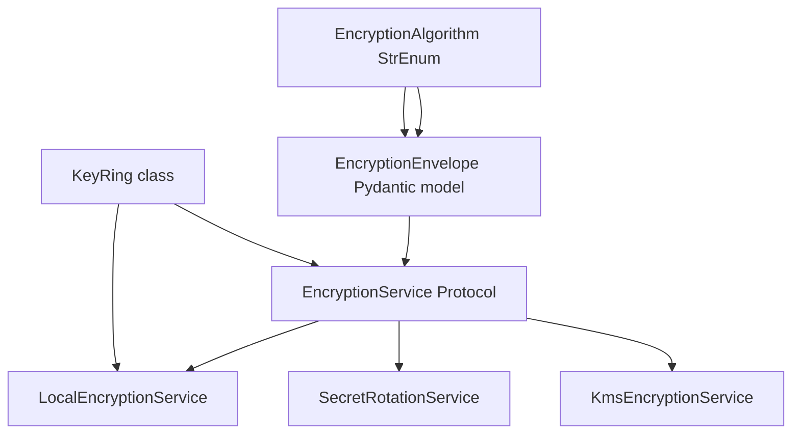
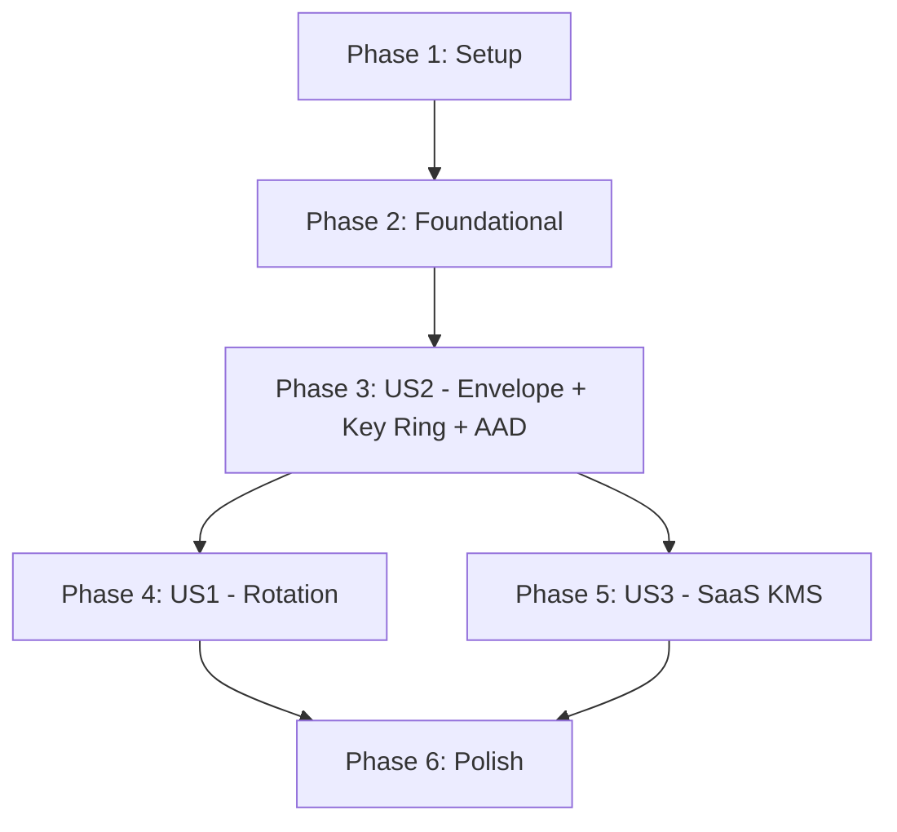

# Tasks: 058 At-Rest Secret Encryption — Key Ring + KMS Envelope

**Input**: Design documents from `docs/vault/Specs/058 At-Rest Secret Encryption/`
**Prerequisites**: plan.md (required), spec.md (required for user stories), research.md, data-model.md, contracts/encryption_service.md, quickstart.md

**Tests**: Included per TDD mandate (Constitution Article IV). Tests are written first (Red), then implementation (Green), then refactor.

**Organization**: Tasks are grouped by user story to enable independent implementation and testing of each story. Execution order follows dependency chain: US2 (envelope foundation) → US1 (rotation) → US3 (SaaS KMS).

## Format: `[ID] [P?] [Story] Description`

- **[P]**: Can run in parallel (different files, no dependencies)
- **[Story]**: Which user story this task belongs to (e.g., US1, US2, US3)
- Include exact file paths in descriptions

## Path Conventions

- **Single project**: `anvil/`, `tests/` at repository root
- All paths shown are relative to repository root

---

## Phase 1: Setup (Shared Infrastructure)

**Purpose**: Project initialization and directory structure for the new `secrets/` domain and `_saas/encryption/` module.

- [X] T001 Create `anvil/services/secrets/` directory with bare `__init__.py` (docstring-only, describing "secrets" domain purpose)
- [X] T002 Create `anvil/_saas/encryption/` directory with bare `__init__.py` (docstring-only, describing "SaaS KMS-backed encryption" purpose)
- [X] T003 Create `tests/unit/services/secrets/` directory with blank `__init__.py`

**Checkpoint**: Directory structure ready for implementation.

---

## Phase 2: Foundational (Blocking Prerequisites)

**Purpose**: Core types and refactoring that MUST be complete before ANY user story can begin.

**⚠️ CRITICAL**: All user stories depend on these foundational types.



- [X] T004 Create `EncryptionAlgorithm` StrEnum in `anvil/services/_shared/encryption_algorithm.py` with member `AES_256_GCM = "aes-256-gcm"`
- [X] T005 Create `EncryptionEnvelope` Pydantic model in `anvil/services/_shared/encryption_envelope.py` with fields `v: int`, `alg: str`, `kid: str`, `n: str`, `ct: str` + `to_token()` / `from_token()` serialization
- [X] T006 Create `KeyRing` class in `anvil/services/_shared/key_ring.py` with `current`, `previous`, `keys: dict[str, bytes]`, `resolve()`, `generate()`, `save()`, `load()` methods; `0600` file permissions; UUID4 key IDs
- [X] T007 [P] Add test for `EncryptionAlgorithm` enum values in `tests/unit/services/secrets/test_encryption_algorithm.py`
- [X] T008 [P] Add test for `EncryptionEnvelope` round-trip (`to_token`/`from_token`), validation rejects bad nonce length, malformed base64 in `tests/unit/services/secrets/test_encryption_envelope.py`
- [X] T009 [P] Add test for `KeyRing` (resolve, generate, persist/load round-trip, unknown kid raises `UnknownKeyIdError`) in `tests/unit/services/secrets/test_key_ring.py`
- [X] T010 Migrate `UserSecretService` from `anvil/services/model_import/user_secret_service.py` to `anvil/services/secrets/user_secret_service.py` (move file, update all imports: `workbench.py`, `model_import/model_import_service.py`, `model_import/model_asset_service.py`)
- [X] T011 Create Alembic migration `008_add_user_secrets_key_id.py` in `anvil/_resources/migrations/versions/` adding indexed `key_id` column to `user_secrets` table with `down_revision = "007"`

**Checkpoint**: Foundation ready — shared types exist, `user_secrets` has `key_id` column, `UserSecretService` lives in the correct domain.

---

## Phase 3: User Story 2 — Secrets Encrypted With Rotatable, Tamper-Bound Envelope (Priority: P1) 🎯 FOUNDATION

**Goal**: Every stored secret is a self-describing JSON envelope (`v/alg/kid/n/ct`) with AAD bound to `user_id:key`, encrypted via a `current`/`previous` key ring. The existing single-key `EncryptionService` is replaced by a Protocol with `LocalEncryptionService` as the local implementation.

**Independent Test**: Encrypt a value, inspect stored token is JSON with `v/alg/kid/n/ct`; decrypt round-trips; decrypting with different AAD fails; tampered `ct` fails; unknown `kid` raises explicit error.

**Spec acceptance scenarios**: 1–4 under User Story 2.

### Tests for User Story 2 ⚠️ (Write first — Red, then Green)

- [X] T012 [P] [US2] Test `EncryptionService` Protocol structural conformance (any class with `encrypt(plaintext, aad)` and `decrypt(token, aad)` signatures satisfies) in `tests/unit/services/secrets/test_encryption_service.py`
- [X] T013 [P] [US2] Test `LocalEncryptionService` — encrypt/decrypt round-trip, AAD mismatch raises `InvalidAadError`, tampered ciphertext raises `InvalidCiphertextError`, unknown `kid` raises `UnknownKeyIdError` in `tests/unit/services/secrets/test_encryption_service.py`
- [X] T014 [P] [US2] Test envelope format — encrypted value is valid JSON with `v/alg/kid/n/ct` fields; `key_id` column matches envelope `kid` in `tests/unit/services/secrets/test_encryption_service.py`
- [X] T015 [US2] Test `ANVIL_MASTER_SECRET` env var seeds the key ring and is popped from env after read in `tests/unit/services/secrets/test_encryption_service.py`
- [X] T016 [US2] Test `key_id` column is correctly set on upsert and queryable via `count_by_key_id()` in `tests/unit/db/repositories/test_user_secret_repository.py`
- [X] T017 [US2] End-to-end test — POST secret, verify `encrypted_value` is a valid envelope, GET returns key name, decrypt with correct/user-specific AAD succeeds in `tests/e2e/test_endpoints.py`

### Implementation for User Story 2

- [X] T018 [US2] Refactor `anvil/services/_shared/encryption.py`: rename existing `EncryptionService` → `LocalEncryptionService`; define `EncryptionService` Protocol with `encrypt(plaintext: str, aad: bytes) -> str` and `decrypt(token: str, aad: bytes) -> str`; update `LocalEncryptionService` to use `KeyRing`, `EncryptionEnvelope`, `EncryptionAlgorithm`, and AAD `f"{user_id}:{key}"`
- [X] T019 [US2] Implement `EncryptionService` Protocol definition in `anvil/services/_shared/encryption.py` with PEP 544 structural typing (no ABC inheritance)
- [X] T020 [US2] Implement `LocalEncryptionService` — AES-256-GCM via `cryptography`, fresh 96-bit nonce per operation, key ring integration, auto-generated `current` key on first boot, `ANVIL_MASTER_SECRET` env var override
- [X] T021 [US2] Update `UserSecretRepository` in `anvil/db/repositories/user_secret_repository.py` — add `count_by_key_id(key_id: str) -> int` and `iterate_by_key_id(key_id: str, batch_size: int = 100) -> AsyncIterator[UserSecret]` methods
- [X] T022 [US2] Update `UserSecretService` in `anvil/services/secrets/user_secret_service.py` (file moved by T010) — pass `user_id` into `encrypt()` for AAD construction; update `encrypted_value` and `key_id` on write; set `key_id` to `ring.current` on every write (FR-006)
- [X] T023 [US2] Update `UserSecret` ORM model in `anvil/db/models/user_secret.py` — add `key_id: Mapped[str]` column with index; add `ix_user_secrets_key_id` index definition
- [X] T024 [US2] Update `AnvilWorkbench` in `anvil/workbench.py` — wire `LocalEncryptionService(key_ring=KeyRing.load())` into `user_secrets` property (replacing `EncryptionService()`)
- [X] T025 [US2] Create shared `anvil/services/_shared/encryption_errors.py` with canonical error types: `UnknownKeyIdError`, `InvalidAadError`, `InvalidCiphertextError`, `InvalidEnvelopeError`. US1 rotation error types (T038) append to this file.
- [ ] T026 [US2] Verify FR-030 compliance: scan all new/modified service code for `print()`, `logger.*` calls — confirm only `kid`s, counts, and status strings are logged, never plaintext or key material

**Checkpoint**: User Story 2 complete — envelope, key ring, AAD, and `LocalEncryptionService` fully functional and tested.

---

## Phase 4: User Story 1 — Operator Rotates the Master Key Without Data Loss (Priority: P1)

**Goal**: An operator triggers `rotate()` → `reencrypt_sweep()` → `expire_previous()` as observable steps. Secrets written before rotation remain readable through the overlap window; new writes use the new key; the previous key is retired only after zero rows reference it.

**Independent Test**: Write secrets → run `rotate()` → confirm old-key rows still decrypt → write new secrets and confirm they carry the new `kid` → run sweep → confirm `expire_previous()` succeeds only after zero rows reference the previous `kid`.

**Spec acceptance scenarios**: 1–4 under User Story 1.

### Tests for User Story 1 ⚠️ (Write first — Red, then Green)

- [X] T027 [P] [US1] Test `SecretRotationService.rotate()` — promotes `current→previous`, mints new key, persists ring; second `rotate()` before sweep raises `RotationInProgressError` in `tests/unit/services/secrets/test_secret_rotation_service.py`
- [X] T028 [P] [US1] Test `reencrypt_sweep()` — re-encrypts rows with `key_id=previous` under `current`; is idempotent (re-running same batch is safe); cursor-based iteration is resumable after crash in `tests/unit/services/secrets/test_secret_rotation_service.py`
- [X] T029 [US1] Test `expire_previous()` — refuses when `count(key_id=previous) > 0` with the residual count; succeeds when count is zero; never expires on a timer alone in `tests/unit/services/secrets/test_secret_rotation_service.py`
- [X] T030 [US1] Test full rotation lifecycle — write N rows → rotate → confirm old rows still decrypt with previous key → sweep → expire → confirm rows with old `kid` now fail decryption in `tests/unit/services/secrets/test_secret_rotation_service.py`
- [X] T031 [US1] Test no plaintext or key material in rotation logs — override logger, assert only `kid`s and counts appear in `tests/unit/services/secrets/test_secret_rotation_service.py`
- [ ] T032 [US1] End-to-end test — POST `/v1/admin/secrets/rotate` returns `{"status":"accepted"}`; GET `/v1/admin/secrets/rotation-status` returns ring state + `rows_by_kid` in `tests/e2e/test_endpoints.py`

### Implementation for User Story 1

- [X] T033 [US1] Create `SecretRotationService` in `anvil/services/secrets/secret_rotation_service.py` with dependencies: `UserSecretRepository`, `EncryptionService` Protocol, `KeyRing`
- [X] T034 [US1] Implement `rotate()` — check `previous is None` (refuse if rotation in progress), mint new key via `KeyRing.generate()`, promote `current→previous`, set new key as `current`, persist ring atomically, emit structured log with new/old `kid`s
- [X] T035 [US1] Implement `reencrypt_sweep(batch_size=100)` — cursor-based pagination (`key_id = previous AND id > cursor ORDER BY id`), decrypt each row with its own `kid`, re-encrypt under `current`, update `encrypted_value` and `key_id`; return count of rows processed; log progress at each batch
- [X] T036 [US1] Implement `expire_previous()` — check `count_by_key_id(previous) == 0`; if residual rows remain, raise `SweepIncompleteError` with residual count; otherwise remove `previous` from ring, persist, log
- [X] T037 [US1] Implement `rotation_status()` — return `{"current": kid, "previous": kid|None}` (read-only)
- [X] T038 [US1] Add `RotationInProgressError` and `SweepIncompleteError` exception classes to `anvil/services/_shared/encryption_errors.py` (append to canonical file created in T025)
- [X] T039 [US1] Add admin rotation endpoints to `anvil/api/v1/user_secrets.py` — `POST /v1/admin/secrets/rotate`, `GET /v1/admin/secrets/rotation-status`, `POST /v1/admin/secrets/sweep`, `POST /v1/admin/secrets/expire-previous`
- [X] T040 [US1] Update `AnvilWorkbench` in `anvil/workbench.py` — add `secret_rotation_service` lazy property wiring `UserSecretRepository` + `LocalEncryptionService` + `KeyRing`; expose to admin routes

**Checkpoint**: User Story 1 complete — full rotation lifecycle functional and tested.

---

## Phase 5: User Story 3 — SaaS Encrypts via KMS Without Storing a Master Key (Priority: P2)

**Goal**: In SaaS mode, the application uses KMS envelope encryption — DEK ring unwrapped once at startup via IAM role, AES-256-GCM in-process per row. Envelope format is byte-identical to the local service. KMS CMK auto-rotation needs no re-encryption. DEK rotation reuses the Phase 4 sweep machinery.

**Independent Test**: With mocked KMS (`moto`), load the DEK ring, encrypt/decrypt round-trip, confirm a row encrypted by the local service decrypts under the KMS service and vice-versa.

**Spec acceptance scenarios**: 1–4 under User Story 3.

### Tests for User Story 3 ⚠️ (Write first — Red, then Green)

- [X] T042 [P] [US3] Test `KmsEncryptionService` — boot with mocked KMS (`moto.mock_kms`), unwrap DEK ring from mocked SSM, encrypt/decrypt round-trip works in `tests/unit/services/secrets/test_kms_encryption_service.py`
- [X] T043 [P] [US3] Test format parity — row encrypted by `LocalEncryptionService` decrypts under `KmsEncryptionService` and vice-versa (same `EncryptionEnvelope` schema) in `tests/unit/services/secrets/test_kms_encryption_service.py`
- [X] T044 [US3] Test KMS unavailable at boot — `KmsEncryptionService` raises fail-fast error; app does not start serving in `tests/unit/services/secrets/test_kms_encryption_service.py`
- [X] T045 [US3] Test DEK rotation — triggers Phase 4 `SecretRotationService.rotate()` → sweep → `expire_previous()` unchanged in `tests/unit/services/secrets/test_secret_rotation_service.py`
- [X] T046 [US3] Test FR-024 KMS CMK rotation transparency — generate a KMS key via `moto`, create a DEK ring, encrypt a value, then simulate KEK rotation by re-importing the CMK under a new ID (via `moto` key re-creation); confirm existing rows decrypt unchanged in `tests/unit/services/secrets/test_kms_encryption_service.py`

### Implementation for User Story 3

- [X] T047 [US3] Create `KmsEncryptionService` in `anvil/_saas/encryption/kms_encryption_service.py`
- [X] T048 [US3] Implement DEK ring loading — parse JSON, unwrap each wrapped DEK via `kms_client.decrypt()`, hold `dict[kid, bytes]` in process memory
- [X] T049 [US3] Implement KMS boot sequence — on init, call `kms_client.decrypt()` and unwrap DEKs; fail-fast if any step fails
- [X] T050 [US3] Implement `encrypt()`/`decrypt()` on `KmsEncryptionService` — uses the in-memory DEK ring + `EncryptionEnvelope` + local AES-256-GCM; format identical to `LocalEncryptionService`
- [X] T051 [US3] Implement DEK rotation — call `kms_client.generate_data_key()` to mint a new DEK; write wrapped DEK into config; then delegate to `SecretRotationService` machinery
- [X] T052 [US3] Add `moto` to `[tool.pytest.ini_options]` test-only dependencies in `pyproject.toml` (confirmed absent: no existing `moto` dependency)
- [ ] T053 [US3] Verify `anvil/_saas/` import boundary — `KmsEncryptionService` must not be importable from outside `_saas`; confirm `_saas` lint gate catches violations

**Checkpoint**: User Story 3 complete — SaaS KMS encryption fully functional behind `[aws]` extra, format-compatible with local mode.

---

## Phase 6: Polish & Cross-Cutting Concerns

**Purpose**: Safety hardening, documentation, vault enrichment, and final verification.

- [ ] T054 [P] Add structured logging helper to `SecretRotationService` — log rotation events with `kid`, operation, row count; verify `FR-030` (no plaintext in logs) across all services
- [ ] T055 [P] Update `docs/vault/Sessions/` with session log for this feature implementation
- [ ] T056 [P] Update ADR-044 status from `draft` to `reviewed` and verify vault-links resolve
- [ ] T057 Run `make vault-audit` — must report 0 errors before vault changes are committed
- [ ] T058 Run `make lint` — ruff → black --check → isort --check --pylint; must pass
- [ ] T059 Run `make typecheck` — `mypy --strict` on all changed files; zero type-error suppressions
- [ ] T060 Run `make test` — full test suite must pass (including all new encryption tests)
- [ ] T061 Run `make format` — auto-format any remaining whitespace/style issues

**Checkpoint**: Feature complete — all gates pass, vault records enriched.

---

## Dependencies & Execution Order

### Phase Dependencies



- **Setup (Phase 1)**: No dependencies — directory structure only
- **Foundational (Phase 2)**: Depends on Setup — BLOCKS all user stories
- **US2 (Phase 3)**: Depends on Foundational — no other story dependencies
- **US1 (Phase 4)**: Depends on US2 completion (rotation needs envelope + key ring + sweep queries)
- **US3 (Phase 5)**: Depends on US2 completion (needs `EncryptionService` Protocol + `SecretRotationService` sweep) — CAN run in parallel with US1
- **Polish (Phase 6)**: Depends on all user stories complete

### User Story Dependencies

- **User Story 2 (P1)**: No dependencies on other stories — can start after Foundational
- **User Story 1 (P1)**: Depends on US2 (envelope, key ring, key_id queries must exist)
- **User Story 3 (P2)**: Depends on US2 (`EncryptionService` Protocol) — independent of US1 rotation-specific code

### Within Each User Story

- Tests MUST be written and FAIL before implementation (Red-Green-Refactor)
- Models/Protocols before services
- Services before endpoints/routes
- Core implementation before integration

---

## Parallel Opportunities

### Phase 2 (Foundational)

```bash
# All shared type definitions can run in parallel:
Task: T004 EncryptionAlgorithm StrEnum in anvil/services/_shared/encryption_algorithm.py
Task: T005 EncryptionEnvelope Pydantic model in anvil/services/_shared/encryption_envelope.py
Task: T006 KeyRing class in anvil/services/_shared/key_ring.py
```

### Phase 3 (US2) — Models first, then combined

```bash
# Tests (parallel):
Task: T012 EncryptionService Protocol conformance test
Task: T013 LocalEncryptionService round-trip/AAD/tamper test
Task: T014 Envelope format + key_id test

# Implementation (parallel models + Protocol):
Task: T018 Refactor encryption.py → Protocol + LocalEncryptionService
Task: T019 EncryptionService Protocol definition
Task: T020 LocalEncryptionService implementation
Task: T021 UserSecretRepository count/iterate methods

# Then sequential: T022 → T023 → T024 → T025 → T026
```

### Phase 4 (US1) — Mostly sequential within

```bash
# Tests (parallel):
Task: T027 rotate() test
Task: T028 reencrypt_sweep() test
Task: T029 expire_previous() test

# Implementation: mostly sequential (each builds on previous)
# T033 → T034 → T035 → T036 → T037 → T038
# T039 routes + T040 wiring can run after T033-T038
```

### Phase 5 (US3) — Independent of US1

```bash
# Can run in parallel with Phase 4 (US1) since they depend on US2
# Tests first:
Task: T042 KmsEncryptionService round-trip test
Task: T043 Format parity test

# Then implementation:
Task: T047 → T048 → T049 → T050 → T051 → T052 → T053
```

---

## Implementation Strategy

### MVP First (US2 + US1 — Both P1)

The spec defines US1 (rotation) and US2 (envelope) as both P1. Since US1 depends on US2, the minimal shippable increment is:

1. **Phase 1**: Setup
2. **Phase 2**: Foundational (shared types + `key_id` migration + `UserSecretService` move)
3. **Phase 3**: US2 — Envelope + Key Ring + AAD + `LocalEncryptionService`
4. **Phase 4**: US1 — Rotation mechanics + admin endpoints
5. **STOP and VALIDATE**: Full rotation lifecycle tested locally. MVP is complete.
6. **Phase 5**: US3 (SaaS KMS) — deploy as follow-up

### Incremental Delivery

1. Complete Setup + Foundational → Foundation ready
2. Add US2 (envelope/AAD) → Test independently → Core encryption complete
3. Add US1 (rotation) → Test independently → Rotation MVP ready
4. Add US3 (SaaS KMS) → Test independently → Full spec complete

### Parallel Team Strategy

With multiple developers:

1. Team completes Setup + Foundational together
2. Phase 3 (US2) — Developer A: types + models + repository → Developer B: Protocol + LocalEncryptionService + wiring
3. Once US2 is stable:
   - Developer A: Phase 4 (US1 — rotation)
   - Developer B: Phase 5 (US3 — SaaS KMS)
4. Phase 6: Polish together

---

## Notes

- [P] tasks = different files, no dependencies
- [Story] label maps task to specific user story for traceability
- Each user story should be independently completable and testable
- Verify tests fail before implementing (Red-Green-Refactor)
- Commit after each logical group (no auto-commit)
- Stop at any checkpoint to validate story independently
- `moto` for KMS mocking in Phase 5 tests
- Plaintext/key material NEVER in logs — verify at every implementation task (FR-030)
- The `_saas` import boundary is enforced by existing lint gates — verify Phase 5 code stays behind it
