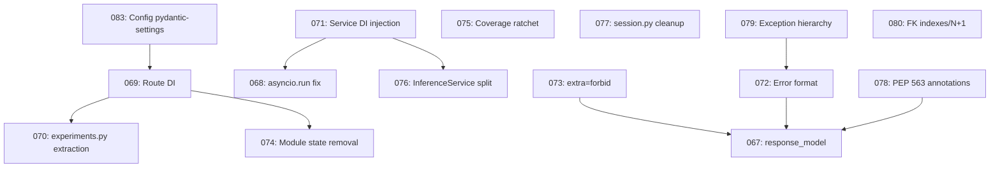

# Feature Specification: Codebase Remediation — Anti-Patterns & Best-Practice Gaps

**Feature Branch**: `066-codebase-remediation`  
**Created**: 2026-07-18  
**Status**: Draft  
**Input**: Comprehensive codebase review of anvil for anti-patterns and best-practice gaps in Python, FastAPI, Pydantic, and solution structure.

## Overview

This is a **master specification** for a suite of 15 remediation specs (066–080) addressing anti-patterns and best-practice gaps identified across the anvil codebase. Each sub-spec is independently implementable and testable, with its own acceptance criteria. The work is scoped to a single branch and will be merged as one PR containing all specs, research, and design artifacts.

## Spec Index

### P0 — Critical (blocker)

| # | Spec | Focus | Effort |
|---|------|-------|--------|
| 083 | [Config Migration to pydantic-settings](../083%20Config%20Pydantic%20Settings/083%20Config%20Pydantic%20Settings.md) | Replace `dict[str, Any]` config with `BaseSettings` | 2-3 days |
| 067 | [Add response_model to All Routes](../067-api-response-models/spec.md) | Complete OpenAPI response schemas | 3-5 days |
| 068 | [Remove asyncio.run() Blocking Call](../068-training-service-async-fix/spec.md) | Fix thread-blocking in TrainingService | 1 day |
| 069 | [Replace Module-Level Service Singletons with DI](../069-route-di-cleanup/spec.md) | Use FastAPI Depends() for services | 2-3 days |

### P1 — Important

| # | Spec | Focus | Effort |
|---|------|-------|--------|
| 070 | [Extract Business Logic from experiments.py](../070-experiments-service-extraction/spec.md) | Move logic to service layer | 2-3 days |
| 071 | [Inject Cross-Service Dependencies](../071-service-di-injection/spec.md) | Constructor injection for services | 2-3 days |
| 072 | [Standardize API Error Response Format](../072-error-response-standardization/spec.md) | Consistent error envelopes | 1-2 days |
| 073 | [Add extra="forbid" to Schema Files](../073-pydantic-schema-validation/spec.md) | Strict request body validation | 0.5 day |
| 074 | [Remove Module-Level Mutable State](../074-module-state-removal/spec.md) | Move to app.state | 1 day |
| 075 | [Raise Coverage Threshold](../075-coverage-threshold-ratchet/spec.md) | Ratchet from 23% to ~41% | 0.5 day |

### P2 — Improvement

| # | Spec | Focus | Effort |
|---|------|-------|--------|
| 076 | [Split InferenceService](../076-inference-service-decomposition/spec.md) | SRP decomposition | 3-5 days |
| 077 | [Clean Up session.py](../077-session-py-cleanup/spec.md) | Remove cast/assert/module globals | 1 day |
| 078 | [PEP 563 Annotations Consistency](../078-annotations-consistency/spec.md) | Add `from __future__ import annotations` | 0.5 day |
| 079 | [Exception Hierarchy Unification](../079-exception-hierarchy-unification/spec.md) | Common base class for service errors | 1-2 days |
| 080 | [FK Indexes and N+1 Prevention](../080-db-indexes-eager-loading/spec.md) | DB performance tuning | 1-2 days |

## Dependencies & Execution Order

**Isolation**: Each spec is independently implementable except where noted:
- 067 (response_model) benefits from 072 (error format) and 073 (extra="forbid") being resolved first
- 068 (asyncio.run) depends on 071 (service DI) since the fix requires injecting services
- 070 (experiments.py) depends on 069 (route DI) since extracted services need injection

## Handoff Artifacts (per spec)

Each spec directory (066–080) contains THREE files for cold-start pickup:
- **`spec.md`** — the specification (user stories, requirements, success criteria).
- **`context.md`** — quoted current code, exact file:line refs, reference implementations, gotchas, and cross-references. **Corrections to the original review are recorded here.**
- **`tasks.md`** — TDD-ordered task breakdown (Red → Green → Refactor) with verification steps.

Master-level artifacts (in `066-codebase-remediation/`):
- **`research.md`** — overall context, file inventory, architecture constraints, findings index.
- **`data-inventory.md`** — verified ground-truth: exact grepped inventories of every anti-pattern occurrence, reference-implementation pointers, and **corrections to the original review** (e.g. 3 `asyncio.run()` not 1; 221 routes not 23; schema files already have PEP 563; a live `external_models` FK inconsistency).
- **`shared-decisions.md`** — cross-cutting decisions that MUST be made once (envelope convention, DI mechanism, config strategy, exception base, migration numbering).

## Corrections Baked In (from verification pass)

The original review had inaccuracies now corrected in `context.md`/`data-inventory.md`:
1. **`asyncio.run()`**: 3 occurrences (training.py:336, 353, 430), not 1.
2. **Route count**: 221 endpoints, not "23 route files". 6 use `response_model`.
3. **PEP 563 (spec 078)**: schema files ALREADY have the import; the actual gap is in route files (backup.py, compute.py, config.py, eval.py, eval_datasets.py, experiments.py, health_ops.py, registry.py, router.py).
4. **Service DI (spec 071)**: more offenders than reported — `demo_model_provider.py` and `demo_bootstrap.py` also create services inline.
5. **DB indexes (spec 080)**: `external_models` table dropped by migration 013 but still FK'd by `fine_tune_dataset.py` and `lora_adapter.py` — a live inconsistency to resolve before indexing.
6. **Coverage (spec 075)**: actual % NOT measured (no venv) — must run `make test` first.

## Handoff Notes

1. **Branch**: Master overview lives on `066-codebase-remediation`. Each individual spec has its own directory. When implementing, create individual feature branches per spec (e.g. `083-config-pydantic-settings`).
2. **PR**: Single PR containing all spec documents, research, and design artifacts.
3. **Implementation**: Work will be picked up later in a separate session — start each spec by reading its `context.md`, then follow `tasks.md`.
4. **Re-verify first**: Line numbers drift. Each `context.md` includes re-verify grep commands — run them before editing.
5. **TDD**: All implementation MUST follow Red-Green-Refactor (Constitution Article IV). `tasks.md` marks `[Red]`/`[Green]`/`[Refactor]` phases.
6. **Constitution Check**: Every implementation must pass the Simplicity First gate (Article XI).
7. **Suggested order**: quick wins first (073 extra="forbid", 078 annotations), then 079 → 072 (exceptions → error format), 071 → 068 (DI → async fix), 083 (config), 069 → 070 (route DI → experiments), 074 (state), 067 (response models — largest), 076/077/080 (P2), 075 (coverage — LAST).