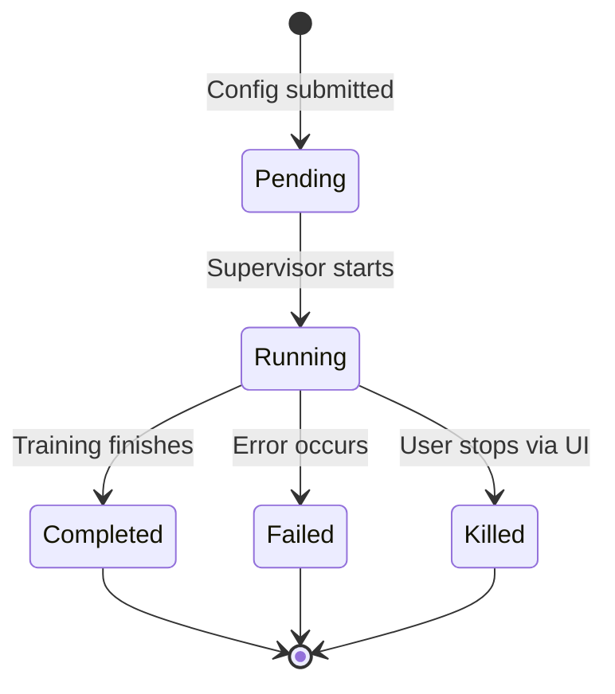

# Data Model: Bootstrap LLM Workbench

**Phase**: Phase 1 — Data Model & Contracts  
**Date**: 2026-06-10  
**Spec**: `specs/001-bootstrap-llm-workbench/spec.md`

## Entity Overview

| Entity | Repository | Service | API Prefix |
|--------|-----------|---------|------------|
| Dataset | `DatasetRepository` | `DatasetService` | `/v1/datasets` |
| Experiment | `ExperimentRepository` | `ExperimentService` | `/v1/experiments` |
| TrainingConfig | `TrainingConfigRepository` | `TrainingService` | `/v1/training` |

---

## Dataset

Stores training datasets (text files of documents, one per line).

| Field | Type | Constraints | Notes |
|-------|------|-------------|-------|
| `id` | int | PK, auto-increment | |
| `name` | str | NOT NULL, unique, 1-255 chars | User-facing label |
| `description` | str | nullable, max 1000 chars | |
| `filename` | str | NOT NULL | Original upload filename |
| `file_path` | str | NOT NULL | Path in FileStore storage |
| `vocabulary_size` | int | nullable | Computed after upload (unique chars + BOS) |
| `document_count` | int | nullable | Number of documents/lines |
| `char_set` | str | nullable | JSON-serialized sorted unique characters |
| `created_at` | datetime | NOT NULL, auto | |
| `updated_at` | datetime | NOT NULL, auto | |
| `is_default` | bool | default False | Whether this is the bundled names dataset |

### Validation Rules
- Name must be unique (case-insensitive? — exact match)
- File must be `.txt` or `.csv` format (validated before storage)
- File content must be non-empty text (validated after upload)
- Vocabulary size computed on upload: `len(set(''.join(docs))) + 1` (for BOS token)

### Relationships
- `experiments`: one-to-many with Experiment (optional — an experiment may reference a dataset)

---

## TrainingConfig

Captures hyperparameters for a training run. Can be saved as a template for reuse.

| Field | Type | Constraints | Notes |
|-------|------|-------------|-------|
| `id` | int | PK, auto-increment | |
| `name` | str | nullable, 1-255 chars | Optional label for saved configs |
| `n_layer` | int | NOT NULL, default 1 | Transformer depth |
| `n_embd` | int | NOT NULL, default 16 | Embedding dimension |
| `n_head` | int | NOT NULL, default 4 | Number of attention heads |
| `block_size` | int | NOT NULL, default 16 | Maximum context length |
| `num_steps` | int | NOT NULL, default 1000 | Training steps |
| `learning_rate` | float | NOT NULL, default 0.01 | |
| `beta1` | float | NOT NULL, default 0.85 | Adam beta1 |
| `beta2` | float | NOT NULL, default 0.99 | Adam beta2 |
| `temperature` | float | NOT NULL, default 0.5 | Inference temperature |
| `use_gpu` | bool | default False | Whether to attempt GPU acceleration |
| `dataset_id` | int | FK → Dataset.id, nullable | Which dataset to train on |
| `created_at` | datetime | NOT NULL, auto | |

### Validation Rules
- `n_embd` must be divisible by `n_head` (head_dim = n_embd // n_head)
- `n_head` >= 1, `n_layer` >= 1
- `num_steps` between 1 and 100000
- `learning_rate` between 0.0 and 1.0
- `temperature` between 0.0 and 2.0
- `block_size` >= 1

### Relationships
- `dataset`: many-to-one with Dataset
- `experiments`: one-to-many with Experiment

---

## Experiment

Represents a single training run and its results.

| Field | Type | Constraints | Notes |
|-------|------|-------------|-------|
| `id` | int | PK, auto-increment | |
| `mlflow_run_id` | str | nullable, unique | MLflow run ID for cross-reference |
| `status` | str | NOT NULL, default 'pending' | One of: pending, running, completed, failed, killed |
| `config_id` | int | FK → TrainingConfig.id, NOT NULL | |
| `dataset_id` | int | FK → Dataset.id, nullable | Denormalized for query convenience |
| `final_loss` | float | nullable | Loss at end of training |
| `started_at` | datetime | nullable | |
| `completed_at` | datetime | nullable | |
| `generated_samples` | str | nullable | JSON array of generated name strings |
| `error_message` | str | nullable | If status is 'failed', the error |
| `metrics_path` | str | nullable | Path to per-step metrics JSON in FileStore |
| `created_at` | datetime | NOT NULL, auto | |

### Validation Rules
- Status transitions: pending → running → completed|failed|killed
- `final_loss` must be set when status is 'completed'
- `error_message` must be set when status is 'failed'

### Relationships
- `config`: many-to-one with TrainingConfig
- `dataset`: many-to-one with Dataset

---

## State Transitions

### Training Run Lifecycle



### MLflow Integration

When an experiment transitions to `running`:
1. `mlflow.start_run()` creates an MLflow run
2. `mlflow.log_params()` logs the TrainingConfig
3. Per step: `mlflow.log_metrics({"loss": loss}, step=step)`
4. On complete: `mlflow.log_artifact()` saves final samples
5. `mlflow.end_run()` finalizes the run
6. Experiment.`mlflow_run_id` is set for cross-referencing

---

## Storage Abstraction (FileStore)

Not a relational entity — an abstract interface for file content.

| Method | Parameters | Returns | Notes |
|--------|-----------|---------|-------|
| `get(path)` | path: str | `AsyncIterator[bytes]` | Stream file content |
| `put(path, stream)` | path: str, stream: AsyncIterator[bytes] | `str` (etag) | Atomic write |
| `delete(path)` | path: str | None | |
| `list(prefix)` | prefix: str | `list[FileInfo]` | List with metadata |

### FileInfo Structure
```python
class FileInfo(BaseModel):
    path: str
    size: int
    etag: str
    content_type: str
    created_at: datetime
    updated_at: datetime
```

### Backends
- `LocalFileStore`: filesystem via `aiofiles`, temp-file-rename for atomic writes
- `S3FileStore`: designed but not implemented in v1 (S3-ready interface contract)