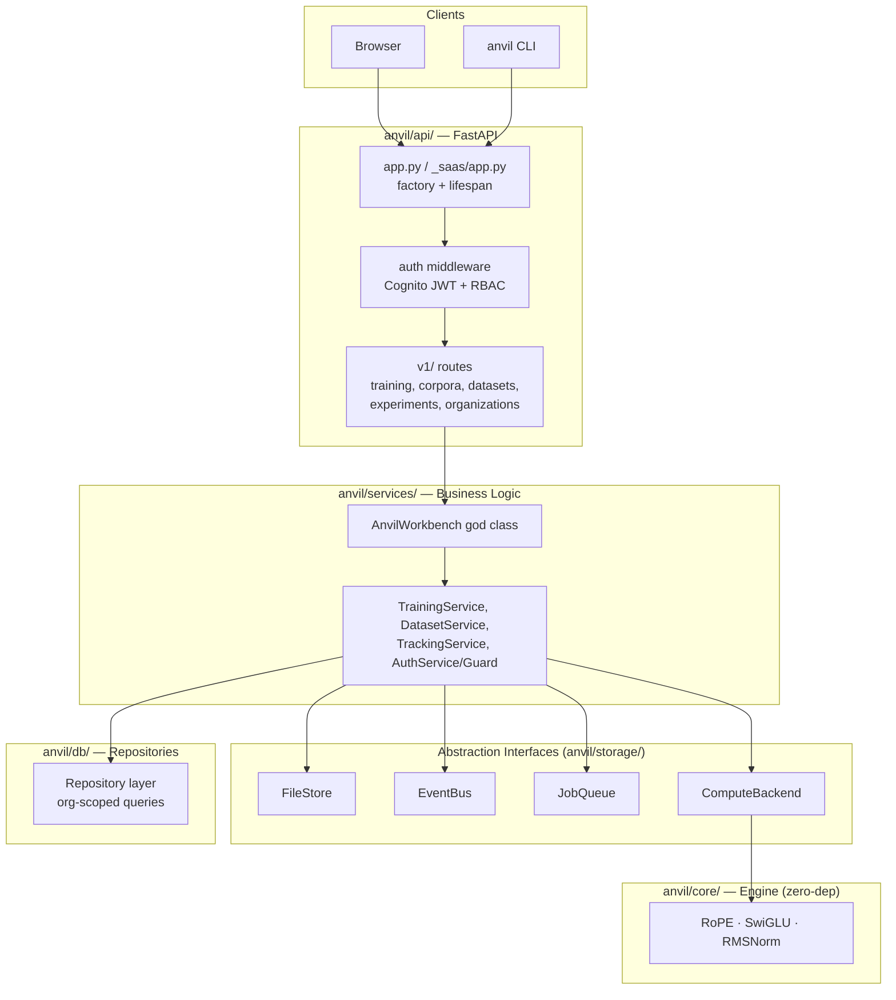
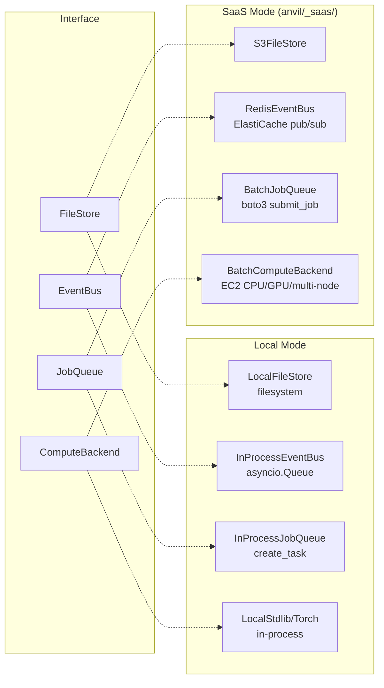
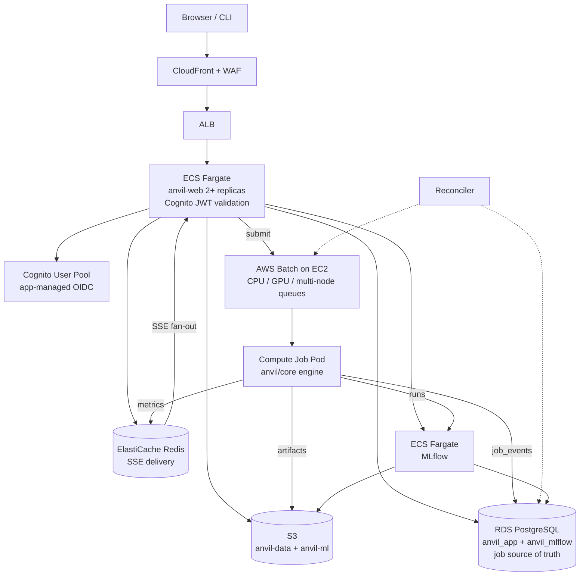
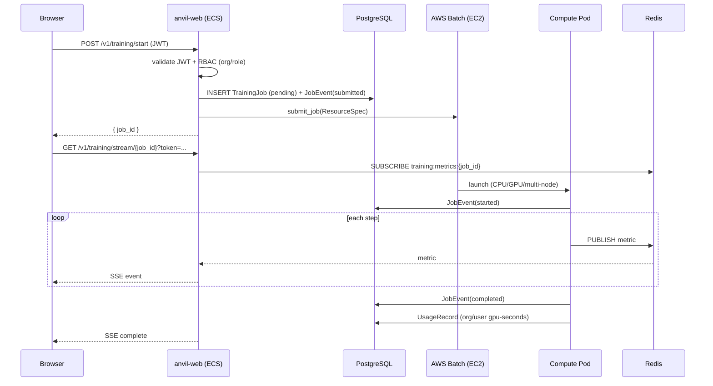

# Implementation Plan: SaaS Architecture — Three-Mode Operating Model

**Branch**: `014-saas-architecture` | **Date**: 2026-06-19 | **Spec**: specs/014-saas-architecture/spec.md
**Input**: Feature specification from `specs/014-saas-architecture/spec.md`

## Summary

Add a multi-tenant SaaS mode to the anvil LLM training platform alongside the existing local mode. Three operating modes share the same `anvil` package: Local User (unchanged), SaaS User (cloud-hosted multi-tenant), and SaaS Developer (docker compose + CDK). Four abstraction interfaces (`FileStore`, `EventBus`, `JobQueue`, `ComputeBackend`) decouple infrastructure from business logic. Authentication uses Amazon Cognito with the **app-managed OIDC/JWT** pattern — zero custom auth code. Full RBAC multi-tenancy (Organization → Team → Role → User) with usage metering for billback. Compute runs on **AWS Batch on EC2** supporting CPU, GPU, multi-GPU, and multi-node distributed training. Job state is durable in PostgreSQL (source of truth) with an append-only `job_events` log and a reconciler. Deployment is one command: `pip install anvil[aws] && anvil deploy init`, with a 3-layer agentic validation loop (`anvil deploy verify`). All architecture decisions resolving the pre-implementation review are recorded as AD-1 through AD-11 in spec.md.

## High-Level Architecture

### Layered Architecture (shared across all modes)

The same layered codebase serves every mode. Only the bottom infrastructure layer swaps implementation behind the four abstraction interfaces. The API layer (`anvil/api/`) and business logic (`anvil/services/`) are identical in local and SaaS.



### Mode Topology (implementation swap behind interfaces)



### SaaS Runtime Topology (AWS)



### Request → Training → Stream Flow (SaaS)



> Detailed AWS topology, S3 layout, IAM roles, and the three-mode feature matrix live in `docs/vault/Reference/SaaSArchitecture.md`. **Full-fidelity per-subsystem diagrams (33 system + 37 security/flow = 70 diagrams — C4 levels, network, ERD, auth sequences, orchestration, compute, reconciler, deploy flows, CI/CD, tenant/access boundaries)** live in `docs/vault/Reference/SaaSSystemDiagrams.md` and `docs/vault/Reference/SaaSSecurityAndFlowDiagrams.md`.

## Technical Context

**Language/Version**: Python 3.11+ (backend), TypeScript 5.x (CDK infrastructure), JavaScript ES6+ (frontend unchanged)
**Primary Dependencies**: FastAPI (existing), SQLAlchemy[asyncio] (existing), `boto3` (new, SaaS extra), `redis-py` (new, SaaS extra), `aws-jwt-verify` (new, SaaS extra), `aws-cdk-lib` (dev only, infra package)
**Storage**: RDS PostgreSQL (SaaS), SQLite (local), S3 (SaaS), local filesystem (local), ElastiCache Redis (SaaS, for SSE)
**Testing**: pytest (existing), CDK assertions (new, `packages/infra/`)
**Target Platform**: Linux x86_64 (ECS Fargate web tier + AWS Batch on EC2 for compute, CPU + GPU instance families), macOS/Linux (local mode)
**Project Type**: Python web application (FastAPI) with AWS CDK infrastructure package
**Performance Goals**: SC-002: training metrics in browser within 1s of compute pod reporting via Redis pub/sub; SC-003: 10+ concurrent training jobs across users
**Constraints**: Zero cloud dependencies in local mode; SaaS code in `anvil/_saas/` never imported locally; one-command deploy with no Node.js required on user machine; Cognito for all auth (app-managed OIDC/JWT) — no custom password/token management; Postgres is the job-state source of truth (Redis delivery-only); migrations run as a pre-deploy step; CFN templates are asset-free with digest-pinned images
**Scale/Scope**: Multi-tenant SaaS with full RBAC (org/team/role/user), per-org data isolation, usage metering/billback, N concurrent Batch compute jobs (CPU/GPU/multi-node), auto-scaling ECS web tier

## Constitution Check

*GATE: Must pass before Phase 0 research. Re-check after Phase 1 design.*

### Article I — Zero-Dependency Core
- `anvil/core/` is untouched. ✓
- Compute pod uses `anvil/core` directly (already zero deps).

### Article IV — TDD Mandatory
- Tests must be written before or alongside all new code.
- SaaS abstractions (FileStore, EventBus, JobQueue, ComputeBackend) each get contract tests.
- Integration tests against docker compose stack confirm end-to-end flow.

### Article V — Async-First
- All new SaaS code follows async patterns: `redis.asyncio`, `boto3` async wrappers, async SSE handlers. ✓

### Article VI — `__init__.py` Ownership Policy
- `anvil/_saas/` is a new authoritative level — gets bare docstring-only `__init__.py`. ✓
- `anvil/_saas/implementations/` sub-package — same treatment. ✓
- `packages/infra/` is outside the Python package — no `__init__.py`. ✓

### Article VII — Layered Architecture
- The compute worker (`_saas/compute_worker.py`) runs as a standalone script in the Batch pod — it does NOT go through `AnvilWorkbench` god class. **This is a justified exception**: the compute pod is a separate process that only runs `anvil/core` + I/O. It is not a component of the web application layer.
- All other SaaS code (API routes, services, implementations) follows the existing layered pattern. ✓

### Article IX — Pit of Success
- Local mode unchanged: `pip install anvil && anvil serve` works without any env vars. ✓
- SaaS deploy: `pip install anvil[aws] && anvil deploy init` works with just AWS credentials. ✓
- If `ANVIL_MODE=saas` is set but cloud services aren't reachable, the app errors clearly rather than silently degrading. ✓

### Article X — Domain-Driven Package Decomposition
- `anvil/_saas/` follows underscore-prefixed convention for internal infrastructure. ✓
- `anvil/_saas/implementations/` contains the S3, Redis, Batch implementations — one file per class. ✓
- Max 2 levels of sub-packaging. ✓

### Additional Constraints
- **Pydantic BaseModel**: All new data classes use BaseModel (TrainingJob, etc.). ✓
- **One class per file**: FileStore interface, S3FileStore, EventBus interface, RedisEventBus, etc. each get their own file. ✓
- **No type-error suppression**: `mypy --strict` applies to all new SaaS code. ✓
- **Lean dependencies**: `boto3`, `redis-py`, `aws-jwt-verify` go in `[project.optional-dependencies]` under `aws` extra. ✓

### Gate Evaluation

**Gate 1: Article VII exception (compute worker bypasses God Class)** — PASS. Justification documented above. The compute worker is a separate process, not a web-layer component.

**Gate 2: New cloud dependencies not in base package** — PASS. All cloud SDKs are optional extras.

**Gate 3: Local mode unchanged** — PASS. Zero behavioral changes to existing `make run` / `anvil serve`.

## Project Structure

### Documentation (this feature)

```text
specs/014-saas-architecture/
├── spec.md                    # Feature specification
├── plan.md                    # This file
├── research.md                # Phase 0 research findings
├── data-model.md              # Phase 1 data model
├── quickstart.md              # Phase 1 developer quickstart
├── contracts/                 # Phase 1 abstraction interfaces
│   ├── filestore.py
│   ├── event_bus.py
│   ├── job_queue.py
│   └── compute_backend.py
└── tasks.md                   # Phase 2 task decomposition
```

### Source Code (repository root)

```text
# SaaS-specific code — only loaded in ANVIL_MODE=saas
anvil/_saas/
├── __init__.py                # Package docstring
├── app.py                     # SaaS-mode FastAPI factory (wires cloud implementations)
├── compute_worker.py          # AWS Batch entrypoint (standalone script)
└── implementations/
    ├── __init__.py
    ├── s3_file_store.py
    ├── redis_event_bus.py
    ├── batch_job_queue.py
    └── batch_compute_backend.py

# Abstraction interfaces (shared, no cloud deps)
anvil/storage/
├── filestore.py               # FileStore interface (abstract)
├── local.py                   # LocalFileStore (existing, moved behind interface)
├── event_bus.py               # EventBus interface (abstract)
├── in_process_event_bus.py    # InProcessEventBus (local)
├── job_queue.py               # JobQueue interface (abstract)
├── in_process_job_queue.py    # InProcessJobQueue (local)
└── compute_backend.py         # ComputeBackend interface (extends existing)

# Deploy CLI (installed with anvil[aws] extra)
anvil/deploy/
├── __init__.py
├── command.py                 # deploy init/destroy/update/config/status commands
├── cloudformation.py           # CFN template loading, stack management
└── templates/                 # Pre-synthesized CloudFormation templates (bundled in wheel)

# SaaS auth + RBAC + reconciler
anvil/_saas/auth/              # Cognito JWT validation, get_current_user, RBAC, SSE token, device grant
anvil/_saas/reconciler.py      # Job state reconciler (AD-4)
anvil/services/auth/           # Role enum + permission guard (mode-agnostic)

# CDK infrastructure (TypeScript, dev only)
packages/infra/
├── bin/anvil.ts               # CDK app entrypoint (asset-free synth, digest-pinned images)
├── lib/
│   ├── anvil-stack.ts          # Main stack orchestration
│   ├── networking.ts           # VPC, ALB, CloudFront, Route53, WAF
│   ├── database.ts             # RDS + RDS Proxy + Redis + S3 constructs
│   ├── cognito-auth.ts         # Cognito User Pool (native), Hosted UI — NO ALB authenticate-cognito
│   ├── ecs-services.ts         # anvil-web + MLflow ECS services + Cloud Map
│   ├── batch-environment.ts    # Batch-on-EC2: CPU + GPU compute envs, multi-node job defs
│   └── migration-task.ts       # One-off ECS migration task (pre-deploy, AD-6)
├── lambdas/post_auth.py        # Cognito post-auth user mapping (inline/S3, not CDK asset)
├── package.json
└── tsconfig.json

# Docker compose for local SaaS emulation
docker-compose.yml              # PostgreSQL, Redis, MinIO, MLflow, anvil-web (new)
```

## Phasing

Phases map 1:1 to tasks.md and the acceptance gates (G1–G8) in spec.md.

### Phase 1 — Setup
Package structure, `[aws]` extras, CDK app skeleton, docker-compose stub. **Gate G1.**

### Phase 2 — Foundational Abstractions
FileStore / EventBus / JobQueue (+ ResourceSpec) / ComputeBackend interfaces + local implementations + `ANVIL_MODE` selector + contract tests. **Gate G2.**

### Phase 3 — Cognito Auth (US1)
App-managed OIDC/JWT via `aws-jwt-verify` (AD-2). Native email/password; social BYO post-deploy (AD-3). SSE signed-token auth. CLI device grant. **Gate G3.**

### Phase 4 — RBAC Multi-Tenancy (US3)
Organization/Team/Membership/Role models, ownership columns, RBAC middleware + service guard, org/team/member API, cross-org isolation tests (AD-8). **Gate G4.**

### Phase 5 — Durable Training Pipeline (US2)
TrainingJob + JobEvent (append-only) + UsageRecord models. S3FileStore, RedisEventBus, BatchJobQueue (CPU/GPU/multi-node), BatchComputeBackend, compute worker, reconciler (AD-4), SSE with replay (AD-5), usage metering (AD-9). **Gate G5.**

### Phase 6 — CDK Infrastructure (US6)
VPC, RDS+Proxy, Redis, S3, Batch-on-EC2 (CPU+GPU+multi-node), ECS (web+MLflow), migration task (AD-6), CloudFront+WAF, IAM, asset-free synth with digest-pinned images (AD-7).

### Phase 7 — One-Command Deploy + Agentic Verify (US7)
Pre-synth templates, boto3 deploy, `anvil deploy init/status`, and the 3-layer `anvil deploy verify` (infra/api/browser). **Gate G6.**

### Phase 8 — Deploy Lifecycle (US8)
`destroy` (S3 cleanup), `update` (image roll), `config set/get/list`, `config set-idp` (social BYO). **Gate G7.**

### Phase 9 — Local Mode Regression (US4)
Verify zero SaaS deps/imports in local mode; full suite passes. **Gate G8.**

### Phase 10 — Docker Compose Dev Stack (US5)
Full local SaaS emulation + hot-reload + dev auth + seed data.

### Phase 11 — CLI Remote (US9)
`anvil remote login/push/pull/ls` via device-grant auth.

### Phase 12 — Polish & Cross-Cutting
Lint/typecheck, SaaS import isolation rule, SSE latency monitoring, CI E2E harness, cost/teardown docs.

## Complexity Tracking

| Item | Justification |
|------|---------------|
| Article VII exception — compute worker bypasses God Class | The compute worker is a standalone process in a Batch pod running only `anvil/core` + I/O. Not a web-tier component. Documented in Constitution Check. |
| New cloud dependencies (`boto3`, `redis`, `aws-jwt-verify`) | Optional `[aws]` extras only; never installed or imported in local mode (Gate G8 enforces). |
| RBAC complexity (org/team/role) added in v1 | User requirement; Oracle review confirmed retrofitting `tenant_id` post-launch is painful (HIGH finding). First-class now. |
| Batch-on-EC2 instead of Fargate-default | Oracle CRITICAL finding — Fargate has no GPU. Required for GPU/multi-node training (AD-1). |