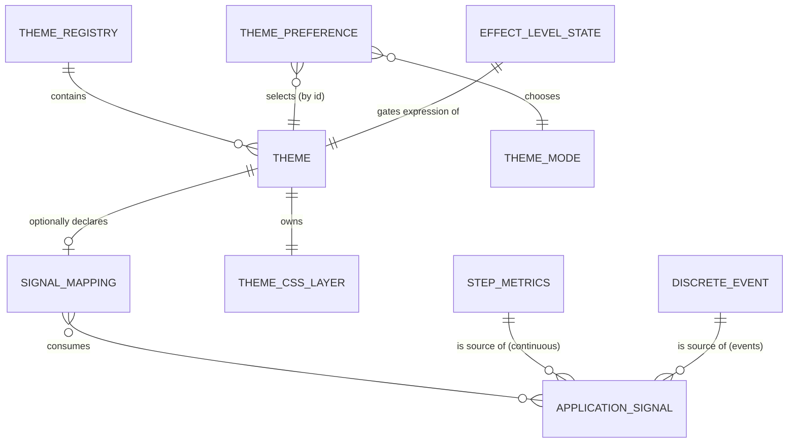

# Data Model: Theme Engine (Behavioral Themes)

**Phase 1 output.** The theme engine has two data planes: a **client-side configuration model** (themes, preference, effect-level — all in the browser, no DB) and a **backend signal model** (the neutral per-step metrics + discrete events emitted over SSE). No relational schema changes, no Alembic migration (per spec Assumption: v1 persistence is client-local).



---

## Client-Side Configuration Entities (browser, vanilla JS)

### Theme
A named, self-contained presentation system. One module per theme at `static/js/themes/<id>.js`.

| Field | Type | Description |
|---|---|---|
| `id` | string (slug) | Stable unique identifier, used as `data-theme="<id>"`. e.g. `default`, `forge`, `oldgrowth`. |
| `displayName` | string | Human-readable name shown in the picker. |
| `previewHint` | string | Short descriptor / preview cue so users can tell themes apart before selecting (FR-001). |
| `modes` | enum set | Which of `light` / `dark` / `single` the theme supports (see ThemeMode). |
| `cssLayer` | string (path) | Path to the theme's CSS layer, `static/css/themes/<id>.css` (omitted/`null` for `default`, which uses base `tokens.css`). |
| `mapping` | function \| null | Optional expressive hook `mapping(signalBus, effectLevel) → teardown`. `null` ⇒ purely cosmetic theme (FR-014). |

**Validation rules**:
- `id` MUST be unique within the registry and a valid CSS attribute value.
- A theme with `modes` containing both `light` and `dark` MUST provide token values for both; a `single` theme provides one inherent mode (FR-023).
- `mapping` MUST be idempotent on re-bind and MUST return a teardown to support clean theme switching mid-run (FR-026).
- A theme MUST render legibly with `mapping === null` or when its mapping is suppressed by EffectLevelState (FR-013, FR-016).

### ThemeMode (enum)
| Value | Meaning |
|---|---|
| `light` | Light variant. |
| `dark` | Dark variant. |
| `single` | Theme is inherently one fixed appearance (e.g. Old Growth always-dark CRT); light/dark control is inapplicable and communicated as such (FR-023). |

### ThemeRegistry
The in-memory, client-side collection of available themes. Single source of truth for the picker and the manager.

| Field | Type | Description |
|---|---|---|
| `themes` | ordered map<id, Theme> | All registered themes; order = picker display order. |
| `defaultId` | string | Always `default`; fallback target (FR-007, FR-024). |

**Validation rules**:
- MUST always contain `default`.
- Adding a theme = registering one module + one CSS layer; MUST require no change to manager/registry code (FR-015, SC-009).
- Lookup of an unknown id MUST resolve to `defaultId` (FR-024).

### ThemePreference (persisted in `localStorage`)
| Field | Type | Description |
|---|---|---|
| `themeId` | string | Selected theme id. |
| `mode` | ThemeMode | Selected light/dark choice (ignored for `single` themes). |

**Persistence & migration**:
- Stored under the existing `localStorage` key `theme`. Legacy values (`"dark"` / `"light"`) MUST be migrated to `{themeId:"default", mode:<legacy>}` on read (back-compat with current `core.js`/FOUC script).
- On read, if `themeId` is unknown, reconcile to `{themeId:"default", mode:<OS preference or stored mode>}` and rewrite (FR-024).
- First visit with no value ⇒ `{themeId:"default", mode: <OS prefers-color-scheme>}` (FR-005).

### EffectLevelState (derived, client-side)
The current effective permission level for expression. Recomputed reactively from inputs.

| Field | Type | Source |
|---|---|---|
| `reducedMotion` | bool | OS `matchMedia('(prefers-reduced-motion: reduce)')` OR in-app toggle (FR-017). |
| `reducedEffects` | bool | In-app maximum-legibility toggle (FR-018). |
| `reducedTransparency` | bool | OS `matchMedia('(prefers-reduced-transparency: reduce)')`. |
| `audioOptIn` | bool | In-app opt-in, default `false` (FR-020). |
| `visible` | bool | `document.visibilityState === 'visible'` (FR-021 throttle/pause). |

**State transitions** (effect intensity the active theme is permitted):

```mermaid
stateDiagram-v2
    [*] --> Full
    Full --> Muted: reducedMotion OR reducedTransparency
    Full --> Legible: reducedEffects (max legibility)
    Muted --> Legible: reducedEffects
    Full --> Paused: tab hidden
    Muted --> Paused: tab hidden
    Paused --> Full: tab visible (and no reduced prefs)
    Paused --> Muted: tab visible (reduced prefs)
    Legible --> Legible: (effects suppressed; static identity only)
```



- **Full**: all continuous + discrete effects run.
- **Muted**: continuous looping animation disabled/reduced; static identity preserved (FR-017).
- **Legible**: legibility-degrading effects (glyph corruption, heavy overlays) suppressed; primary content fully readable (FR-018, SC-006).
- **Paused**: continuous effects paused to save resources; resume on visible (FR-021).

---

## Backend Signal Entities (Python; emitted over SSE)

### StepMetrics  *(new — `anvil/services/training/step_metrics.py`, Pydantic BaseModel)*
The neutral per-step observation the service layer serializes into the `metrics` SSE event. Backend stays theme-agnostic (R1, R6).

| Field | Type | Description | Status |
|---|---|---|---|
| `step` | int | Training step number. | exists |
| `loss` | float | Cross-entropy loss at this step. | exists |
| `device` | str | `cpu` / `cuda:0` / `mps`. | exists |
| `elapsed_sec` | float | Wall-clock seconds since start. | exists |
| `steps_per_sec` | float \| None | Rolling 20-step rate. | exists |
| `eta_sec` | float \| None | Estimated seconds to completion. | exists |
| `grad_norm` | float \| None | Global (un-clipped — no clipping exists) gradient norm sampled after `backward()` (torch engine; `None` for stdlib engine — R2). | **new** |
| `tokens_per_sec` | float \| None | Derived in the service closure from a **rolling sum of per-step `tokens` ÷ window-elapsed** (R4). NOT `batch_size × context_len` — the engines are unbatched and tokens/step varies. | **new** |

**Validation rules**:
- All fields theme-NEUTRAL; the model MUST NOT contain theme-specific values (e.g. no `disturbance`, no `color`). (R6, FR-011)
- `grad_norm`/`tokens_per_sec` are nullable; consumers MUST tolerate `None` (graceful degradation, FR-025).
- Engine→service boundary uses a stdlib `NamedTuple` (`core/`); the `BaseModel` is constructed in the service layer (Article I, R1).

### CoreStepObservation  *(new — stdlib `NamedTuple`, lives at the `core/` boundary)*
Plain primitives emitted by the engines so `core/` stays zero-dependency.

| Field | Type | Notes |
|---|---|---|
| `step` | int | training step number |
| `loss` | float | loss at this step (may be `nan`/`inf` → divergence) |
| `tokens` | int | **actual tokens processed this step** = `n = min(block_size, len(tokens)-1)`; varies per document (engines are unbatched). Source for exact `tokens_per_sec`. |
| `grad_norm` | float \| None | global un-clipped norm after `backward()` (torch); `None` for stdlib engine |

### DiscreteEvent (SSE events)
Discrete, named SSE events the service emits; themes register distinct responses (FR-012).

| Event name | Payload | Status | Notes |
|---|---|---|---|
| `metrics` | StepMetrics (JSON) | widened | per-step continuous signal |
| `divergence` | `{step:int, reason:str}` | **new** | `isnan`/`isinf` (or grad explosion) detected in service closure; **raises `DivergenceError` to halt the run** and the SSE route breaks on it (R3) |
| `milestone` | `{step:int}` | **new** | neutral cadence marker (every N steps) for the "quench" beat; **no artifact write, does NOT imply a model checkpoint** (R5); ignorable by existing consumers |
| `complete` | `{final_loss, samples, device}` | exists | maps to terminal "quench"/tempered state (R5) |
| `error` | `{message}` | exists | |
| `submitted` | `{backend, device}` | exists | |
| `export_error` | `{error}` | exists | |
| `heartbeat` | `{}` | exists | keep-alive |

### SignalName (vocabulary — documentation-only)
Canonical neutral signal identifiers a theme mapping may consume. **This is a documentation vocabulary, not a delivered Python enum** — no task creates a `SignalName` Python type. It exists in JS as a frozen constant set inside `signal-bus.js` (T036). The only delivered Python enum for this feature is `DivergenceReason` (T026).

`STEP`, `LOSS`, `GRAD_NORM`, `TOKENS_PER_SEC`, `VAL_LOSS`(future), `DIVERGENCE`(event), `MILESTONE`(event), `COMPLETE`(event).

---

## Application Signal & Mapping (conceptual, client-side)

### ApplicationSignal
A neutral live value/event the active theme may consume. Sourced from `StepMetrics` (continuous) or `DiscreteEvent` (events). Exists independent of any theme.

### SignalMapping (per theme; the differentiator)
The theme-owned relationship from neutral signals → coordinated responses. Lives inside each theme module's `mapping()` hook; never on the backend (R6, FR-011).

| Attribute | Description |
|---|---|
| `consumes` | Which SignalNames/events this theme reads. |
| `domain` | Modeled range/normalization per signal (e.g. loss→clarity, grad_norm+volatility→disturbance). |
| `responses` | Coordinated visual (and optional audio) outputs driven from the signals (one signal may drive many). |
| `idle` | Defined at-rest presentation when no signal/run is present (FR-013). |
| `outOfRange` | Defined response for missing/NaN/out-of-range input — clamp / idle / explicit error (FR-025). |

**Reference mappings (binding per FR-027):**

| Theme | Continuous mapping | Discrete events |
|---|---|---|
| **Forge** | `loss` → curve color/temperature (white-hot→steel-blue) + sample resolve-from-noise (clarity ≈ 1−normalized_loss); `tokens_per_sec` → forge-core glow + spark rate. | `milestone`/`complete` → quench flash; `divergence` → shatter sample to noise + alarm color. |
| **Old Growth** | client-derived `disturbance` (normalized `grad_norm` + rolling loss volatility) → scanline flicker + chromatic aberration + glyph corruption + inverse signal-lock meter. | `divergence` → disturbance pinned to max. |
| **Default** | none (cosmetic only). | none. |
| **New theme(s)** | ≥1 additional, must differ in behavior/feel (FR-008, FR-028). | as designed. |

---

## Data Flow (signal → expression)

```mermaid
sequenceDiagram
    participant Eng as core engine (sync)
    participant BE as compute backend
    participant Svc as TrainingService closure (async)
    participant SSE as /v1/training/stream (SSE)
    participant Bus as signal-bus.js
    participant Thm as active theme mapping
    participant View as data-theme + CSS/canvas

    Eng->>BE: CoreStepObservation(step, loss, tokens, grad_norm?)
    BE->>Svc: forward observation (progress callback, worker thread)
    Note over Svc: rolling tokens_per_sec (Σ tokens ÷ elapsed);<br/>isnan/isinf check; milestone every N steps
    alt loss is NaN/inf
        Svc->>SSE: event: divergence {step, reason}
        Svc-->>BE: raise DivergenceError (halts run; no complete)
    else normal
        Svc->>SSE: event: metrics (StepMetrics JSON)
    end
    SSE-->>Bus: named events (single EventSource)
    Bus->>Thm: publish neutral signals
    Thm->>View: set CSS vars / drive canvas (gated by EffectLevelState)
```

**Invariants**:
- The backend emits **only neutral signals**; no theme identifier or theme-specific value ever crosses the wire (FR-011, R6).
- Switching the active theme rebinds `Thm` to the same live `Bus` without closing the EventSource (FR-026).
- Every consumer tolerates `None`/missing/NaN (FR-025, SC-008).
- On divergence the service raises `DivergenceError` (halting the run like `StopRequested`), emits `divergence`, skips `complete`, and reconciles persisted run status; the SSE route includes `divergence` in its terminal break set (R3).
