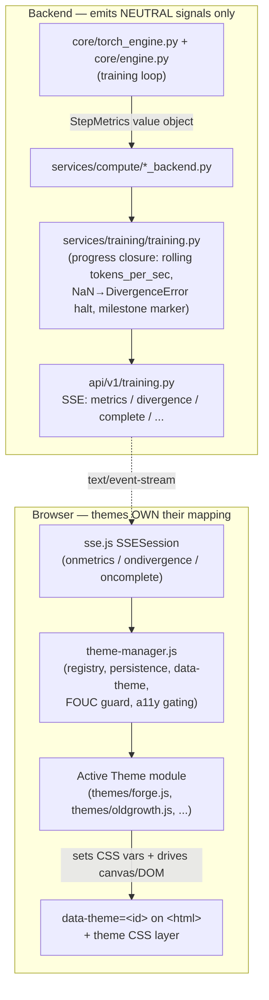
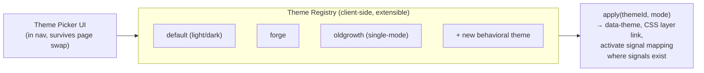

# Implementation Plan: Theme Engine (Behavioral Themes)

**Branch**: `015-theme-engine` | **Date**: 2026-06-19 | **Spec**: [spec.md](./spec.md)
**Input**: Feature specification from `/specs/015-theme-engine/spec.md`

## Summary

Introduce **behavioral themes** to the anvil web UI: a curated, extensible gallery of named presentation systems where a theme changes palette, typography, motion, layered effects, and — the differentiator — a **signal→expression mapping** that translates live training state into coordinated visual responses. Launch with at least four themes: the clean iOS-modern **Default** (unchanged baseline), **Forge** (loss as cooling metal, throughput-driven core/sparks, resolve-from-noise sample, quench/divergence events), **Old Growth** (a derived "disturbance" instability signal driving CRT scanlines/aberration/glyph-corruption/lock-meter), and at least one additional new behavioral theme.

**Technical approach**: Extend the existing `data-theme` attribute mechanism from a binary dark/light toggle into a registry-driven, N-theme system. The backend emits **neutral** training signals (never theme-specific); each theme owns its own mapping in a self-contained JS module + CSS layer. The signal surface is widened minimally and once: the per-step `metrics` SSE payload gains `grad_norm` and an **exact** `tokens_per_sec` (derived from a per-step `tokens` count carried on the observation — the engines are unbatched/variable-length with no `batch_size`), plus a new `divergence` event (which **halts the run** via a `DivergenceError`, mirroring the existing `StopRequested` pattern) and a neutral `milestone` cadence marker — by replacing the brittle `progress_callback(step, loss)` signature with a single structured step-observation threaded through the protocol → engines → backends → service closure. Accessibility (reduced-motion, reduced-effects, legibility) and graceful degradation gate every expressive effect, preserving the `004-frontend-refactor` decision that removed the old mandatory CRT chrome.

## High-Level Architecture





## Technical Context

**Language/Version**: Python 3.11+ (backend), JavaScript ES6+ (frontend, no build step / no framework)
**Primary Dependencies**: FastAPI, Jinja2, async SQLAlchemy (all existing). **No new runtime dependencies** — themes are vanilla JS + CSS; signal instrumentation is stdlib (`math.isnan`) + existing Pydantic.
**Storage**: Client-side only — `localStorage` for theme preference (`theme` key extended) and light/dark choice; `sessionStorage` not required. No DB schema change, no Alembic migration (per spec Assumption: server-side per-user persistence out of scope for v1).
**Testing**: pytest + httpx (backend SSE payload/contract tests, divergence detection unit tests); manual/QA harness for visual+a11y acceptance (per existing project practice — there is no JS unit runner in repo).
**Target Platform**: Modern evergreen browsers on macOS/Linux desktop + responsive mobile; served by the single FastAPI process on `:8080`.
**Project Type**: Web application (FastAPI backend + server-rendered Jinja2 + static vanilla JS/CSS).
**Performance Goals**: Theme switch applied without full reload, perceptibly instant (< 200ms to repaint); expressive effects sustain 60fps on capable hardware, throttle/pause when tab hidden (FR-021), and **degrade intensity before impairing control interactivity** under load (FR-031, SC-011); no first-paint flash (FR-006, SC-010).
**Constraints**: WCAG AA contrast for primary content in every theme/mode (FR-016, SC-006); reduced-motion + reduced-effects honored (FR-017/018); expressive effects MUST NOT impair the underlying tool's usability (FR-031); divergence (non-finite loss) MUST halt the run and reconcile status, theme-independently (FR-030, SC-012); `mypy --strict`, no type suppression; one-class-per-file; relative imports only; Pydantic BaseModel for structured data; backend signals MUST stay theme-neutral.
**Scale/Scope**: 8 web UI pages; ≥4 launch themes; ~12 existing canvas widgets already token-reactive (no per-widget change required). Signal-instrumentation slice touches a fixed, small file set (see Phasing G1).

## Constitution Check

*GATE: Must pass before Phase 0 research. Re-check after Phase 1 design.*

### Article I — Zero-Dependency Core
- [x] No new third-party dependency is added anywhere. The pure engine (`anvil/core/engine.py`) stays stdlib-only.
- [x] The new per-step metrics value object is a **Pydantic `BaseModel` placed in `anvil/services/training/`** (service layer), NOT in `anvil/core/`. The pure engine emits a plain stdlib `NamedTuple` (`step`, `loss`, `tokens: int`, `grad_norm: float | None`); the backend/service layer wraps it into the BaseModel. This keeps `core/` free of Pydantic and honors Article I. (See research.md R1, R4.)

### Article II — Educational Clarity
- [x] `grad_norm` in the pure stdlib engine is computed with a short, well-commented global-norm loop (WHY explained); it is optional and additive, not obscuring the existing path. If deemed to add noise, it degrades to `None` for the stdlib engine and themes gracefully fall back (research.md R2).

### Article III — Seeded Reproducibility
- [x] No change to RNG/seed flow. New signals are read-only observations of existing training state; they do not alter training math or ordering.

### Article IV — TDD Mandatory
- [x] Red-Green-Refactor: contract tests for the widened `metrics` payload (incl. exact rolling `tokens_per_sec`), the new `divergence` event (incl. run-halt + stream break), and the `milestone` cadence marker are written before instrumentation; divergence (`isnan`/`isinf`) detection has a unit test; coverage ratchet respected (no lowering of `fail_under`).
- [x] **JS theme-engine coverage**: the repo has no JS unit runner, so the client engine is covered by an **end-to-end system test** (`tests/system/test_theme_engine.py`, run via `make test-system`) authored RED during US1 — exercising theme switch, persistence, no-flash, and unknown-theme fallback. This satisfies Article IV's "e2e system tests MUST exist" for the frontend slice; finer visual/a11y behavior is validated via the `quickstart.md` manual matrix.

### Article V — Async-First
- [x] Web/service/SSE remain async. The progress callback continues to run on the worker thread and marshal to the asyncio queue via `run_coroutine_threadsafe` exactly as today. The sync core engine remains the only sync exception.

### Article VI — `__init__.py` Ownership Policy
- [x] Any new package level (e.g. if a `themes/` static dir — NOT a Python package) is data-only and gets NO `__init__.py`. No new Python sub-packages are introduced; new Python modules land in existing authoritative packages (`services/training/`, `api/v1/`).

### Article VII — Layered Architecture
- [x] No DB primitives leak; no repository change (no persistence). The signal-instrumentation flows Engine → compute backend → Service closure → Route. Routes call the service as today. The God Class (`AnvilWorkbench`) surface is unchanged (no new DB-backed service).

### Article VIII — iOS-Grade Polish
- [x] Default theme is untouched and remains the polished baseline (FR-019, SC-007). Expressive themes are crafted to the design system's motion/spacing tokens; polish never undermines correctness — accessibility gating (FR-016–018) is mandatory.

### Article IX — Pit of Success
- [x] Default path unchanged: a user who does nothing gets the existing experience. Expressive themes degrade gracefully when signals are absent (stdlib runs without grad_norm), when reduced-motion/effects are set, or when no run is active — never crash, never block (FR-013, FR-024, FR-025).

### Article X — Domain-Driven Package Decomposition
- [x] New Python code is cohesive within `services/training/` (step-metrics value object + divergence detection) and `api/v1/` (event emission). No directory crosses the 12-module split threshold as a result; no new domain is introduced.

### Additional Constraints
- [x] **Pydantic BaseModel**: the new structured step-metrics type is a `BaseModel` (in the service layer, not core).
- [x] **One class per file**: the value object gets its own module (e.g. `services/training/step_metrics.py`).
- [x] **Enums over magic strings**: SSE event names and theme mode (`light`/`dark`/`single`) use `StrEnum` where they appear in Python; JS uses a frozen registry of string constants.
- [x] **mypy --strict / no suppression**: widened signature is fully typed; `grad_norm: float | None`.
- [x] **Relative imports only** inside `anvil/`.
- [x] **ADR**: a decision record for "behavioral theme engine + neutral signal instrumentation" is added to `docs/vault/Decisions/` (research.md R7).

### Gate Evaluation
**Gate 1: Widening the `progress_callback` signature touches the protocol + both engines + both backends + the service closure in one commit.** — PASS. Justified: this is a single structural change with zero behavioral delta to training math, isolated to a dedicated commit per Article X §10.9 discipline. The alternative (kwargs creep) violates the "structured data = BaseModel" constraint and ages poorly. See Complexity Tracking.

**Gate 2: Re-introducing CRT/scanline/glyph-corruption aesthetics that `004-frontend-refactor` deliberately removed.** — PASS. Justified: spec FR-019 keeps these strictly opt-in, gated behind reduced-effects/reduced-motion, and never affecting the accessible default. This is additive expression on top of a legible base, not a regression of the default.

**No unjustified violations. Gate PASSED — proceed to Phase 0.**

## Project Structure

### Documentation (this feature)

```text
specs/015-theme-engine/
├── plan.md              # This file (/speckit.plan output)
├── spec.md              # Feature spec (+ Clarifications)
├── research.md          # Phase 0 — signal-instrumentation & theme-architecture decisions
├── data-model.md        # Phase 1 — Theme, SignalMapping, StepMetrics, ThemePreference entities
├── quickstart.md        # Phase 1 — how to author a new theme end-to-end (proves FR-015/SC-009)
├── contracts/           # Phase 1 — design + interface contracts
│   ├── theme-registry.md     # JS Theme module shape + registry/lifecycle contract
│   ├── signal-stream.md      # SSE metrics/divergence payload contract (widened)
│   └── theme-tokens.md       # Per-theme CSS layer + token override contract
├── checklists/
│   └── requirements.md       # (from /speckit.specify)
└── tasks.md             # Phase 2 — /speckit.tasks (NOT created here)
```

### Source Code (repository root)

```text
anvil/
├── core/
│   ├── engine.py             # (touch) emit CoreStepObservation with tokens=n; grad_norm optional/None
│   ├── step_observation.py   # (new) CoreStepObservation NamedTuple {step,loss,tokens,grad_norm?} — stdlib, zero-dep
│   └── torch_engine.py       # (touch) grad_norm after backward() (no clipping); emit tokens=n
├── services/
│   ├── compute/
│   │   ├── protocol.py            # (touch) ProgressCallback → Callable[[CoreStepObservation], None]
│   │   ├── local_torch_backend.py # (touch) thread CoreStepObservation through
│   │   └── local_stdlib_backend.py# (touch) thread CoreStepObservation through
│   └── training/
│       ├── training.py            # (touch) build metrics, rolling tokens_per_sec, NaN→DivergenceError+divergence event, milestone marker, run-status reconcile
│       ├── step_metrics.py        # (new) Pydantic BaseModel: one structured per-step metrics value object
│       ├── divergence_reason.py   # (new) DivergenceReason StrEnum (neutral) — see tasks T026
│       └── divergence_error.py    # (new) DivergenceError exception (raise-to-halt, mirrors StopRequested)
└── api/
    ├── v1/
    │   └── training.py            # (touch) emit widened `metrics` + `divergence` (+except block) + `milestone`; add "divergence" to stream break tuple (:614)
    ├── templates/
    │   ├── base.html              # (touch) FOUC head-script for N themes; theme CSS layer link slot; theme-picker markup in nav
    │   └── components/
    │       └── theme_picker.html  # (new) reusable picker partial (name + preview hint)
    └── static/
        ├── css/
        │   ├── tokens.css         # (touch) keep default :root + [data-theme=light]; document theme-layer contract
        │   └── themes/            # (new, data-only dir — NO __init__.py)
        │       ├── forge.css           # (new) Forge palette/chrome/effects layer
        │       ├── oldgrowth.css       # (new) Old Growth CRT layer (gated)
        │       └── <new-theme>.css     # (new) additional behavioral theme
        └── js/
            ├── core.js            # (touch) replace binary toggle with theme-manager wiring; init from registry
            ├── sse.js             # (touch) add `ondivergence` named-event handler
            ├── theme/
            │   ├── theme-manager.js    # (new) registry, persistence, apply(), FOUC, a11y gating, visibility throttle
            │   └── signal-bus.js       # (new) subscribes to SSESession, exposes neutral signals to active theme
            └── themes/                 # (new) one self-contained module per behavioral theme
                ├── default.js          # (new) cosmetic-only (no expressive layer)
                ├── forge.js            # (new) Forge signal→expression mapping
                ├── oldgrowth.js        # (new) Old Growth disturbance mapping (derives instability client-side)
                └── <new-theme>.js      # (new) additional behavioral theme

tests/
├── api/
│   └── test_training_sse_signals.py   # (new) contract: widened metrics + rolling tokens_per_sec + divergence(halt+break) + milestone marker
├── services/
│   └── training/
│       └── test_step_metrics.py       # (new) StepMetrics model + divergence (isnan/isinf) detection
└── system/
    └── test_theme_engine.py           # (new) e2e: theme switch/persist/no-flash/fallback (make test-system) — closes JS-coverage gap
```

**Structure Decision**: Web-application layout (existing). Frontend additions are organized into two new **data-only** static directories — `static/js/theme/` (engine: manager + signal bus), `static/js/themes/` (one module per theme), and `static/css/themes/` (one CSS layer per theme) — which receive NO `__init__.py` (Article VI: not Python packages). Backend additions are minimal and confined to existing authoritative Python packages (`services/training/`, `services/compute/`, `api/v1/`, `core/`). The theme registry and all signal→expression mappings live client-side so themes are self-contained and extensible (FR-015), while the backend emits only neutral signals.

## Complexity Tracking

> Filled because Constitution Check Gate 1 is a justified, cross-cutting structural change.

| Violation / Cost | Why Needed | Simpler Alternative Rejected Because |
|---|---|---|
| Widening `progress_callback(step, loss)` across protocol + 2 engines + 2 backends + service closure in one commit | `grad_norm` and per-step `tokens` are only knowable *inside* the training loop; they cannot be computed downstream. A single structured `CoreStepObservation` (→ `StepMetrics` at the service) is the only typed, future-proof carrier. | (a) Optional kwargs (`grad_norm=None, …`) creep and violate "structured data = BaseModel"; (b) computing grad_norm/tokens outside the engine is impossible; (c) a side-channel callback doubles the threading/marshalling surface. |
| New static dirs `js/theme/`, `js/themes/`, `css/themes/` | Themes must be self-contained and extensible (FR-015, SC-009); colocating each theme's CSS+JS+mapping is the cohesive unit. | A single mega `theme.js`/`theme.css` would couple all themes, breaking "add a theme without touching the system." |
| Re-introducing CRT-style effects (Old Growth) | Explicit user request + spec FR-027; expressive themes are the feature's core value. | Omitting them fails the feature; mitigated by opt-in + a11y gating (FR-016–019) so the `004` accessibility decision is preserved. |
