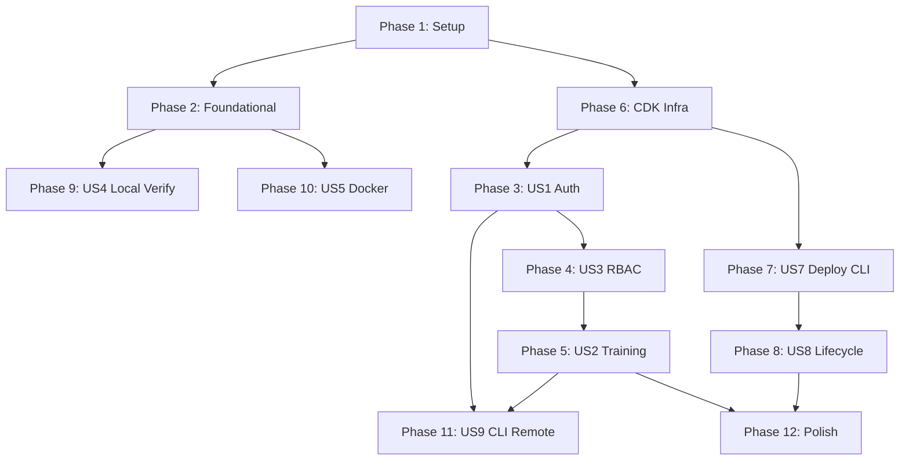

# Tasks: SaaS Architecture — Three-Mode Operating Model

**Input**: Design documents from `specs/016-saas-architecture/`
**Prerequisites**: plan.md, spec.md, research.md, data-model.md, contracts/

**Organization**: Tasks grouped by user story. Each phase ends at an **Acceptance Gate** (G1–G8 in spec.md) that MUST pass before dependent phases begin.

## Format: `[ID] [P?] [Story] Description`

- **[P]**: Can run in parallel (different files, no dependencies)
- **[Story]**: Which user story this task belongs to (US1–US9)
- Include exact file paths in descriptions

---

## Phase 1: Setup (Shared Infrastructure)

**Purpose**: Project initialization, package structure, dependency management

- [ ] T001 Create `anvil/_saas/` package with bare docstring `__init__.py` at `anvil/_saas/__init__.py`
- [ ] T002 [P] Create `anvil/_saas/implementations/` sub-package `__init__.py` at `anvil/_saas/implementations/__init__.py`
- [ ] T003 Add `boto3`, `redis`, `aws-jwt-verify` as optional `[aws]` extras in `pyproject.toml`
- [ ] T004 [P] Create `anvil/deploy/` package at `anvil/deploy/__init__.py` with `cloudformation.py` and `command.py` stubs
- [ ] T005 Create `packages/infra/` CDK app structure at `packages/infra/bin/anvil.ts` and `packages/infra/package.json`
- [ ] T006 [P] Create initial `docker-compose.yml` at repo root (PostgreSQL + Redis + MinIO stubs)

**Gate G1** (spec.md): SaaS package never imported in local mode; cloud deps are optional extras; CDK synthesizes.

---

## Phase 2: Foundational (Blocking Prerequisites)

**Purpose**: Core abstraction interfaces decoupling business logic from infrastructure. (FR-016, AD-1, AD-4)

**⚠️ CRITICAL**: No user story work begins until this phase completes.

- [ ] T007 Define `FileStore` ABC at `anvil/storage/filestore.py` (from `contracts/filestore.py`)
- [ ] T008 [P] Define `EventBus` ABC at `anvil/storage/event_bus.py` (from `contracts/event_bus.py`)
- [ ] T009 [P] Define `JobQueue` ABC + `TrainingJob` + `JobStatus` + `ResourceSpec` at `anvil/storage/job_queue.py` (Pydantic BaseModel; ResourceSpec per AD-1)
- [ ] T010 [P] Define `ComputeBackend` ABC at `anvil/storage/compute_backend.py`
- [ ] T011 Refactor `LocalFileStore` (`anvil/storage/local.py`) to implement `FileStore`
- [ ] T012 Implement `InProcessEventBus` (wraps `asyncio.Queue`) at `anvil/storage/in_process_event_bus.py`
- [ ] T013 Implement `InProcessJobQueue` (immediate `asyncio.create_task`) at `anvil/storage/in_process_job_queue.py`
- [ ] T014 Add `ANVIL_MODE` env var selector in `anvil/config.py` — guard (entrypoint/mode match, fail fast on mismatch) + SaaS cloud-config validation (fail fast on missing vars, never fall back) per FR-011a/b/c
- [ ] T015 [P] Create bare `__init__.py` files for `anvil/storage/` per Article VI
- [ ] T016 [P] Write contract tests for all 4 interfaces at `tests/contract/test_storage_interfaces.py`

**Gate G2** (spec.md): All interfaces `mypy --strict` clean; contract tests pass; `make test` 100%; mode selector wires correctly.

---

## Phase 3: User Story 1 — Sign Up / Log In via Cognito (Priority: P1)

**Goal**: App-managed OIDC/JWT auth via Cognito. Native email/password out of the box; social BYO post-deploy. No custom auth code. (AD-2, AD-3, FR-018–FR-021a)

**Independent Test**: API canary creates a native Cognito test user, obtains JWT, calls a protected endpoint (200), calls without token (401). **Gate G3.**

- [ ] T017 [P] [US1] Create Cognito CDK construct at `packages/infra/lib/cognito-auth.ts` — User Pool, native email/password, app client, Hosted UI domain (NO ALB authenticate-cognito)
- [ ] T018 [US1] Implement Cognito JWT validation middleware at `anvil/_saas/auth/verify_jwt.py` using `aws-jwt-verify` (validates bearer token against JWKS)
- [ ] T019 [US1] Implement `get_current_user` FastAPI dependency at `anvil/_saas/auth/deps.py` — reads bearer JWT, returns local `User`, auto-creates on first login
- [ ] T020 [US1] Implement SSE auth via short-lived signed query-param token at `anvil/_saas/auth/sse_token.py` (FR-020)
- [ ] T021 [US1] Mark routes public vs protected — only auth/health public, all others require `get_current_user`
- [ ] T022 [US1] Implement CLI OAuth2 device authorization grant flow scaffolding at `anvil/_saas/auth/device_grant.py` (FR-021)
- [ ] T023 [US1] Create `anvil/_saas/auth/__init__.py` with bare docstring

**Gate G3** (spec.md): Cognito pool exists; invalid token → 401; valid token → 200; first login creates `users` row; SSE token auth works.

---

## Phase 4: User Story 3 — RBAC Multi-Tenancy & Data Isolation (Priority: P1)

**Goal**: Full RBAC (Organization → Team → Role → User). Resources owned by `org_id` (+ team_id + created_by). Cross-org access impossible. (AD-8, FR-034–FR-038)

**Independent Test**: Two orgs; Org B sees nothing from Org A and gets 403 on direct access; viewer cannot delete, admin can. **Gate G4.**

- [ ] T024 [P] [US3] Create `Organization` model at `anvil/db/models/organization.py`
- [ ] T025 [P] [US3] Create `Team` model at `anvil/db/models/team.py`
- [ ] T026 [P] [US3] Create `Membership` model at `anvil/db/models/membership.py`
- [ ] T027 [P] [US3] Create `TeamMembership` model at `anvil/db/models/team_membership.py`
- [ ] T028 [P] [US3] Create `User` model with `org_id` at `anvil/db/models/user.py`
- [ ] T029 [US3] Define `Role` enum + permission matrix at `anvil/services/auth/role.py`
- [ ] T030 [US3] Add `org_id`/`team_id`/`created_by` ownership columns to `Corpus` and `Dataset` models
- [ ] T031 [US3] Add Alembic migration for RBAC tables + ownership columns at `anvil/_resources/migrations/`
- [ ] T032 [US3] Update `CorpusRepository` + `DatasetRepository` — scoped by `org_id` + team/role visibility
- [ ] T033 [US3] Implement RBAC resolution middleware at `anvil/_saas/auth/rbac.py` — resolves org/team/effective-role from JWT
- [ ] T034 [US3] Implement service-layer permission guard at `anvil/services/auth/guard.py`
- [ ] T035 [US3] Implement org/team/member management API at `anvil/api/v1/organizations.py`
- [ ] T036 [US3] Update storage paths — SaaS uses `{org_id}/...` prefix via `S3FileStore`
- [ ] T037 [US3] Add cross-org RBAC negative tests at `tests/integration/test_rbac_isolation.py`

**Gate G4** (spec.md): RBAC tables migrated; cross-org access denied; role permissions enforced; storage scoped by org_id.

---

## Phase 5: User Story 2 — Train a Model with Durable State & Live Metrics (Priority: P1)

**Goal**: Submit training to AWS Batch (CPU/GPU/multi-node), stream live metrics via Redis→SSE, durable job state in Postgres with reconciler, usage metering. (AD-1, AD-4, AD-5, AD-9, FR-039–FR-048)

**Independent Test**: Submit a tiny CPU job; SSE shows metrics; job reaches `completed`; artifact in S3+MLflow; `usage_record` created; killing pod mid-job is reconciled. **Gate G5.**

- [ ] T038 [P] [US2] Create `TrainingJob` model (org/team/created_by, resource_spec, compute_shape) at `anvil/db/models/training_job.py`
- [ ] T039 [P] [US2] Create `JobEvent` append-only model at `anvil/db/models/job_event.py` (idempotent `(job_id, sequence)`)
- [ ] T040 [P] [US2] Create `UsageRecord` model at `anvil/db/models/usage_record.py`
- [ ] T041 [US2] Create `TrainingJobRepository` + `JobEventRepository` at `anvil/db/repositories/`
- [ ] T042 [US2] Implement `S3FileStore` at `anvil/_saas/implementations/s3_file_store.py` (deterministic keys, signed URLs)
- [ ] T043 [US2] Implement `RedisEventBus` at `anvil/_saas/implementations/redis_event_bus.py` (delivery-only pub/sub)
- [ ] T044 [US2] Implement `BatchJobQueue` at `anvil/_saas/implementations/batch_job_queue.py` — pre-registered per-shape job defs (cpu/gpu/multigpu/multinode, FR-045i), CPU + GPU queues with fair-share scheduling keyed on `org_id` (FR-045k), retry attempts for infra failures only (FR-045l), per-job timeout (FR-045o), multi-node parallel job defs from `ResourceSpec` (FR-040/041)
- [ ] T045 [US2] Implement `BatchComputeBackend` at `anvil/_saas/implementations/batch_compute_backend.py` — three-plane control-plane submit/observe, never polls pod (FR-045g)
- [ ] T046 [US2] Write compute worker entrypoint at `anvil/_saas/compute_worker.py` — reads config from S3 (FR-045h), runs `anvil/core`, emits idempotent `JobEvent`s, periodic S3 checkpoints with resume-on-retry (FR-045m), multi-node rank-0-only event/artifact emission (FR-045p), publishes to Redis, logs MLflow
- [ ] T047 [US2] Implement job state reconciler at `anvil/_saas/reconciler.py` — compares Batch/DB/MLflow/S3, repairs stuck jobs (AD-4, FR-044)
- [ ] T048 [US2] Derive `TrainingJob.status` from latest `JobEvent` (never multi-writer) at service layer
- [ ] T049 [US2] Implement usage metering — write `UsageRecord` from terminal `JobEvent` (AD-9, FR-046); tag Batch jobs with Cost Allocation Tags (FR-047)
- [ ] T050 [US2] Create SSE endpoint with `Last-Event-ID` replay from `job_events` at `anvil/api/v1/training.py` (AD-5, FR-045)
- [ ] T051 [US2] Create training start endpoint `POST /v1/training/start` — enforce per-org quota (max concurrent jobs, max GPUs) before submit (FR-045j); write config to S3 `jobs/{id}/config.json` (FR-045h); create job, submit to BatchJobQueue with ResourceSpec
- [ ] T052 [US2] Create training status + cancellation + usage query endpoints — `GET /v1/training/{id}`, `POST /v1/training/{id}/cancel` (terminate Batch job + idempotent `cancelled` event, FR-045n), usage query (FR-048)
- [ ] T053 [US2] Create metrics polling endpoint `GET /v1/training/{job_id}/events?since={seq}` reading `job_events` backlog (FR-045a)
- [ ] T054 [US2] Implement client SSE→polling auto-degrade in `anvil/api/static/js/sse.js` — fall back to polling on EventSource failure (FR-045b)
- [ ] T055 [US2] Implement file upload/download via signed S3 URLs (`POST /v1/corpora/upload`, model download)
- [ ] T056 [US2] Wire SaaS implementations in `anvil/_saas/app.py` — `ANVIL_MODE=saas` selector; configure SaaS async SQLAlchemy engine with an IAM auth token-provider callback (RDS Proxy, regenerates ≤15-min tokens per connection — FR-045c/e); inject Redis token via `secrets:` (FR-045d)
- [ ] T057 [US2] Chaos test: kill compute pod mid-job, assert reconciler marks failed at `tests/integration/test_reconciler.py`
- [ ] T058 [US2] Resilience test: drop SSE connection mid-job, assert Last-Event-ID replay + polling fallback recover with no gap at `tests/integration/test_sse_resilience.py`

**Gate G5** (spec.md): CPU/GPU/multi-node jobs complete; per-org quota enforced + fair-share prevents starvation; Spot interruption auto-retries + resumes from checkpoint; user-error fails fast (no retry); cancellation terminates + records `cancelled`; timeout → `failed`; SSE delivers metrics; SSE reconnect replays without gap; polling fallback reaches terminal state; pod-crash reconciled; artifact in S3+MLflow; usage_record with correct attribution.

---

## Phase 6: User Story 6 — CDK Infrastructure (Priority: P2)

**Goal**: Full CDK stack: networking, RDS, Redis, ECS, Batch-on-EC2 (CPU+GPU), S3, Cognito, CloudFront, migrations-as-pre-deploy. Asset-free templates with digest-pinned images. (AD-1, AD-6, AD-7)

**Independent Test**: `cdk deploy` to dev creates `CREATE_COMPLETE`; CloudFront URL serves login page; migrations ran before web rollout. (Feeds Gate G6.)

- [ ] T059 [P] [US6] CDK networking construct at `packages/infra/lib/networking.ts` — VPC (2 AZ), subnets, NAT, VPC endpoints (S3 Gateway, ECR, Secrets Manager, CloudWatch Logs)
- [ ] T060 [P] [US6] CDK database construct at `packages/infra/lib/database.ts` — RDS PostgreSQL (`anvil_app` + `anvil_mlflow`), RDS Proxy + IAM auth
- [ ] T061 [P] [US6] CDK Redis construct — ElastiCache, SG allowing Batch + ECS on 6379, in-transit encryption
- [ ] T062 [P] [US6] CDK S3 construct — `anvil-data-{env}` + `anvil-ml-{env}` with lifecycle policies
- [ ] T063 [US6] CDK Batch-on-EC2 construct at `packages/infra/lib/batch-environment.ts` — CPU compute env, GPU compute env (g4dn/g5), Spot, CPU + GPU job queues, multi-node parallel job definitions (AD-1)
- [ ] T064 [US6] CDK ECS services construct at `packages/infra/lib/ecs-services.ts` — anvil-web (2+ replicas, autoscale) + MLflow (1 replica), Cloud Map service discovery
- [ ] T065 [US6] CDK migration task at `packages/infra/lib/migration-task.ts` — one-off ECS task run BEFORE web rollout (AD-6)
- [ ] T066 [US6] CDK Secrets Manager entries — DB credentials, JWT config, Redis auth token
- [ ] T067 [US6] CDK IAM roles — `AnvilTaskRole`, `MlflowTaskRole`, `BatchExecutionRole` (ECR/Logs/scoped Secrets reads), `BatchJobRole` (`rds-db:connect`, org-scoped S3, Redis, Cost Allocation Tags). Least-privilege split per FR-045f; no static DB password in any task definition (FR-045c)
- [ ] T068 [US6] CDK CloudFront + WAF construct — distribution with ALB origin, SSE-compatible timeouts/heartbeat, WAF rate limiting
- [ ] T069 [US6] CDK post-auth Lambda (inline/S3-versioned, NOT CDK asset) for user mapping at `packages/infra/lambdas/post_auth.py`
- [ ] T070 [US6] Main CDK stack at `packages/infra/lib/anvil-stack.ts` — orchestrates all constructs
- [ ] T071 [US6] CDK app entrypoint at `packages/infra/bin/anvil.ts` — env-specific parameters, asset-free synth with digest-pinned images (AD-7)

**Gate**: `cdk synth` produces asset-free templates; `cdk deploy` to dev succeeds; migration task gates web rollout.

---

## Phase 7: User Story 7 — One-Command Deploy into AWS Account (Priority: P1)

**Goal**: `anvil deploy init` deploys the full stack via boto3 from pre-synthesized CFN — no Node.js/CDK on user machine. Includes the agentic `verify` command. (AD-6, AD-7, FR-024, FR-049, FR-050)

**Independent Test**: `anvil deploy init` in fresh account → `CREATE_COMPLETE`; output URL serves login; `anvil deploy verify --layer api` passes. **Gate G6.**

- [ ] T072 [US7] CI step: `cdk synth` → copy asset-free templates to `anvil/deploy/templates/`, record image digests
- [ ] T073 [US7] Bundle templates via `pyproject.toml` `[tool.setuptools.package-data]`
- [ ] T074 [US7] Implement CloudFormation logic at `anvil/deploy/cloudformation.py` — create-or-update, waiters, output retrieval, asset publishing (Lambda to S3)
- [ ] T075 [US7] Implement `anvil deploy init` at `anvil/deploy/command.py` — prompts, deploy, run migration task, create admin + org/owner, output URL
- [ ] T076 [US7] Implement `anvil deploy status` — stack status, CloudFront URL, version from `~/.anvil/deploy-config.json`
- [ ] T077 [US7] Save deploy config to `~/.anvil/deploy-config.json`
- [ ] T078 [US7] Implement `anvil deploy verify --layer infra` at `anvil/deploy/verify.py` — boto3 control-plane checks (FR-049)
- [ ] T079 [US7] Implement `anvil deploy verify --layer api` — headless E2E API canary (FR-050)
- [ ] T080 [US7] Implement `anvil deploy verify --layer browser` — Playwright Hosted UI + SSE smoke test

**Gate G6** (spec.md): init deploys full stack; URL serves login; migrations ran pre-rollout; admin authenticates; verify --layer api green.

---

## Phase 8: User Story 8 — Destroy / Upgrade / Reconfigure (Priority: P2)

**Goal**: Single-command lifecycle: destroy (with S3 cleanup), update (new image), config (incl. social IdP BYO). (FR-025–FR-027, FR-031, AD-3)

**Independent Test**: Deploy → `config set-idp` adds social → `update` rolls new image → `destroy --force` removes everything incl. S3. **Gate G7.**

- [ ] T081 [US8] Implement `anvil deploy destroy` — empty S3 buckets, delete stack, clean up credentials; no-op if stack absent (FR-031)
- [ ] T082 [US8] Implement `anvil deploy update` — update stack with new image digest, wait UPDATE_COMPLETE
- [ ] T083 [US8] Implement `anvil deploy config set/get/list`
- [ ] T084 [US8] Implement `anvil deploy config set-idp` — add Google/GitHub social login post-deploy with BYO OAuth credentials (AD-3, FR-021a)

**Gate G7** (spec.md): update rolls new image no-downtime; set-idp adds IdP; destroy removes ALL resources; double-destroy clean.

---

## Phase 9: User Story 4 — Local Mode Unchanged (Priority: P1)

**Goal**: `pip install anvil && anvil serve` works exactly as before. Zero SaaS deps loaded. (FR-011, AD-2)

**Independent Test**: Clean install + smoke test; verify no `anvil._saas` import; `boto3`/`redis` absent. **Gate G8.**

- [ ] T085 [US4] Verify `anvil/cli.py serve()` imports no `anvil/_saas/` code (import-trace audit)
- [ ] T086 [US4] Verify `pip install anvil` installs none of `boto3`, `redis`, `aws-jwt-verify`
- [ ] T087 [US4] Run full existing suite (`make test`) — all pass after refactoring
- [ ] T088 [US4] Run `make lint` + `make typecheck` — zero new errors

**Gate G8** (spec.md): local install works unchanged; zero SaaS imports reachable; all pre-existing tests pass.

---

## Phase 10: User Story 5 — SaaS Developer Local Stack (Priority: P2)

**Goal**: `docker compose up` runs PostgreSQL, Redis, MinIO, MLflow, anvil-web with hot-reload.

**Independent Test**: `docker compose up` → all healthy → register user (dev pool/mock) → upload → train → SSE metrics.

- [ ] T089 [US5] Complete `docker-compose.yml` — PostgreSQL 16, Redis 7, MinIO, MLflow, anvil-web (volume-mounted hot-reload)
- [ ] T090 [US5] Create `Dockerfile.dev` — uvicorn `--reload`, dev deps
- [ ] T091 [US5] Create dev auth setup at `anvil/_saas/auth/dev_setup.py` — dev Cognito pool or mock OIDC
- [ ] T092 [US5] Create seed data script at `scripts/seed-dev-data.py` — admin, org, demo data
- [ ] T093 [US5] Add `make compose-up` and `make compose-down` targets

**Gate**: compose stack healthy; hot-reload works; in-process compute writes to MinIO + PostgreSQL.

---

## Phase 11: User Story 9 — CLI Remote Push/Pull (Priority: P3)

**Goal**: `anvil remote` commands sync local data to/from SaaS via device-grant auth.

**Independent Test**: `anvil remote login` → `push corpus` appears in UI → `pull model` downloads locally.

- [ ] T094 [US9] Implement `anvil remote login` — OAuth2 device grant, store JWT in `~/.anvil/credentials` (0600)
- [ ] T095 [US9] Implement `anvil remote logout`
- [ ] T096 [US9] Implement `anvil remote push corpus <path>` — signed-URL S3 upload + corpus create
- [ ] T097 [US9] Implement `anvil remote push dataset <path>`
- [ ] T098 [US9] Implement `anvil remote pull model <id>` — signed-URL download
- [ ] T099 [US9] Implement `anvil remote ls <corpora|datasets|experiments>`

**Gate**: device-grant login works; push creates remote resources; pull downloads artifacts.

---

## Phase 12: Polish & Cross-Cutting Concerns

- [ ] T100 [P] `mypy --strict` compliance for all `anvil/_saas/` code
- [ ] T101 [P] `ruff` linting for `anvil/_saas/` code
- [ ] T102 [P] `ruff` per-file-ignore — boto3/redis imports restricted to `anvil/_saas/`
- [ ] T103 Update AGENTS.md with new tech stack (via update-agent-context.sh)
- [ ] T104 Run full test suite against local mode — zero regressions
- [ ] T105 Run `make vault-audit` — zero vault errors
- [ ] T106 [P] Document CloudWatch dashboards + alarms (ECS, RDS, Batch, SSE latency per SC-002)
- [ ] T107 [P] Document IAM permissions required for `anvil deploy init`
- [ ] T108 [P] Add SSE latency monitoring — instrument publish-to-subscribe timing vs SC-002 1s target
- [ ] T109 CI release pipeline: build SINGLE multi-stage SaaS image (web + `compute_worker` entrypoints, AD-10) → push to GHCR with one digest → `cdk synth` digest-pinned → wheel → E2E (`deploy init → verify --layer api → destroy`) in throwaway AWS account, gates release (SC-011)
- [ ] T110 [P] Document cost/idle model and teardown completeness (Oracle finding #6)

---

## Dependencies & Execution Order

### Key Dependencies
- **Phase 4 (RBAC) depends on Phase 3 (Auth)** — org/role resolution needs validated JWT identity
- **Phase 5 (Training) depends on Phase 4 (RBAC)** — jobs owned by org/team/user
- **Phase 7 (Deploy CLI) depends on Phase 6 (CDK)** — needs pre-synthesized templates
- **Phase 5 reconciler + job_events (AD-4) are prerequisites for usage metering (AD-9)**

### Parallel Opportunities
- Phase 2: T008–T010, T016 (independent interfaces + contract tests)
- Phase 4: T024–T028, T030 (independent RBAC models)
- Phase 5: T038–T040 (independent models: TrainingJob, JobEvent, UsageRecord)
- Phase 6: T059–T062 (independent CDK constructs)
- Phase 12: T100–T102, T106–T108, T110 (independent polish)

## Implementation Strategy

### Core MVP (Phases 1 → 2 → 6 → 3 → 4 → 5 → 7)
setup → abstractions → AWS infra → auth → RBAC → durable training → one-command deploy. At Phase 7 + verify, the product is deployable and validated end-to-end.

### Incremental Delivery
1. Phase 1+2 → abstractions, local unchanged
2. +Phase 6 → CDK stack provisions AWS
3. +Phase 3 → Cognito auth
4. +Phase 4 → RBAC isolation
5. +Phase 5 → durable training + metering → **MVP**
6. +Phase 7 → turnkey deploy + agentic verify
7. +Phase 8/10/11 → lifecycle, dev DX, CLI remote

## Summary

| Metric | Count |
|--------|-------|
| **Total Tasks** | 110 |
| **Acceptance Gates** | G1–G8 (one per phase) + agentic verify (3 layers) |
| **P1 Stories** | US1 (Auth), US2 (Training), US3 (RBAC), US4 (Local), US7 (Deploy) |
| **P2 Stories** | US5 (Docker), US6 (CDK), US8 (Lifecycle) |
| **P3 Stories** | US9 (CLI Remote) |
| **Parallelizable [P]** | 24 tasks |
| **SSE resilience** | reconnect replay (FR-045) + metrics polling fallback (FR-045a/b) |